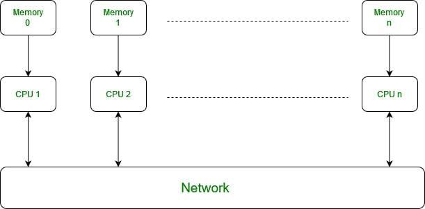

## Table of Contents

## What is SPMD in the context of machine learning?

SPMD stands for Single Program, Multiple Data. In the context of machine learning, it is a parallel computing approach where the same program runs on multiple processors, but each processor works on different data. This method is useful for speeding up large-scale machine learning tasks, like training big models on lots of data. By using SPMD, the workload is split among many processors, making the overall process faster and more efficient.

For example, when training a neural network, the dataset can be divided into smaller parts, and each part can be processed by a different processor. All processors run the same training algorithm, but they work on their own piece of data. This way, the training can be done much quicker than if it was done on a single processor. SPMD is particularly helpful in distributed computing environments, where many machines work together to solve a problem.

## How does SPMD differ from traditional parallel processing?

SPMD, or Single Program, Multiple Data, is a way to make computers work faster by using many processors at the same time. In SPMD, all the processors run the same program, but they each work on different pieces of data. This is different from traditional parallel processing, where different processors might run different programs or parts of a program. In traditional parallel processing, the work is often split into tasks that can be different from each other, and each task might need a different program to run.

In SPMD, the main idea is to keep things simple by using the same program everywhere. This can make it easier to manage and coordinate the work across all the processors. For example, if you're training a [machine learning](/wiki/machine-learning) model, you can split your data into many smaller parts and let each processor handle one part. All the processors will run the same training code, but on their own piece of data. This can make the training process much faster. Traditional parallel processing might involve more complex coordination because the tasks can be different, which can make it harder to manage but might be necessary for some types of problems.

## What are the main benefits of using SPMD for machine learning tasks?

Using SPMD for machine learning tasks can make things faster and easier to manage. When you use SPMD, you can split your big dataset into smaller pieces and let each processor work on its own piece. This means that all the processors are running the same training code, but they are working on different data. This can speed up the training process a lot because all the processors are working at the same time. It's like having a team of workers all doing the same job but on different parts of a big project.

Another benefit of SPMD is that it's easier to coordinate and manage. Since all the processors are running the same program, you don't have to worry about different tasks needing different code. This can make it simpler to set up and keep track of what's going on. For example, if you're training a [neural network](/wiki/neural-network), you can use SPMD to make sure all the processors are working together smoothly, without needing to write different code for each one. This can save time and reduce the chance of mistakes.

## Can you explain how SPMD is implemented in popular machine learning frameworks?

In popular machine learning frameworks like TensorFlow and PyTorch, SPMD is implemented to make training large models faster. For example, in TensorFlow, you can use a feature called "tf.distribute.Strategy" to split your data and model across multiple devices like GPUs or TPUs. This means that each device runs the same training code but works on different parts of the data. TensorFlow takes care of coordinating the work and combining the results, so you don't have to worry about the details. This makes it easier to use big datasets and complex models without slowing down your training process.

In PyTorch, a similar approach is used with the "DistributedDataParallel" module. When you use this, PyTorch splits your data and model across multiple GPUs. Each GPU runs the same forward and backward passes of the neural network, but on different data. PyTorch handles the communication between the GPUs, so they can work together smoothly. This way, you can train your model much faster, especially when you have a lot of data or a big model. Both frameworks make it easy to use SPMD without needing to write complex code to manage the parallel processing yourself.

## What types of machine learning algorithms are most suited for SPMD?

Machine learning algorithms that work well with SPMD are usually those that need to process a lot of data or have big models. For example, [deep learning](/wiki/deep-learning) algorithms like neural networks are great for SPMD. These algorithms often need to train on large datasets, and SPMD lets you split the data across many processors. Each processor can run the same training steps but on different pieces of data, making the training process much faster. This is especially useful for tasks like image recognition or natural language processing, where the models can be very big and the datasets can be huge.

Another type of algorithm that benefits from SPMD is those used in big data analytics, like clustering or decision tree algorithms. These algorithms often need to go through a lot of data to find patterns or make predictions. With SPMD, you can split the data into smaller chunks and let each processor work on its own chunk. This can speed up the process of finding clusters or building decision trees, especially when you have a lot of data to go through. So, if you're working with large datasets and need to process them quickly, SPMD can be a big help.

## How does SPMD handle data distribution and synchronization in machine learning?

In machine learning, SPMD handles data distribution by splitting the dataset into smaller pieces and giving each processor its own piece to work on. For example, if you have a big dataset for training a neural network, SPMD will divide the data so that each processor can process a different part of it. This way, all the processors can work at the same time, making the training process much faster. The same training code runs on each processor, but they all work on different data. This is like having a team of workers, where each worker is doing the same job but on a different part of the project.

Synchronization in SPMD is important to make sure all the processors are working together correctly. When the processors finish their part of the work, they need to share their results with each other. For example, during the training of a neural network, the processors need to update the model's parameters based on the results they get from their data. SPMD makes sure that these updates happen in a way that keeps the model consistent across all processors. This can be done using techniques like all-reduce, where the processors combine their results to get a final update. By managing data distribution and synchronization well, SPMD helps make machine learning tasks faster and more efficient.

## What are the common challenges faced when using SPMD in machine learning projects?

One common challenge when using SPMD in machine learning projects is managing the communication between processors. When you split your data and let each processor work on a different part, they need to share their results to update the model. This can slow things down if not done right. For example, if the processors are on different machines, sending data back and forth can take time. Also, making sure all the processors are working at the same pace can be tricky. If one processor finishes its work before others, it might have to wait, which can waste time.

Another challenge is making sure the model stays consistent across all processors. When each processor updates the model based on its data, you need a way to combine these updates so that everyone has the same version of the model. This can be hard to do without introducing errors. For example, if the processors update the model at different times, you might end up with different versions of the model, which can mess up your training. Also, keeping track of all the processors and making sure they are all doing their job correctly can be a lot of work.

## How can SPMD improve the scalability of machine learning models?

SPMD can improve the scalability of machine learning models by allowing them to handle bigger datasets and more complex models. When you use SPMD, you can split your data into smaller pieces and let each processor work on its own piece. This means that as your dataset grows, you can add more processors to handle the extra data. For example, if you're training a neural network on a large dataset, SPMD lets you use many processors at the same time, making the training process much faster. This way, you can keep adding data and processors without slowing down, which makes your model more scalable.

Another way SPMD helps with scalability is by making it easier to manage and coordinate the work across many processors. Since all the processors run the same program but on different data, you don't have to write different code for each processor. This makes it simpler to add more processors as your model grows. For example, if you need to train a bigger model with more parameters, SPMD can help you use more processors to handle the increased workload. By keeping things simple and coordinated, SPMD helps you scale your machine learning models more easily.

## What are some real-world examples of SPMD being used in machine learning?

In the real world, SPMD is used a lot in big tech companies to train huge machine learning models. For example, Google uses SPMD to train models for its search engine and for understanding language. They have a lot of data from all over the world, and SPMD helps them split this data into smaller pieces. Each piece is then processed by different processors at the same time. This makes the training process much faster, so they can keep their models up to date with the latest information.

Another example is in the field of autonomous driving, where companies like Tesla use SPMD to train models that help cars see and understand the road. These models need to process a lot of data from cameras and sensors, and SPMD allows them to use many processors to handle this data. By doing this, they can train their models quickly and keep improving how their cars drive on their own.

## How does SPMD impact the training time of large-scale machine learning models?

SPMD can make the training time of large-scale machine learning models a lot shorter. When you use SPMD, you split your big dataset into smaller pieces and let each processor work on its own piece. This means that all the processors are working at the same time, which can speed up the training process a lot. For example, if you have a neural network that needs to train on a huge amount of data, SPMD lets you use many processors to handle different parts of the data at once. This way, the training can finish much faster than if you used just one processor.

Another way SPMD helps is by making it easier to add more processors as your model grows. When you have a bigger model with more parameters, you can use more processors to handle the extra work. This means that as your model and data get larger, you can keep adding processors to keep the training time short. By using SPMD, you can train big models quickly and keep improving them without waiting too long for the training to finish.

## What advanced techniques can be used to optimize SPMD for machine learning?

One advanced technique to optimize SPMD for machine learning is using data parallelism with model parallelism. In data parallelism, you split the dataset into smaller pieces and let each processor work on its own piece. In model parallelism, you split the model itself across different processors. By combining these two approaches, you can handle even bigger datasets and more complex models. For example, you can use data parallelism to train on a large dataset and model parallelism to manage a model with many parameters. This can make the training process faster and more efficient, especially for very large models.

Another technique is using techniques like gradient accumulation and mixed precision training. Gradient accumulation lets you collect gradients from multiple mini-batches before updating the model, which can help when you have limited memory on each processor. Mixed precision training uses lower precision data types, like half-precision (float16) instead of full-precision (float32), to save memory and speed up computations. This can make SPMD even more effective for training large-scale machine learning models. By using these advanced techniques, you can make the most out of SPMD and train your models faster and with less resources.

## How do you evaluate the performance of SPMD in machine learning applications?

To evaluate the performance of SPMD in machine learning applications, you look at how fast the training process is and how well the processors work together. One way to do this is by measuring the time it takes to train a model using SPMD compared to training it on a single processor. If SPMD makes the training much faster, it's a sign that it's working well. You can also check the speedup, which is how many times faster the training is with SPMD. The speedup can be calculated with the formula $$ \text{Speedup} = \frac{\text{Time on single processor}}{\text{Time on multiple processors}} $$. If the speedup is close to the number of processors you're using, then SPMD is doing a good job.

Another important thing to look at is how well the processors communicate with each other. Good communication means the processors can share their results and update the model without slowing down too much. You can measure this by looking at the communication overhead, which is the extra time spent on sending data between processors. If the overhead is low, then SPMD is efficient. You can also check the scalability of SPMD by seeing how well it handles bigger datasets and more complex models. If you can keep adding more data and processors without slowing down the training too much, then SPMD is helping to make your machine learning application more scalable.