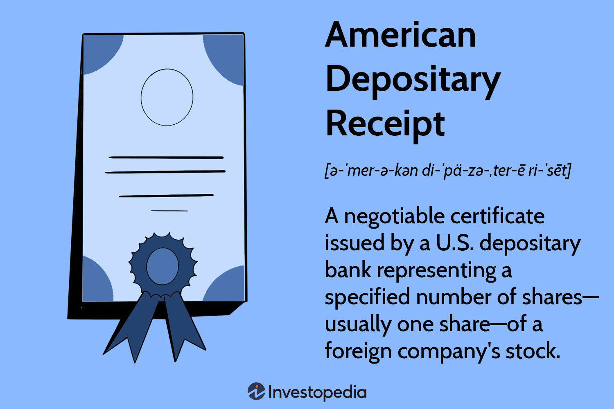

The globalization of financial markets has significantly expanded investment opportunities, allowing investors to diversify their portfolios beyond domestic borders. One notable financial instrument facilitating this trend is the American Depositary Receipt (ADR), which provides a streamlined mechanism for U.S. investors to engage with international equities. ADRs simplify the process of investing in foreign stocks by allowing shares of these companies to be traded on U.S. exchanges, denominated in U.S. dollars. This reduces the complexities associated with direct investment in international markets, such as currency conversion and foreign regulatory compliance.

In recent years, the advent and growth of algorithmic trading have further transformed the landscape of ADR investments. Algorithmic trading deploys computer algorithms to automate trading decisions, improving the efficiency and liquidity of trading processes. This technological advancement has enabled investors to execute trades more swiftly, with reduced transaction costs. Algorithms can quickly analyze a multitude of data points, identify pricing inefficiencies, and make strategic decisions to optimize investment outcomes.



This article will explore the intricate structure of ADRs, detailing their benefits and inherent risks, while also examining how algorithmic trading strategies are integrated into ADR investments. By understanding these elements, investors can make well-informed decisions, exploiting the benefits of ADRs while navigating the challenges presented in today’s interconnected financial ecosystem. As financial markets continue their rapid evolution, staying informed about these aspects is crucial for investors aiming to maximize their investment potential globally.

## Table of Contents

## Understanding American Depositary Receipts (ADRs)

American Depositary Receipts (ADRs) are financial instruments established by U.S. banks to enable the trading of foreign stocks on U.S. stock exchanges. They represent shares in a foreign company's equity and are expressed in U.S. dollars, thereby simplifying the process of international investment for American investors. ADRs help investors avoid the complexities associated with trading on foreign stock exchanges, such as currency conversion and understanding different regulatory environments.

ADRs are divided into two categories: sponsored and unsponsored. Sponsored ADRs are created when a foreign company enters into a formal agreement with a U.S. depositary bank to manage its ADRs. This partnership ensures a higher level of transparency, adherence to regulatory requirements, and enhanced communication between the foreign entity and its U.S. investors. Sponsored ADRs typically offer voting rights and financial information and are often listed on major exchanges like the New York Stock Exchange (NYSE) or NASDAQ.

In contrast, unsponsored ADRs are established by one or more U.S. depositary banks without an involvement agreement with the foreign company. As a result, these ADRs may present discrepancies in financial disclosures and do not always grant voting rights. They are generally traded over-the-counter (OTC) and [carry](/wiki/carry-trading) an increased risk of inconsistencies in reporting and shareholder privileges.

Moreover, ADRs are subdivided into three distinct levels, each defined by its regulatory compliance and market presence:

1. **Level I ADRs**: These ADRs fulfill the least stringent regulations and are typically traded OTC. They are not required to adhere to U.S. Generally Accepted Accounting Principles (GAAP) or provide detailed quarterly reports. Consequently, Level I ADRs offer minimal visibility and are considered the least advantageous for retail investors seeking comprehensive information.

2. **Level II ADRs**: Traded on recognized exchanges such as the NYSE or NASDAQ, Level II ADRs must comply with stricter regulatory standards. They are mandated to prepare financial statements according to U.S. GAAP and regularly file reports with the U.S. Securities and Exchange Commission (SEC). This enhances their market visibility and typically provides investors with a higher degree of confidence in the available financial data.

3. **Level III ADRs**: These are the most demanding in terms of regulatory adherence because they represent an attempt by the foreign company to raise capital in the U.S. This involves issuing shares directly to the American public via an Initial Public Offering (IPO) and conforming to the highest level of SEC reporting requirements, including periodic filings and adherence to U.S. GAAP standards. Consequently, Level III ADRs offer the greatest transparency and investor protection.

In summary, ADRs facilitate American investments in foreign companies by mitigating the associated complexities and risks. Their classification into sponsored and unsponsored categories, alongside different levels of regulatory compliance, provides investors with varied choices in terms of transparency, market presence, and involvement rights with the issuing company.

## Sponsored vs. Unsponsored ADRs

American Depositary Receipts (ADRs) offer a structured mechanism for U.S. investors to engage with international markets. These instruments are classified into two primary categories: sponsored and unsponsored ADRs, each with distinct features in terms of transparency, regulatory compliance, and investor rights.

**Sponsored ADRs** are created through an agreement between the foreign company and a U.S. depository bank. This formal arrangement ensures a higher degree of regulatory oversight and transparency. Sponsored ADRs are typically registered with the Securities and Exchange Commission (SEC) and adhere to U.S. reporting standards, which can provide investors with reliable and consistent financial information and disclosures. This close collaboration allows foreign companies to maintain some control over their ADRs, offering a level of assurance to investors about the integrity and authenticity of the investment. Additionally, sponsored ADRs often include voting rights and other privileges similar to those available to domestic shareholders, thereby enhancing engagement with the issuing foreign company.

In contrast, **unsponsored ADRs** are established by U.S. financial institutions without direct involvement from the foreign companies whose stocks they represent. These ADRs are usually listed on over-the-counter (OTC) markets and may not be registered with the SEC. As a result, unsponsored ADRs might not provide the same level of transparency or adherence to regulatory standards. Because multiple financial institutions can issue unsponsored ADRs for the same foreign company, discrepancies can arise in terms of reporting standards, dividend policies, and investor communications. This lack of uniformity can create challenges for investors seeking comprehensive information and reliable shareholder rights.

The decision between investing in sponsored versus unsponsored ADRs hinges on several factors. Sponsored ADRs generally offer better information access, regulatory alignment, and shareholder privileges but might be subject to higher administrative costs. Unsponsored ADRs can provide broader market access and diversity but often come with variations in information reliability and investor rights.

When deciding on investing in ADRs, it is essential for investors to evaluate the level of compliance, transparency, and investor rights that align with their individual investment strategies and risk tolerance.

## Pricing, Costs, and Taxation of ADRs

The pricing of American Depositary Receipts (ADRs) is intrinsically linked to the underlying foreign shares they represent. This relationship is adjusted for currency exchange rates, thereby reflecting the economic conditions in both the home country of the foreign company and the United States. Mathematically, the price of an ADR can be expressed as:

$$
\text{ADR Price} = \left(\frac{\text{Price of Foreign Share} \times \text{Exchange Rate}}{\text{Ratio}}\right)
$$

where the "Ratio" refers to the number of foreign shares represented by a single ADR. ADR prices may fluctuate due to exchange rate volatility, impacting the value perceived by U.S. investors.

Investing in ADRs requires consideration of various associated costs, differing from domestic stock investments. These include custody fees, which are charges levied by banks for holding foreign shares. Transaction fees applicable to buying or selling ADRs can also accumulate, making the overall cost structure more complex. It is crucial for investors to account for these expenses when assessing the potential returns from ADRs.

Taxation of ADRs introduces further intricacies. A notable challenge is the possibility of double taxation on dividends, where they are taxed both in the United States and in the foreign country where the company is domiciled. For example, if a foreign country withholds taxes on dividends at a rate of 15%, and the U.S. imposes an additional tax rate of 10% on foreign dividends received, the effective tax rate can be significant. However, investors may be eligible for foreign tax credits, which help mitigate this risk by allowing U.S. taxpayers to credit certain foreign taxes paid against their U.S. tax liability.

Proper understanding of ADR pricing, associated costs, and taxation is essential for making informed investment decisions, enabling investors to strategically manage their international holdings within an ADR framework. By evaluating these factors, investors can better navigate the unique challenges posed by ADR investments and optimize their strategies accordingly.

## Advantages and Disadvantages of Investing in ADRs

American Depositary Receipts (ADRs) offer U.S. investors a convenient way to access foreign equities and diversify their investment portfolios globally. This diversification can lead to enhanced growth potential, as investors can capitalize on the economic growth of various regions without dealing directly with foreign markets. By trading ADRs, investors can participate in international financial markets while benefiting from the regulations and protections of U.S. exchanges, such as the New York Stock Exchange (NYSE) or the Nasdaq.

Despite these advantages, investing in ADRs comes with inherent risks and limitations. Currency risk is one of the primary concerns, as fluctuations in exchange rates between the U.S. dollar and the foreign currency can impact the value of the ADR. While ADRs are denominated in U.S. dollars, the underlying stocks are priced in foreign currencies, making them susceptible to exchange rate [volatility](/wiki/volatility-trading-strategies).

Additionally, investors in ADRs may face a limited selection compared to investing directly in foreign markets. While ADRs provide exposure to international companies, not all foreign stocks are available as ADRs on U.S. exchanges. This restriction can limit the scope of portfolio diversification and the ability to invest in specific sectors or regions.

Another significant consideration is taxation. ADR dividends may be subject to double taxation, where taxes are levied both in the United States and the foreign company's home country. This situation can reduce the net income from such investments, affecting the overall return. Investors need to be aware of tax treaties between the U.S. and other countries, which might offer relief through reduced tax rates or credits to mitigate this issue.

Choosing to invest in ADRs requires careful analysis of these benefits and risks. Strategic portfolio management involves weighing the growth opportunities against the potential obstacles, such as currency fluctuations and tax implications. Understanding these factors is essential for investors seeking to optimize their portfolios and achieve their financial objectives in a globalized market landscape.

## The Role of Algorithmic Trading in ADR Investments

Algorithmic trading, often referred to as algo trading, has significantly influenced the trading of American Depositary Receipts (ADRs). By automating trading processes, it enhances efficiency and reduces transaction costs, facilitating smoother operation within the ADR marketplace.

**Automation and Efficiency**: At its core, algorithmic trading employs sophisticated algorithms to execute trades automatically based on pre-defined criteria. This could include timing, price, volume, or various mathematical models. For ADRs, which represent foreign stocks in U.S. markets, algo trading optimizes the process, enabling rapid execution of trades across time zones, and adapting to the liquidity and volatility inherent in different markets.

**Cost Reduction**: By minimizing the need for manual intervention, algorithmic systems lower transaction costs associated with ADR trading. These systems can execute a high number of trades at lower costs compared to traditional trading methods. Moreover, they minimize the impact of human error, ensuring greater accuracy and speed in decision-making.

Consider a simple Python algorithm for executing ADR trades based on moving averages:

```python
import numpy as np

def moving_average(data, window_size):
    return np.convolve(data, np.ones(window_size)/window_size, 'valid')

def trade_signal(prices, short_window=5, long_window=20):
    short_avg = moving_average(prices, short_window)
    long_avg = moving_average(prices, long_window)

    signal = np.where(short_avg > long_avg, 1, -1)
    return signal

prices = [10, 11, 12, 13, 14, 15, 14, 13, 12, 11, 10]  # Example ADR prices
signals = trade_signal(prices)

print("Trade signals:", signals)
```

The above script uses moving averages to generate buy (1) and sell (-1) signals based on short-term and long-term price changes.

**Exploiting Pricing Inefficiencies**: Due to varying market dynamics, ADRs can occasionally present arbitrage opportunities. Algorithms can identify and exploit these inefficiencies, allowing investors to capitalize on price discrepancies between domestic securities and their ADR counterparts, thus enhancing potential returns.

**Integration of Complex Data Analytics**: Advanced algorithms leverage big data, incorporating a multitude of factors such as trading volumes, historical price patterns, macroeconomic indicators, and market sentiment. Through machine learning models, traders can forecast ADR price movements with heightened precision, adapting strategies dynamically in response to real-time data.

**Challenges and Risks**: Despite these advantages, algorithmic trading introduces certain risks. It can exacerbate market volatility, as high-speed trading systems may respond to market anomalies with simultaneous, large-volume trades, leading to rapid market fluctuations. Technological infrastructure is paramount; glitches or delays can result in significant financial losses.

Moreover, the reliance on algorithms necessitates robust risk management strategies, ensuring that trading systems are transparent, secure, and capable of managing unforeseen market events effectively.

In summary, while [algorithmic trading](/wiki/algorithmic-trading) has enriched the ADR investment landscape with efficiency and strategic depth, it requires a diligent approach to mitigate inherent technological and volatility risks. Investors and financial institutions must balance these dynamics to fully leverage the potential of algo trading in ADR markets.

## Conclusion

American Depositary Receipts (ADRs) play a significant role in the global financial market by providing U.S. investors seamless access to foreign stocks. By representing shares of non-U.S. companies and being traded on American exchanges, ADRs simplify international investment, enabling portfolio diversification and potentially capturing growth in various foreign markets.

The rise of algorithmic trading has added a technological edge to investing in ADRs by offering enhanced trading efficiency and [liquidity](/wiki/liquidity-risk-premium). Algorithmic strategies can systematically manage large data sets, identify optimal trading opportunities, and execute decisions at high speeds, thus minimizing human error and leveraging patterns not easily discernible through traditional methods. Although these advancements have optimized some aspects of ADR investment strategies, they also introduce risks such as increased volatility and technological failures, necessitating vigilant oversight.

As financial technology continues to evolve, staying well-informed becomes essential for investors seeking to maximize gains while managing the inherent risks. Adapting to the ongoing shifts in the financial landscape ensures that U.S. investors can continue to use ADRs effectively to engage with international markets, taking advantage of both the strategic benefits they present and the efficiencies introduced by algorithmic solutions. This adaptability is crucial for the smart allocation of resources and optimizing investment portfolios in a continually globalizing economy.

## Frequently Asked Questions (FAQs)

**Frequently Asked Questions (FAQs)**

**What are American Depositary Receipts (ADRs)?**

American Depositary Receipts (ADRs) are financial instruments issued by U.S. banks that enable the trading of foreign company stocks on U.S. exchanges. ADRs are denominated in U.S. dollars and represent a specified number of shares in a foreign company. This setup simplifies the process for American investors to access international markets without dealing directly with foreign exchanges.

**How are ADRs structured?**

ADRs come in two main types: sponsored and unsponsored. Sponsored ADRs are created in collaboration with the foreign company, ensuring better compliance and information transparency. In contrast, unsponsored ADRs are established by U.S. banks without the direct involvement of the foreign company, which may result in discrepancies in shareholder information and rights.

**What costs are associated with investing in ADRs?**

When investing in ADRs, investors should consider various costs, such as custody fees charged by the bank issuing the ADRs, transaction fees similar to those for domestic stocks, and potential foreign exchange conversion fees. Additionally, ADRs may face double taxation on dividends, both in the U.S. and the foreign company's home country.

**What are the advantages and disadvantages of ADRs?**

ADRs offer the benefit of diversifying an investment portfolio with international equities, providing exposure to potentially high-growth foreign markets. However, they also involve risks like currency fluctuations, a narrower selection compared to direct foreign investments, and the possibility of double taxation on dividends.

**How does algorithmic trading impact ADR investments?**

Algorithmic trading has significantly influenced the ADR market by automating trading processes, thus enhancing trading speed, efficiency, and liquidity. Algorithms can identify and exploit pricing discrepancies and integrate comprehensive data analysis to inform investment decisions. However, this technological advancement can also increase market volatility and introduce technological risks that require careful oversight.

**Are there tax implications for ADRs?**

Yes, ADR dividends might be subject to double taxation, first in the foreign country where the company is based, and then in the U.S. However, U.S. investors can often claim a foreign tax credit to offset part of this burden, depending on bilateral tax agreements and specific tax regulations. It's advisable for investors to consult with tax professionals to understand the implications fully.

**Can ADR investment strategies be optimized with technology?**

Indeed, the use of algorithmic trading and other financial technologies allows investors to optimize their ADR investment strategies by analyzing large datasets for better decision-making, reducing transaction costs, and capturing [arbitrage](/wiki/arbitrage) opportunities across different markets. However, investors must remain cautious about the increased risks of automation, such as price swings and system failures.

This FAQ section addresses key aspects of ADR investments and the role of algorithmic trading, providing essential insights to facilitate informed decision-making in an increasingly interconnected financial market.

## References & Further Reading

[1]: ["American Depositary Receipts: An Introduction to U.S. Capital Markets for Foreign Issuers."](https://ir.lawnet.fordham.edu/ilj/vol17/iss1/2/) U.S. Securities and Exchange Commission (SEC) 

[2]: ["Algorithmic Trading: Winning Strategies and Their Rationale"](https://www.wiley.com/en-us/Algorithmic+Trading%3A+Winning+Strategies+and+Their+Rationale-p-9781118746912) by Ernest P. Chan 

[3]: ["Global Tax Guide for American Depositary Receipts"](https://www.financestrategists.com/wealth-management/stocks/depositary-receipt/) by BNY Mellon 

[4]: Aggarwal, R., & Dahiya, S. (2013). ["Demystifying Stock Price Synchronization: How Mutual Funds and Foreign Institutions Amplify or Attenuate Market Noise"](https://pmc.ncbi.nlm.nih.gov/articles/PMC10295092/). Journal of Financial Economics, 110(2).

[5]: ["The Basics of American Depository Receipts (ADRs)"](https://www.investopedia.com/terms/a/adr.asp) by Investopedia

[6]: Menkhoff, L. (2010). ["The Use of Technical Analysis in the Foreign Exchange Market."](https://www.econstor.eu/bitstream/10419/38748/1/625491165.pdf) Journal of Banking & Finance, 34(11).

[7]: The Bank of New York Mellon. ["The Benefits of American Depositary Receipts (ADRs)"](https://www.bnymellon.com/content/dam/bnymellon/documents/pdf/depositary-receipts-brochure.pdf)

