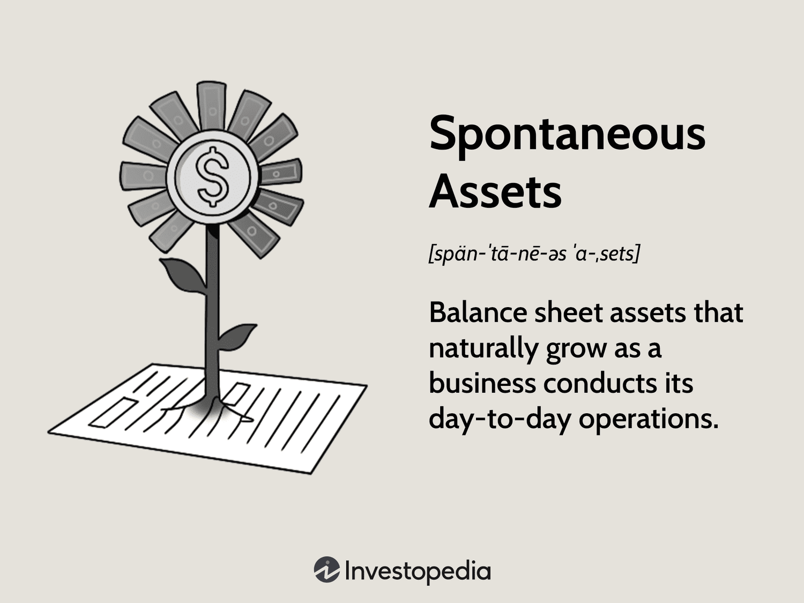

## Table of Contents

## What are spontaneous assets?

Spontaneous assets are items a business gets without planning for them. They usually come from the normal day-to-day activities of the business. For example, when a business sells goods on credit, the money customers owe becomes an asset called accounts receivable. Another example is inventory, which grows as the business buys more products to sell.

These assets are called spontaneous because they happen naturally as the business operates. They are not assets that the business goes out and buys on purpose, like a new machine or a building. Instead, they appear as a result of the business's regular activities. Understanding spontaneous assets helps businesses manage their money better and plan for the future.

## How do spontaneous assets differ from traditional assets?

Spontaneous assets and traditional assets are different in how they come to a business. Spontaneous assets are things that a business gets without planning for them. They happen naturally as the business does its everyday work. For example, when a store sells things on credit, the money people owe becomes an asset called accounts receivable. Another example is inventory, which grows as the business buys more things to sell. These assets are not something the business decides to buy, like a new machine or a building.

Traditional assets, on the other hand, are things that a business buys on purpose. These are things like buildings, machines, or vehicles that the business plans to use for a long time. They are usually big purchases that the business thinks about carefully before buying. Traditional assets often need a lot of money to buy and can help the business grow or work better. Unlike spontaneous assets, traditional assets are not a surprise; they are part of the business's plan.

In summary, the main difference between spontaneous and traditional assets is how they are acquired. Spontaneous assets come from the normal activities of the business and are not planned, while traditional assets are bought intentionally as part of the business's strategy. Both types of assets are important for a business, but they serve different purposes and require different kinds of management.

## Can you provide examples of spontaneous assets?

Spontaneous assets are things a business gets without planning for them. They happen naturally as the business does its everyday work. A common example is accounts receivable. This is the money customers owe the business when they buy things on credit. For example, if a store sells a sofa to a customer who will pay later, the amount the customer owes becomes an asset for the store.

Another example of a spontaneous asset is inventory. As a business buys more products to sell, the amount of inventory grows. For instance, a grocery store will have more food on its shelves as it orders more from suppliers. This increase in inventory is not something the business plans to buy as an asset; it's just part of running the store.

These examples show how spontaneous assets are different from things like buildings or machines, which a business buys on purpose. Spontaneous assets help a business keep running smoothly, but they appear naturally as part of daily operations.

## What role do spontaneous assets play in personal finance?

In personal finance, spontaneous assets are things you get without planning for them. They can be money or things that come to you as part of your everyday life. For example, if you lend money to a friend and they owe you, that money is a spontaneous asset. Another example is if you find a good deal on something you need and buy it, that item becomes a spontaneous asset. These assets help you manage your money better because they can give you extra money or things you need without you having to plan for them.

Spontaneous assets are important because they can help you save money or make more money. For instance, if you buy something at a discount, you save money that you can use for other things. Or, if someone pays you back money they owe you, that's extra money you can use. These assets can make your financial life easier because they come to you without you having to do extra work or spend more money. Understanding and using spontaneous assets well can help you be better with your money.

## How can spontaneous assets impact a business's financial strategy?

Spontaneous assets can affect a business's financial strategy in big ways. These assets, like accounts receivable and inventory, come from the normal work of the business. They can help a business have more money to use or things to sell. For example, if a business has a lot of money coming in from customers who owe them, it can use that money to buy more things to sell or pay for other costs. This means the business can grow or run better without needing to borrow more money or find new money.

But spontaneous assets can also make things harder for a business. If a business has too much money tied up in things people owe them, it might not have enough money to pay its own bills. And if it has too much inventory, it might not be able to sell everything before it goes bad or becomes outdated. So, a business needs to be careful with its spontaneous assets. It needs to plan how to use them well, so they help the business grow and not cause problems. This means keeping a close eye on how much money is coming in and how much stuff is sitting around, and making smart choices about what to do with it all.

## What are the benefits of including spontaneous assets in an investment portfolio?

Including spontaneous assets in an investment portfolio can help you in different ways. These assets, like money people owe you or things you buy at a good price, can give you extra money or things you need without you having to plan for them. For example, if you lend money to someone and they pay you back, that's extra money you can use to invest in other things. Or, if you find a good deal on something you need, that item can save you money that you can then use elsewhere. This can make your money go further and help you reach your financial goals faster.

However, it's important to be careful with spontaneous assets. They can be unpredictable because they come from everyday life and not from a planned investment. For example, if someone who owes you money can't pay you back, that can hurt your financial plans. So, you need to keep a close eye on these assets and think about how they fit into your overall investment strategy. By doing this, you can use spontaneous assets to your advantage while also managing the risks they might bring.

## What are the risks associated with spontaneous assets?

Spontaneous assets can be risky because they can be unpredictable. These assets, like money people owe you or things you buy at a good price, come from everyday life and not from a planned investment. This means you might not know when or if you will get the money back from someone who owes you. If they can't pay you back, it can hurt your financial plans. Also, if you buy something at a good price but it turns out you don't need it or it loses value quickly, you might lose money instead of saving it.

Another risk is that spontaneous assets can tie up your money in ways you didn't plan for. For example, if a lot of your money is stuck in things people owe you, you might not have enough money to pay your own bills or invest in other things. And if you have too much inventory, it might not sell before it goes bad or becomes outdated. This can lead to wasted money and missed opportunities. So, it's important to keep a close eye on your spontaneous assets and think carefully about how they fit into your overall financial strategy.

## How can one identify potential spontaneous assets?

To find potential spontaneous assets, you need to look at the things that come to you naturally as part of your everyday life. For example, if you lend money to a friend or family member and they owe you, that money is a spontaneous asset. Another example is when you find a good deal on something you need and decide to buy it. That item becomes a spontaneous asset because it saves you money that you can use for other things.

It's also important to keep an eye on your daily activities to spot these assets. For instance, if you run a small business, money that customers owe you for goods or services is a spontaneous asset. And if you buy more products to sell, the increase in your inventory is another spontaneous asset. By paying attention to these things, you can better manage your money and make the most of the assets that come your way without planning for them.

## What strategies can be used to manage spontaneous assets effectively?

To manage spontaneous assets well, you need to keep a close eye on them. For example, if people owe you money, make sure you know how much and when they will pay you back. This helps you plan your money better. Also, if you have things like inventory, check how much you have and how fast it sells. This way, you don't end up with too much stuff that you can't sell. By watching your spontaneous assets carefully, you can use them to help your business or personal finances without getting into trouble.

Another strategy is to use spontaneous assets to save or make more money. For instance, if you find a good deal on something you need, buy it and save the money you would have spent. Or, if someone pays you back money they owe you, use that money to invest in something else or pay off a bill. But be careful not to rely too much on these assets because they can be unpredictable. Always have a plan for what to do if things don't go as expected. By being smart and careful, you can make the most of your spontaneous assets.

## How do economic conditions affect the performance of spontaneous assets?

Economic conditions can change how well spontaneous assets do. When the economy is good, people have more money to spend and businesses do well. This means more people can pay back the money they owe, so your accounts receivable become more valuable. Also, if you have inventory, it's easier to sell things because more people are buying. But if the economy is bad, people might not have as much money. This can make it harder for them to pay you back, and your accounts receivable might not be worth as much. It can also be harder to sell your inventory because fewer people are buying.

It's important to keep an eye on economic conditions when you have spontaneous assets. If you know the economy is doing well, you might want to lend more money or buy more inventory because it's likely to pay off. But if you see the economy starting to struggle, you might want to be more careful. Maybe you should try to get people to pay you back faster or not buy as much inventory. By understanding how the economy affects your spontaneous assets, you can make better choices and protect your money.

## What advanced analytical tools are used to evaluate spontaneous assets?

To evaluate spontaneous assets, businesses and individuals often use advanced analytical tools like financial ratios and cash flow analysis. Financial ratios help you understand how well your spontaneous assets are doing compared to other parts of your business. For example, the accounts receivable turnover ratio tells you how quickly people are paying you back. A high ratio means people are paying you back fast, which is good. Another useful tool is the inventory turnover ratio, which shows how quickly you're selling your inventory. If this ratio is high, it means your inventory is moving fast, and you're not stuck with too much stuff.

Cash flow analysis is another important tool. It helps you see how money is moving in and out of your business or personal finances. By looking at your cash flow, you can see if your spontaneous assets are helping you or causing problems. For example, if a lot of your money is tied up in accounts receivable, it might be hard to pay your bills. Cash flow analysis can show you this and help you plan better. These tools are important because they give you a clear picture of how your spontaneous assets are affecting your money, so you can make smart choices about what to do next.

## How do regulatory frameworks influence the management of spontaneous assets?

Regulatory frameworks can change how businesses and people handle spontaneous assets. These rules come from the government and tell you what you can and can't do with your money. For example, if there are strict rules about lending money, it might be harder to have a lot of accounts receivable. This means you need to be careful about who you lend money to and make sure they can pay you back on time. Also, if there are rules about how long you can keep inventory, you might need to sell things faster or face fines.

These regulations can also affect how you report your spontaneous assets. You might need to keep detailed records of who owes you money and how much inventory you have. This helps the government make sure you're following the rules. It's important to understand these regulations because they can impact how you manage your spontaneous assets. By knowing the rules, you can make better decisions and avoid getting into trouble with the law.

## What is the key to understanding balance sheets?

A balance sheet, also referred to as a statement of financial position, offers a snapshot of a company's financial condition at a particular point in time. This statement is a fundamental tool for financial analysis and is composed of three major components: assets, liabilities, and shareholders' equity. Each of these elements plays a critical role in understanding a company's financial health and stability.

Assets include all the items owned by the company that are expected to provide future economic benefits. These can be classified into current assets, which are expected to be converted into cash or used within a year (such as cash, accounts receivable, and inventory), and non-current assets, which are long-term investments, property, and equipment.

Liabilities represent the obligations that the company must fulfill. Similar to assets, liabilities are divided into current liabilities, which are expected to be settled within a year (such as accounts payable, short-term debt, and other accrued expenses), and non-current liabilities, which include long-term debt and other long-term obligations.

Shareholders' equity is essentially the net worth of the business. It represents the residual interest in the company’s assets after deducting liabilities. The formula for calculating shareholders' equity is:

$$
\text{Shareholders' Equity} = \text{Total Assets} - \text{Total Liabilities}
$$

This equation highlights the balance between what the company owns and what it owes, providing insight into its financial foundation.

Balance sheets are indispensable for evaluating a company's operational efficiency, financial stability, and growth potential. Evaluations often involve ratio analysis to better understand and interpret the financial data presented. Key ratios include the current ratio, which assesses [liquidity](/wiki/liquidity-risk-premium) by comparing current assets to current liabilities, and the debt-to-equity ratio, which examines a company's financial leverage by comparing total liabilities to shareholders’ equity.

Overall, balance sheets are essential tools for investors, creditors, and financial professionals, providing comprehensive insights into a company's financial performance and long-term viability. They aid stakeholders in making informed decisions by offering detailed views of the company's economic resources and obligations.

## How can analyzing balance sheets provide financial insights?

Analyzing balance sheets requires a keen understanding of various financial ratios that provide insights into a company's financial health. These ratios distill raw financial data into meaningful metrics that guide investment decisions.

The **current ratio** is a key liquidity indicator, calculated as:

$$
\text{Current Ratio} = \frac{\text{Current Assets}}{\text{Current Liabilities}}
$$

This ratio measures a company's capability to cover its short-term obligations with its short-term assets. A current ratio greater than one suggests that the company possesses more current assets than current liabilities, signaling financial stability.

The **debt-to-equity ratio** assesses financial leverage and risk, calculated as:

$$
\text{Debt-to-Equity Ratio} = \frac{\text{Total Liabilities}}{\text{Shareholders' Equity}}
$$

This ratio indicates how much financing a company obtains through debt compared to equity. A higher ratio may imply greater financial risk, as the firm relies more on borrowing to finance its operations.

The **asset turnover ratio**, calculated by dividing sales by average total assets, reveals operational efficiency:

$$
\text{Asset Turnover Ratio} = \frac{\text{Net Sales}}{\text{Average Total Assets}}
$$

This ratio measures how efficiently a company uses its assets to generate sales, offering insights into the operational management of the business.

For a comprehensive analysis, it is crucial to compare these ratios against industry standards and historical data. This benchmarking helps in assessing whether a company performs above or below market expectations and identifies trends that might indicate potential investment opportunities.

Incorporating qualitative factors enriches balance sheet analysis. Market conditions, economic forecasts, and strategic business initiatives provide context to the quantitative data, offering a holistic view of a company’s potential.

For example, a firm with a high current ratio in a booming economy might expand aggressively, leveraging its liquidity. However, in a downturn, the same firm might prioritize conservative fiscal strategies to preserve stability.

By integrating these metrics with broader market analysis, investors can predict market performance more accurately, making more informed and strategic investment decisions. Mastery of balance sheet analysis is crucial for leveraging financial data to maximize investment outcomes.

## References & Further Reading

[1]: ["Advances in Financial Machine Learning"](https://www.amazon.com/Advances-Financial-Machine-Learning-Marcos/dp/1119482089) by Marcos Lopez de Prado

[2]: ["Evidence-Based Technical Analysis: Applying the Scientific Method and Statistical Inference to Trading Signals"](https://www.amazon.com/Evidence-Based-Technical-Analysis-Scientific-Statistical/dp/0470008741) by David Aronson

[3]: ["Machine Learning for Algorithmic Trading"](https://github.com/stefan-jansen/machine-learning-for-trading) by Stefan Jansen

[4]: ["Quantitative Trading: How to Build Your Own Algorithmic Trading Business"](https://www.amazon.com/Quantitative-Trading-Build-Algorithmic-Business/dp/1119800064) by Ernest P. Chan

[5]: Berk, J., & DeMarzo, P. (2019). ["Corporate Finance"](https://elibrary.pearson.de/book/99.150005/9781292304212) (5th Edition).