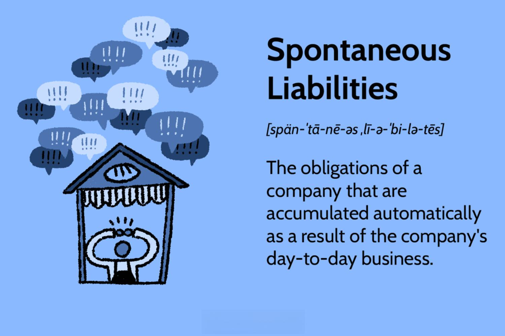

In today's rapidly evolving financial landscape, understanding liabilities is crucial for businesses aiming to optimize their financial strategies. Liabilities, in their various forms, represent obligations that a company must settle over time, often in the form of cash payments. They are key components of a company's balance sheet and can significantly influence financial health and performance. This article explores the intricate concepts of business finance, spontaneous liabilities, financial liabilities, and algorithmic trading, focusing on how they affect organizational outcomes.

Business finance involves the strategic planning, management, and allocation of financial resources to achieve business goals and maximize shareholder value. Effective liability management is a cornerstone of this process, impacting everything from daily operations to long-term growth strategies. Spontaneous liabilities, such as accounts payable and wages payable, naturally arise during normal business operations and are closely tied to sales and operational activities. On the other hand, financial liabilities stem from financing activities necessary for growth and expansion, either short-term or long-term.

Algorithmic trading, a modern approach to trading financial securities, utilizes pre-set computer algorithms to execute trades at high speed and efficiency. This form of trading introduces complexities in liability management, particularly through leverage and margin trading, making it essential for traders to understand the potential financial implications.

The interaction between these elements poses both challenges and opportunities for companies. An in-depth understanding of liabilities equips business owners, financial analysts, and traders with better tools for decision-making, helping to navigate the complexities of contemporary financial markets. By mastering these topics, stakeholders are better positioned to enhance financial planning, mitigate risks, and adapt to rapid market changes.

## Table of Contents

## Understanding Business Finance

Business finance involves the systematic process of managing a company's financial resources, aiming to achieve its strategic goals and enhance shareholder value. This process requires a comprehensive understanding and implementation of various financial activities, including financial planning, asset management, and capital allocation.

Financial planning is a cornerstone of effective business finance. It entails forecasting future financial results and preparing strategies to manage the business's cash flow, investments, and expense patterns. By anticipating future financial conditions, companies can set realistic budgets, define financial goals, and establish a roadmap for achieving these objectives. Accurately forecasting financial needs and ensuring the availability of funds at the right time are critical to avoiding situations of cash shortages or excessive borrowing.

Asset management is another crucial component, focusing on maximizing the efficiency and productivity of a company's resources. This involves not just purchasing and selling physical assets, but also optimizing intangible assets like intellectual property or brand reputation. Effective asset management ensures that every asset is utilized in a manner that enhances overall company performance, thereby contributing to value creation.

Capital allocation is the strategic process of determining how to invest the organization’s funds to generate the best possible return. This includes analyzing potential investment opportunities, understanding the associated risks, and deciding on the mix of debt and equity financing. Proper capital allocation helps businesses fund expansion projects, acquire new technology, or enter new markets, supporting sustainable growth.

Managing liabilities effectively is integral to maintaining [liquidity](/wiki/liquidity-risk-premium) and operational efficiency. Liabilities represent the obligations a business must fulfill, and managing them involves striking a balance between short-term debts, which require quick repayment, and long-term liabilities, which can finance growth initiatives over an extended period. Mismanagement of liabilities can lead to liquidity crisis or financial distress, jeopardizing the company's operational viability.

Financial decisions made in the context of business finance can significantly affect a company's financial health, potentially leading to either growth or financial distress. Decisions must consider the time value of money, risk tolerance, and expected returns. For instance, over-leveraging can provide short-term benefits but increase long-term risk, whereas under-leveraging may hinder growth opportunities.

In conclusion, understanding business finance necessitates a holistic approach towards managing financial resources, fostering an environment where strategic goals can be achieved efficiently. These principles are critical not only for financial officers and analysts but also for business leaders who must steer organizations towards profitable and sustainable futures.

## What Are Spontaneous Liabilities?

Spontaneous liabilities are financial obligations that naturally arise in the day-to-day operations of a business, closely linked to its operating activities. These liabilities are not the result of specific financing decisions but are instead incurred automatically as a company carries out its business processes. The most common examples of spontaneous liabilities include accounts payable, wages payable, and taxes payable.

Accounts payable refers to the amounts a company owes to its suppliers for goods or services received but not yet paid for. This liability increases as a company purchases more inventory or services on credit, making it directly proportional to the firm's operational scale and sales [volume](/wiki/volume-trading-strategy). Effectively managing accounts payable is crucial for maintaining healthy vendor relationships and optimizing cash flow.

Wages payable, another critical component of spontaneous liabilities, encompasses the salaries and wages that a company owes to its employees for work performed but not yet paid. This liability fluctuates with changes in the workforce size, payroll structure, and payment cycles. Timely management of wages payable ensures employee satisfaction and compliance with labor regulations.

Taxes payable are liabilities that a company owes to the government, often arising from value-added taxes (VAT), sales taxes, and other business-related taxes that accumulate as sales and operations expand. Understanding these obligations is essential for accurate financial planning and avoiding penalties due to non-compliance.

The dependence of spontaneous liabilities on a company's sales activity highlights their dynamic nature. As a business grows and its sales increase, these liabilities tend to rise in tandem. Therefore, comprehending and managing spontaneous liabilities is integral for accurate cash flow prediction and leveraging short-term financing options effectively. Businesses can strategically optimize their working capital by balancing these liabilities with current assets, ensuring liquidity while supporting operational growth. Such financial agility can enhance a company's ability to react to market opportunities and withstand economic fluctuations.

## Exploring Financial Liabilities

Financial liabilities represent obligations that a business is required to fulfill, typically arising from the necessity to secure funding for various activities. These liabilities are a pivotal component of any company's financial structure and appear on the balance sheet. They are broadly categorized into short-term and long-term liabilities, with each type having a distinct impact on the financial health and operational dynamics of an organization.

**Short-term Liabilities**: These are obligations that are due within one fiscal year. They often include accounts payable, short-term loans, and accrued expenses. Proper management of short-term liabilities is crucial because they directly affect a firm's liquidity—its ability to cover immediate expenses. Companies must strategically manage these liabilities to avoid liquidity issues that can lead to operational disruptions.

**Long-term Liabilities**: These are debts or obligations that extend beyond one fiscal year, such as bonds payable and long-term lease obligations. Long-term liabilities are integral to a company’s capital structure and offer insights into a firm’s strategy for growth and expansion. By efficiently managing long-term liabilities, companies can leverage their capital structure to optimize investment in growth opportunities while maintaining financial flexibility.

One key reason for focusing on the management of financial liabilities is their profound influence on a company's creditworthiness and financial leverage. An excess of liabilities can strain an organization’s balance sheet and may make it challenging to secure additional financing. Conversely, effective liability management can bolster a company’s credit profile, reducing financing costs and enhancing its reputation among lenders and investors.

From an investor’s perspective, financial liabilities are scrutinized as they reveal insights about a company's risk management practices and financial health. Metrics such as the debt-to-equity ratio, interest coverage ratio, and current ratio provide valuable information. For example, the debt-to-equity ratio:
$$
\text{Debt-to-Equity Ratio} = \frac{\text{Total Liabilities}}{\text{Shareholder's Equity}}
$$
This ratio indicates the extent to which a company is financing its operations through debt versus wholly-owned funds. A higher ratio might suggest increased financial risk, potentially deterring investors.

In essence, balanced financial liability management is fundamental for maintaining a sustainable operational model, fostering investor confidence, and ensuring long-term success. Companies adept in aligning their liabilities with strategic financial planning can achieve a competitive edge by preserving capital for investment and leveraging opportunities that propel financial growth.

 to Algorithmic Trading

Algorithmic trading refers to the use of computer algorithms to execute trades based on pre-defined criteria and strategies. These algorithms automate trading decisions, enabling rapid execution of orders, which can result in significant improvements in trading efficiency and speed. This method reduces the need for manual intervention, minimizing human errors and emotional biases that can arise in traditional trading environments.

In [algorithmic trading](/wiki/algorithmic-trading), traders employ various strategies to capitalize on market movements, requiring a deep understanding of market conditions and the ability to recognize patterns. Strategies such as statistical [arbitrage](/wiki/arbitrage), [market making](/wiki/market-making), and [trend following](/wiki/trend-following) are commonly used. Each strategy is based on different market assumptions and risk preferences, necessitating robust analytical skills and a solid grasp of financial theory.

The advancement of algorithmic trading has revolutionized the financial markets by increasing liquidity and enhancing the price discovery process. This growth has underscored the importance of a robust financial infrastructure, which supports high-frequency trading with minimal latency. The speed and complexity of algorithmic trades demand advanced technological systems, capable of handling large volumes of data and executing trades in milliseconds.

Moreover, the proliferation of algorithmic trading highlights the need for a thorough understanding of potential liabilities that may arise. These liabilities may include margin requirements, credit risks, and operational risks associated with technological failures. Ensuring the stability and reliability of trading systems is essential to manage these liabilities effectively and avoid adverse financial outcomes.

Algorithmic trading has become a cornerstone of modern financial markets. Its ability to enhance efficiency and utilize sophisticated strategies offers traders a competitive advantage. However, the complexities tied to its implementation necessitate comprehensive knowledge and infrastructure to mitigate associated risks and leverage its full potential.

## The Intersection of Liabilities and Algo Trading

Algorithmic trading, which employs computer algorithms for executing trades based on predetermined criteria, significantly alters the landscape of financial liabilities due to its inherent features such as leverage and margin trading. Such trading strategies maximize returns by using borrowed funds to increase exposure. However, this leverage presents amplified financial liabilities, especially in volatile market conditions. 

One of the primary liabilities in algorithmic trading arises from margin requirements. Margin trading involves partial upfront payment, allowing traders to manage larger positions. However, fluctuations in market prices can lead to margin calls. Should a trader's account equity fall below a required maintenance margin due to adverse price movements, a margin call ensues, requiring the trader to deposit additional funds or liquidate positions. Managing these situations effectively is critical to avoid substantial financial losses, as failing to meet margin calls can result in forced liquidations at unfavorable prices. 

Additionally, algorithmic strategies often rely on high-frequency trading, where positions are held for extremely short durations. In such scenarios, transaction costs, including fees and slippage, can accumulate, impacting the overall profitability and potentially leading to financial liabilities if not monitored closely. The nature of algorithmic trading also necessitates a robust technological infrastructure, including real-time data feeds and efficient execution platforms, incurring operational liabilities in terms of both setup and maintenance costs.

To maintain sustainable trading operations, traders must have a comprehensive understanding of the balance between spontaneous and financial liabilities. Spontaneous liabilities, such as settlements due from trades, occur naturally in the trading process, whereas financial liabilities, including those from leverage, stem from specific financial strategies employed. Successful algorithmic trading requires integrating risk management protocols to monitor and control these liabilities. Techniques such as stress testing for various market scenarios, diversifying trading strategies, and employing conservative leverage ratios can mitigate potential risks.

Overall, gaining insights into the complexities of spontaneous and financial liabilities within algorithmic trading frameworks provides a significant advantage. By enhancing their understanding of these factors, traders can better navigate the risks associated with rapid market changes and optimize their financial strategies to maintain competitive edges in today's fast-paced financial markets.

## Case Study: Tesla's Spontaneous Liabilities

Tesla, Inc. serves as an illustrative example of how spontaneous liabilities play a significant role in the financial dynamics of a large corporation. Spontaneous liabilities, which typically include accounts payable and accrued expenses such as wages and taxes payable, are directly tied to the inherent operating activities of the company. As Tesla experiences a surge in sales, these liabilities naturally increase, affecting the company's cost of goods sold (COGS) and reflecting the dynamic nature of operational expenses associated with sales growth.

In Tesla's financial statements, spontaneous liabilities are prominently observed in accounts such as accounts payable, which rise with the purchase of materials necessary for production as sales volumes expand. This showcases a direct correlation between sales activities and the accumulation of spontaneous liabilities. For instance, when Tesla's vehicle deliveries increase, its accounts payable account tends to grow due to the need to procure more materials from suppliers and manage higher production levels.

Monitoring these liabilities is crucial, as they can substantially impact Tesla’s liquidity and cash flow management. Maintaining close surveillance of liabilities in line with revenue growth ensures that the company can sustain its financial stability without encountering unnecessary financial distress. Efficiently managing these spontaneous liabilities allows Tesla to optimize its short-term liquidity and take advantage of credit terms offered by suppliers, thereby preserving cash resources for strategic initiatives.

Moreover, Tesla's approach to managing spontaneous liabilities provides valuable insights into broader financial strategies aimed at achieving scalability while maintaining fiscal discipline. This is especially significant given the rapid and substantial growth Tesla has experienced over the years. The company's ability to manage these liabilities effectively is a key [factor](/wiki/factor-investing) in maintaining its operational efficiency and supporting its ambitious expansion goals.

Overall, Tesla's handling of spontaneous liabilities highlights the necessity of aligning liability management with revenue trajectories to foster financial resilience and ensure ongoing business success. Through careful management of these operational liabilities, Tesla can better navigate the complexities of high-growth environments, sustaining both profitability and its competitive edge in the automotive industry.

## Conclusion

The dynamic interrelationship between spontaneous liabilities, financial liabilities, and algorithmic trading represents both significant challenges and valuable opportunities for businesses. These aspects of financial management are integral to navigating the contemporary economic landscape.

A comprehensive understanding of spontaneous liabilities, which normally fluctuate with sales and operations, and financial liabilities, which impact creditworthiness and leverage, is crucial for effective financial planning. Recognizing patterns and trends within these liabilities can empower businesses to implement strategies that optimize cash flow and capitalize on short-term financing options. This proactive approach not only fosters operational efficiency but also enhances an organization's ability to respond to variable market conditions.

Similarly, the rise of algorithmic trading demands a solid grasp of the associated financial liabilities, such as those emerging from leverage and margin trading. Traders who can manage these liabilities adeptly can significantly reduce exposure to potential losses from unforeseen market shifts. Knowledge in this area assists in maintaining sustainable trading operations by preventing the repercussions of poorly managed margin calls or adverse market positions.

For anyone engaged in finance—whether entrepreneurs, investors, or traders—staying informed about these concepts is crucial. Continuous learning and adaptation are necessary to meet the demands of an evolving financial environment. By applying these insights effectively, a business can not only mitigate risks but also leverage opportunities for growth and success.

As financial landscapes evolve, it is imperative to adjust strategies to effectively manage liabilities. This adaptability, in understanding and responding to changes, underpins the ability to sustain growth and achieve long-term business success.

## References & Further Reading

[1]: Lopez de Prado, M. (2018). ["Advances in Financial Machine Learning."](https://www.amazon.com/Advances-Financial-Machine-Learning-Marcos/dp/1119482089) John Wiley & Sons.

[2]: Aronson, D. R. (2006). ["Evidence-Based Technical Analysis: Applying the Scientific Method and Statistical Inference to Trading Signals."](https://www.amazon.com/Evidence-Based-Technical-Analysis-Scientific-Statistical/dp/0470008741) John Wiley & Sons.

[3]: Jansen, S. (2020). ["Machine Learning for Algorithmic Trading."](https://github.com/stefan-jansen/machine-learning-for-trading) Packt Publishing.

[4]: Chan, E. P. (2008). ["Quantitative Trading: How to Build Your Own Algorithmic Trading Business."](https://github.com/egorpe/EPChan-QuantitativeTrading/blob/master/example7_6.m) John Wiley & Sons.

[5]: Hull, J. C. (2018). ["Options, Futures, and Other Derivatives."](https://www.semanticscholar.org/paper/Options%2C-Futures%2C-and-Other-Derivatives-Hull/89bdee500c8623864fc9eb7a471546aa713acc44) Pearson.