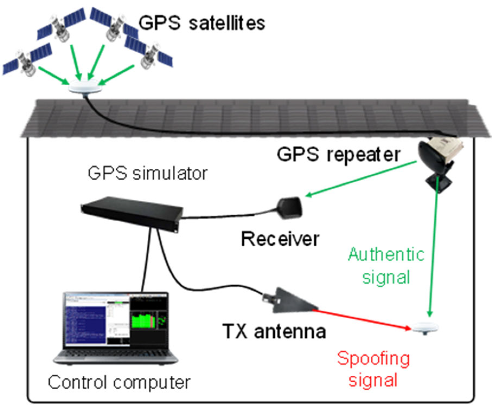

Algorithmic trading, often referred to as algo trading, is a sophisticated method employed in financial markets, leveraging computer programs to make trading decisions. These programs execute rules and instructions based on algorithms, aiming to enhance efficiency and execute trades at lightning speed, often faster than a human trader could. However, despite their advantages, algorithmic trading systems can be exploited through certain fraudulent practices, one of which is spoofing.

Spoofing is a manipulative strategy designed to deceive other market participants about the true demand or supply of a financial instrument. It involves placing a sequence of buy or sell orders in the market, only to cancel them before execution. The primary objective of spoofing is to create a false perception of market conditions, thereby influencing the instrument's price. Such deceptive tactics can significantly impact market behavior, allowing spoofers to benefit from price changes they have artificially induced.

With the increasing prevalence of algorithmic trading, ensuring market integrity becomes paramount. Spoofing detection mechanisms are essential tools in this regard, acting as sentinels to safeguard markets against manipulative trading practices. These mechanisms enable market participants and regulatory bodies to identify and mitigate the risks associated with spoofing, thereby preserving the fairness and transparency of the trading environment.

This article examines the methodologies and technologies pivotal in detecting spoofing within algorithmic trading. By exploring these security measures, we aim to provide valuable insights into their role in maintaining equitable trading conditions, ultimately contributing to a more trustworthy and stable financial marketplace.

## Table of Contents

## Understanding Spoofing in Algo Trading

Spoofing in algorithmic trading is a manipulative technique wherein traders submit orders to the market with no intention of executing them. These orders are placed on one side of the market to create a false impression of demand or supply. As the market reacts to these orders, typically by adjusting the price, the spoofer then executes genuine trades on the opposite side, capitalizing on the temporary price changes induced by their deceptive orders.

This strategy leverages the inherent nature of algorithmic trading systems, which are programmed to respond to incoming market data and perceived order book imbalances. By placing numerous large orders that they plan to cancel, spoofers can create artificial market conditions that algorithms interpret as genuine changes in supply or demand. Consequently, these automated systems may adjust their trading strategies, thereby unintentionally facilitating the spoofer's objectives.

The primary aim of spoofing is to distort the perceived market conditions, impacting pricing dynamics in a way that is beneficial to the spoofer. For instance, by fabricating an increase in demand through spoof orders, the price might rise, allowing the spoofer to sell at a high price. Conversely, by feigning increased supply, the price could drop, enabling the spoofer to buy at a lower cost.

One of the significant challenges posed by spoofing is attributed to the nature of [algorithmic trading](/wiki/algorithmic-trading) itself, which relies profoundly on speed and the rapid processing of data. This environment provides an opportunity for spoofers to influence market dynamics swiftly, often before detection mechanisms can respond. The high-frequency trading systems prevalent in modern financial markets are particularly vulnerable, as they can execute thousands of transactions within milliseconds. These systems might react almost instantaneously to changes caused by spoofing activities, thus amplifying the spoofing impact before corrective measures can be implemented. Therefore, recognizing and mitigating spoofing is an ongoing challenge for maintaining the integrity of algorithmic trading environments.

## Technologies Used in Spoofing Detection

Advanced analytics and [machine learning](/wiki/machine-learning) algorithms are integral to the detection of spoofing activities in algorithmic trading. These technological solutions analyze trading patterns and identify irregularities indicative of potential spoofing attempts. Machine learning models, particularly those employing supervised learning techniques, are trained on labeled datasets where known spoofing instances are tagged. These models can then predict with high accuracy when similar activities occur in real-time trading environments.

Real-time monitoring systems form the backbone of modern spoofing detection. By continuously analyzing [order book](/wiki/order-book-trading-strategies) data and trade executions, these systems detect abnormal patterns that could signify spoofing. For example, large orders that are frequently placed and canceled without execution suggest suspicious behavior. These systems typically implement anomaly detection algorithms, often using statistical methods or clustering techniques to determine deviations from standard trading behavior.

Historical trading data is another valuable resource in spoofing detection. Systems that utilize historical data can establish profiles of normal trading behavior, which serve as benchmarks against which current activities are measured. When trades deviate significantly from these profiles, the system alerts analysts to possible spoofing. Time-series analysis and regression models are commonly employed to predict and understand the trends underlying trading actions, enabling a sharper focus on potential manipulation.

Visualization tools complement detection systems by offering a clear depiction of trading trends. Graphical representations, such as candlestick charts and heatmaps, help identify unusual order volumes and cancellations that typify spoofing attempts. By visualizing the data, traders and regulators can quickly assess the health of the market and identify instances of manipulation.

The collaboration between machine learning, real-time monitoring systems, historical data analysis, and visualization ensures a robust framework for identifying and mitigating spoofing practices. These technologies not only enhance market integrity but also bolster confidence in financial markets by ensuring fair and transparent trading environments.

## Importance of Spoofing Detection

Effective spoofing detection is crucial in maintaining market fairness and protecting investors from potential losses due to deceptive practices. Spoofing undermines the integrity of financial markets by creating an illusion of artificial demand or supply, leading to price distortions. As a result, investors might make decisions based on manipulated information, exposing them to unnecessary risks.

By accurately identifying and mitigating spoofing activities, regulatory bodies are better equipped to enforce trading rules. This enforcement is essential for the smooth operation of financial markets, ensuring transactions are based on genuine supply and demand interactions. Maintaining these fundamentals upholds market efficiency and [liquidity](/wiki/liquidity-risk-premium), allowing prices to reflect true economic value.

Furthermore, spoofing detection enhances the credibility of trading platforms. When participants trust that market conditions are founded on real trading intentions, overall confidence in the market increases. This trust is vital for investor participation and market activity, as traders are less likely to engage in a system perceived as unfair or manipulated.

Preventing spoofing is also critical for reducing market [volatility](/wiki/volatility-trading-strategies). Artificial fluctuations caused by spoofing can lead to erratic price movements, resulting in instability that extends beyond individual traders to affect broader economic conditions. Market volatility can deter investment and hinder economic growth, making it imperative to minimize such disruptions through effective spoofing detection.

In conclusion, robust spoofing detection mechanisms are not only pivotal in protecting individual investors but also in maintaining the integrity of financial markets. These mechanisms help ensure that trading environments remain fair, transparent, and efficient, fostering trust and stability across global markets.

## Conclusion

Spoofing detection in algorithmic trading is a vital component in preserving the integrity of financial markets. As technology continues to advance, the capabilities of trading systems to identify and prevent spoofing are steadily improving. These enhancements are vital for the development of robust detection systems that uphold investor trust and foster fair trading practices globally.

The evolution of algorithmic trading necessitates continual innovation in spoofing detection. Given how sophisticated these markets have become, it is crucial to develop systems that can rapidly adapt to and counteract manipulative tactics. Leveraging technologies such as machine learning and real-time analytics, trading platforms are better equipped to flag suspicious behaviors and mitigate risks associated with spoofing.

Effective spoofing detection systems provide an environment where genuine supply and demand dynamics prevail, reducing the risk of artificial price manipulations. By implementing these systems, markets can ensure that trades are executed based on real intentions rather than deceptive practices. This not only enhances market credibility but also contributes to overall market stability by minimizing volatility caused by fraudulent activities.

As trading environments become increasingly complex, the role of advanced detection methods cannot be overstated. Continued innovation and adoption of cutting-edge technologies are essential to address the evolving nature of spoofing and maintain a high standard of market fairness. This ongoing commitment to innovation in spoofing detection is crucial for supporting the long-term sustainability and growth of global financial markets.

## References

1. Industry reports on the impact of spoofing in financial markets highlight the significant influence this manipulative practice can have on market dynamics and investor confidence. These reports often show how spoofing leads to artificial price movements, creating an unfair trading environment that can mislead investors and disrupt the natural balance of supply and demand.

2. Academic studies focus on the development and application of machine learning techniques for spoofing detection. These studies explore algorithms that analyze trading data to identify patterns indicative of spoofing. For instance, researchers have applied supervised learning techniques, such as decision trees and neural networks, to classify trading patterns and flag suspicious activities. One common approach involves using historical trading data to train models that can predict potential spoofing events based on deviations from normal trading behavior.

3. Regulatory body guidelines and laws regarding spoofing and manipulative trading practices play a critical role in establishing legal frameworks that deter and penalize such activities. Agencies like the U.S. Commodity Futures Trading Commission (CFTC) and the Securities and Exchange Commission (SEC) have outlined specific rules that define spoofing and other deceptive practices, setting precedents for enforcement actions and penalties. These guidelines serve to bolster efforts in monitoring and preventing manipulation in financial markets.

4. Case studies on the implementation of spoofing detection systems in major trading platforms provide practical insights into the efficacy and challenges of combating spoofing. These studies often examine the integration of real-time monitoring systems and analytics tools into existing trading infrastructures. For example, some platforms employ a hybrid approach, combining rule-based systems with machine learning algorithms to enhance their detection capabilities. Such case studies help illustrate the continuous evolution of trading technologies aimed at maintaining market integrity.

## References & Further Reading

[1]: Benos, E., Brugler, J., Hjalmarsson, E., & Zikes, F. (2018). ["Interactions Among High-Frequency Traders."](https://www.bankofengland.co.uk/working-paper/2015/interactions-among-high-frequency-traders) Bank of England Working Paper No. 701.

[2]: Cartea, Á., Jaimungal, S., & Penalva, J. (2015). ["Algorithmic and High-Frequency Trading."](https://assets.cambridge.org/97811070/91146/frontmatter/9781107091146_frontmatter.pdf) Cambridge University Press.

[3]: CFTC. (2015). ["CFTC Files Complaint Against Trader for Spoofing and Manipulative Conduct,"](https://www.cftc.gov/PressRoom/PressReleases/7274-15) U.S. Commodity Futures Trading Commission.

[4]: Easley, D., López de Prado, M. M., & O'Hara, M. (2012). ["Flow Toxicity and Liquidity in a High-Frequency World."](https://www.jstor.org/stable/41485533) Financial Analysts Journal, 68(6), 42-56.

[5]: Gomber, P., Haferkorn, M., Ibrahim, S., & Lutat, M. (2015). ["The Determinants of an Order's Life Cycle: An Analysis of the Changes Around Short-Selling Bans,"](https://www.semanticscholar.org/paper/High-Frequency-Trading-Gomber-Haferkorn/abc039a3062247744e85451ec2bb8b8adfff3fc9) Review of Managerial Science, 9(3), 571-603.