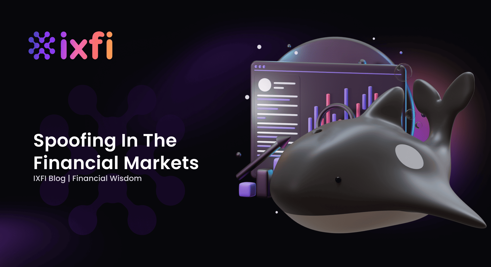

Spoofing is a controversial practice in algorithmic trading characterized by the placement of deceptive orders aimed at manipulating market prices. These orders are entered with the intent to cancel them before execution, creating a misleading impression of demand or supply. Traders who engage in spoofing exploit this artificial market activity to influence asset prices advantageously, often resulting in transient price movements they can profit from. Spoofing is deemed illegal in numerous jurisdictions, including the United States, where it is explicitly prohibited under the Dodd-Frank Act. The legislation empowers regulatory bodies such as the Commodity Futures Trading Commission (CFTC) and the Securities and Exchange Commission (SEC) to monitor and penalize such activities, highlighting its recognized detrimental impact on financial markets.

The practice of spoofing can induce considerable volatility within markets, which can mislead both institutional and retail investors, eroding their confidence in the fairness and integrity of the trading environment. This artificial volatility can also distort the true market value of assets, potentially causing a ripple effect that impacts market liquidity and trading volumes. By examining the mechanics of spoofing, the article aims to shed light on its implications for market dynamics and the evolving regulatory landscape engineered to combat this malpractice in the financial sector.

## Table of Contents

## Understanding Spoofing

Spoofing, a manipulative tactic within algorithmic trading, involves the strategic placement of orders intended for cancellation before execution. This deceptive practice is designed to mislead other market participants by creating a false perception of supply and demand. The primary objective of spoofing is to influence asset prices temporarily, thereby benefiting the spoofer's trading strategies.

The mechanics of spoofing encompass a variety of techniques, all aimed at order book manipulation. Traders engaging in spoofing may place large, visible orders on one side of the market to simulate significant buying or selling interest. This tactic is intended to lure other traders into reacting to the perceived price direction. For example, a spoofer may place substantial buy orders, prompting other market participants to believe in a forthcoming price increase. Once these traders act on this perception, the spoofer cancels the initial orders and potentially sells at the inflated price, securing a profit.

Spoofing's impact on price movement is noteworthy, as it generates transient fluctuations that do not reflect actual market conditions. These artificial price movements can ripple through the market, creating volatility that unjustly benefits the spoofer at the expense of genuine investors. The deceptive nature of spoofing not only skews price discovery but also undermines the integrity of the financial markets.

Overall, understanding the intricacies of spoofing is crucial for recognizing its adverse effects on market stability and for developing strategies to detect and deter such manipulations effectively.

## Regulatory Framework

The regulatory framework governing spoofing in the United States is primarily established through legislative measures such as the Dodd-Frank Wall Street Reform and Consumer Protection Act. Enacted in response to the financial crisis of 2007-2008, the Dodd-Frank Act specifically targets practices that manipulate market fairness, with spoofing identified as a major concern. Under this legislation, spoofing is explicitly prohibited, acknowledging its potential to undermine the integrity of financial markets.

Key regulatory bodies such as the Commodity Futures Trading Commission (CFTC) and the Securities and Exchange Commission (SEC) are entrusted with the enforcement of these anti-spoofing regulations. These agencies employ a variety of strategies to monitor trading activities, leveraging advanced technological tools and data analysis techniques to detect and deter fraudulent practices. The CFTC, for example, utilizes sophisticated algorithms to scrutinize large volumes of trading data, identifying patterns indicative of spoofing. This proactive approach enables regulators to initiate timely investigations and take enforcement actions against entities engaging in deceptive trading practices.

On an international level, various regulatory frameworks mirror the U.S. efforts to combat spoofing. For instance, the European Union, through the Markets in Financial Instruments Directive II (MiFID II), delineates stringent guidelines aimed at enhancing transparency and reducing market manipulation. Similarly, other jurisdictions have instituted their own measures, recognizing the global implications of spoofing on market stability and investor trust. International coordination among regulatory bodies, facilitated through forums and organizations such as the International Organization of Securities Commissions (IOSCO), plays a crucial role in standardizing anti-spoofing efforts, promoting market integrity on a global scale.

These regulatory initiatives highlight a comprehensive approach to curbing spoofing, emphasizing the importance of robust legal frameworks and cross-border collaboration in maintaining equitable and efficient financial markets. As trading technologies and strategies evolve, regulatory frameworks continue to adapt, ensuring that measures remain effective in deterring spoofing and safeguarding market participants.

## Notable Cases of Spoofing

Navinder Singh Sarao's involvement in the 2010 Flash Crash is one of the most notable instances of spoofing in financial markets. Sarao, a British trader, utilized advanced software to implement spoofing strategies that significantly contributed to the Flash Crash on May 6, 2010. On that day, the U.S. stock market plummeted, shedding about $1 trillion in value within minutes, before quickly recovering. Investigation revealed that Sarao placed large spoof orders on the Chicago Mercantile Exchange (CME) to influence futures prices, thereby profiting from the resultant price movements. He managed to amass substantial illegal profits over several years by repeatedly deploying similar tactics. Sarao's case underscores the vast potential for spoofing to affect market stability and prompted intensified scrutiny by regulatory bodies.

Another landmark spoofing case involved Michael Coscia and his firm, Panther Energy Trading LLC. In this precedent-setting prosecution under the Dodd-Frank Act's anti-spoofing provisions, Coscia was accused of designing a computer algorithm to place and quickly cancel large orders, creating a false impression of market demand and supply. His scheme operated between August and October 2011, generating approximately $1.4 million in illicit profits by manipulating markets for various commodities. Coscia was prosecuted in 2015, marking the first criminal conviction under the Dodd-Frank Act for spoofing. This case reinforced the notion that sophisticated algorithms could be employed for illicit market manipulation and highlighted the ongoing challenge faced by regulators in detecting and prosecuting these sophisticated schemes.

These instances of spoofing highlight both the challenges and successes of detecting and prosecuting market manipulation. Identifying illegitimate orders amid the vast number of legitimate trades is a complex task requiring advanced detection technologies and robust regulatory frameworks. The prosecutions of Sarao and Coscia demonstrate that while significant challenges remain, successful enforcement is achievable with diligent investigative efforts and the implementation of advanced technological resources. Such measures are crucial for preserving market integrity and ensuring fair trading conditions for all participants.

## Impact on Financial Markets

Spoofing significantly impacts financial markets by introducing artificial [volatility](/wiki/volatility-trading-strategies), which can adversely affect both institutional and retail investors. This artificial volatility arises when traders place large orders with no intention of executing them, merely to create a false impression of demand or supply. For instance, when a spoofer places a large buy order to drive up the price, unsuspecting traders may follow suit, believing there is genuine interest in the asset. Once the price has been artificially increased to a desirable level, the spoofer cancels their initial order, executes a sell order at the elevated price, then exits the position for a profit, consequently causing the market to fall back to its original state or beyond.

This manipulation of supply and demand dynamics can damage market confidence. A lack of trust in market integrity may deter participation, causing a decline in overall [liquidity](/wiki/liquidity-risk-premium) and trading [volume](/wiki/volume-trading-strategy). Lower liquidity can expand bid-ask spreads, making it more costly to enter or [exit](/wiki/exit-strategy) positions. Thus, liquidity providers, such as market makers, may require higher compensation for the increased risk, potentially exacerbating the problem. The following formula represents the relation between the bid-ask spread and liquidity:

$$
\text{Spread} = \frac{1}{\text{Liquidity}}
$$

Where a higher spread signifies reduced liquidity. Spoofing-induced volatility can thus increase the spread, diminishing market efficiency.

Moreover, asset prices can be distorted by spoofing. When prices are artificially manipulated, they may deviate from their true value, providing unfair advantages to those who engage in or anticipate spoofing activities. Spoofers can exploit these price distortions to gain profits at the expense of other market participants who trade based on deceptive price signals. This undermines the price discovery process, which is fundamental to the efficient functioning of financial markets.

Developing robust mechanisms to prevent and detect spoofing is crucial to safeguarding market integrity, ensuring a level playing field for all participants.

## Detection and Prevention

Advanced algorithms and [machine learning](/wiki/machine-learning) models are instrumental in identifying spoofing behaviors in financial markets in real-time. These sophisticated tools are designed to process enormous volumes of trade data and detect anomalies indicative of potentially manipulative activities. Machine learning algorithms, particularly those utilizing supervised learning techniques, are trained to recognize patterns symptomatic of spoofing through labeled datasets comprising historical trading data. By comparing live trading behaviors against these established patterns, it is possible to flag suspicious activities promptly.

Historical trade data analysis plays a crucial role in uncovering spoofing activities. Analysts employ statistical techniques to examine past trade sequences, looking for irregularities such as unusually large order cancellations and rapid price changes that often accompany spoofing. For example, the time-weighted average price (TWAP) and volume-weighted average price (VWAP) can be utilized to discern price fluctuations that do not align with typical market behaviors. Such metrics allow analysts to draw comparisons between the expected and observed trading volumes, assisting in detecting discrepancies potentially caused by spoofing.

Emerging technologies like blockchain hold substantial promise in enhancing transparency and deterring spoofing. Blockchain’s decentralized ledger system provides an immutable record of transactions, thereby enhancing data integrity and traceability. Each transaction is time-stamped and recorded across a distributed network, creating a transparent environment resistant to manipulation. This intrinsic transparency could make it significantly more difficult for actors to engage in spoofing without detection.

Blockchain technology also facilitates the development of smart contracts, which can automate certain aspects of trading and compliance. These contracts can enforce predetermined conditions for trade execution, reducing the potential for fraudulent activities. Moreover, smart contracts can provide automated alerts when trading behaviors deviate from norms, thereby acting as an additional layer of deterrence against spoofing.

In summary, the combination of advanced algorithms, historical data analysis, and innovative technologies like blockchain presents a formidable defense against spoofing. While these tools do not eliminate the risk entirely, they considerably enhance the ability of market participants and regulators to monitor and respond to such illicit activities, thereby promoting market integrity and efficiency.

## Conclusion

Spoofing remains a significant challenge in maintaining fair and efficient financial markets due to its ability to manipulate prices and mislead participants. The practice undermines market integrity by creating an illusion of false supply and demand, leading to distorted asset prices and artificial volatility. As technology in trading continues to advance, so do the methods employed by spoofers, necessitating ongoing vigilance and innovation.

Technological advancements have become crucial in combating spoofing. Financial institutions and regulatory bodies employ sophisticated algorithms and machine learning models to detect spoofing activities in real-time. These technologies analyze large volumes of data to identify suspicious trading patterns that may indicate manipulative behaviors. For instance, anomaly detection algorithms are designed to recognize irregularities in [order book](/wiki/order-book-trading-strategies) activities that deviate from typical trading behaviors, thus aiding in the identification of spoofing attempts.

Moreover, the regulatory landscape is continuously evolving to counter the ever-changing strategies of spoofers. Regulations are becoming increasingly stringent, particularly in jurisdictions like the United States, where the Dodd-Frank Act explicitly prohibits spoofing. Regulatory bodies such as the Commodity Futures Trading Commission (CFTC) and the Securities and Exchange Commission (SEC) are dedicated to enforcing these regulations through monitoring and penalizing violators, thereby safeguarding market integrity.

Despite these efforts, the dynamic nature of spoofing techniques necessitates adaptive regulatory frameworks. International cooperation among regulatory authorities is critical to ensuring consistent prevention strategies across global markets. As financial markets become more interconnected, a unified approach to regulation can prevent regulatory [arbitrage](/wiki/arbitrage), wherein spoofers exploit jurisdictions with weaker enforcement.

In conclusion, while significant strides have been made in addressing spoofing, its elimination requires ongoing efforts. Technological innovation, coupled with evolving regulation, forms the backbone of effective prevention and enforcement strategies. Ultimately, maintaining the integrity of financial markets hinges on the continuous adaptation of these measures, ensuring a fair trading environment for all market participants.

## References & Further Reading

[1]: ["Spoofing and Layering in Futures Markets"](https://www.securitieswhistleblowerattorneys.com/layering-spoofing-manipulation.html) by the U.S. Commodity Futures Trading Commission (CFTC)

[2]: Gomber, P., Arndt, B., Lutat, M., & Uhle, T. (2011). ["High-Frequency Trading."](https://papers.ssrn.com/sol3/papers.cfm?abstract_id=1858626) Goethe University Frankfurt Working Paper.

[3]: Harris, L. (2003). ["Trading & Exchanges: Market Microstructure for Practitioners"](https://www.amazon.com/Trading-Exchanges-Market-Microstructure-Practitioners/dp/0195144708). Oxford University Press.

[4]: de Prado, M. L. (2018). ["Advances in Financial Machine Learning"](https://www.amazon.com/Advances-Financial-Machine-Learning-Marcos/dp/1119482089). Wiley.

[5]: Wymeersch, E. (2012). ["The Reforms to the IOSCO Financial System: Some Preliminary Considerations."](https://papers.ssrn.com/sol3/papers.cfm?abstract_id=2127068) Springer, Capital Markets Union and Beyond.

[6]: Securities and Exchange Commission. (2015). ["SEC Charges Trading Firm and CEO in First Federal Court Case Enforcing Rule to Prevent Disruptive Trading"](https://en.wikipedia.org/wiki/U.S._Securities_and_Exchange_Commission), U.S. Securities and Exchange Commission. 

[7]: Duffie, D. (2010). ["Asset Price Dynamics with Slow-Moving Capital"](https://www.darrellduffie.com/uploads/1/4/8/0/148007615/duffieafapresidentialaddress2010.pdf). The Review of Financial Studies.

[8]: Khan, M. (2015). ["Flash Boys: Cracking the Money Code"](https://archive.org/details/flashboyscrackin0000lewi). Penguin Books.