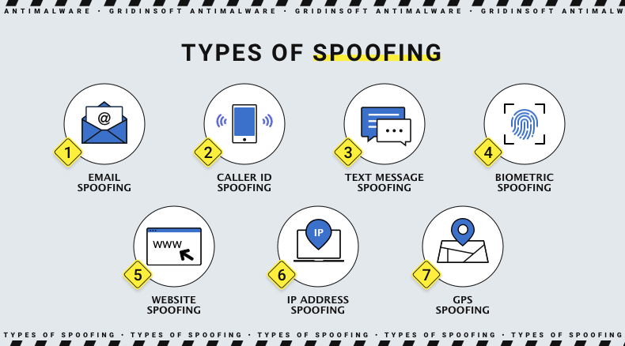

Spoofing represents a critical challenge within algorithmic trading and cybersecurity, affecting both the financial markets and the broader digital environment where fraud and security breaches are rampant. In algorithmic trading, spoofing is a manipulative practice wherein deceitful orders are placed to create artificial demand or supply, misleading other market participants with false signals. This tactic can significantly distort market dynamics, impacting price discovery mechanisms and leading to unfair trading conditions. Spoofing undermines the core principles of market integrity by presenting a facade of activity without genuine intent, eroding trust among investors.

Understanding spoofing is vital for preventing internet fraud and enhancing cybersecurity defenses. Recognizing spoofing methods allows for the development of robust technological frameworks to detect and deter such manipulative activities, thereby securing financial transactions and crucial data exchanges online. Given that spoofing techniques are continually evolving and growing more sophisticated, ongoing study and adaptation are essential to safeguard against potential threats to both personal and organizational data integrity.



The impact of spoofing on market integrity is profound. When unchecked, spoofing can diminish investor confidence, reduce market liquidity, and increase volatility. This manipulation not only affects individual traders but also has broader economic consequences, as it may lead investors to question the fairness and transparency of the trading environment. A strong understanding and proactive management of spoofing activities are critical to maintaining trust in the systems that underpin global markets. As a result, enhancing security measures and regulatory frameworks against spoofing is crucial for ensuring market stability and protecting investors from potential exploitation.

## Table of Contents

## Understanding Spoofing in Algo Trading

Spoofing in algorithmic trading refers to a strategy where traders place deceptive orders to manipulate market conditions, ultimately for their financial gain. These activities involve entering large volume orders with no intention of executing them, instead aiming to create false impressions about supply and demand dynamics. The practice undermines market integrity by distorting price signals and manipulating the behavior of other market participants.

At the core of spoofing is the placement of fictitious buy or sell orders, designed to deceive other traders about the true state of the market. This tactic creates artificial price movements, often making an asset appear more attractive or less desirable than it actually is. Once the market responds to these misleading signals, the spoofing actor cancels the phony orders and executes genuine orders at advantageous prices.

Common spoofing strategies include layering and quote stuffing. Layering involves placing a series of sell (or buy) orders at increasing (or decreasing) prices to give an illusion of market demand or supply levels. This tactic can lead other traders to base their actions on the misleading order book data, potentially inflating or deflating the asset's price. For example, a spoofer might place multiple layers of sell orders just above the current market price. This activity suggests substantial selling pressure, enticing other traders to lower their bids and allowing the spoofer to buy the asset at a reduced price.

Quote stuffing, another spoofing tactic, involves rapidly placing and withdrawing large numbers of orders to congest market systems. This tactic can slow down market participants' order processing capabilities and data feeds, creating latency [arbitrage](/wiki/arbitrage) opportunities. By overwhelming market infrastructure with excessive order traffic, spoofers can gain informational advantages over slower traders and exploit temporary inefficiencies in price discovery.

These deceptive trading practices undermine the foundational principles of fair and transparent markets. They erode trust among investors, pose challenges to maintaining an efficient marketplace, and necessitate regulatory interventions and sophisticated detection mechanisms. Addressing spoofing requires coordinated efforts between traders, exchanges, and regulatory bodies to safeguard market integrity.

## Cyber Spoofing: Beyond Financial Markets

Spoofing, in the context of cybersecurity, extends beyond financial markets, manifesting through techniques like email and IP spoofing. These techniques manipulate digital communication systems to deceive recipients or systems, posing significant threats to data integrity and privacy.

Email spoofing involves sending messages with forged sender addresses. This tactic is often employed in phishing attacks, where the attacker attempts to trick the recipient into revealing sensitive information or downloading malicious files. For example, a spoofed email might appear to come from a trusted source, such as a bank, urging the recipient to reset their password or verify account details. The key danger here lies in the trust recipients place in seemingly legitimate communications, potentially leading to data breaches or identity theft.

IP spoofing, on the other hand, involves altering the source IP address in a packet header to make it appear as though it is originating from a trusted source. This method is often used in denial-of-service (DoS) attacks or to bypass network security measures. By masquerading as a legitimate entity, attackers can gain unauthorized access to systems and manipulate data flows, compromising network integrity.

Comparing spoofing in cybersecurity to financial markets reveals several similarities and differences. Both involve deception and manipulation to gain advantage or unauthorized access. However, while financial spoofing primarily aims to manipulate market conditions for profit, cyber spoofing often targets data theft, system disruption, or espionage. The impacts on data integrity and privacy are profound. Cyber spoofing can lead to unauthorized data access, corruption, and leakage, jeopardizing the confidentiality, integrity, and availability of information. In contrast, while market spoofing affects market levels and investor decisions, it indirectly influences data privacy, primarily through financial loss rather than data alteration.

Cyber spoofing's implications on data integrity and privacy are vast. By undermining the trust and authenticity of digital communications and transactions, it exposes individuals and organizations to significant risks. It stresses the need for robust security measures, such as email authentication protocols (e.g., SPF, DKIM, and DMARC), network monitoring, and anomaly detection systems, to safeguard against these deceptive practices.

## Regulatory Measures Against Spoofing

Regulatory measures against spoofing are crucial to maintaining market integrity and protecting investors from fraudulent practices. One of the most significant frameworks in addressing spoofing in financial markets is the Dodd-Frank Wall Street Reform and Consumer Protection Act, enacted in 2010. The Dodd-Frank Act was a direct response to the financial crisis of 2007-2008 and aimed to increase accountability and transparency in the financial system. It granted the Commodity Futures Trading Commission (CFTC) and the Securities and Exchange Commission (SEC) broader oversight powers to regulate and penalize market manipulation practices, including spoofing.

A landmark legal case that underscores the application of the Dodd-Frank Act against spoofing is the conviction of Michael Coscia in 2015. Coscia was found guilty of manipulating commodity futures markets through spoofing, marking the first successful criminal prosecution under the anti-spoofing provisions of the Dodd-Frank Act. He was sentenced to three years in prison, a ruling that highlighted the seriousness with which regulators and courts view spoofing activities.

Internationally, efforts to harmonize anti-spoofing regulations have been crucial in addressing the global nature of financial markets. Bodies such as the International Organization of Securities Commissions (IOSCO) work towards establishing coherent regulatory standards across different jurisdictions. By aligning policies, international authorities aim to prevent regulatory arbitrage, where traders exploit differences in regulations between countries to engage in spoofing without reprisal.

The European Union has also implemented stringent regulations through the Markets in Financial Instruments Directive II (MiFID II), which came into effect in 2018. MiFID II explicitly prohibits market manipulation practices like spoofing and requires high-frequency traders to register, thereby increasing market surveillance. These regulations are complemented by the Market Abuse Regulation (MAR), reinforcing the EU’s commitment to combating market abuse.

Ensuring the efficacy of these regulations requires robust detection and enforcement mechanisms. In recent years, technological advancements, including [machine learning](/wiki/machine-learning) and [artificial intelligence](/wiki/ai-artificial-intelligence), have significantly enhanced the ability of regulators to monitor trading activities in real-time, identify suspicious patterns, and act swiftly to investigate and impose penalties on offenders. The collaboration between exchanges, regulators, and international bodies is vital in fostering a global climate where spoofing is actively discouraged, consequently boosting investor confidence and market stability.

## Detection and Prevention Techniques

Technological advancements in the financial sector have necessitated robust strategies to detect and prevent spoofing, particularly through the employment of machine learning (ML) and artificial intelligence (AI). These technologies are pivotal in analyzing vast datasets, uncovering anomalies, and identifying fraudulent activities, thereby enhancing the security and integrity of trading environments.

One of the primary methods of detection involves supervised machine learning models that are trained using historical trading data to recognize patterns indicative of spoofing. For instance, these models can be designed to identify sudden surges in [order book](/wiki/order-book-trading-strategies) entries that are quickly canceled, a hallmark of spoofing activities. A typical approach might involve defining features such as the time between order placements and cancellations, the [volume](/wiki/volume-trading-strategy) of orders, and changes in bid-ask spreads. An example of such a model is logistic regression, which could predict the likelihood of an order being a part of a spoofing scheme:

```python
from sklearn.linear_model import LogisticRegression
from sklearn.model_selection import train_test_split
from sklearn.metrics import accuracy_score

# Example data: features for spoofing behavior
X = [[0.1, 2000, 0.05], [0.2, 1500, 0.03], [0.05, 3200, 0.1]]  # Placeholder data
y = [1, 0, 1]  # 1 for spoofing, 0 for non-spoofing

# Splitting the dataset into training and testing
X_train, X_test, y_train, y_test = train_test_split(X, y, test_size=0.3, random_state=42)

# Training the logistic regression model
model = LogisticRegression()
model.fit(X_train, y_train)

# Predict and evaluate
predictions = model.predict(X_test)
accuracy = accuracy_score(y_test, predictions)
print(f"Model Accuracy: {accuracy}")
```

In addition to machine learning, real-time monitoring is critical for thwarting spoofing activities. Exchanges and regulators can leverage advanced analytics and high-frequency data processing to detect irregular trading patterns as they occur. This approach often involves creating an integrated network of surveillance systems that allows for seamless data sharing and coordination between regulatory bodies and exchanges. By employing real-time algorithms, market participants can be alerted to suspicious trades immediately, enabling swift intervention.

Furthermore, collaboration between exchanges and regulatory authorities is vital for crafting comprehensive preventive frameworks. This includes the synchronization of data sharing protocols, standardization of alert systems, and harmonization of regulatory policies to ensure a unified approach to surveillance and enforcement. Enhancing market surveillance can involve not only technical solutions but also strategic cooperation across jurisdictions to address the cross-border nature of modern financial markets.

To bolster investor protection, strategies must also account for educating market participants about spoofing tactics and encouraging transparency. By fostering an environment where market players are aware of anti-spoofing measures, the effectiveness of detection and prevention efforts can be significantly improved. 

Overall, the integration of technological advancements and collaborative regulatory efforts forms the backbone of effective spoofing detection and prevention strategies, thereby safeguarding market integrity and investor interests.

## Impact of Spoofing on Market Integrity

Spoofing is a market manipulation tactic that can significantly affect market integrity, primarily through its impact on price discovery and fairness. Price discovery is the mechanism by which markets aggregate information from all participants to determine the price of an asset. Spoofing disrupts this process by giving false signals that can mislead traders about the true supply and demand conditions. For example, a trader engaged in spoofing might place large buy orders to create artificial demand, inflate prices momentarily, and then cancel these orders before execution, exploiting the resultant price movements. This subversion of genuine market conditions leads to distorted price signals, thereby impairing the efficiency of financial markets.

The erosion of trust due to spoofing further exacerbates its impact on market [liquidity](/wiki/liquidity-risk-premium) and [volatility](/wiki/volatility-trading-strategies). Liquidity, defined as the ability to buy or sell assets without causing a significant impact on the asset's price, is heavily reliant on market participants' confidence in a fair trading environment. Spoofing introduces uncertainty, as traders become skeptical about the authenticity of available order information. This skepticism can lead to decreased participation, causing liquidity to dry up. Moreover, as vast, non-genuine orders create artificial fluctuations, market volatility increases, making it difficult for traders to manage risk effectively.

Spoofing's influence extends to long-term economic implications, as persistent market manipulation undermines overall market confidence. Repeated incidents can deter investors from engaging in the markets, fearing manipulation and financial losses. This aversion results in diminished market participation, which can stifle market growth and potentially result in higher costs of capital, reduced innovation, and slower economic expansion. The economic repercussions can be extensive, affecting not just the markets directly involved but also the broader financial system reliant on efficient and fair markets. The threat to market integrity posed by spoofing underlines the importance of effective regulatory measures and technological advances to monitor and combat such deceptive practices.

## Conclusion

Understanding and addressing spoofing in both [algorithmic trading](/wiki/algorithmic-trading) and cybersecurity is crucial for maintaining the integrity and trustworthiness of financial and digital ecosystems. Spoofing manipulates market dynamics, undermining the confidence of investors and distorting price discovery processes. By recognizing the patterns and techniques employed in spoofing, stakeholders can implement more effective measures to safeguard against such manipulation, thus enhancing overall market integrity.

Ensuring market integrity requires a multi-faceted approach involving stringent regulatory frameworks, advanced technological solutions, and international cooperation. Regulatory measures such as the Dodd-Frank Act exemplify the need for robust legal standards to deter and punish market manipulation. Additionally, technological advancements, including machine learning and artificial intelligence, offer promising tools for real-time detection and prevention of spoofing activities. These innovations, combined with effective collaboration between exchanges, regulators, and market participants, are essential for fostering a fair and transparent trading environment.

Restoring investor confidence involves demonstrating that effective defenses against spoofing are in place and that the market operates on principles of fairness and transparency. As financial systems evolve and cyber threats grow more sophisticated, continuous vigilance and innovation in anti-spoofing measures are imperative. Embracing emerging technologies and enhancing regulatory coherence will be key in building trust and ensuring that markets function smoothly and equitably.

Ultimately, the commitment to combat spoofing reflects a broader commitment to protecting investors, ensuring the integrity of data, and upholding the fundamental principles of fairness and fairness in both financial and cyber domains. Continued efforts in this area are necessary to maintain the stability and efficiency of markets, benefiting all participants and contributing to stronger, more reliable international financial systems.


## References & Further Reading

[1]: Lewis, M. (2015). ["Flash Boys: A Wall Street Revolt."](https://en.wikipedia.org/wiki/Flash_Boys) W. W. Norton & Company.

[2]: De Prado, M. L. (2018). ["Advances in Financial Machine Learning."](https://www.amazon.com/Advances-Financial-Machine-Learning-Marcos/dp/1119482089) Wiley.

[3]: Securities and Exchange Commission. (2015). ["Litigation Release No. 23433: SEC Charges Trading Firm and CEO in Scheme Involving Manipulative Trading in Thousands of Options Series."](https://www.sec.gov/litigation/litreleases/2015/lr23433.htm)

[4]: Commodity Futures Trading Commission. (2015). ["CFTC Charges Panther Energy Trading LLC and Its Principal Michael J. Coscia With Spoofing in Commodity Futures."](https://en.wikipedia.org/wiki/Commodity_Futures_Trading_Commission)

[5]: International Organization of Securities Commissions. (2013). ["Technological Challenges to Effective Market Surveillance Issues and Regulatory Tools."](https://www.iosco.org/library/pubdocs/pdf/IOSCOPD412.pdf)