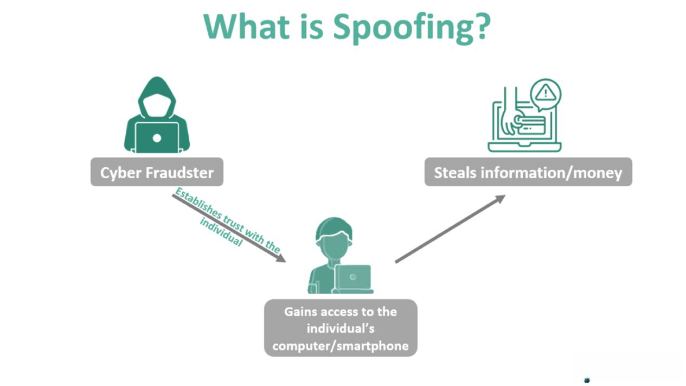

Algorithmic trading has significantly reshaped financial markets by employing computer algorithms to execute trades at speeds and frequencies unachievable by human traders. This technological advancement has birthed a plethora of new terms and strategies that continue to evolve the trading landscape. Among these terms, "Spoofy" has garnered notable attention from both traders and regulators.

"Spoofy" refers to a controversial figure or group that purportedly manipulates cryptocurrency markets through a deceptive trading practice known as "spoofing." Spoofing involves placing large orders that one intends to cancel before execution to manipulate market prices, creating false perceptions of supply or demand. This tactic can lead to advantages when executing real trades at more favorable prices, drawing ethical and regulatory scrutiny.



The phenomenon of Spoofy emphasizes the complexities introduced by algorithmic trading, where rapid execution and automated strategies may operate at the edge of legality and market integrity. As markets become increasingly algorithm-driven, understanding these practices' implications is crucial for traders. They must remain vigilant about potential manipulative strategies and evolving regulatory frameworks governing such tactics to mitigate risks and maintain ethical standards in trading activities.

## Table of Contents

## Understanding Spoofy in Algorithmic Trading

Spoofy is a term that has gained notoriety within cryptocurrency trading circles. It refers to a potential group or individual known for manipulating cryptocurrency markets through a tactic called 'spoofing.' Spoofing is a form of market manipulation that involves placing large buy or sell orders on an exchange with no genuine intent to execute these orders. Instead, the objective is to create a false impression of supply or demand in the market, thereby misleading other traders.

This method operates by placing large visible orders on an exchange's order book. These orders are meant to convey a skewed perception of the market's supply-demand dynamics. For instance, a trader may place a large buy order, suggesting robust demand, with the intention of pushing prices upward. Conversely, a large sell order might suggest an increased supply, driving prices down. Once the market moves in the desired direction, the spoofer cancels the original orders before they are executed, having already taken advantage of the price movement to execute real trades at more favorable prices.

The entire spoofing process is further facilitated by the use of algorithmic trading systems. These algorithms can swiftly place and cancel orders, reacting at speeds beyond human capability, thereby maximizing the efficacy of the spoofing strategy. Although regarded as unethical and illegal in many traditional financial markets due to its distortive effects, spoofing exists in somewhat of a gray area within the relatively less regulated cryptocurrency markets. Despite some jurisdictions taking steps to regulate such activities, the pseudonymous nature of cryptocurrency trading platforms makes enforcement challenging. As a result, activities like those attributed to Spoofy continue to raise concerns and discussions among traders, regulators, and market participants globally.

## The Mechanics of Spoofing

Spoofing is a manipulative trading practice where traders place orders they do not intend to execute, with the goal of influencing market prices to their advantage. This technique involves submitting large buy or sell orders to create the illusion of demand or supply in the market. Once the market participants react to the perceived demand or supply by adjusting their price expectations, the spoofer cancels the spoof orders. Meanwhile, the spoofer executes genuine trades that capitalize on the artificially altered price levels.

The mechanics of spoofing can be broken down into a few key steps:

1. **Placing Fake Orders**: A trader begins by entering large buy or sell orders in the market book. These orders are substantial enough to be noticed by other market participants, thereby affecting their perceptions of demand or supply. These orders are placed at prices that are unlikely to be executed immediately, minimizing the risk of accidental fulfillment.

2. **Market Reaction and Price Movement**: As these large orders appear in the order book, they create a false impression of increased buying or selling interest. Other traders, reacting to this perceived market activity, may adjust their positions or place their own orders in response, often moving the market price in the desired direction.

3. **Executing Genuine Trades**: With the market price now shifted, the spoofer discreetly executes smaller, genuine trades on the opposite side of the market, capturing the favorable price changes induced by the spoof orders.

4. **Cancelling Spoof Orders**: Once satisfactory trades have been executed, the spoofer quickly cancels the original large fake orders before they are filled. The speed and timing of order placement and cancellation are critical for this tactic to succeed without detection.

The Spoofy trades on the Bitfinex platform serve as one of the most cited examples of spoofing in [cryptocurrency](/wiki/cryptocurrency) markets. It is alleged that Spoofy, a moniker used to describe either an individual or group, manipulated market prices through extensive spoofing practices. Critics have pointed to unusual, large-[volume](/wiki/volume-trading-strategy) trades on Bitfinex that distort prices momentarily—indicative of spoofing activities.

This practice exploits the perception-based reaction of other market participants and can lead to temporary market instability. As a result, it's a subject of intense scrutiny by regulators, given its potential to create unfair trading conditions and distort market efficiency.

## Market Impact and Ethical Concerns

Spoofing, a deceptive practice where traders place large orders without the intention of executing them, significantly distorts market perception and contributes to increased [volatility](/wiki/volatility-trading-strategies). By creating a false sense of supply and demand, spoofing can cause price movements that mislead investors, impacting their trading decisions and potentially resulting in financial loss. This manipulation disrupts the efficient market hypothesis, which posits that asset prices reflect all available information.

In traditional financial markets, spoofing is recognized as illegal due to its disruptive impact and the potential harm it causes to market integrity. Regulatory bodies, such as the U.S. Commodity Futures Trading Commission (CFTC) and the Securities and Exchange Commission (SEC), strictly prohibit spoofing activities, often imposing severe penalties on individuals or entities found guilty of engaging in such practices. These regulatory measures are instrumental in maintaining market stability and investor confidence by deterring manipulative behaviors.

However, the situation is markedly different in the cryptocurrency sector, where the regulatory landscape is highly fragmented and inconsistent across different jurisdictions. In some regions, there are clear regulations addressing market manipulation, including spoofing, while in others, regulatory frameworks are either underdeveloped or non-existent. This inconsistency allows spoofing and similar tactics to proliferate in certain parts of the cryptocurrency market. The lack of a comprehensive regulatory structure can create environments where unethical trading practices thrive, posing substantial risks to market participants and overall market integrity.

The cryptocurrency market's relatively nascent stage and rapid evolution compound these issues, as regulators grapple with establishing oversight mechanisms that are both effective and flexible enough to accommodate new developments. As a result, traders and investors in the cryptocurrency market must exercise increased diligence and awareness of the varying legal frameworks governing market manipulation in different jurisdictions. Understanding these disparities is crucial for navigating the market and minimizing exposure to unethical and potentially illegal trading activities.

## Regulatory Considerations

Several cryptocurrency trading platforms are enhancing their surveillance mechanisms to combat the practice of spoofing. This increase in monitoring is partly a response to the evolving regulatory environment, which varies significantly across different jurisdictions. In traditional financial markets, spoofing is clearly defined as an illegal activity under regulations such as the Dodd-Frank Act in the United States. However, the cryptocurrency market's regulatory framework is less uniform, allowing for varying interpretations and enforcement practices globally.

Cryptocurrency exchanges are taking proactive measures to detect and deter spoofing. These measures often include sophisticated algorithms to monitor trading patterns and identify suspicious activity. For example, [order book](/wiki/order-book-trading-strategies) analytics can be used to flag irregularities or potential manipulation attempts. Exchanges may impose penalties on traders caught engaging in spoofing, ranging from temporary suspension to permanent bans from the platform. As such, traders operating within these environments must remain vigilant to avoid punitive actions.

Understanding local regulations is crucial for traders involved in high-frequency trading, especially in jurisdictions with stringent financial market oversight. Traders must stay informed about national and international regulatory changes to ensure compliance. Regulations differ widely; some countries may have strict policies against market manipulation, including spoofing, while others may lack clear guidelines.

For traders employing algorithmic strategies, adherence to regulatory requirements is not merely a legal obligation but a strategic necessity. Compliance ensures that trading activities are sustainable in the long term and fosters trust with counterparties and trading platforms. Additionally, as global regulatory bodies continue to develop comprehensive guidelines for cryptocurrency markets, traders should anticipate and adapt to new rules, leveraging them as an opportunity to refine and enhance their trading strategies.

In summary, the interplay between regulation and technology continues to shape the landscape of cryptocurrency trading. Traders must navigate this complex environment with a thorough understanding of the legal implications of their trading tactics and embrace best practices to avoid regulatory penalties. This approach will not only safeguard traders against the risks associated with non-compliance but also contribute to the broader effort of fostering a transparent and fair trading ecosystem.

## Whales and Their Role in Spoofing

'Whales' are major players in the cryptocurrency markets, characterized by their large holdings and potential to influence market prices. Their substantial asset bases enable them to place significant buy or sell orders capable of affecting the market. This power often leads to suspicions of market manipulation practices such as spoofing, where market dynamics are influenced by large, yet fictitious, orders.

Spoofing involves placing large orders on one side of the order book with no intention of fulfilling them. This practice might mislead other traders into perceiving false signals of demand or supply, thus artificially moving the market price. When the prices move in the spoofers' favor, they cancel their large fake orders and execute smaller, actual trades at a profit. Given their sheer market influence, whales are particularly well-positioned to engage in such tactics, amplifying their ability to manipulate prices subtly.

Spoofy represents a notable example within cryptocurrency markets, epitomizing the archetype of influential entities leveraging their size to potentially orchestrate market dynamics deceitfully. Allegations suggest that Spoofy executed numerous spoofing activities, especially on platforms like Bitfinex. By leveraging large-scale operations, Spoofy illustrated the potential for whales to sway market sentiment and price movement through both actual and fictitious orders.

The influence wielded by whales, combined with the relative lack of regulation in some crypto markets, poses challenges for market integrity. This environment raises ethical and operational questions about the transparency and fairness of cryptocurrency trading, highlighting the need for vigilance among traders and regulators alike.

## Special Considerations for Algorithmic Traders

In [algorithmic trading](/wiki/algorithmic-trading), ethical and regulatory considerations require special attention from traders. The rapidly evolving nature of financial markets demands that traders ensure their algorithms can withstand both market fluctuations and ethical dilemmas. Developing reliable algorithms is crucial to prevent susceptibility to manipulation, such as spoofing, which could have both financial and legal repercussions.

Algorithmic traders are encouraged to integrate adaptive mechanisms within their strategies. This means designing algorithms that can respond dynamically to changes in market conditions, ensuring that trading strategies remain effective amidst volatility. For instance, using [machine learning](/wiki/machine-learning) techniques, traders can build predictive models that assess real-time data to make informed decisions. Here's a simple Python example that demonstrates a basic framework for an adaptive trading algorithm using a moving average:

```python
import pandas as pd

# Sample data
prices = pd.Series([100, 101, 102, 103, 100, 98, 97, 199, 101, 105])

# Parameters for moving average
short_window = 3
long_window = 5

# Calculating the moving averages
short_mavg = prices.rolling(window=short_window, min_periods=1).mean()
long_mavg = prices.rolling(window=long_window, min_periods=1).mean()

# Generate trading signals: 1 means buy, -1 means sell
signals = pd.DataFrame(index=prices.index)
signals['signal'] = 0.0
signals['signal'][short_window:] = np.where(short_mavg[short_window:] > long_mavg[short_window:], 1.0, -1.0)
signals['positions'] = signals['signal'].diff()

print(signals)
```

Beyond technical capabilities, continuous learning and adaptation are paramount for success. This involves staying informed about market trends, regulatory updates, and advancements in trading technologies. Attending relevant workshops, participating in online forums, and engaging with the algorithmic trading community are practical methods to enhance one's understanding and adaptability. Moreover, ethical considerations should guide algorithmic strategy development, ensuring trades adhere to legal standards and market norms. This balanced approach not only optimizes performance but also safeguards against regulatory breaches and reputational risks.

## Conclusion

While Spoofy appears to be a distinct case within cryptocurrency markets, its presence underscores broader issues inherent in algorithmic trading and market ethics. The phenomenon of Spoofy, characterized by tactics such as spoofing, reveals the potential for sophisticated manipulative practices that traders must vigilantly address. This is critical as these practices not only distort fair market valuation but also pose significant ethical dilemmas, impacting traders and wider financial ecosystems.

Algorithmic traders are urged to remain aware of these potential manipulative strategies and constantly update themselves with the evolving regulatory landscape. This awareness is not merely academic; it is a practical necessity in a domain where regulations can vary significantly across jurisdictions. For instance, while spoofing is illegal in many traditional markets, the regulatory environment for cryptocurrencies is often less stringent, allowing such activities to persist in some regions. Hence, a well-informed trader can better navigate these intricacies and anticipate regulatory changes that might affect their trading strategies.

Moreover, achieving success in algorithmic trading demands more than just strategic expertise; it requires a comprehensive understanding of the market's ethical framework. Traders must recognize the line between innovative trading strategies and unethical manipulation. This often involves continuously refining algorithms to adapt to new market conditions while ensuring they operate within ethical boundaries. Furthermore, continuous learning and adaptation are crucial. The dynamic nature of markets, especially in cryptocurrencies, requires traders to perpetually refine their strategies and technological tools to remain competitive and responsible.

In conclusion, the case of Spoofy serves as a compelling reminder of the ethical considerations that accompany technological advancements in trading. For traders to succeed over the long term, they must balance strategic ingenuity with ethical responsibility, navigating the complexities of both the market and its regulatory contours.

## References & Further Reading

[1]: Bergstra, J., Bardenet, R., Bengio, Y., & Kégl, B. (2011). ["Algorithms for Hyper-Parameter Optimization."](https://papers.nips.cc/paper/4443-algorithms-for-hyper-parameter-optimization) Advances in Neural Information Processing Systems 24.

[2]: Lopez de Prado, M. (2018). ["Advances in Financial Machine Learning."](https://www.amazon.com/Advances-Financial-Machine-Learning-Marcos/dp/1119482089) John Wiley & Sons.

[3]: Aronson, D. R. (2006). ["Evidence-Based Technical Analysis: Applying the Scientific Method and Statistical Inference to Trading Signals."](https://www.amazon.com/Evidence-Based-Technical-Analysis-Scientific-Statistical/dp/0470008741) Wiley.

[4]: Jansen, S. (2018). ["Machine Learning for Algorithmic Trading."](https://github.com/stefan-jansen/machine-learning-for-trading) Packt Publishing.

[5]: Chan, E. P. (2009). ["Quantitative Trading: How to Build Your Own Algorithmic Trading Business."](https://github.com/ftvision/quant_trading_echan_book) John Wiley & Sons.

[6]: Hunsader, E. (2015). ["The Need for Speed: Impact of Routing Regulations on Algorithmic Trading."](https://www.tandfonline.com/doi/full/10.1080/17521440.2016.1200333) Harvard Law School Forum on Corporate Governance.

[7]: U.S. Commodity Futures Trading Commission (CFTC). ["Remarks of Chairman Gary Gensler before the Securities Industry and Financial Markets Association (SIFMA)."](https://en.wikipedia.org/wiki/Commodity_Futures_Trading_Commission) (2012).

[8]: Securities and Exchange Commission (SEC). ["Investor Bulletin: Measures to Address Spoofing and Layering."](https://www.sec.gov/search-filings) (2016).