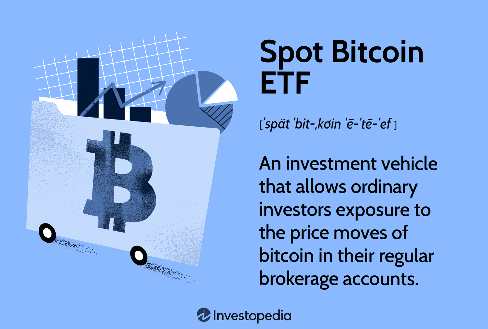

## Table of Contents

## What is a Spot Bitcoin ETF?

A Spot Bitcoin ETF, or Exchange-Traded Fund, is a type of investment fund that tracks the price of Bitcoin directly. Instead of buying Bitcoin itself, investors can buy shares in the ETF, which represents a portion of the Bitcoin held by the fund. This makes it easier for people to invest in Bitcoin without dealing with the complexities of buying and storing the cryptocurrency themselves.

These ETFs are traded on traditional stock exchanges, just like stocks. This means investors can buy and sell shares of the ETF during regular trading hours, making it more accessible and convenient. Spot Bitcoin ETFs are seen as a way to bring more mainstream acceptance to Bitcoin, as they provide a regulated and familiar way for investors to gain exposure to the cryptocurrency market.

## How does a Spot Bitcoin ETF differ from a Bitcoin Futures ETF?

A Spot Bitcoin ETF directly holds Bitcoin in its portfolio. This means the ETF's value goes up or down based on the current market price of Bitcoin. It's like owning Bitcoin without having to store it yourself. When you buy shares of a Spot Bitcoin ETF, you're essentially buying a piece of the Bitcoin that the fund owns.

On the other hand, a Bitcoin Futures [ETF](/wiki/etf-trading-strategies) does not hold actual Bitcoin. Instead, it invests in futures contracts, which are agreements to buy or sell Bitcoin at a future date at a set price. The value of a Bitcoin Futures ETF depends on the price of these futures contracts, which can be different from the actual price of Bitcoin. This can make the performance of a Bitcoin Futures ETF more complex and potentially more volatile.

In simple terms, a Spot Bitcoin ETF gives you direct exposure to Bitcoin's price, while a Bitcoin Futures ETF gives you exposure to Bitcoin's expected future price through contracts. Both types of ETFs let you invest in Bitcoin without owning it directly, but they work in different ways and can have different risks and rewards.

## What are the benefits of investing in a Spot Bitcoin ETF?

Investing in a Spot Bitcoin ETF can be easier and safer than buying Bitcoin directly. When you buy shares in a Spot Bitcoin ETF, you don't have to worry about setting up a digital wallet or keeping your Bitcoin safe from hackers. The ETF does all that for you. Plus, you can buy and sell shares of the ETF during regular trading hours on a stock exchange, just like you would with any other stock. This makes it more convenient for many people.

Another benefit is that a Spot Bitcoin ETF can help you diversify your investment portfolio. By adding Bitcoin to your investments through an ETF, you can spread out your risk. Bitcoin can be a good way to balance out other types of investments, like stocks or bonds, because it often moves differently than these traditional assets. This can help protect your overall investments from big losses if one part of the market goes down.

## What are the potential risks associated with Spot Bitcoin ETFs?

Investing in a Spot Bitcoin ETF comes with risks because Bitcoin's price can go up and down a lot. This means the value of your ETF shares can also change a lot. If Bitcoin's price drops suddenly, you could lose money quickly. Also, even though the ETF handles the Bitcoin for you, there can still be risks with how the fund is managed. If the people running the ETF make bad decisions or if there are problems with how they keep the Bitcoin safe, it could affect the value of your investment.

Another risk is that the rules and laws about Bitcoin and ETFs can change. Governments might decide to put new rules in place that affect how Bitcoin is used or how ETFs can invest in it. This could make it harder for the ETF to work the way it's supposed to, or it could even stop the ETF from operating at all. Also, since Spot Bitcoin ETFs are still pretty new, there might be less information and fewer examples to help you understand how they might perform in the future. This makes it harder to predict what might happen to your investment.

## How is the price of a Spot Bitcoin ETF determined?

The price of a Spot Bitcoin ETF is determined by the value of the Bitcoin that the ETF holds. When you buy shares of the ETF, you're buying a piece of the Bitcoin that the fund owns. So, if the price of Bitcoin goes up, the price of the ETF's shares will also go up. If the price of Bitcoin goes down, the ETF's share price will go down too. It's like a direct link between the ETF and Bitcoin's market price.

But, the price of the ETF can also be affected by other things, like how many people want to buy or sell the ETF's shares. If a lot of people want to buy the ETF, the price might go up a bit more than the price of Bitcoin. If a lot of people want to sell, the price might go down a bit more than Bitcoin's price. This is called the supply and demand of the ETF's shares. So, while the main thing that sets the ETF's price is the price of Bitcoin, other things can make it go a little higher or lower.

## What regulatory considerations should investors be aware of when investing in Spot Bitcoin ETFs?

When you invest in a Spot Bitcoin ETF, it's important to know about the rules that the government puts on these funds. Different countries have different rules about Bitcoin and ETFs. In the United States, for example, the Securities and Exchange Commission (SEC) has to approve a Spot Bitcoin ETF before it can be sold to people. The SEC looks at things like how the ETF will work, how it will keep the Bitcoin safe, and if it's fair to investors. If the rules change, it could affect how the ETF works or even if it can keep operating.

Also, there might be rules about how much you can invest in a Spot Bitcoin ETF. Some countries might limit how much of your money you can put into cryptocurrencies like Bitcoin. This is to protect you from losing too much money if the price of Bitcoin goes down a lot. It's a good idea to check the rules in your country before you invest, so you know what you're getting into. Understanding these rules can help you make better choices about whether a Spot Bitcoin ETF is right for you.

## How can investors buy and sell Spot Bitcoin ETFs?

Investors can buy and sell Spot Bitcoin ETFs just like they would buy and sell regular stocks. They do this through a brokerage account, which is like a special account at a bank or a company that helps people buy and sell investments. You can use an online platform or an app to place your order. Just search for the name of the Spot Bitcoin ETF you want, decide how many shares you want to buy or sell, and then confirm your order. The price you get will depend on the current market price of the ETF, which is linked to the price of Bitcoin.

Once you've bought shares in a Spot Bitcoin ETF, you can keep them in your brokerage account. If you want to sell your shares later, you can do that through the same platform. The money from the sale will go back into your brokerage account, and you can either use it to buy other investments or take it out. Remember, the price of the ETF can go up or down based on the price of Bitcoin, so it's important to keep an eye on the market and think about when you want to buy or sell.

## What impact might Spot Bitcoin ETFs have on the broader cryptocurrency market?

Spot Bitcoin ETFs could make a big difference in the [cryptocurrency](/wiki/cryptocurrency) market. They might bring in more people who want to invest in Bitcoin but don't know how to buy it directly. Because ETFs are traded on regular stock exchanges, they can be easier and safer for many people to use. This could make more people interested in Bitcoin and other cryptocurrencies, which could push their prices up. More investors might also mean more money flowing into the crypto market, making it bigger and more important.

But, there could also be some challenges. If a lot of people start buying and selling Spot Bitcoin ETFs, it might make Bitcoin's price go up and down more than it already does. This could make the market more unpredictable. Also, if something goes wrong with the ETFs, like a big drop in Bitcoin's price or problems with how the ETFs are managed, it could make people lose trust in cryptocurrencies. So, while Spot Bitcoin ETFs could help grow the market, they might also bring new risks that everyone needs to watch out for.

## How do Spot Bitcoin ETFs manage their holdings and ensure security?

Spot Bitcoin ETFs manage their holdings by keeping the Bitcoin they own in secure digital wallets. These wallets are like special bank accounts just for cryptocurrencies. The people who run the ETF, called fund managers, make sure the Bitcoin is stored safely. They often use different kinds of wallets, some that are connected to the internet and some that are not, to keep the Bitcoin safe from hackers. They also have strict rules about who can access the wallets and how they can move the Bitcoin around.

To make sure the Bitcoin is secure, the fund managers use a lot of different security measures. They might use special codes, called encryption, to protect the wallets. They also have backup plans in case something goes wrong, like keeping copies of the Bitcoin in different places. The ETF has to follow rules set by the government to make sure they are doing everything they can to keep the Bitcoin safe. This way, investors can feel more confident that their money is protected, even though the price of Bitcoin can still go up and down a lot.

## What are the tax implications of investing in Spot Bitcoin ETFs?

When you invest in a Spot Bitcoin ETF, you need to think about taxes. If you make money from the ETF going up in value, you might have to pay capital gains tax. This is like a tax on the profit you make when you sell something for more than you paid for it. The tax rate can be different depending on how long you held the ETF before selling it. If you held it for less than a year, it's called a short-term capital gain, and you'll pay a higher tax rate. If you held it for more than a year, it's a long-term capital gain, and the tax rate is usually lower.

Also, if the ETF gives you any money, like dividends, you might have to pay taxes on that too. Dividends are like little payments the ETF might send you if it makes money from its Bitcoin. The tax on dividends can be different depending on where you live and what kind of account you use to buy the ETF. It's a good idea to talk to a tax expert to understand exactly how much you might have to pay in taxes when you invest in a Spot Bitcoin ETF.

## How do Spot Bitcoin ETFs compare to other investment vehicles like direct Bitcoin ownership or Bitcoin-related stocks?

Spot Bitcoin ETFs are a way to invest in Bitcoin without having to buy and store the cryptocurrency yourself. When you buy shares in a Spot Bitcoin ETF, you're investing in a fund that holds actual Bitcoin. This can be easier and safer than buying Bitcoin directly because the ETF handles all the technical stuff, like keeping the Bitcoin secure. Plus, you can buy and sell ETF shares during regular trading hours on a stock exchange, just like you would with any other stock. This makes it more convenient for many people. But, remember, the price of the ETF goes up and down with the price of Bitcoin, so you still face the same risks as if you owned Bitcoin directly.

Compared to Bitcoin-related stocks, Spot Bitcoin ETFs give you a more direct way to invest in Bitcoin's price. Bitcoin-related stocks are companies that have something to do with Bitcoin, like mining it or making technology for it. When you buy these stocks, you're betting on the company doing well, not just on Bitcoin's price going up. This can be riskier because the company might not do well even if Bitcoin's price goes up. On the other hand, a Spot Bitcoin ETF's value is tied directly to Bitcoin's price, so it's more straightforward. But, like any investment, it's important to think about your own goals and how much risk you're okay with before you decide what to invest in.

## What advanced strategies can be employed using Spot Bitcoin ETFs for portfolio diversification and risk management?

Using Spot Bitcoin ETFs can be a smart way to spread out your investments and manage risk. One strategy is to add a small part of your portfolio to a Spot Bitcoin ETF. This can help balance out other investments like stocks and bonds because Bitcoin often moves differently than these traditional assets. By doing this, you're not putting all your money in one place, which can protect you if one part of the market goes down. It's like having a safety net that can help cushion any big losses in your overall investments.

Another strategy is to use Spot Bitcoin ETFs as a way to hedge against inflation or economic uncertainty. Bitcoin is sometimes seen as a "digital gold" because people think it can hold its value when other things like money lose value. By putting some money into a Spot Bitcoin ETF, you can protect your portfolio from losing too much value if inflation goes up or if the economy has problems. This way, you're not just hoping for Bitcoin's price to go up, but also using it to keep your money safe from other risks.

## References & Further Reading

[1]: ["Advances in Financial Machine Learning"](https://www.amazon.com/Advances-Financial-Machine-Learning-Marcos/dp/1119482089) by Marcos Lopez de Prado

[2]: ["Machine Learning for Algorithmic Trading"](https://github.com/stefan-jansen/machine-learning-for-trading) by Stefan Jansen

[3]: ["Quantitative Trading: How to Build Your Own Algorithmic Trading Business"](https://www.amazon.com/Quantitative-Trading-Build-Algorithmic-Business/dp/1119800064) by Ernest P. Chan

[4]: ["Handbook of Digital Currency: Bitcoin, Innovation, Financial Instruments, and Big Data"](https://www.sciencedirect.com/book/9780323989732/handbook-of-digital-currency) edited by David Lee Kuo Chuen

[5]: Makarov, I., & Schoar, A. (2020). ["Trading and Arbitrage in Cryptocurrency Markets."](https://www.sciencedirect.com/science/article/pii/S0304405X19301746) The Journal of Financial Economics, 135(2), 293-319.

[6]: Baur, D. G., Hong, K., & Lee, A. D. (2018). ["Bitcoin: Medium of Exchange or Speculative Assets?"](https://www.sciencedirect.com/science/article/abs/pii/S1042443117300720) Journal of International Financial Markets, Institutions, and Money, 54, 177-189.