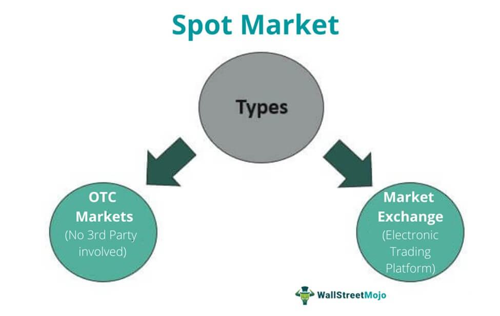

## Table of Contents

## What is a spot commodity?

A spot commodity is a type of commodity that is bought and sold for immediate delivery. This means that when someone buys a spot commodity, they receive it right away, instead of waiting for a future date. Spot commodities are often traded on commodity exchanges, where buyers and sellers come together to make deals.

These commodities can include things like gold, oil, or agricultural products like wheat and corn. The price of a spot commodity is determined by the current market conditions, which can be influenced by factors like supply and demand, weather, and geopolitical events. Trading spot commodities can be a way for businesses to manage their immediate needs for raw materials or for investors to take advantage of short-term price movements.

## How does the spot market for commodities work?

The spot market for commodities is where people buy and sell things like oil, gold, or grains right away. When someone wants to buy a commodity on the spot market, they pay the current price and get the commodity immediately. This is different from the futures market, where people agree on a price now but get the commodity later. The spot market is important because it helps businesses get the raw materials they need quickly.

The price of commodities on the spot market can change a lot. It depends on how much of the commodity is available and how many people want to buy it. If there's a lot of a commodity and not many people want it, the price goes down. But if there's not much of it and a lot of people want it, the price goes up. Things like the weather, wars, or new laws can also change the price. People who trade on the spot market need to watch these things closely to make good decisions.

## What are the most common types of commodities traded on the spot market?

The most common types of commodities traded on the spot market are energy products, metals, and agricultural goods. Energy products include things like crude oil, natural gas, and gasoline. These are very important because they are used all over the world to power cars, heat homes, and run factories. Metals like gold, silver, and copper are also commonly traded. Gold and silver are often used for jewelry and as investments, while copper is important for making wires and other things that conduct electricity.

Agricultural goods are another big part of the spot market. These include things like wheat, corn, soybeans, and coffee. Farmers grow these crops, and people buy them to eat or use in other products. For example, wheat is used to make bread, and corn can be used to feed animals or make ethanol. The prices of these commodities can change a lot depending on the weather, how much is being grown, and how many people want to buy them.

## What is the difference between spot commodities and futures commodities?

Spot commodities are bought and sold right away. When you buy a spot commodity, you get it immediately. The price you pay is the current market price, which can change quickly depending on how much of the commodity is available and how many people want it. For example, if you need oil for your factory today, you would buy it on the spot market.

Futures commodities are different. When you buy a futures commodity, you agree on a price now, but you get the commodity later. This can be helpful if you want to lock in a price for something you will need in the future. For example, if you think the price of wheat will go up in six months, you can buy a futures contract now and get the wheat at today's price when it's time to use it. This way, you know how much you will pay and can plan better.

## How do spot commodity prices get determined?

Spot commodity prices are determined by how much of the commodity is available and how many people want to buy it. This is called supply and demand. If there is a lot of a commodity, like oil, and not many people want to buy it, the price will go down. But if there is not much of the commodity and a lot of people want it, the price will go up. This balance between supply and demand changes all the time, so spot prices can be very different from one day to the next.

Other things can also affect spot commodity prices. For example, the weather can change how much of a crop like wheat is available. If there is a drought, less wheat might be grown, and the price could go up. Wars or political problems in countries that produce a lot of a commodity can also make prices change. For example, if there is a war in an oil-producing country, it might be harder to get oil, and the price could go up. People who trade commodities need to watch all these things to understand why prices are changing.

## What are the risks involved in trading spot commodities?

Trading spot commodities can be risky because prices can change a lot and very quickly. If you buy a commodity and the price goes down right after, you could lose money. For example, if you buy oil and then a big oil field is discovered, the price of oil might drop, and you would lose money on your purchase. Also, things like bad weather or political problems can make prices go up and down a lot, which makes it hard to know what will happen next.

Another risk is that you need to have the money to buy the commodity right away. If you don't have enough money, you can't trade on the spot market. This can be a problem if you need the commodity but can't afford it at the current price. Also, if you buy a commodity and then can't sell it quickly, you might have to keep it for a while, which can cost more money for storage and other things.

## Can individuals participate in the spot commodity market, or is it limited to institutions?

Individuals can participate in the spot commodity market, but it is usually easier for institutions like big companies and banks. This is because trading spot commodities needs a lot of money and knowledge. You have to pay for the commodity right away, and you need to know a lot about how prices change because of things like the weather or politics. Also, you might need special accounts or to work with brokers who can help you buy and sell commodities.

Even though it's harder for individuals, it's not impossible. Some people do trade spot commodities by using online platforms or working with smaller brokers. But it's important for individuals to be very careful and learn a lot before they start. The spot market can be risky, and prices can go up and down a lot, so it's easy to lose money if you're not ready.

## What role do spot commodities play in the global economy?

Spot commodities are very important for the global economy. They help businesses get the things they need right away, like oil for factories or wheat for bread. When companies can buy these things quickly, they can keep working without waiting. This helps the economy grow because it keeps businesses running smoothly. Also, spot commodities are traded all over the world, so they help different countries work together. For example, if a country has a lot of oil, it can sell it to another country that needs it, and both countries benefit.

The prices of spot commodities can also tell us a lot about what is happening in the world. If the price of oil goes up, it might mean there is a problem in an oil-producing country, like a war or a storm. This can affect the whole world because many things need oil to work. When prices change, it can make other things more expensive too, like gas for cars or food that needs to be transported. So, watching spot commodity prices helps people understand and predict what might happen in the global economy.

## How do geopolitical events impact spot commodity prices?

Geopolitical events can really change spot commodity prices. When there are problems like wars or new laws in a country that makes a lot of a commodity, it can make it harder to get that commodity. For example, if there is a war in a country that produces a lot of oil, it might be harder to get oil from there. This can make the price of oil go up because there is less oil available and people still need it.

These events can also make prices go up and down a lot. If people think there might be a problem soon, they might start buying more of a commodity to be safe. This can make the price go up even before the problem happens. For example, if people think there might be a war that could affect oil supplies, they might buy more oil now, which can make the price go up right away. So, geopolitical events can make spot commodity prices very unpredictable.

## What are some strategies for managing risk when trading spot commodities?

Managing risk when trading spot commodities is important because prices can change a lot. One way to do this is by diversifying. This means not putting all your money into one commodity. If you spread your money across different commodities, like oil, gold, and wheat, you might lose money on one but make money on another. This can help balance out your losses. Another strategy is to use stop-loss orders. These are orders that automatically sell your commodity if the price drops to a certain level. This can help you limit how much money you lose if the price goes down a lot.

Another way to manage risk is by staying informed. You need to keep an eye on things that can change commodity prices, like the weather or political events. If you know what might happen, you can make better decisions about when to buy or sell. Also, it can be helpful to use hedging. This means buying something that will go up in value if your commodity goes down. For example, if you have oil and you're worried the price might drop, you could buy something that goes up when oil goes down. This can help protect you from losing too much money.

## How does technology influence the trading of spot commodities?

Technology has made a big difference in how people trade spot commodities. It used to be hard to buy and sell commodities because you had to be in a certain place or call someone to make a deal. Now, with computers and the internet, you can trade commodities from anywhere. There are online platforms where you can see the prices and make trades right away. This makes it easier and faster to buy and sell commodities. Also, technology helps traders get information quickly. They can use apps and websites to see what is happening in the world that might change commodity prices, like the weather or political news.

Technology also helps with things like keeping track of trades and making sure everything is done correctly. There are special programs that can watch the market and help traders decide when to buy or sell. These programs can look at a lot of information and find patterns that might be hard for people to see. This can help traders make better decisions and manage their risks. Overall, technology makes trading spot commodities easier, faster, and more accurate, but it also means traders need to keep learning how to use new tools and stay up to date with technology.

## What are the regulatory considerations for trading spot commodities internationally?

Trading spot commodities across different countries involves following many rules. Each country has its own laws about trading commodities. These laws can be about things like who can trade, how much they can trade, and how they need to report their trades. For example, some countries might need traders to have special licenses or to follow certain rules to stop fraud. Also, there are international rules that countries agree on to make trading easier and fairer. These rules can be about things like how to settle disagreements or how to make sure everyone follows the same standards.

Another important thing to think about is taxes and tariffs. When you trade commodities between countries, you might have to pay taxes or fees. These can change the price of the commodity and affect how much money you make or lose. It's important to know about these taxes and tariffs before you start trading. Also, some countries might have rules to protect their own businesses or to control how much of a commodity comes into or goes out of the country. Traders need to understand all these rules and make sure they follow them to avoid problems.

## References & Further Reading

[1]: Hull, J. C. (2014). ["Options, Futures, and Other Derivatives"](https://edisciplinas.usp.br/pluginfile.php/5278790/mod_resource/content/1/Hull%20J.C.-Options%2C%20Futures%20and%20Other%20Derivatives_9th%20edition.pdf). Pearson.

[2]: Pirrong, C. (1996). ["The Economics, Law, and Public Policy of Market Power Manipulation"](https://link.springer.com/book/10.1007/978-1-4615-6259-7). Springer.

[3]: Geman, H. (2005). ["Commodities and Commodity Derivatives: Modelling and Pricing for Agriculturals, Metals and Energy"](https://download.e-bookshelf.de/download/0000/5675/90/L-G-0000567590-0015270354.pdf). Wiley Finance.

[4]: Chaboud, A., Chiquoine, B., Hjalmarsson, E., & Vega, C. (2014). ["Rise of the Machines: Algorithmic Trading in the Foreign Exchange Market"](https://papers.ssrn.com/sol3/papers.cfm?abstract_id=1501135). Journal of Finance, 69(5).

[5]: Lopez de Prado, M. (2018). ["Advances in Financial Machine Learning"](https://www.amazon.com/Advances-Financial-Machine-Learning-Marcos/dp/1119482089). Wiley.