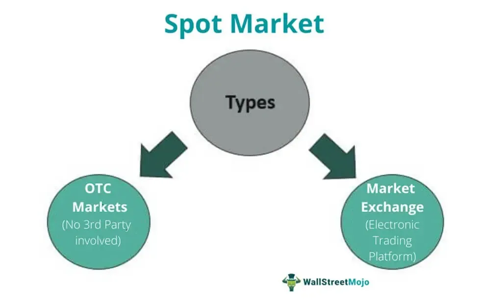

Algorithmic trading, a blend of finance and technology, has significantly reshaped the dynamics of global financial markets. Employing sophisticated algorithms, traders and financial institutions execute orders at speeds and frequencies unparalleled by manual trading practices. At the core of these operations lies a fundamental understanding of financial transaction dates, notably spot and settlement dates. These dates are vital components that influence the timing, execution, and strategy of trades, impacting both the market's microstructure and overall efficiency.

Financial markets operate on well-defined timeframes that dictate when transactions should be executed and settled. Spot dates, typically associated with foreign exchange (forex) markets, determine when the exchange of currencies occurs. They are generally set two business days after a trade is executed. This convention is pivotal as it directly affects the exchange rate applied to a transaction, thereby influencing trading decisions and strategies. A misinterpretation of spot dates can lead to costly errors in trade execution and settlement.



On the other hand, settlement dates are crucial in determining when the delivery of securities and the corresponding payment must occur. These vary across different markets—for instance, equities and bonds have settlement cycles commonly designated as T+1 or T+2, which indicate settlement one or two days after the trade date, respectively. An accurate understanding of settlement dates ensures liquidity management is optimized, and it prevents the penalties associated with late settlements, such as added costs or lost trading opportunities.

In the realm of algorithmic trading, precision and speed are non-negotiable. Algorithms harness financial transaction dates to enhance decision-making processes, ensuring trades are executed at optimal times and prices. Delays or inaccuracies in transaction data can severely impair algorithmic performance, highlighting the necessity for high-quality, real-time data inputs.

This article investigates the interplay between financial transaction dates and algorithmic trading, elucidating how understanding and managing these dates is essential for effective market navigation. As technology continues to evolve, traders and financial institutions will need to adapt to changing practices, ensuring continued efficiency and success in the market.

## Table of Contents

## Understanding Spot Dates in Financial Transactions

Spot dates play a critical role in determining when a financial transaction concludes and when obligations are met. Predominantly utilized in the foreign exchange (forex) market, the spot date is established as two business days following the trade date, denoted as T+2. This timeline allows traders to iron out transaction details, manage the necessary funds, and adjust to any regulatory requirements. The two-day buffer also enables sufficient time for the involved parties to address potential discrepancies or unforeseen issues that might arise.

The spot date’s relevance extends to its influence on the exchange rate applied to a transaction. Exchange rates are not static; they fluctuate based on market conditions, economic indicators, geopolitical events, and trader sentiment. Therefore, when a transaction is settled on its spot date, the agreed-upon exchange rate is locked in from the trade date, shielding parties from any interim fluctuations. For example, consider a trader agreeing to exchange USD for EUR at a rate of 1.15 on the trade date. With a spot date set T+2, this rate remains binding, thus securing financial forecasting and hedging activities based on this value.

Moreover, the spot date influences the timing and strategy behind financial transactions. Traders and financial institutions must meticulously plan for converging spot dates to manage [liquidity](/wiki/liquidity-risk-premium) and market exposure effectively. For instance, a trader might exploit the interim period between the trade and the spot date to speculate or hedge against anticipated market movements, optimizing their trading strategy to capitalize on predicted price shifts.

In [algorithmic trading](/wiki/algorithmic-trading), where timing precision is paramount, the adherence to spot dates can determine the success or failure of a transaction. Trading algorithms must account for spot dates to ensure compliance and optimize trading performance. By incorporating spot date considerations into an algorithm's decision-making process, traders can enhance strategic positioning and potentially leverage converging market trends.

Ultimately, while the concept of spot dates may appear straightforward, their impact on the trading ecosystem is profound, influencing both the operational mechanics and broader strategic imperatives of market participants. Their role underscores the necessity for meticulous planning and accurate market insights in achieving trading efficiency and success.

## The Role of Settlement Dates

Settlement dates are crucial in financial transactions as they designate the exact day when the exchange of securities and the accompanying payment are officially completed. These dates are especially important in maintaining the integrity and efficiency of financial markets by ensuring that the transfer of assets occurs in a timely manner.

In the financial markets, different asset classes have distinct settlement cycles. For instance, in equity markets, the common settlement cycle is T+2, meaning that the transaction is settled two business days after the trade date. This settlement convention allows time for the necessary administrative processes to be completed and for the clearing of funds. Bonds and other fixed-income securities also typically follow a T+2 cycle, although some may settle on a T+1 timeline, particularly in markets where quicker settlement is standard. These settlement conventions help maintain market stability and liquidity by providing a predictable framework within which transactions are completed.

The impact of settlement dates on liquidity management and trading strategies is significant. Traders and financial institutions must ensure adequate liquidity to meet settlement obligations. A mismatch in timing between receiving funds and obligations due can lead to liquidity crises or forced borrowing, which can increase costs and impact profitability. Moreover, settlement dates can influence trading strategies by affecting decisions on when to buy or sell assets. Traders might strategically time trades based on their anticipated liquidity needs around settlement dates, impacting capital allocation and risk management decisions.

Failing to meet settlement dates can have serious consequences for market participants. Non-compliance with these dates can lead to financial penalties, reputational damage, and in some cases, legal ramifications. For financial institutions, it can result in a loss of trust from clients and counterparties, impacting future business operations. Additionally, late settlements can lead to market disruptions, as they may result in cascading obligations that affect multiple parties within the financial ecosystem.

To manage settlement risk, institutions often employ technology and risk management practices that include pre-settlement verification, real-time monitoring systems, and automated reconciliation processes. These measures help ensure that trades are settled on time and that any discrepancies are quickly identified and resolved, maintaining the efficiency and reliability of financial markets.

## Algorithmic Trading and Transaction Dates

Algorithmic trading integrates advanced computational technologies to make swift and precise financial transactions. Central to the effectiveness of these algorithms is strict adherence to financial transaction dates, such as spot and settlement dates. These dates are pivotal as they represent the agreed times for the exchange of assets and payments, having distinct implications for optimizing trading strategies and ensuring transactional accuracy.

Algorithms capitalize on spot and settlement dates to enhance decision-making processes. The spot date, prominent in [forex](/wiki/forex-system) markets, generally occurs two business days post the trade date. It defines the specific day when the currency exchange rate is applicable. Algorithmic systems leverage this predictability to plan trades with precise buying and selling actions, thereby reducing the uncertainty inherent in the forex market. For instance, if a trader executes a currency swap on a Monday, the spot date would typically fall on the following Wednesday. This predictability allows algorithms to adjust for time zone differences and international bank holidays, ensuring seamless transaction completion.

Similarly, settlement dates dictate the finalization of security transfers and payments. In environments where equities and bonds trade, settlement cycles typically follow a T+1 or T+2 schedule, indicating one or two days, respectively, after the trade date for settlement. Algorithms utilize these cycles to manage portfolios and liquidity effectively. By planning around these dates, they can balance asset positions and cash flows to optimize returns.

Delayed data can significantly hinder algorithmic performance and market efficiency. In a discipline that thrives on speed, even brief data lags can lead to inefficient market operations and missed opportunities. Algorithms rely on real-time data inputs to make informed decisions. If transaction date information is outdated or inaccurate, it can lead to erroneous trades or strategies that do not align with current market conditions.

Real-world scenarios illustrate the profound influence of transaction dates on algorithmic trading success. For example, an algorithm designed by a [hedge fund](/wiki/hedge-fund-trading-strategies) might execute a high-frequency trading strategy that benefits from minor price discrepancies in assets due to the timing of spot and settlement dates. If the settlement date shifts unexpectedly, these minute differences can affect the strategy's profitability, underscoring the importance of accurate date-dependent calculations.

In conclusion, embracing the nuances of transaction dates is critical for thriving in algorithmic trading. The ability to forecast and adapt to spot and settlement dates underpins successful financial strategies, highlighting the intricate balance between technological capability and market knowledge.

## Challenges and Considerations

Navigating spot and settlement dates in algorithmic trading poses several challenges in the trading environment, particularly concerning liquidity, slippage, and data quality. Addressing these challenges is crucial for optimizing trading strategies and maintaining profitability.

Liquidity challenges play a significant role in shaping trading strategies. Liquidity refers to the ability of an asset to be quickly bought or sold in the market without causing a drastic change in its price. In markets with low liquidity, large trades can result in significant price movements, affecting the strategies of algorithmic traders. High liquidity, on the other hand, allows algorithms to execute substantial trades with minimal impact on market prices, which is essential for strategies that rely on rapid entry and [exit](/wiki/exit-strategy) points. For instance, algorithms designed for large institutional trades must effectively manage liquidity to avoid adverse price effects and ensure optimal execution. Formulating strategies that adapt to varying levels of liquidity can aid in preventing the erosion of potential gains.

Slippage refers to the difference between the expected price of a trade and the actual price at which it is executed. This can occur due to market [volatility](/wiki/volatility-trading-strategies) or delays in order processing, particularly in fast-moving markets. Slippage negatively impacts the profitability of algorithmic trading, as even small discrepancies can accumulate over numerous trades. To mitigate slippage, traders can implement algorithms with advanced order routing capabilities, ensuring that trades are executed at the most favorable prices and minimizing the time between decision-making and order execution. Additionally, using limit orders instead of market orders can help control the execution price, although this may increase the risk of orders not being filled in low-liquidity conditions.

High-quality, real-time data is crucial to minimizing trading errors. Algorithmic trading relies on precise data for market analysis, order execution, and risk management. Inconsistent or delayed data can lead to erroneous decisions, potentially resulting in significant financial losses. Ensuring data integrity involves investing in robust data acquisition systems capable of handling high-frequency updates and filtering out noise that may distort market signals. Furthermore, advanced data analytics and [machine learning](/wiki/machine-learning) models can be employed to predict market trends more accurately and adjust trading strategies accordingly.

In conclusion, effectively managing liquidity constraints, minimizing slippage, and ensuring data quality are pivotal in algorithmic trading, directly influencing strategy formulation and execution. As technology evolves, continuous innovations are expected to enhance the management of these challenges, thereby improving overall trading performance.

## Mitigating Risks with Transaction Dates

Mitigating risks associated with transaction dates in financial trading is paramount to ensuring optimal performance and reduced exposure to potential losses. A critical aspect of risk mitigation involves developing robust [backtesting](/wiki/backtesting) models. Backtesting is the process of testing a trading strategy on historical data to evaluate its effectiveness. It is essential to account for discrepancies in transaction dates, including delays and mismatches, which can significantly alter the outcome of trading strategies. Discrepancies may arise from differences in regional market holidays or unforeseen market closures, making it crucial for algorithms to incorporate these variations.

Mathematically, backtesting can be represented by simulating a strategy $S(t)$ over a time series $t$ with adjusted transaction dates to validate its performance. The process involves recalculating the expected returns $R_t$ based on different spot and settlement date scenarios:

$$
R_t = f(S(t), \text{adjusted transaction dates})
$$

In addition to backtesting, implementing real-time monitoring and alert systems is pivotal for effectively managing transaction date-related risks. Real-time systems enable traders and financial institutions to react promptly to unexpected market shifts or discrepancies in transaction processing. For instance, a sudden change in market liquidity conditions or a delay in a settlement process can be immediately flagged by a robust alert mechanism, allowing traders to make necessary adjustments to their strategies. Real-time monitoring involves deploying tools and algorithms that continuously track transaction statuses, market conditions, and potential irregularities. Python code snippets demonstrating real-time monitoring might look like:

```python
import time
import market_data_api

def monitor_transactions():
    while True:
        transactions = market_data_api.get_recent_transactions()
        for transaction in transactions:
            if transaction.status == 'delayed':
                alert_user(transaction)
        time.sleep(10)  # Check every 10 seconds

def alert_user(transaction):
    print(f"Alert: Transaction {transaction.id} is delayed.")
```

Furthermore, comprehensive risk management practices are essential for ensuring adherence to transaction dates and achieving optimal trading outcomes. These practices encompass strategies such as diversification, position sizing, and the inclusion of stop-loss mechanisms. Diversification helps mitigate the impact of localized market disruptions, while position sizing ensures that no single trade poses excessive risk. Implementing stop-loss orders automatically triggers the sale of securities when their price falls below a specified level, limiting potential losses due to unforeseen transaction date changes.

In conclusion, mitigating risks related to transaction dates involves a combination of robust backtesting models, real-time monitoring and alerts, and sound risk management practices. Such strategies allow market participants to navigate the complexities of trading with greater precision and confidence, ultimately enhancing overall market efficiency.

## Conclusion

Understanding and managing spot and settlement dates is crucial for anyone involved in financial trading due to their pivotal role in defining transactional timelines and affecting liquidity. Algorithmic trading, which prioritizes speed and exactness, derives considerable advantage from precise execution and timing tied to these dates. Algorithms use spot and settlement dates to optimize trading pathways, thus achieving operational efficiencies and reducing financial risks.

As technology continually evolves, it presents solutions to the challenges associated with transaction dates. Enhanced data analytics and machine learning algorithms are increasingly being integrated to predict market responses and preempt potential discrepancies in transactional timelines. These technological advancements increase the reliability of trading algorithms, improving both execution accuracy and the management of risks associated with untimely settlements.

Future trends suggest that both algorithms and financial institutions will further adapt to evolving market practices. Innovations such as blockchain technology and smart contracts hold the potential to revolutionize settlement processes, decreasing the settlement cycle and cost while increasing transparency and security. As these technologies mature, they will likely redefine how transaction dates are managed, potentially leading to real-time settlements and thus transforming the landscape of financial trading.

In summary, mastering spot and settlement dates is essential for trading success. As technology progresses, its application in algorithmic trading will continue to enhance the accuracy and efficiency of transactions, leading to a more resilient and adaptable financial market system.

## References & Further Reading

[1]: ["Advances in Financial Machine Learning"](https://www.amazon.com/Advances-Financial-Machine-Learning-Marcos/dp/1119482089) by Marcos Lopez de Prado

[2]: ["Evidence-Based Technical Analysis: Applying the Scientific Method and Statistical Inference to Trading Signals"](https://www.amazon.com/Evidence-Based-Technical-Analysis-Scientific-Statistical/dp/0470008741) by David Aronson

[3]: ["Machine Learning for Algorithmic Trading"](https://github.com/PacktPublishing/Machine-Learning-for-Algorithmic-Trading-Second-Edition) by Stefan Jansen

[4]: ["Quantitative Trading: How to Build Your Own Algorithmic Trading Business"](https://books.google.com/books/about/Quantitative_Trading.html?id=j70yEAAAQBAJ) by Ernest P. Chan

[5]: Bank for International Settlements. ["Foreign exchange turnover in April 2019"](https://www.bis.org/statistics/rpfx19_fx.htm). 

[6]: Harris, Larry. ["Trading and Exchanges: Market Microstructure for Practitioners"](https://www.amazon.com/Trading-Exchanges-Market-Microstructure-Practitioners/dp/0195144708) by Oxford University Press.

[7]: Hull, John C. ["Options, Futures, and Other Derivatives"](https://www.pearson.com/en-us/subject-catalog/p/options-futures-and-other-derivatives/P200000005938/9780136939917) by Pearson Education.