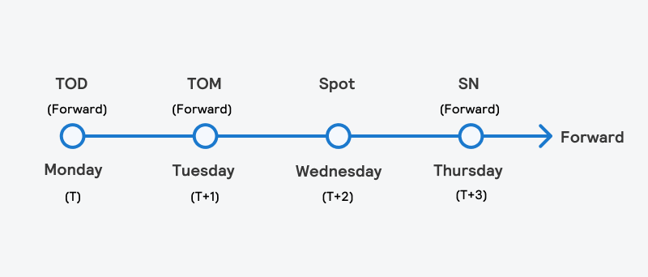

## Table of Contents

## What is a spot date?

A spot date is a type of financial transaction where the delivery of the assets, like currencies or commodities, happens right away or very soon, usually within two business days. It's called "spot" because it's immediate, not something that will happen in the future. People and businesses use spot dates when they need to buy or sell things quickly.

In the world of foreign exchange, a spot date is often the second business day after the trade is made. This gives time for the money to move between banks. For example, if you trade on Monday, the spot date would be Wednesday. Spot dates are important because they help keep trading smooth and predictable.

## How does a spot date differ from other types of dates in trading?

A spot date is different from other types of dates in trading because it's about getting the assets right away or very soon, usually within two business days. Other types of dates, like forward dates, are for trades that will happen later. With a forward date, you agree to buy or sell something at a set price, but you don't get it until a future date that you choose. This can be weeks, months, or even years away.

For example, if you want to buy euros with dollars today, you might use a spot date to get the euros in two days. But if you think the price of euros will go up in six months, you might use a forward date to lock in today's price and get the euros in six months. Spot dates are about quick trades, while forward dates are about planning for the future.

## What is the typical settlement period for a spot date?

The typical settlement period for a spot date is two business days after the trade is made. This means if you make a trade on Monday, you will get your assets, like money or goods, on Wednesday. This short time frame is why it's called a "spot" date - it's quick and happens soon after you agree to the trade.

In the world of foreign exchange, this two-day rule is standard. It gives banks and other financial places enough time to move the money around safely. Because of this, spot dates help keep trading smooth and predictable for everyone involved.

## Why is the spot date important in financial markets?

The spot date is important in financial markets because it helps keep trading smooth and predictable. When people and businesses trade things like money or goods, they need to know when they will get what they bought. The spot date, which is usually two business days after the trade, gives everyone a clear time to expect their assets. This makes it easier for banks and other financial places to move money and goods around safely and on time.

Also, the spot date helps with quick trades. If someone needs money or goods right away, they can use a spot date to get what they need in just a couple of days. This is different from forward dates, which are for trades that will happen much later. Spot dates are about getting things quickly, which is very useful in the fast-paced world of financial markets.

## Can the spot date vary depending on the type of financial instrument?

Yes, the spot date can change depending on what you are trading. For most currencies, the spot date is two business days after the trade. This is the standard time for foreign exchange markets. But for some other things, like precious metals, the spot date might be different. For example, gold and silver often have a spot date of one business day after the trade.

This difference happens because of how each market works. Currencies need two days to move safely between banks, so that's why the spot date is two days for them. But for gold and silver, the trading and delivery can happen faster, so the spot date is shorter. Knowing these differences is important for anyone trading in financial markets because it helps them plan when they will get their money or goods.

## How do holidays and weekends affect the spot date?

Holidays and weekends can change when the spot date happens. If you make a trade and the spot date falls on a weekend or a holiday, it will move to the next business day. This is because banks and other places that handle money are usually closed on weekends and holidays, so they can't move money or goods on those days.

For example, if you make a trade on a Wednesday and the spot date would normally be Friday, but Friday is a holiday, the spot date will move to the next business day, which might be Monday. This makes sure that everyone gets their money or goods on a day when banks are open and working. Knowing how holidays and weekends can change the spot date helps people plan their trades better.

## What are the implications of missing a spot date?

If you miss a spot date, it can cause problems. You might not get the money or goods you were supposed to get on time. This can be a big deal if you needed that money or those goods to do something important. For example, if you were planning to use the money to pay for something else, you might have to wait longer or find another way to get the money.

Also, missing a spot date can make people who are trading with you upset or worried. They might think you are not reliable or that something went wrong. This can hurt your relationship with them and make it harder to do business with them in the future. It's important to keep track of spot dates and make sure you are ready to get your money or goods when they are supposed to arrive.

## How is the spot date calculated for currencies?

The spot date for currencies is usually two business days after the trade is made. This means if you trade on a Monday, you will get your money on Wednesday. It takes two days because banks need time to move the money safely between accounts. This two-day rule is standard in the foreign exchange market, which is where people trade different kinds of money.

If the spot date falls on a weekend or a holiday, it moves to the next business day. For example, if you trade on Wednesday and the spot date would normally be Friday, but Friday is a holiday, you will get your money on Monday instead. This makes sure that everyone gets their money on a day when banks are open and working. Knowing how to calculate the spot date helps people plan their trades better and make sure they get their money on time.

## What role does the spot date play in forex trading?

In [forex](/wiki/forex-system) trading, the spot date is very important because it tells people when they will get the money they traded for. It is usually two business days after the trade. This gives banks enough time to move the money safely between accounts. If you trade on a Monday, you will get your money on Wednesday. This two-day rule helps keep forex trading smooth and predictable for everyone involved.

If the spot date falls on a weekend or a holiday, it moves to the next business day. For example, if you trade on Wednesday and the spot date would normally be Friday, but Friday is a holiday, you will get your money on Monday instead. This makes sure that everyone gets their money on a day when banks are open and working. Knowing when the spot date is helps people plan their trades better and make sure they get their money on time.

## How do market participants use spot dates to manage risk?

Market participants use spot dates to manage risk by knowing exactly when they will get their money or goods. This helps them plan their trades better. For example, if someone needs money quickly to pay for something, they can use a spot date to make sure they get it in two days. This way, they can avoid the risk of not having enough money when they need it.

Also, spot dates help people manage the risk of price changes. If someone thinks the price of a currency will go down soon, they can use a spot date to trade it before the price drops. This way, they can lock in a better price and avoid losing money if the price goes down after the spot date. Knowing when the spot date is helps people make smart choices and manage their risks better in the fast-paced world of financial markets.

## What are the technological systems used to track and manage spot dates?

In the world of finance, special computer systems help keep track of spot dates. These systems are called trading platforms and they are used by banks and other people who trade money or goods. Trading platforms keep a record of when trades happen and when the spot date is. They make sure everyone knows exactly when they will get their money or goods. This helps people plan their trades and manage their risks better.

Another important system is the payment and settlement system. This system moves money between banks and makes sure it gets to the right place on the spot date. It works like a big network that connects all the banks together. When the spot date comes, the payment and settlement system makes sure the money moves quickly and safely. This is very important because it helps keep trading smooth and predictable for everyone involved.

## How have regulations affected the standardization of spot dates across different markets?

Regulations have helped make spot dates the same across different markets. They do this by setting rules that everyone has to follow. For example, in the foreign exchange market, rules say that the spot date is usually two business days after the trade. This makes it easier for everyone to know when they will get their money. It also helps keep trading fair and predictable, which is good for the whole market.

Sometimes, regulations can be different in different countries or for different types of trades. But even then, they often try to make spot dates as similar as possible. This helps people who trade in many different markets. They can plan their trades better because they know what to expect. Overall, regulations play a big role in making sure spot dates are clear and consistent, which is important for keeping the financial markets running smoothly.

## How can risks be mitigated with transaction dates?

Mitigating risks associated with transaction dates in financial trading is paramount to ensuring optimal performance and reduced exposure to potential losses. A critical aspect of risk mitigation involves developing robust [backtesting](/wiki/backtesting) models. Backtesting is the process of testing a trading strategy on historical data to evaluate its effectiveness. It is essential to account for discrepancies in transaction dates, including delays and mismatches, which can significantly alter the outcome of trading strategies. Discrepancies may arise from differences in regional market holidays or unforeseen market closures, making it crucial for algorithms to incorporate these variations.

Mathematically, backtesting can be represented by simulating a strategy $S(t)$ over a time series $t$ with adjusted transaction dates to validate its performance. The process involves recalculating the expected returns $R_t$ based on different spot and settlement date scenarios:

$$
R_t = f(S(t), \text{adjusted transaction dates})
$$

In addition to backtesting, implementing real-time monitoring and alert systems is pivotal for effectively managing transaction date-related risks. Real-time systems enable traders and financial institutions to react promptly to unexpected market shifts or discrepancies in transaction processing. For instance, a sudden change in market [liquidity](/wiki/liquidity-risk-premium) conditions or a delay in a settlement process can be immediately flagged by a robust alert mechanism, allowing traders to make necessary adjustments to their strategies. Real-time monitoring involves deploying tools and algorithms that continuously track transaction statuses, market conditions, and potential irregularities. Python code snippets demonstrating real-time monitoring might look like:

```python
import time
import market_data_api

def monitor_transactions():
    while True:
        transactions = market_data_api.get_recent_transactions()
        for transaction in transactions:
            if transaction.status == 'delayed':
                alert_user(transaction)
        time.sleep(10)  # Check every 10 seconds

def alert_user(transaction):
    print(f"Alert: Transaction {transaction.id} is delayed.")
```

Furthermore, comprehensive risk management practices are essential for ensuring adherence to transaction dates and achieving optimal trading outcomes. These practices encompass strategies such as diversification, position sizing, and the inclusion of stop-loss mechanisms. Diversification helps mitigate the impact of localized market disruptions, while position sizing ensures that no single trade poses excessive risk. Implementing stop-loss orders automatically triggers the sale of securities when their price falls below a specified level, limiting potential losses due to unforeseen transaction date changes.

In conclusion, mitigating risks related to transaction dates involves a combination of robust backtesting models, real-time monitoring and alerts, and sound risk management practices. Such strategies allow market participants to navigate the complexities of trading with greater precision and confidence, ultimately enhancing overall market efficiency.

## References & Further Reading

[1]: ["Advances in Financial Machine Learning"](https://www.amazon.com/Advances-Financial-Machine-Learning-Marcos/dp/1119482089) by Marcos Lopez de Prado

[2]: ["Evidence-Based Technical Analysis: Applying the Scientific Method and Statistical Inference to Trading Signals"](https://www.amazon.com/Evidence-Based-Technical-Analysis-Scientific-Statistical/dp/0470008741) by David Aronson

[3]: ["Machine Learning for Algorithmic Trading"](https://github.com/PacktPublishing/Machine-Learning-for-Algorithmic-Trading-Second-Edition) by Stefan Jansen

[4]: ["Quantitative Trading: How to Build Your Own Algorithmic Trading Business"](https://books.google.com/books/about/Quantitative_Trading.html?id=j70yEAAAQBAJ) by Ernest P. Chan

[5]: Bank for International Settlements. ["Foreign exchange turnover in April 2019"](https://www.bis.org/statistics/rpfx19_fx.htm). 

[6]: Harris, Larry. ["Trading and Exchanges: Market Microstructure for Practitioners"](https://www.amazon.com/Trading-Exchanges-Market-Microstructure-Practitioners/dp/0195144708) by Oxford University Press.

[7]: Hull, John C. ["Options, Futures, and Other Derivatives"](https://www.pearson.com/en-us/subject-catalog/p/options-futures-and-other-derivatives/P200000005938/9780136939917) by Pearson Education.