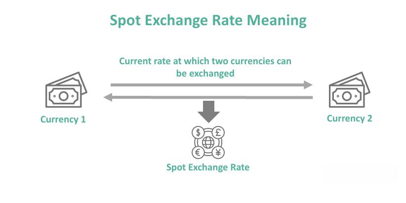

The foreign exchange market, known as forex, represents the most extensive and fluid financial system globally. With trillions of dollars exchanged daily, it serves as a critical platform for international trade and investment. Central to its operation are spot exchange rates, which enable the immediate conversion of currencies based on prevailing market prices. These rates reflect real-time economic conditions, allowing traders to capitalize on currency value fluctuations for immediate transactions.

Algorithmic trading has significantly reshaped the forex markets, introducing unparalleled efficiency and transaction speed. By leveraging complex computer algorithms, traders can quickly analyze market data and execute trades automatically, reducing the time lag associated with manual trading. This technological advancement has enhanced precision in trading strategies, allowing for improved risk management and exploiting fleeting market opportunities.



The interplay between spot exchange rates and algorithmic trading underscores their importance in the forex market. Spot rates provide the necessary real-time price benchmarks for executing timely trades, while algorithmic systems ensure that these trades are conducted with optimal efficiency and minimal human error. Together, they facilitate the fluid movement of capital and reflect global economic dynamics instantaneously. This exploration examines the significance and interplay of spot exchange rates and algorithmic trading within the forex market context, offering insights into their roles and impacts.

## Table of Contents

## Understanding Spot Exchange Rates

Spot exchange rates represent the current market prices at which one currency can be exchanged for another in a transaction meant to take place immediately. The foreign exchange market, where currencies are traded, determines these rates primarily through the interaction of supply and demand forces. When the demand for a particular currency outweighs its supply, the spot exchange rate for that currency tends to increase, signaling a higher value compared to other currencies.

Several factors influence the fluctuations in spot exchange rates:

1. **Interest Rates**: Central banks adjust interest rates to control economic activity. A higher interest rate usually attracts foreign capital, causing an appreciation of the domestic currency due to increased demand. Conversely, if interest rates are lowered, the currency might depreciate as capital flows move out seeking better returns elsewhere.

2. **Economic Data**: Key economic indicators, such as GDP growth, unemployment rates, and inflation, provide insights into a country's economic health. Positive economic data generally leads to currency appreciation, as investors are more likely to invest in a robust economy, increasing demand for the currency.

3. **Geopolitical Events**: Political stability, government policies, and international relations can significantly impact currency values. Political uncertainty or instability can lead to currency depreciation, as investors consider the risks high and seek safer investment opportunities elsewhere.

Spot transactions are characterized by their rapid settlement cycle. Typically, spot transactions settle within two business days from the trade date, a standard known as T+2 settlement. This quick turnaround is appealing to many traders and businesses, allowing them to respond to market changes promptly. The immediacy of spot exchange rates and transactions is crucial for importers and exporters needing to manage the risk associated with currency value changes in a globalized economy.

Overall, understanding spot exchange rates requires awareness of the various economic, financial, and political elements that influence currency valuations. Participants in the [forex](/wiki/forex-system) market must consider these factors when engaging in spot transactions, as they directly affect the profitability and risk associated with currency trading.

## Mechanics of the Forex Market

The forex market, a global decentralized market, facilitates the exchange of currencies, operating continuously due to its 24-hour framework. This perpetual trading environment is sustained by the involvement of numerous financial centers across different time zones, including major ones like New York, London, Tokyo, and Sydney. Consequently, it offers uninterrupted trading opportunities, allowing market participants to respond to real-time economic and geopolitical developments.

Trades are primarily executed electronically over-the-counter (OTC) through a network of banks, corporations, brokers, and individual traders. This electronic infrastructure enhances efficiency, ensuring that transactions are executed swiftly and accurately without the need for a centralized exchange. Key participants in these transactions include financial institutions, multinational corporations, hedge funds, and retail investors.

Currencies are traded in pairs in the forex market, with each pair representing the exchange rate between the two involved currencies. For instance, the EUR/USD pair denotes the exchange rate between the euro and the U.S. dollar. The dynamics of currency pairs are influenced by a variety of factors such as interest rates, inflation, and economic indicators from the respective countries or regions. These factors collectively determine the relative strength or weakness of a currency, impacting its price against other currencies.

Spot transactions play a significant role in the forex market. These transactions involve the immediate exchange of currencies at current market rates, known as spot rates. The appeal of spot transactions lies in their immediacy, settling typically within two business days. This prompt settlement aligns with the needs of traders aiming to capitalize on short-term market movements. The spot market's [liquidity](/wiki/liquidity-risk-premium) is a testament to its efficiency, offering traders the ability to quickly enter and [exit](/wiki/exit-strategy) positions based on fluctuations in currency values.

Overall, the mechanics of the forex market are characterized by its continuous operation, electronic trade execution, the trading of currency pairs, and the prominence of spot transactions. These features collectively provide a versatile platform for participants to navigate the complexities of global currency exchange.

## Algorithmic Trading in Forex

Algorithmic trading in forex involves the use of computer systems and algorithms to automate trading strategies based on predefined criteria, transforming how trades are conducted in this market. These sophisticated computer programs allow traders to analyze vast amounts of market data and execute trades with remarkable speed and precision. The process starts with defining criteria based on technical analysis, statistical models, or historical data patterns to create trading algorithms that can autonomously manage buying and selling decisions.

A key advantage of [algorithmic trading](/wiki/algorithmic-trading) is its capacity to process a large [volume](/wiki/volume-trading-strategy) of data and respond to market changes nearly instantaneously. This allows traders to capitalize on short-lived market inefficiencies that are difficult to exploit manually. By leveraging algorithms, traders can design strategies to minimize risk exposure, identify [arbitrage](/wiki/arbitrage) opportunities, and execute trades at optimal prices.

Algorithmic trading encompasses various approaches, but one of its most prominent subsets is high-frequency trading ([HFT](/wiki/high-frequency-trading-strategies)). HFT involves the execution of a large number of orders at lightning speed, often in fractions of a second. This form of trading seeks to exploit minute price movements and leverage small profit margins across a vast number of trades, thereby accumulating significant returns over time.

Algorithms can employ strategies such as [statistical arbitrage](/wiki/statistical-arbitrage), which analyzes historical price relationships between different currency pairs and executes trades when deviations from these relationships occur. Another common approach is market-making algorithms, which provide liquidity by continuously quoting buy and sell prices, and profiting from the bid-ask spread.

In Python, implementing a basic algorithmic trading strategy can be achieved using libraries such as pandas for data manipulation and NumPy for numerical computations. Below is a simple example of a moving average crossover strategy:

```python
import pandas as pd

# Load historical forex data
data = pd.read_csv('forex_data.csv')

# Calculate moving averages
data['SMA_50'] = data['Close'].rolling(window=50).mean()
data['SMA_200'] = data['Close'].rolling(window=200).mean()

# Signal generation
data['Signal'] = 0
data['Signal'][data['SMA_50'] > data['SMA_200']] = 1
data['Signal'][data['SMA_50'] <= data['SMA_200']] = -1

# Trade execution logic
data['Positions'] = data['Signal'].shift()

# Display results
print(data[['Close', 'SMA_50', 'SMA_200', 'Signal', 'Positions']].tail())
```

This example illustrates a simple moving average crossover strategy, where buy signals are generated when a short-term moving average crosses above a long-term moving average, and sell signals are generated when it crosses below. Such strategies serve as foundational models that can be expanded with more complex rules and conditions to capture diverse market conditions.

Algorithmic trading has undeniably enhanced trading efficiency, reducing both transaction costs and emotional biases inherent in manual trading. However, it necessitates robust monitoring and control systems to mitigate risks like market disruptions and unexpected liquidity shortfalls. As technology continues to evolve, algorithmic trading remains a crucial component in the modern forex trading ecosystem.

## Benefits and Risks of Algo Trading

Algorithmic trading, or algo trading, offers several advantages that make it an attractive option for participants in the forex market. One of the primary benefits is increased trading efficiency. By utilizing computer systems to execute trades based on predefined criteria, algo trading allows transactions to be carried out more quickly and with greater precision than manual methods. This efficiency not only enhances the speed of trade executions but also reduces transaction costs. Costs are minimized as algorithms can optimize order placement, taking advantage of the best available prices and reducing market impact.

Additionally, algorithmic trading plays a crucial role in eliminating emotional biases from trading decisions. Human traders are often susceptible to emotional influences that can lead to irrational decisions. By employing algorithms, trading strategies can be executed consistently and objectively, adhering strictly to predefined rules and avoiding common psychological pitfalls.

Speed and accuracy are other significant advantages of algo trading. The ability to process vast amounts of data in real-time allows traders to respond almost instantaneously to market changes. This swift responsiveness provides a competitive edge by exploiting short-lived market inefficiencies that may arise due to news releases or unexpected economic events.

However, there are risks associated with algorithmic trading that must be considered. One such risk is market fragmentation. As different platforms and venues may execute trades using varied algorithms, it can lead to a less centralized market structure, sometimes causing discrepancies in prices and execution quality. Moreover, during periods of high [volatility](/wiki/volatility-trading-strategies), liquidity can become a concern. Algorithms may simultaneously trigger buy or sell trades, overwhelming the market and exacerbating price swings.

To mitigate these risks, regulation and market monitoring are essential. Regulatory frameworks must be updated to address the challenges specific to algorithmic trading, ensuring fair and transparent markets. Market monitoring by exchanges and regulatory bodies can help detect and prevent potential issues such as market abuse or systemic risks that could arise from malfunctioning algorithms.

Overall, while algorithmic trading enhances the efficiency and competitiveness of forex trading, it also necessitates careful risk management strategies and regulatory oversight to maintain market integrity.

## The Interplay Between Spot Rates and Algo Trading

Spot exchange rates provide real-time market information, serving as a vital component for algorithmic trading strategies in the foreign exchange market. These rates represent the current value at which one currency can be exchanged for another, reflecting the immediate supply and demand dynamics of the forex market. Algorithms exploit these real-time fluctuations in spot rates to implement and execute trades swiftly, capitalizing on the volatile movements that can occur within seconds. By integrating spot rate data, algorithms can leverage quantitative models to forecast future price movements and execute trades that aim to maximize profits or minimize risks.

Algorithmic trading has significantly changed how spot exchange rates influence market activities. As algorithmic trading strategies have become more sophisticated, they have contributed to the increased liquidity and efficiency of the forex market. When an algorithm detects a favorable movement in spot rates, it can initiate a trade almost instantaneously, taking advantage of arbitrage opportunities or executing trades at optimal prices based on predefined criteria. This capacity for rapid execution allows traders to exploit minute changes in the market that might be imperceptible to human traders.

The evolution of algorithmic trading has also affected how spot exchange rates are set and how volatile they can become. Algorithms contribute to the market's overall speed and might exacerbate volatility, especially during times of market stress. Since they operate at high speeds, including strategies such as high-frequency trading, the collective actions of algorithmic trades can influence the short-term dynamics of spot rates, potentially leading to sharp price swings. This interaction underscores the complex, dynamic nature of the forex market, where technological advancements continue to redefine trading strategies.

As technology advances, this interplay between spot rates and algorithmic trading is expected to grow more intricate. Innovations such as [artificial intelligence](/wiki/ai-artificial-intelligence) and [machine learning](/wiki/machine-learning) offer the potential to enhance the predictive capabilities of trading algorithms. These technologies can identify patterns and correlations that might otherwise remain undiscovered, driving new synergies between spot trading and algorithmic strategies. Python, for instance, offers libraries such as NumPy and pandas which are instrumental in handling large datasets, and machine learning libraries like scikit-learn can be employed to create predictive models that inform trading decisions.

Ultimately, the synergy between spot exchange rates and algorithmic trading strategies is a driving force in forex markets, shaping both the execution of trades and the behavior of market participants. This interplay is part of a broader trend where technological advancement continues to influence and redefine financial markets. Understanding these dynamics is crucial for market participants aiming to stay ahead in an ever-evolving trading landscape.

## Future Trends in Forex Trading

The incorporation of artificial intelligence (AI) and machine learning (ML) is set to significantly enhance forex trading by automating decision-making processes and optimizing trading strategies. AI and ML algorithms excel at analyzing large datasets to identify patterns and predict market trends, allowing traders to execute more informed and timely decisions. Their application in forex trading is not just limited to predicting price movements but also extends to risk management and portfolio optimization. These technologies enable traders to adjust to market dynamics swiftly and efficiently.

Blockchain technology is also being integrated into forex markets to improve transaction transparency, security, and efficiency. By utilizing distributed ledger technology, blockchain records forex transactions in a decentralized, tamper-proof manner. This innovation reduces the risk of fraud and ensures greater trust between trading parties. Additionally, blockchain can streamline the settlement process, potentially reducing the typical two-business-day settlement period for spot transactions to nearly instantaneous execution.

Both retail and institutional traders are increasingly turning to sophisticated algorithms to enhance trading performance. Algorithms designed for forex trading can [factor](/wiki/factor-investing) in numerous variables, adjust to ever-changing market conditions, and execute trades at optimal prices. The demand for such advanced algorithms is driven by the need for competitive advantage in a fast-paced trading environment.

The evolution of digital currencies, such as cryptocurrencies, is influencing traditional forex markets. As digital currencies become more integrated into global financial systems, they could affect spot exchange rate dynamics by introducing new currency pairs and volatility patterns. The increased use of cryptocurrencies for cross-border transactions may also impact forex liquidity and market behavior, necessitating adaptations in trading strategies.

In summary, technological advancements are reshaping forex trading by enhancing precision and reliability. As AI, ML, blockchain, and digital currencies continue to evolve, they will provide new opportunities and challenges for forex traders looking to optimize their strategies and outcomes.

## Conclusion

Spot exchange rates and algorithmic trading together play a pivotal role in today's forex market. They provide essential liquidity, enabling seamless currency conversions and facilitating efficient trading operations. Spot exchange rates, by reflecting real-time economic dynamics, serve as fundamental indicators that guide decision-making in currency markets. Concurrently, algorithmic trading enhances the speed and precision of trade executions, significantly reducing latency and transaction costs, thus allowing traders to capitalize on micro-movements in spot rates.

As technology progresses, traders must adapt and employ these advancements to gain strategic advantages. The integration of sophisticated algorithms, driven by artificial intelligence and machine learning, promises to further streamline operations and uncover new trading opportunities. Algorithmic strategies, optimized through continuous learning from data patterns and historical trends, are being increasingly adopted by both retail and institutional traders.

Understanding the interplay between spot exchange rates and algorithmic trading is essential for effectively navigating the forex landscape. Mastery of these concepts empowers traders to make informed decisions, optimize portfolios, and manage risks more effectively. It is imperative for market participants to stay informed about technological innovations and market shifts to maintain competitiveness and achieve optimal trading results in the fast-evolving forex market.

## References & Further Reading

[1]: Bergstra, J., Bardenet, R., Bengio, Y., & Kégl, B. (2011). ["Algorithms for Hyper-Parameter Optimization."](https://papers.nips.cc/paper/4443-algorithms-for-hyper-parameter-optimization) Advances in Neural Information Processing Systems 24.

[2]: ["Advances in Financial Machine Learning"](https://www.amazon.com/Advances-Financial-Machine-Learning-Marcos/dp/1119482089) by Marcos Lopez de Prado

[3]: ["Evidence-Based Technical Analysis: Applying the Scientific Method and Statistical Inference to Trading Signals"](https://www.semanticscholar.org/paper/Evidence-Based-Technical-Analysis%3A-Applying-the-and-Aronson/3b33df8737f1772e9e14d66a08c9696f140a2ee1) by David Aronson

[4]: ["Machine Learning for Algorithmic Trading"](https://github.com/stefan-jansen/machine-learning-for-trading) by Stefan Jansen

[5]: ["Quantitative Trading: How to Build Your Own Algorithmic Trading Business"](https://books.google.com/books/about/Quantitative_Trading.html?id=j70yEAAAQBAJ) by Ernest P. Chan