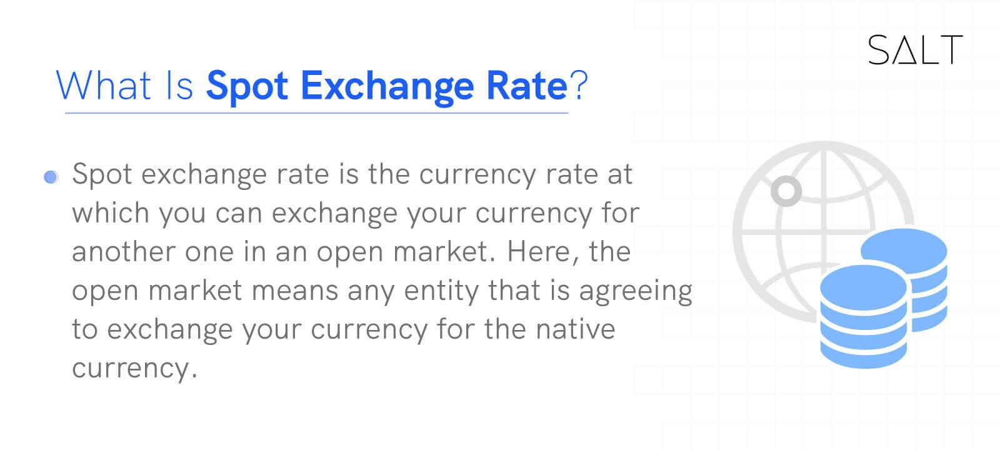

## Table of Contents

## What is a spot exchange rate?

A spot exchange rate is the current price at which one currency can be exchanged for another. It is used for immediate transactions, meaning the exchange happens right away, usually within two business days. This rate is important for people and businesses who need to convert money quickly, like travelers or importers.

The spot exchange rate changes all the time because it is influenced by many things, like how much people want a currency and how much of it is available. News about a country's economy, politics, and even big events can make the rate go up or down. Because it can change so quickly, it's a good idea to keep an eye on it if you need to exchange money soon.

## How is the spot exchange rate different from other exchange rates?

The spot exchange rate is different from other exchange rates because it's the price to swap one currency for another right now. It's used for trades that happen quickly, usually within two days. Other exchange rates, like forward rates, are for trades that will happen in the future. With a forward rate, you agree on a price today, but you don't actually swap the money until later. This can be useful if you want to protect yourself from future changes in the exchange rate.

Another type of exchange rate is the futures rate, which is similar to the forward rate but is traded on an official market. Futures rates are standardized and can be bought and sold like other financial products. Unlike the spot rate, which is always changing based on what's happening right now, futures and forward rates are set for a specific time in the future. So, the spot rate is about what's happening now, while other rates are about planning for what might happen later.

## Where can you find the current spot exchange rate?

You can find the current spot exchange rate on many websites and apps that focus on money and finance. Big banks and financial news websites like Bloomberg, Reuters, and Yahoo Finance show these rates. They update the rates all the time, so you can see the latest numbers whenever you need to.

Some popular apps on your phone, like XE Currency or Oanda, also show the spot exchange rate. These apps are easy to use and can be handy if you're traveling or need to check rates often. Just remember that the rates might be slightly different from one place to another because of small fees or how they get their information.

## How often does the spot exchange rate change?

The spot exchange rate changes all the time, even from one second to the next. It's like a busy market where the price of currencies goes up and down based on how much people want them and how many are available. News about a country's economy, big events, or even what people think might happen can make the rate change quickly.

Because the spot exchange rate can move so fast, it's a good idea to check it right before you need to exchange money. If you're planning to convert currency, looking at the rate a few times a day or even every few hours can help you get a better deal. Remember, the rate you see might be a little different depending on where you look because each place might have slightly different fees or ways of getting their information.

## What factors influence the spot exchange rate?

Many things can change the spot exchange rate. One big reason is how much people want a currency compared to how much is available. If a lot of people want to buy a currency, its price goes up. If not many people want it, the price goes down. Another reason is interest rates set by a country's central bank. If a country's interest rates are high, people might want to invest there, which can make the currency stronger.

News and events also play a big role. For example, if a country's economy is doing well, its currency might get stronger. On the other hand, if there's bad news, like a political problem or a natural disaster, the currency might weaken. People's feelings about what might happen in the future can also move the exchange rate. If everyone thinks a currency will do well, they might buy more of it now, pushing the rate up.

Lastly, the overall balance of trade between countries affects the spot exchange rate. If a country exports more than it imports, its currency might get stronger because other countries need it to buy their goods. If a country imports more than it exports, its currency might weaken. All these factors together make the spot exchange rate move up and down all the time.

## How do banks and financial institutions use spot exchange rates?

Banks and financial institutions use spot exchange rates every day to help their customers and to manage their own money. When someone wants to change their money from one currency to another, the bank uses the spot exchange rate to figure out how much they will get. This helps people who are traveling or businesses that buy and sell things in different countries. Banks also use the spot rate to trade currencies with each other, making sure they have enough of each currency to meet their customers' needs.

Besides helping customers, banks use spot exchange rates to manage their own risks. If a bank thinks a currency will get weaker, they might exchange it for a stronger one to protect their money. They also use the spot rate to make money by buying and selling currencies. If they think the rate will change soon, they might buy a currency at the current rate and sell it later when the rate is higher. This way, banks can make a profit from the small changes in the spot exchange rate.

## What is the role of central banks in determining spot exchange rates?

Central banks play a big role in deciding spot exchange rates. They do this by setting interest rates and using other tools to control how much money is in their country. If a central bank raises interest rates, it can make their currency stronger because people want to invest in that country to get higher returns. On the other hand, if they lower interest rates, it can make the currency weaker because people might look for better deals elsewhere.

Central banks also sometimes buy or sell their own currency in the market to change the spot exchange rate. If they want their currency to be stronger, they might buy it, which reduces the amount available and pushes the price up. If they want it to be weaker, they might sell it, increasing the supply and pushing the price down. By doing these things, central banks can influence the spot exchange rate and help keep their country's economy stable.

## How can individuals use spot exchange rates for international transactions?

Individuals can use spot exchange rates when they need to change money for international transactions, like when they travel or buy things from other countries. If someone is going on a trip, they can check the spot exchange rate to see how much of their home currency they need to get the foreign currency they want. This helps them know how much money they will have to spend while they're away. For example, if someone from the U.S. is going to Europe, they can use the spot rate to figure out how many Euros they will get for their dollars.

People can also use spot exchange rates when they send money to family or friends in other countries. By checking the current rate, they can see how much of their money will reach the other person. It's a good idea to look at the rate right before sending the money because it can change quickly. If the rate is good, they might decide to send the money right away to get more for their money. Using the spot exchange rate helps individuals make smart choices about when and how to exchange their money for international transactions.

## What are the risks associated with fluctuations in spot exchange rates?

Fluctuations in spot exchange rates can be risky for people and businesses. If the exchange rate changes a lot, it can mean you get less money when you change currencies. For example, if you plan to travel and the exchange rate gets worse before you go, your money won't go as far as you thought. Businesses that buy and sell things in different countries also face risks. If they have to pay for something in another currency and the rate goes up, it can cost them more than they planned. This can hurt their profits or even make it hard to keep doing business.

To manage these risks, people and businesses can use different strategies. One way is to keep an eye on the exchange rate and try to change money when the rate is good. Another way is to use financial tools like forward contracts, which let you lock in a rate for the future. This can protect you from bad changes in the rate. However, these tools can be complicated and might cost money, so it's important to understand them well before using them. Even with these strategies, there's always some risk because no one can predict exactly how exchange rates will move.

## How do traders and investors use spot exchange rates in forex markets?

Traders and investors in the forex market use spot exchange rates to buy and sell currencies right away. They look at the current rate to decide if it's a good time to trade. If they think a currency will get stronger, they might buy it at the spot rate and sell it later when the rate goes up. This way, they can make money from the difference. On the other hand, if they think a currency will get weaker, they might sell it at the current rate and buy it back later when it's cheaper. This kind of trading happens all the time in the forex market, where people are always trying to guess which way the rates will move.

Besides trading, investors use spot exchange rates to manage their money across different countries. If they have investments in another country, they need to change their money into that country's currency. They use the spot rate to figure out how much they will get. This helps them plan their investments better. For example, if an investor from the U.S. wants to buy stocks in Europe, they will use the spot rate to see how many Euros they can get for their dollars. By keeping an eye on the spot rate, investors can make smarter choices about when to move their money and how to protect it from big changes in the exchange rate.

## What are some advanced strategies for hedging against spot exchange rate risks?

One advanced strategy for hedging against spot exchange rate risks is using forward contracts. A forward contract lets you agree on an exchange rate now for a trade that will happen in the future. This can be really helpful if you know you'll need to change money later and want to protect yourself from bad changes in the rate. For example, if a business knows it will have to pay for something in another currency in three months, they can use a forward contract to lock in today's rate. This way, even if the spot rate gets worse in the future, they won't lose money. But remember, forward contracts can be complicated and might cost money, so it's important to understand them well before using them.

Another strategy is using options. Options give you the right, but not the obligation, to exchange money at a certain rate in the future. This can be a good choice if you want to protect yourself from bad changes in the rate but also want the chance to benefit if the rate gets better. For example, if you think the spot rate might get worse but also might get better, you can buy an option to change money at today's rate if it goes down, but you can still use the new rate if it goes up. Options can be more flexible than forward contracts, but they also cost money and can be hard to understand. Both forward contracts and options need careful planning and a good understanding of the forex market to use them well.

## How do geopolitical events and economic policies impact spot exchange rates?

Geopolitical events can have a big impact on spot exchange rates. When something big happens, like a war, a political crisis, or even a major election, it can make people worried about a country's future. If people think a country might have problems, they might not want to hold onto its currency. This can make the currency weaker because there are more people trying to sell it than buy it. On the other hand, if a country seems stable and safe, people might want to invest there, which can make its currency stronger. So, big events around the world can change how people feel about a currency and move the spot exchange rate up or down.

Economic policies also play a big role in spot exchange rates. When a country's central bank changes interest rates, it can affect how much people want to invest there. If interest rates go up, people might want to put their money in that country to get higher returns, which can make the currency stronger. If interest rates go down, people might take their money out to find better deals elsewhere, which can make the currency weaker. Governments can also use other tools, like buying or selling their own currency, to try to control the exchange rate. These actions can have a direct impact on the spot exchange rate, making it go up or down depending on what the government is trying to do.

## References & Further Reading

[1]: Bergstra, J., Bardenet, R., Bengio, Y., & Kégl, B. (2011). ["Algorithms for Hyper-Parameter Optimization."](https://papers.nips.cc/paper/4443-algorithms-for-hyper-parameter-optimization) Advances in Neural Information Processing Systems 24.

[2]: ["Advances in Financial Machine Learning"](https://www.amazon.com/Advances-Financial-Machine-Learning-Marcos/dp/1119482089) by Marcos Lopez de Prado

[3]: ["Evidence-Based Technical Analysis: Applying the Scientific Method and Statistical Inference to Trading Signals"](https://www.semanticscholar.org/paper/Evidence-Based-Technical-Analysis%3A-Applying-the-and-Aronson/3b33df8737f1772e9e14d66a08c9696f140a2ee1) by David Aronson

[4]: ["Machine Learning for Algorithmic Trading"](https://github.com/stefan-jansen/machine-learning-for-trading) by Stefan Jansen

[5]: ["Quantitative Trading: How to Build Your Own Algorithmic Trading Business"](https://books.google.com/books/about/Quantitative_Trading.html?id=j70yEAAAQBAJ) by Ernest P. Chan