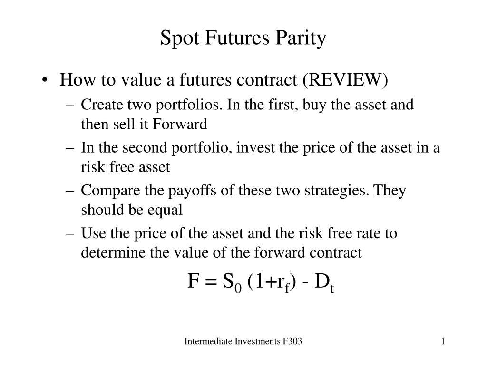

## Table of Contents

## What is spot-future parity?

Spot-future parity is a concept in finance that explains the relationship between the price of an asset in the spot market and its price in the futures market. The spot market is where assets are bought and sold for immediate delivery, while the futures market involves contracts to buy or sell assets at a future date. The idea behind spot-future parity is that the price of a futures contract should reflect the current spot price of the asset, plus any costs associated with holding the asset until the future date, such as storage costs or interest rates.

This relationship helps traders and investors understand whether a futures contract is priced fairly. If the futures price is higher than the spot price plus the costs, it might be seen as overpriced, and if it's lower, it might be seen as underpriced. By understanding spot-future parity, people can make better decisions about buying or selling futures contracts, and it helps keep the market balanced and efficient.

## How does spot-future parity relate to the pricing of futures contracts?

Spot-future parity is all about how the price of something you can buy right now (the spot price) connects to the price of a contract to buy that thing later (the futures price). Imagine you want to buy a barrel of oil. The spot price is what you'd pay today to get that barrel right away. But if you buy a futures contract, you agree to buy the barrel at a set price on a future date. The futures price should be the spot price, plus any extra costs you'd have to pay to keep the barrel until that future date, like storage fees or interest on money you borrowed to buy it.

If the futures price is a lot higher than the spot price plus those extra costs, people might think the futures contract is too expensive. On the other hand, if the futures price is lower than expected, people might see it as a good deal. By understanding spot-future parity, traders can figure out if futures contracts are priced fairly. This helps them decide whether to buy or sell these contracts, and it keeps the market working smoothly.

## What is the formula for calculating spot-future parity?

The formula for calculating spot-future parity is pretty straightforward. It says that the price of a futures contract (F) should be equal to the current spot price (S) of the asset, plus any costs you would have to pay to hold onto that asset until the future date. These costs include things like storage fees, if you're dealing with physical goods, or interest costs if you had to borrow money to buy the asset. So, the basic formula looks like this: F = S + (Costs).

Let's break it down with a simple example. Imagine you want to buy a barrel of oil. The spot price today is $50. If you buy a futures contract to get that barrel in six months, and it costs you $2 to store the barrel for that time, then the futures price should be $50 (the spot price) plus $2 (the storage cost), which equals $52. This helps you see if the futures contract is priced right. If the futures price is way more than $52, it might be overpriced, and if it's less, it could be a bargain.

## Can you explain the concept of arbitrage in the context of spot-future parity?

Arbitrage is like finding a way to make money from price differences without taking a big risk. In the world of spot-future parity, it happens when the futures price doesn't match what it should be based on the spot price and the costs of holding the asset. If you see that the futures price is higher than the spot price plus the costs, you can buy the asset now, store it until the future date, and then sell it at the higher futures price. This way, you make a profit from the difference, and it helps bring the futures price back to where it should be.

On the other hand, if the futures price is lower than expected, you can do the opposite. You sell a futures contract at the current futures price and then buy the asset in the spot market at a lower price. When the future date comes, you deliver the asset you bought and pocket the difference. This kind of trading pushes the futures price back toward the spot price plus costs, keeping the market balanced. Arbitrage is important because it helps make sure that the prices in the spot and futures markets stay in line with each other.

## What are the assumptions underlying the spot-future parity theory?

The spot-future parity theory assumes that markets are efficient and that there are no big barriers to trading. This means that people can easily buy and sell assets in both the spot and futures markets without facing high costs or restrictions. It also assumes that everyone has the same information, so no one has an unfair advantage. If these conditions are met, then the price of a futures contract should always match the spot price plus the costs of holding the asset until the future date.

Another key assumption is that there are no big risks or uncertainties that could change the value of the asset between now and the future date. This means that things like interest rates, storage costs, and other expenses are predictable and stable. If these assumptions hold true, then arbitrageurs can step in to correct any price differences between the spot and futures markets, ensuring that spot-future parity is maintained. However, in the real world, these assumptions might not always be perfect, which can lead to differences between the theoretical and actual prices of futures contracts.

## How does the cost of carry affect spot-future parity?

The cost of carry is really important for understanding spot-future parity. It's all the costs you have to pay to keep an asset until the future date when you need it. This can include things like storage fees for physical goods, or interest if you borrowed money to buy the asset. When you add these costs to the spot price, you get the futures price. If the futures price is a lot different from the spot price plus the cost of carry, it might mean the futures contract is priced wrong.

Arbitrageurs watch these costs closely. If the futures price is too high compared to the spot price plus the cost of carry, they might buy the asset now, pay the costs to hold it, and then sell it at the higher futures price later. This helps bring the futures price back down to where it should be. On the other hand, if the futures price is too low, they might sell a futures contract and buy the asset at the lower spot price, making money from the difference when they deliver the asset later. This way, the cost of carry helps keep the spot and futures markets in balance.

## What role do interest rates play in spot-future parity?

Interest rates are a big part of the cost of carry, which is what you have to pay to hold onto an asset until the future date. If you borrow money to buy an asset, you have to pay interest on that loan. So, when figuring out the price of a futures contract, you add the spot price of the asset to the interest you'd pay to hold it until the future date. If interest rates go up, the cost of carry goes up too, which means the futures price should be higher. If interest rates go down, the cost of carry goes down, and the futures price should be lower.

Arbitrageurs keep a close eye on interest rates because they affect how they make money from price differences between the spot and futures markets. If the futures price is too high compared to the spot price plus the cost of carry, including interest, arbitrageurs might buy the asset now, pay the interest to hold it, and sell it at the higher futures price later. This helps bring the futures price back to where it should be. On the other hand, if the futures price is too low, they might sell a futures contract and buy the asset at the lower spot price, making money from the difference when they deliver the asset later. This way, interest rates help keep the spot and futures markets in balance.

## How can spot-future parity be used to identify mispriced futures?

Spot-future parity helps us figure out if a futures contract is priced right by comparing it to the current spot price of the asset plus the costs of holding it until the future date. If the futures price is a lot higher than the spot price plus those costs, like storage fees or interest, then the futures contract might be too expensive. On the other hand, if the futures price is lower than expected, it could be a good deal.

Traders use this idea to spot mispriced futures. If they see a futures contract that's too pricey, they might buy the asset now, pay to hold it, and then sell it at the higher futures price later, making a profit from the difference. If they find a futures contract that's too cheap, they might sell the futures contract and buy the asset at the lower spot price, then deliver it later for a profit. This kind of trading helps keep the futures market in line with the spot market.

## What are the limitations of the spot-future parity model?

The spot-future parity model works on some big ideas that don't always match up with the real world. One big idea is that markets are perfect and everyone can buy and sell easily without big costs or rules getting in the way. But in real life, there can be all sorts of fees, taxes, and rules that make trading harder. Also, the model thinks everyone has the same information, but that's not true. Some people might know more than others, which can mess up the prices.

Another thing is that the model assumes the costs of holding an asset, like interest rates or storage fees, stay the same and are easy to predict. But in the real world, these costs can change a lot and be hard to guess. If these costs go up or down a lot, it can make the futures price different from what the model says it should be. So, while spot-future parity is a good way to understand how futures prices should work, it's not perfect because the real world is more complicated.

## How does spot-future parity apply to different types of assets, such as commodities versus financial instruments?

Spot-future parity works a bit differently for commodities like oil or wheat compared to financial instruments like stocks or bonds. For commodities, the futures price should be the spot price plus the costs of holding the commodity until the future date. These costs can include things like storage fees, insurance, and transportation. If you're dealing with oil, for example, you might have to pay to store it in a tank until the future date. So, if the futures price is a lot higher than the spot price plus these costs, it might be overpriced, and if it's lower, it could be a good deal.

For financial instruments like stocks or bonds, the idea is similar, but the costs are different. Instead of storage fees, you might have to think about interest costs if you borrowed money to buy the asset. If you buy a stock today and sell it later at a higher price, you need to consider the interest you'd pay on the money you borrowed. So, the futures price for a stock should be the spot price plus the interest cost. If the futures price is too high or too low compared to this, traders might step in to make money from the difference, helping to keep the market balanced.

## Can you discuss any real-world examples where spot-future parity has been observed or violated?

One real-world example where spot-future parity has been observed is in the gold market. Gold is a commodity that's easy to store, so the costs of holding it until the future date are mostly about the interest you'd pay if you borrowed money to buy it. If the spot price of gold is $1,800 per ounce and the interest rate is 2% for a year, the futures price for gold a year from now should be around $1,836. If you see the futures price at $1,850, it might be a bit overpriced, and traders might buy gold now, pay the interest, and sell it at the higher futures price later, bringing the futures price back in line.

Another example where spot-future parity has been violated is in the oil market during times of big uncertainty, like during the 2020 global health crisis. Oil prices can be very unpredictable, especially when there's a lot of uncertainty about how much oil people will need in the future. At one point, the spot price of oil dropped to negative values because there was so much oil and nowhere to store it. The futures price didn't follow the spot price plus costs model because nobody knew what the future would hold. Traders couldn't use spot-future parity to figure out if futures were priced right because the world was changing so fast.

## How do market inefficiencies impact the effectiveness of spot-future parity in practice?

Market inefficiencies can really mess with how well spot-future parity works in the real world. This idea says that the price of a futures contract should be the same as the spot price of an asset, plus the costs to hold it until the future date. But in real life, things like high trading fees, taxes, or strict rules can make it hard for people to buy and sell easily. Also, some people might know more about what's going on than others, which can make prices go up or down in ways that don't fit the model. When these things happen, the futures price might not match what spot-future parity says it should be.

Another big problem is that the costs of holding an asset, like interest rates or storage fees, can change a lot and be hard to predict. If these costs go up or down suddenly, it can make the futures price different from what the model says. During times of big uncertainty, like a global crisis, it's even harder to use spot-future parity because nobody knows what will happen next. So, while spot-future parity is a good way to think about how futures prices should work, it's not perfect because the real world is more complicated and unpredictable.

## What is Understanding Spot–Future Parity?

Spot-future parity is a fundamental concept in financial markets, especially crucial in understanding how spot prices and futures prices relate under normal market conditions. This relationship is primarily determined by several components: the spot price, futures price, [interest rate](/wiki/interest-rate-trading-strategies)s, dividends, storage costs, and convenience yield. Each of these elements plays a role in ensuring the parity condition holds.

**Spot Price and Futures Price**

The spot price refers to the current market price at which an asset can be bought or sold for immediate delivery. In contrast, the futures price is the agreed-upon price for delivery of the asset at a future date. The crux of spot-future parity is that the futures price should reflect the cost of holding the asset till the futures contract expires, otherwise known as the [carry](/wiki/carry-trading) cost.

**Interest Rates**

Interest rates are pivotal in the spot-future parity condition, as they represent the opportunity cost of investing capital in an asset now rather than at a future date. Higher interest rates typically increase the futures price because they imply a higher cost to borrow the funds required to purchase the asset now rather than later.

**Dividends**

For assets such as stocks that yield dividends, the expected dividend payments decrease the futures price. This is because anyone holding the asset would receive these dividends, making the actual cost of holding the asset to the contract's expiration date lower than what it would be if no dividends were paid.

**Storage Costs**

In many commodities markets, storage costs are an essential part of the futures pricing model. These costs reflect the expenses associated with storing the physical asset over the life of the futures contract. Higher storage costs increase the futures price as they add to the cost of holding the commodity.

**Convenience Yield**

The convenience yield relates to the non-monetary benefits of holding a physical good, such as ensuring supply during shortages. It can lower the futures price by offering an implicit benefit from holding the actual commodity, as opposed to merely having a financial claim to it, as in the case of holding a futures contract.

**Example of Spot–Future Parity**

Let’s illustrate with a basic example in the gold market: Suppose the spot price of gold is $1,500 per ounce, the risk-free interest rate is 2% per annum, and there are no dividends or storage costs for simplicity. In this case, the futures price (F) for delivery in one year would be calculated using the formula:

$$
F = S \times e^{rT}
$$

Substituting the values into the equation, we get:

$$
F = 1500 \times e^{0.02 \times 1} \approx 1530.30
$$

Hence, in ideal conditions, the futures price for gold one year from now would be approximately $1,530.30 per ounce, reflecting the time value of money as impacted by interest rates.

Spot-future parity ensures that markets remain efficient and [arbitrage](/wiki/arbitrage) opportunities are minimized. If discrepancies arise, traders can use arbitrage strategies to profit, which eventually pushes prices back to parity. Understanding these components not only helps in comprehending how futures contracts are priced but also allows traders to identify dislocations and capitalize on them when they emerge.

## Is there Spot-Future Parity Across Different Markets?

Spot-future parity is an integral mechanism in financial markets that ensures a predictable relationship between the spot price and futures price of an asset. This relationship is predicated on the law of one price, which suggests that identical assets should sell for the same price, accounting for carry costs and yields. The application of spot-future parity is evident across various asset markets, each with unique dynamics and considerations.

### Currencies
In the currency markets, spot-future parity is described by covered interest rate parity (CIRP), which links the spot rate, forward rate, and interest rates of two countries. The formula for CIRP is: 

$$
F = S \times \left(\frac{1 + i_d}{1 + i_f}\right)
$$

where:
- $F$ is the futures price
- $S$ is the spot price
- $i_d$ and $i_f$ are the domestic and foreign interest rates, respectively

CIRP ensures that there is no arbitrage opportunity arising from interest rate differentials between two currencies. In developed markets, CIRP holds firmly due to high [liquidity](/wiki/liquidity-risk-premium) and efficiency, making arbitrage less common. However, in emerging markets, spot-future disparities can occur due to capital controls and market inefficiencies, offering arbitrage opportunities for traders who can navigate these complexities.

### Commodities
In commodity markets, spot-future parity is influenced by several factors, including storage costs, interest rates, and convenience yields. The formula often used for parity in commodities is:

$$
F = S \times e^{(r + u - q)T}
$$

where:
- $r$ is the risk-free rate
- $u$ represents storage costs
- $q$ denotes the convenience yield

In commodities, especially those with significant storage costs or where a convenience yield is present, developed markets tend to display more predictable futures pricing due to better infrastructure and access to information. Conversely, in emerging markets, logistical issues and less efficient information dissemination can lead to disparities from theoretical parity conditions.

### Bonds
For bonds, the futures pricing considers the yield curve and interest rate changes over time. The spot-future parity in bonds involves computing the implied forward rate and comparing it to the actual bond futures price. In developed markets like the US Treasury bond market, the depth and liquidity support adherence to parity. However, in emerging markets, fluctuating interest rates and less liquid markets can create mispricing opportunities relative to theoretical values.

### Differences Between Developed and Emerging Markets
The underlying functioning of spot-future parity is consistent across different markets, but the efficiency in application varies. Developed markets benefit from advanced technology, higher liquidity, and stronger regulatory frameworks, making spot-future parity conditions more robust and deviations rare. By contrast, emerging markets can experience more frequent deviations due to factors such as regulatory barriers, political instability, and lower liquidity levels, offering unique arbitrage opportunities albeit with higher risks.

Overall, understanding spot-future parity across various markets allows traders to identify and exploit inefficiencies, although the degree of opportunity highly depends on the market's development status. As such, while parity provides a theoretical framework, practical application necessitates consideration of market-specific nuances.

## References & Further Reading

[1]: Hull, J. C. (2017). "Options, Futures, and Other Derivatives." Pearson Education Limited.

[2]: Shreve, S. E. (2004). "Stochastic Calculus for Finance I: The Binomial Asset Pricing Model." Springer.

[3]: ["A Guide to the Futures and Options Markets"](https://www.investopedia.com/ask/answers/difference-between-options-and-futures/) by George A. Fontanills

[4]: Damodaran, A. (2008). "Strategic Risk Taking: A Framework for Risk Management." FT Press.

[5]: Taleb, N. N. (2007). "The Black Swan: The Impact of the Highly Improbable." Random House.

[6]: ["Algorithmic Trading and DMA"](https://www.amazon.com/Algorithmic-Trading-DMA-introduction-strategies/dp/0956399207) by Barry Johnson