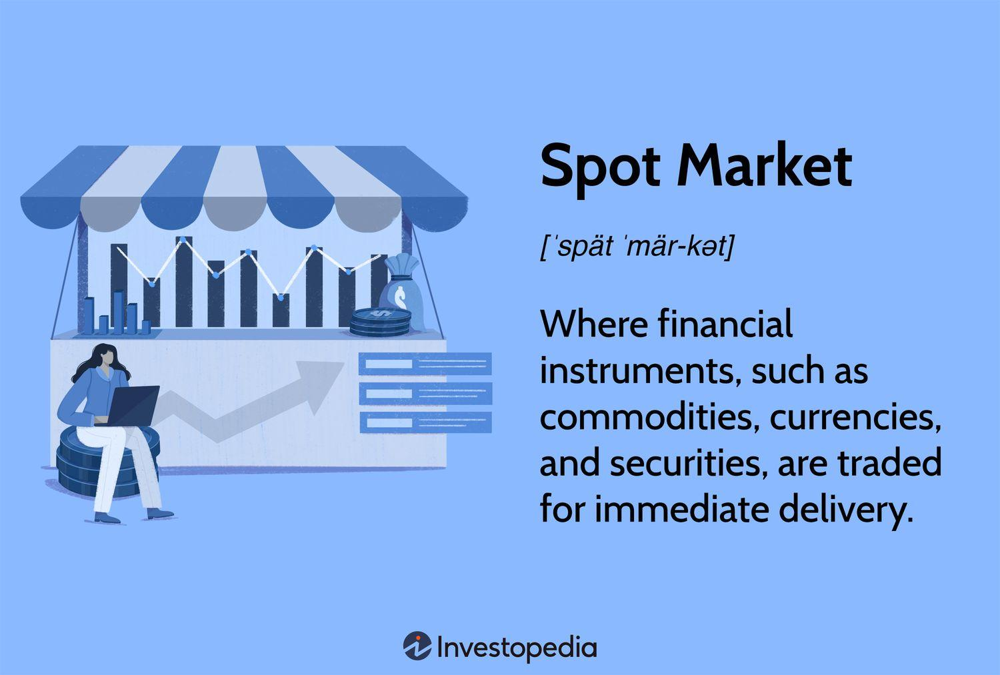

## Table of Contents

## What is a spot market?

A spot market is a place where you can buy or sell things right away. It's called "spot" because the trade happens on the spot, not later. For example, if you want to buy apples, you go to the spot market, find someone selling apples, and buy them right then and there. The price you pay is the current price, which can change quickly based on how many people want apples and how many apples are available.

Spot markets are used for many different things, like stocks, currencies, and even energy like electricity. They are important because they help set prices that reflect what people are willing to pay right now. This can be different from prices set for future delivery, which might be higher or lower depending on what people think will happen in the future. Spot markets help keep things fair and transparent because everyone can see the current price and decide if they want to buy or sell.

## How does a spot market differ from a futures market?

A spot market and a futures market are two different places where you can buy and sell things, but they work in different ways. In a spot market, you buy or sell something right away. For example, if you want to buy a banana, you go to the spot market, find a seller, and trade your money for the banana on the spot. The price you pay is the current price, which can change quickly based on how many people want bananas and how many bananas are available.

In a futures market, you agree to buy or sell something at a future date for a price you set now. For example, if you think the price of bananas will go up in three months, you can make a deal today to buy bananas in three months at today's price. This can be useful if you want to protect yourself from price changes or if you think you can make money by guessing what prices will do in the future. The main difference is that in a spot market, the trade happens immediately, while in a futures market, the trade is set for a later time.

## What types of goods are typically traded on spot markets?

Spot markets are used for trading many different types of goods. Some of the most common goods traded on spot markets are commodities like oil, natural gas, and agricultural products such as wheat, corn, and soybeans. These goods are often traded in large quantities because they are used in industries like energy and food production. The prices for these goods can change quickly based on how much is available and how much people want them.

Another type of good often traded on spot markets is currency. In the foreign exchange market, people buy and sell different currencies right away. This is important for businesses that need to pay for things in different countries or for people who travel and need to change their money into another currency. The spot price of a currency can change a lot in a short time, depending on things like interest rates and what is happening in the world.

Stocks and other financial instruments are also commonly traded on spot markets. When you buy a stock on a stock exchange, you are usually buying it on the spot, meaning the trade happens right away at the current price. This is different from buying a futures contract for a stock, where you agree to buy it later. The spot market for stocks helps people and companies quickly buy and sell shares based on what is happening in the market right now.

## Can you explain the process of a spot market transaction?

When you want to buy something on a spot market, you find a seller who has what you want. Let's say you want to buy some apples. You go to the spot market, find someone selling apples, and agree on a price. This price is the current price, which can change based on how many people want apples and how many apples are available. Once you and the seller agree on the price, you pay the seller, and they give you the apples right away. The whole process happens quickly, and you leave with your apples.

In a spot market transaction, everything is done on the spot, meaning there's no waiting. For example, if you're trading currency, you might go to a currency exchange and trade your dollars for euros at the current exchange rate. You get the euros right away, and the transaction is complete. This is different from other types of markets where you might have to wait or agree to buy something at a future date. Spot markets help keep things simple and immediate, which is why they are used for many different types of goods, like commodities, currencies, and stocks.

## What are the advantages of trading on a spot market?

Trading on a spot market has several advantages. One big advantage is that it's quick and easy. When you want to buy or sell something, you can do it right away. You don't have to wait or make plans for the future. This is really helpful if you need something right now, like if you need to buy food or change your money into another country's currency. The price you pay is the current price, which is fair because it shows what people are willing to pay at that moment.

Another advantage is that spot markets help set prices that are clear and easy to understand. Everyone can see the current price, so you know exactly what you're paying or getting for your goods. This makes trading fair and open because no one can hide the price. It also helps the market work smoothly because prices can change quickly based on how many people want something and how much of it is available. This way, the market can adjust to what people need right away.

## What are the risks associated with spot market trading?

One risk of trading on a spot market is that prices can change quickly. If you buy something and the price drops right after, you might lose money. For example, if you buy apples at a high price and then the price goes down, you could have bought them cheaper if you waited. This can be a problem if you need to sell what you bought later at a lower price than you paid.

Another risk is that spot markets can be affected by things you can't control, like the weather or big news events. If there's a sudden change, like a storm that ruins a crop, the price of that crop can go up a lot. This can be good if you're selling, but bad if you're buying. It's hard to predict these changes, so you might end up paying more than you expected or getting less money than you hoped for.

## How do spot market prices get determined?

Spot market prices are determined by how many people want to buy something and how much of it is available to sell. If a lot of people want to buy apples and there aren't many apples to go around, the price of apples will go up. On the other hand, if there are a lot of apples but not many people want to buy them, the price will go down. This balance between what people want and what's available is called supply and demand, and it's what sets the price in a spot market.

Sometimes, other things can affect spot market prices too. For example, if there's a big news event like a storm that ruins a crop, the price of that crop can go up because there's less of it available. Or if a new technology makes it easier to produce something, the price might go down because there's more of it. These outside factors can make prices change quickly, which is why spot market prices can be different from one day to the next.

## What role do spot markets play in the overall economy?

Spot markets are really important for the economy because they help set prices that everyone can see and understand. When people buy and sell things right away at the current price, it shows what people are willing to pay for things like food, energy, and money. This helps businesses and people make good choices about what to buy and sell. For example, if the price of oil goes up on the spot market, a company might decide to use less oil or look for cheaper options. This keeps the economy running smoothly because everyone knows the real price of things.

Spot markets also help the economy by making it easier for things to move around. When someone needs something right away, like food or money, they can go to the spot market and get it quickly. This helps keep stores full of food and makes sure businesses can pay for things in different countries. Without spot markets, it would be harder to get what you need when you need it, and the economy might not work as well. So, spot markets play a big role in keeping everything balanced and moving in the economy.

## How has technology impacted spot market trading?

Technology has made spot market trading a lot easier and faster. Before, people had to go to a physical place to buy and sell things like stocks or currencies. Now, with computers and the internet, you can trade on spot markets from anywhere. You can use apps or websites to see the current prices and make trades in seconds. This means more people can join in, and the markets can work better because everything happens so quickly.

Another way technology has changed spot market trading is by making it more clear and safe. With technology, you can see all the prices and trades happening in real time. This helps everyone know what's going on and makes trading fairer. Also, technology helps keep your money and information safe with things like encryption and secure websites. This makes people feel more comfortable trading on spot markets because they know their trades are protected.

## What are some examples of major spot markets around the world?

One major spot market is the New York Mercantile Exchange (NYMEX), where people trade things like oil and natural gas right away. It's a big place where the prices of these important things get set, and it helps a lot of businesses know how much they will have to pay for energy. Another big spot market is the London Metal Exchange (LME), where people buy and sell metals like copper and aluminum on the spot. This market is important for industries that use a lot of metal, like construction and manufacturing.

The foreign exchange market, or Forex, is another major spot market where people trade different currencies right away. It's the biggest spot market in the world, and it's open all the time because people are trading all over the world. This market helps businesses and travelers change their money into different currencies at the current price. The Chicago Mercantile Exchange (CME) is also a big spot market where people trade things like agricultural products and livestock. This helps farmers and food companies know the current prices and make good decisions about what to buy and sell.

## How do regulations affect spot market operations?

Regulations help make sure that spot markets work fairly and safely. Governments and other groups make rules that everyone has to follow when they buy and sell things on the spot market. These rules can stop people from doing things that might hurt others, like lying about prices or trying to control the market. For example, there might be rules that say you have to tell everyone what you're buying and selling, so no one can hide what they're doing. This helps keep the market open and honest, so everyone can trust the prices they see.

Regulations also help protect people who are trading on the spot market. There are rules that make sure the people running the market are doing a good job and not taking advantage of anyone. For example, there might be rules about how to keep people's money safe when they make trades. This is important because it makes people feel safe about trading on the spot market. Without these rules, the market might not work as well, and people might not want to trade as much. So, regulations play a big role in making sure spot markets help the economy run smoothly.

## What advanced strategies can traders use to optimize their performance in spot markets?

Traders can use a strategy called technical analysis to optimize their performance in spot markets. This means they look at charts and past prices to guess where prices might go next. They use things like moving averages and support and resistance levels to make better choices about when to buy and sell. By studying these patterns, traders can try to buy low and sell high, which can help them make more money. It's important to keep learning and watching the market closely because prices can change quickly.

Another strategy traders can use is called risk management. This means they think about how much they could lose before they make a trade. They might set stop-loss orders, which automatically sell something if the price goes down too much. This helps them not lose too much money if the market moves against them. Traders also might not put all their money into one trade, but spread it out over different things. This way, if one trade goes bad, they still have other chances to make money. Using these strategies can help traders do better in spot markets.

## References & Further Reading

[1]: Bergstra, J., Bardenet, R., Bengio, Y., & Kégl, B. (2011). ["Algorithms for Hyper-Parameter Optimization."](https://papers.nips.cc/paper/4443-algorithms-for-hyper-parameter-optimization) Advances in Neural Information Processing Systems 24.

[2]: ["Advances in Financial Machine Learning"](https://www.amazon.com/Advances-Financial-Machine-Learning-Marcos/dp/1119482089) by Marcos Lopez de Prado

[3]: Aronson, D. R. ["Evidence-Based Technical Analysis: Applying the Scientific Method and Statistical Inference to Trading Signals"](https://www.amazon.com/Evidence-Based-Technical-Analysis-Scientific-Statistical/dp/0470008741)

[4]: Jansen, S. (2020). ["Machine Learning for Algorithmic Trading"](https://github.com/stefan-jansen/machine-learning-for-trading) - Packt Publishing

[5]: Chan, E. P. (2008). ["Quantitative Trading: How to Build Your Own Algorithmic Trading Business"](https://github.com/ftvision/quant_trading_echan_book) - John Wiley & Sons