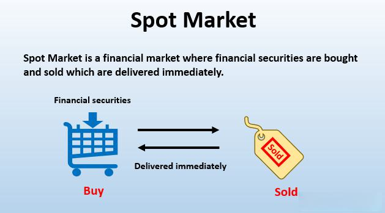

The financial markets serve as a vibrant platform for traders to engage in diverse trading operations, prominently featuring spot market trading and algorithmic trading. Spot market trading entails the buying and selling of financial instruments for immediate execution, thereby facilitating the rapid exchange of assets such as commodities, currencies, and securities. This type of trading is notable for its price transparency and reflection of real-time market conditions, making it a preferred choice for traders seeking immediate results.

Contrastingly, algorithmic trading represents the merger of technology with trade execution, employing sophisticated computer programs to conduct transactions based on predefined algorithms. These algorithms can consider a multitude of criteria including timing, price, quantity, and other mathematical models, enabling operations at speeds and frequencies unattainable by human traders. The computational prowess of algorithmic trading allows market participants to reduce human errors, exploit market inefficiencies, and effectively backtest trading strategies.



This article presents a detailed examination of both spot market trading and algorithmic trading, highlighting the respective advantages and disadvantages inherent to each method. Furthermore, it explores how these trading modalities can be harmoniously integrated to enhance trading precision and efficiency. By understanding the distinct characteristics and synergies of spot market and algorithmic trading, traders can optimize their approaches to navigate the complexities of modern financial markets effectively.

## Table of Contents

## Understanding Spot Market Trading

Spot market trading involves the purchase or sale of financial instruments for immediate delivery, typically executed on either exchanges or over-the-counter (OTC) platforms. This type of trading is characterized by the direct and prompt completion of transactions, with assets being settled within a standard timeframe, usually two business days, a period referred to as T+2.

The range of assets traded in spot markets is diverse, encompassing commodities such as crude oil and gold, currencies, and securities, including stocks and bonds. As a result, spot markets provide traders and investors with a dynamic environment where they can transact based on current market prices. The real-time pricing inherent in spot markets means that transactions are executed at the prevailing market rates, offering high liquidity—a measure of how easily assets can be bought or sold without affecting their price.

One significant advantage of spot market trading is its transparency. Prices reflect the immediate economic conditions and investor sentiment, as they are directly influenced by factors such as supply and demand dynamics, geopolitical events, and macroeconomic indicators. This transparency allows traders to make informed decisions based on the most current and accurate pricing information available.

Moreover, the [liquidity](/wiki/liquidity-risk-premium) in spot markets enables participants to enter and [exit](/wiki/exit-strategy) positions with relative ease; higher liquidity generally results in narrower bid-ask spreads, which are beneficial for traders aiming to minimize costs associated with entering or exiting trades. Such conditions favor both individual and institutional investors seeking to optimize their returns and manage risks effectively within the fluid environment of financial markets.

In summary, spot market trading signifies the purchasing or sale of financial instruments for prompt delivery, offering real-time pricing and high liquidity. With its transparent nature, spot market trading plays a crucial role in reflecting market conditions, making it a significant component of the global financial landscape.

## How Algorithmic Trading Works

Algorithmic trading, commonly referred to as algo-trading, involves the use of computer algorithms to [carry](/wiki/carry-trading) out trading operations. These algorithms are designed based on specific criteria such as timing, price, quantity, and various mathematical models. By processing vast amounts of data quickly, [algorithmic trading](/wiki/algorithmic-trading) systems can operate at speeds and frequencies that are far beyond the capabilities of human traders.

One of the primary advantages of algorithmic trading is its ability to reduce human errors. Since algorithms follow predefined rules and criteria, the risk of making emotional or impulsive trading decisions is minimized. This aspect is particularly useful in volatile markets where human reactions might lead to suboptimal decisions.

Furthermore, the algorithms are adept at identifying and capitalizing on market inefficiencies. They can analyze market conditions and execute trades almost instantaneously when opportunities arise. For example, algorithms might exploit [arbitrage](/wiki/arbitrage) opportunities by buying and selling the same security in different markets to profit from price discrepancies.

A crucial feature of algorithmic trading systems is the ability to backtest trading strategies. Backtesting involves running the algorithm using historical market data to evaluate how a strategy would have performed over a specific period. This process helps in refining strategies and assessing their effectiveness before they are deployed in real-time trading.

The efficiency of algorithmic trading is rooted in the mathematical and statistical models that form the basis of the algorithms. These can range from simple [statistical arbitrage](/wiki/statistical-arbitrage) models to complex [machine learning](/wiki/machine-learning) algorithms that improve trading decisions over time. In Python, for instance, libraries such as NumPy and pandas are frequently used for data analysis, while machine learning models can be developed using scikit-learn or TensorFlow.

Here is a simple example of a Python code snippet that illustrates the concept of a moving average crossover strategy, a basic type of algorithmic trading strategy:

```python
import pandas as pd
import numpy as np

# Load historical market data
data = pd.read_csv('market_data.csv')

# Calculate moving averages
data['short_ma'] = data['Close'].rolling(window=5).mean()
data['long_ma'] = data['Close'].rolling(window=20).mean()

# Generate trading signals
data['signal'] = 0
data['signal'][5:] = np.where(data['short_ma'][5:] > data['long_ma'][5:], 1, 0)

# Mark position changes
data['position'] = data['signal'].diff()

# Print the signals
print(data[['Close', 'short_ma', 'long_ma', 'signal', 'position']])
```

In this example, buy signals are generated when a short-term moving average crosses above a long-term moving average, and sell signals are generated when the opposite occurs. The strategy can then be backtested to evaluate its past performance and guide real-time trading decisions.

Overall, algorithmic trading is a powerful tool for modern traders, significantly enhancing the speed, precision, and execution of trades.

## Integrating Algo-Trading with Spot Markets

Algorithmic trading can be effectively integrated into spot markets to enhance trading processes by executing trades with remarkable speed and precision. In the competitive environment of spot markets, where assets such as commodities, currencies, and securities are traded for immediate delivery, the ability to quickly capitalize on price movements is crucial for maximizing profits. Algorithmic trading systems are designed to automatically monitor and analyze market conditions, allowing traders to respond instantaneously to rapid changes in price.

One major advantage of utilizing algorithmic trading in spot markets is the capacity to undertake arbitrage opportunities. Arbitrage involves buying and selling the same asset in different markets to exploit price differentials. Algorithms can easily detect and act on these fleeting opportunities much faster than human traders, providing a distinct edge in profit generation.

Moreover, the automation inherent in algorithmic trading mitigates the need for round-the-clock market supervision. This is particularly advantageous in markets that operate 24/7, such as [forex](/wiki/forex-system), where constant vigilance would otherwise be mandatory. Automation ensures that trades are executed seamlessly based on pre-defined criteria without the need for human intervention, thereby reducing the likelihood of manual errors.

High-frequency trading ([HFT](/wiki/high-frequency-trading-strategies)), a subset of algorithmic trading, is particularly suited for spot markets. HFT strategies involve executing a large number of orders at extremely high speeds within fractions of a second, relying heavily on sophisticated algorithms to analyze market data and execute trades. This rapid execution allows traders to take advantage of even minimal price changes, reinforcing their competitive position in the market.

In summary, the integration of algorithmic trading into spot markets provides traders with enhanced capabilities to navigate the fast-paced market environment, optimize trading decisions, and capitalize on fleeting opportunities, thereby leading to improved trading outcomes.

## Advantages and Challenges

Spot market trading exhibits several notable advantages, chief among them being real-time execution, where trades are settled almost instantaneously, providing traders with the current market price. This immediate execution enhances transparency, as traders can ascertain the true market price of an asset without delays, thus reducing the chances of price manipulation. The liquidity in spot markets is another major advantage, facilitating the ease with which assets can be bought or sold, often resulting in tighter bid-ask spreads.

Algorithmic trading, alternatively, brings a suite of benefits through automation and efficiency. By utilizing pre-programmed software, algo-trading minimizes human intervention, thereby reducing errors resulting from manual trading. This automation allows for trades to be executed at optimal speeds, capturing fleeting market opportunities that would otherwise be missed. Additionally, the absence of human emotion in algorithm-driven trades eliminates impulsive reactions, ensuring that trading strategies are adhered to with precision.

However, both trading methods encounter distinct challenges. Spot market traders are consistently confronted with market [volatility](/wiki/volatility-trading-strategies), necessitating rapid decision-making to capitalize on or mitigate exposure to swift price changes. Such volatility can introduce significant risk, as sudden market shifts can lead to potential losses if not promptly addressed.

Algo-trading, while advantageous, demands a robust technological infrastructure to operate effectively. The sophistication of algorithmic systems requires significant investment in technology and maintenance. One of the more substantial risks associated with algorithmic trading is its potential to trigger market disruptions, such as flash crashes. These are rapid market declines followed by a swift recovery, often induced by a large [volume](/wiki/volume-trading-strategy) of automated orders executed in quick succession. Such events highlight the need for vigilant oversight and the implementation of circuit breakers to curtail any undue market disturbances.

## Case Study: The Role of Algo-Trading in Forex Markets

The foreign exchange (forex) market is one of the most expansive over-the-counter (OTC) markets globally, providing ample trading opportunities due to its decentralized nature and 24-hour trading cycle. Algorithmic trading has become an indispensable tool for traders in the forex market, facilitating execution based on precise currency trends and arbitrage opportunities. 

Algorithmic trading in forex utilizes pre-programmed strategies that trigger trades according to predetermined conditions, such as price comparisons or economic indicators. This method allows for the exploitation of minor price discrepancies between different currency pairs, referred to as arbitrage. For instance, a forex algorithm might be programmed to initiate buy or sell orders in milliseconds when it identifies a profitable price disparity between EUR/USD and USD/GBP pairs.

High-frequency trading (HFT) strategies are prevalent among forex algo-traders seeking a competitive edge. HFT involves executing a large number of trades at incredibly high speeds, often measured in microseconds. This speed allows traders to capitalize on small price changes that are generally imperceptible to manual traders. Python, a popular language for building such algorithms, may employ the following pseudocode for a simple HFT setup:

```python
import time

def high_frequency_trade(price_data, threshold):
    for price in price_data:
        if price < threshold:
            execute_buy_order()
        elif price > threshold:
            execute_sell_order()
        time.sleep(0.01)  # Represents 10 milliseconds of trade execution time

def execute_buy_order():
    # Code to place a buy order
    pass

def execute_sell_order():
    # Code to place a sell order
    pass
```

However, the forex market poses several challenges for algorithmic traders. Foremost among these is latency, which refers to the time delay between the initiation and execution of a trade. In high-frequency environments, even microsecond delays can translate into substantial financial losses. To mitigate latency, traders may utilize co-location services, where their servers are physically located in proximity to the trading exchanges.

Additionally, unforeseeable market events can dramatically impact currency values, leading to volatile conditions that algorithms might not be programmed to handle. For instance, geopolitical announcements or unexpected economic data releases can cause rapid market movements, creating significant risks for automated trading systems.

Therefore, while algorithmic trading offers enhanced efficiency and precision in the forex market, traders must remain vigilant to optimize their technological infrastructure and continuously refine their algorithms to address the challenges inherent within this fast-paced environment.

## Future Trends in Spot Market and Algorithmic Trading

The future of spot market and algorithmic trading is poised for significant transformation driven by technological advancements, regulatory shifts, and the evolving landscape of financial markets. One of the primary catalysts for change is the continuous enhancement of [artificial intelligence](/wiki/ai-artificial-intelligence) (AI) and machine learning (ML) technologies. These advancements allow for more sophisticated predictive models and trading algorithms, optimizing decision-making processes by analyzing vast datasets more efficiently and accurately than ever before. AI-powered algorithms can assess market conditions in real-time, adjusting strategies adaptively to capitalize on emerging opportunities.

Regulation will also play a crucial role in shaping the future of algorithmic trading. As these systems become more embedded in financial markets, regulatory bodies are expected to enforce stricter governance and compliance requirements to mitigate risks such as market manipulation and flash crashes. These regulations will necessitate the development of more transparent and robust algorithms, fostering a safer trading environment.

The democratization of trading is another trend on the horizon. With the growing accessibility of advanced trading platforms and tools, retail investors are increasingly able to engage in algorithmic trading. This shift is supported by user-friendly platforms that offer algorithmic trading features that were previously exclusive to institutional investors. As more retail traders enter the market, the demand for education and resources to understand complex trading strategies and technologies will rise.

Furthermore, the integration of blockchain technology presents new opportunities and challenges for both spot market and algorithmic trading activities. Blockchain can enhance transparency and security through decentralized ledgers, offering a new paradigm for trading traditional and digital assets. The rise of cryptocurrencies as tradable assets in spot markets adds another layer of complexity and opportunity for algorithmic trading. Trading strategies can now encompass digital currencies, providing diversified portfolio options and exposure to new asset classes.

In summary, the future trends in spot market and algorithmic trading will be defined by how traders and institutions adapt to technological innovations, regulatory landscapes, and the democratization of trading access. Embracing these changes will be crucial for market participants seeking to leverage technological advancements for competitive advantage.

## Conclusion

Spot market and algorithmic trading each offer distinct advantages and challenges to traders in financial markets. Spot market trading, characterized by immediate execution and transparent pricing, provides a straightforward approach where trades occur at current market values. This immediacy can be advantageous for traders looking to capitalize on short-term price movements. On the other hand, algorithmic trading offers the capability to execute trades based on complex algorithms, enabling precision and speed unattainable through manual trading. The integration of real-time processing in spot markets with the speed and accuracy of algorithmic trading yields a formidable combination that modern traders can utilize to maximize opportunities.

Understanding and effectively implementing both spot and algorithmic trading techniques can significantly boost profitability and trading efficiency. Traders who master real-time execution and algorithmic techniques can better navigate the volatility and complexities of today's markets. For instance, algorithmic strategies such as high-frequency trading or arbitrage can be employed to exploit minute price discrepancies, which are often missed in traditional trading. This synergy enhances decision-making processes, allowing traders to execute orders based on calculated criteria rather than emotions.

As the financial landscape continues to evolve with advancements in technology and shifts in market dynamics, continuous learning and adaptation remain crucial for trading success. The increasing role of artificial intelligence, machine learning, and blockchain technologies is reshaping how trades are conducted and analyzed. For traders, keeping pace with these changes involves staying informed and adaptable to emerging tools and regulatory developments. This adaptability not only mitigates risks associated with market disruptions but also capitalizes on new trading methodologies that arise. By embracing change and fostering a learning-oriented mindset, traders can sustainably enhance their strategies in a rapidly changing financial environment.

## References & Further Reading

[1]: Bergstra, J., Bardenet, R., Bengio, Y., & Kégl, B. (2011). ["Algorithms for Hyper-Parameter Optimization."](https://papers.nips.cc/paper/4443-algorithms-for-hyper-parameter-optimization) Advances in Neural Information Processing Systems 24.

[2]: ["Advances in Financial Machine Learning"](https://www.amazon.com/Advances-Financial-Machine-Learning-Marcos/dp/1119482089) by Marcos Lopez de Prado

[3]: Aronson, D. R. ["Evidence-Based Technical Analysis: Applying the Scientific Method and Statistical Inference to Trading Signals"](https://www.amazon.com/Evidence-Based-Technical-Analysis-Scientific-Statistical/dp/0470008741)

[4]: Jansen, S. (2020). ["Machine Learning for Algorithmic Trading"](https://github.com/stefan-jansen/machine-learning-for-trading) - Packt Publishing

[5]: Chan, E. P. (2008). ["Quantitative Trading: How to Build Your Own Algorithmic Trading Business"](https://github.com/ftvision/quant_trading_echan_book) - John Wiley & Sons