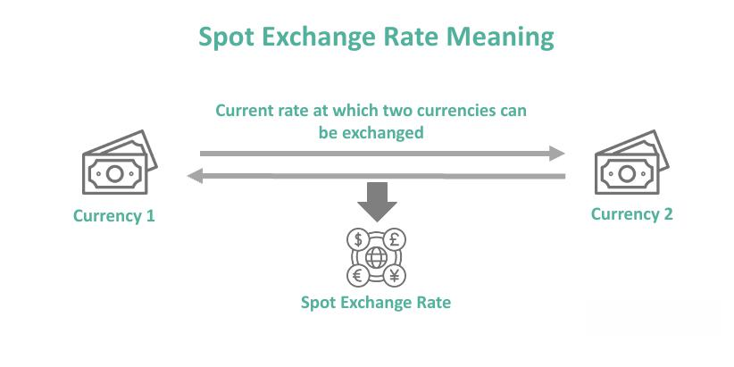

The financial markets have experienced substantial changes as a result of technological innovations, with algorithmic trading, or 'algo trading,' standing out as a particularly transformative factor. This form of trading employs complex algorithms to automate trading decisions, thereby increasing the speed and efficiency of trades. It has redefined how traders, both individual and institutional, interact with the markets by offering methods to capitalize on market movements with precision and agility.

This article focuses on two pivotal concepts shaping contemporary trading practices: spot premium and algorithmic trading. A spot premium occurs in scenarios where the current spot price of an asset surpasses its future contract price, leading to specific trading opportunities, especially in markets such as foreign exchange and commodities. This condition, often associated with backwardation, poses unique challenges and opportunities for traders aiming to maximize returns.



Understanding how spot premiums and algorithmic trading intersect is crucial for optimizing trading strategies in today's market environment. Algorithmic trading systems analyze vast amounts of data and execute trades at speeds unattainable by human traders, enabling them to take advantage of transient inefficiencies, such as those presented by spot premiums. By leveraging these concepts, traders can enhance their decision-making processes, offering the potential for significant strategic advantages.

This exploration is essential for both novice and experienced traders. For beginners, grasping these concepts can form the foundation of a solid trading strategy, while seasoned professionals can refine their approaches to navigate the increasingly automated and dynamic landscape of financial markets. Recognizing the interplay between spot premiums and algorithmic strategies is key to achieving success in the fast-evolving world of trading.

## Table of Contents

## Understanding Spot Premium in Financial Markets

The term 'spot premium' is closely associated with single payment options trading (SPOT) options, which are primarily utilized in the foreign exchange markets. These exotic options are characterized by a unique mechanism whereby investors pay a premium upfront to secure the option, which is contingent on the speculation of price movements. The payout is predetermined, offering investors the opportunity to profit from substantial market swings without the obligation to engage in daily trading activities.

To further understand spot premiums, one must consider their occurrence in scenarios such as backwardation. In these situations, the current spot prices surpass future contract prices. This phenomenon is typically observed in commodities and can also influence other asset classes. Backwardation implies an expectation of declining prices over time, often driven by factors such as supply constraints or high demand for immediate delivery of the asset. This market condition prompts investors to pay a premium for immediate access, thereby affecting trading strategies.

For practical insights into leveraging spot premiums effectively, examples and case studies are invaluable. Consider a scenario where an investor anticipates a surge in the price of a particular currency. By purchasing a SPOT option, the investor secures the potential for significant profit through a one-time premium, contingent on the currency reaching a pre-specified target. This approach not only provides the potential for high returns but also limits the risk to the initial premium paid.

Moreover, in commodities trading, when faced with backwardation, traders might opt to enter the spot market to capitalize on immediate price advantages. By securing commodities at present high prices rather than engaging in future contracts, traders can exploit the spot premium to maximize gains. These strategies, while profitable, require a comprehensive understanding of market dynamics and pricing patterns to mitigate associated risks effectively.

In summary, the concept of a spot premium in financial markets presents diverse opportunities for investors. It requires a strategic approach, informed by market analysis and future price projections, to optimize potential profits while managing the inherent risks.

## What is Algorithmic Trading?

Algorithmic trading, commonly referred to as algo trading, is the process of using automated systems to make trading decisions in financial markets. At its core, this involves employing complex algorithms to analyze market data, identify trading opportunities, and execute trades with unmatched speed and precision. The goal is to capitalize on favorable market conditions faster than human traders can.

The primary advantage of [algorithmic trading](/wiki/algorithmic-trading) lies in its ability to process vast amounts of data and make split-second decisions. Algorithms evaluate real-time data, including price, [volume](/wiki/volume-trading-strategy), and time, to ascertain patterns or trends that might indicate profitable trading opportunities. These algorithms can be programmed to follow diverse strategies, ranging from simple moving averages to intricate machine-learning models.

Algorithmic trading has shown a formidable impact across various financial markets such as stocks, foreign exchange ([forex](/wiki/forex-system)), and cryptocurrencies. In each of these markets, speed and accuracy afforded by algo trading systems are crucial for success. For example, in high-frequency trading ([HFT](/wiki/high-frequency-trading-strategies)), a subset of algorithmic trading, algorithms can execute thousands of trades per second, taking advantage of tiny price differentials in different markets or exchanges.

The mechanics of algorithmic trading can be broken down into several key components:

1. **Data Input**: The first step involves collecting data from various sources, including market feeds and news outlets. The data can be quantitative, such as price and volume, or qualitative, like sentiment analysis derived from social media.

2. **Algorithmic Analysis**: This step entails using algorithms to analyze the input data. The complexity of these algorithms can vary significantly. Basic algorithms might apply straightforward statistical methods, while advanced algorithms might deploy machine learning or natural language processing to discern market patterns and predict market movements.

3. **Trade Execution**: Once a trading opportunity is identified, the algorithm executes the trade automatically. This execution is done with high speed and precision, ensuring that trades occur at the optimal time and price. The execution process involves interacting with brokers' electronic trading platforms and adhering to specific order types and constraints set by the trader.

A key benefit of algorithmic trading is the ability to minimize human errors and emotional influences, which can lead to more consistent trading outcomes. It operates under tight, predefined rules, facilitating objective decision-making. Additionally, the efficiency of algorithmic trading reduces transaction costs due to lower spreads and commission rates achieved through high volumes and continuous trading.

In summary, algorithmic trading stands out as a revolutionary approach in modern trading, largely due to its efficiency, speed, and precision. As technology advances, the capabilities and efficacy of such systems are poised to grow, offering both opportunities and challenges to traders worldwide.

## Types of Algo Trading Strategies

Algorithmic trading strategies are diverse, each designed to exploit specific market conditions and satisfy distinct trading objectives. These strategies leverage mathematical models and advanced computational techniques to achieve their purposes, characterized by varying execution methods and risk profiles.

### Trend-Following Strategies

Trend-following strategies capitalize on persistent price trends within financial markets. The fundamental principle is to enter trades based on established directional [momentum](/wiki/momentum). Popular indicators used in these strategies include moving averages and the relative strength index (RSI). 

**Example: Moving Average Crossover Strategy**
A simple implementation involves two moving averages: a short-term and a long-term. When the short-term moving average crosses above the long-term, a buy signal is generated, indicating an upward trend. Conversely, a crossover below indicates a potential downtrend, signaling a sell.

```python
import pandas as pd

def moving_average_crossover(data, short_window=40, long_window=100):
    data['short_mavg'] = data['close'].rolling(window=short_window, min_periods=1, center=False).mean()
    data['long_mavg'] = data['close'].rolling(window=long_window, min_periods=1, center=False).mean()

    data['signal'] = 0
    data.loc[data['short_mavg'] > data['long_mavg'], 'signal'] = 1  # Buy
    data.loc[data['short_mavg'] < data['long_mavg'], 'signal'] = -1 # Sell

    return data
```

### Mean Reversion Strategies

Mean reversion strategies operate on the assumption that asset prices will revert to their long-term mean over time. These strategies are particularly useful in range-bound markets, as they exploit short-term price deviations. Statistical tools such as Bollinger Bands and standard deviation thresholds are critical in identifying entry and [exit](/wiki/exit-strategy) points.

### Statistical Arbitrage

Statistical [arbitrage](/wiki/arbitrage) leverages quantitative methods to identify pricing inefficiencies across different markets or instruments. It often involves pairs trading, where two historically correlated securities are monitored for divergence. When the price spread widens to an abnormal level, traders buy the underpriced asset and sell the overpriced one, anticipating a reversion to the mean.

### Market-Making

Market-making strategies provide [liquidity](/wiki/liquidity-risk-premium) by continuously quoting buy and sell prices and profiting from the bid-ask spread. These strategies require sophisticated algorithms to optimize pricing decisions and inventory risk, often involving high-frequency trading (HFT) components to react swiftly to market changes.

### High-Frequency Trading (HFT)

HFT strategies execute a large number of orders at extremely fast speeds, typically in milliseconds. These strategies are designed to capitalize on inefficiencies such as temporary mispricings and market micro-structure anomalies. Algorithmic systems are crucial, as they analyze vast amounts of data swiftly to make real-time trading decisions.

**Example: Latency Arbitrage**
HFT traders utilize minimal latency to capitalize on price discrepancies across multiple exchanges. The strategy involves buying an asset on one exchange at a lower price and concurrently selling it on another where the price is slightly higher, locking in a small, yet quick profit.

### Case Studies

Case studies illustrate the real-world application of these strategies. For instance, during the equities boom of the early 2000s, several hedge funds employed trend-following and [statistical arbitrage](/wiki/statistical-arbitrage) strategies to achieve significant returns by systematically identifying and exploiting market inefficiencies. These strategies continue to inform modern algorithmic trading frameworks, underpinning robust strategies for generating consistent profits. 

Understanding and choosing the right algothrading strategy depends on the trader's goals, market conditions, and the algorithmic models available, each offering distinct advantages in harnessing market dynamics efficiently.

## Spot Algorithmic Trading: A Specialized Approach

Spot algorithmic trading specifically targets immediate settlement markets, like foreign exchange (forex) markets, where transactions are executed instantly rather than being delayed or executed on future dates. This approach utilizes sophisticated algorithms designed to enhance the speed and accuracy of trade execution, accommodating the rapid decision-making processes required in these markets.

### Structure of Spot Algorithmic Trading Systems

**Data Collection**: At the core of spot algorithmic trading is data. Trading systems continuously ingest large volumes of market data, such as price quotes, market news, and order book information. This data serves as the foundation for generating trading signals. Advanced data collection methods ensure that algorithms operate with the most up-to-date and precise information.

**Signal Generation**: Using the collected data, algorithms generate trading signals based on predefined criteria or strategies. These criteria can include technical indicators, price fluctuations, or statistical models. For instance, a simple moving average crossover strategy might trigger a buy signal when a short-term moving average exceeds a long-term moving average.

```python
def moving_average(data, window_size):
    return data.rolling(window=window_size).mean()

def generate_signal(data):
    short_ma = moving_average(data, 20)
    long_ma = moving_average(data, 50)

    buy_signal = (short_ma > long_ma) & (short_ma.shift(1) <= long_ma.shift(1))
    sell_signal = (short_ma < long_ma) & (short_ma.shift(1) >= long_ma.shift(1))

    return buy_signal, sell_signal
```

**Risk Management**: Effective trading systems also incorporate robust risk management mechanisms. This includes stop-loss orders to limit potential losses, position sizing to determine the amount of capital invested, and diversification strategies to spread risk across different assets or trading strategies. Algorithms can be programmed to adjust these parameters automatically in response to changing market conditions.

### Advantages of Spot Algorithmic Trading

**Efficiency**: Algorithms can process vast amounts of information and execute trades in milliseconds, which is crucial in spot markets where price movements can be swift and short-lived.

**Consistency**: Unlike human traders, algorithms can operate continuously without fatigue, executing trades based on consistent logic without emotional interference.

**Adaptability**: Algorithms can be optimized to adapt to varying market conditions, from trending markets to more volatile environments, enhancing their effectiveness across different scenarios.

### Potential Challenges

**Technical Complexity**: Developing and maintaining sophisticated algorithms require significant technical expertise. Moreover, the infrastructure needed to support real-time data analysis and rapid trade execution can be technically demanding and costly.

**Market Risk**: Despite their efficiency, algorithms are not immune to market risks such as sudden price spikes or drops, which can occur due to unforeseen global events or market anomalies. Algorithms must be carefully tested and continuously monitored to mitigate these risks.

In conclusion, while spot algorithmic trading presents unique opportunities for exploiting immediate settlement markets, traders must navigate both its technical and market complexities to achieve optimal results. By leveraging advanced algorithms designed for rapid execution, traders can enhance their strategies, but they must also ensure robust risk management practices are in place.

## Choosing the Right Algorithmic Trading Platform

Selecting the right algorithmic trading platform is a critical decision for traders aiming to optimize their strategies and performance. When evaluating platforms, several key factors come into play, such as user interface (UI), [backtesting](/wiki/backtesting) capabilities, and support for different asset classes. A well-chosen platform not only enhances trading efficiency but also aligns with the trader's technical prowess and objectives.

**User Interface (UI):** A platform with an intuitive interface simplifies the trading process. It allows traders to focus on strategy rather than grappling with complex navigation. A good UI should provide clear access to essential features, such as real-time data feeds, execution controls, and performance analytics. An efficient UI ensures that traders can quickly adapt to changing market conditions without unnecessary distractions.

**Backtesting Capabilities:** Backtesting is a fundamental aspect of algorithmic trading, allowing traders to test their strategies against historical market data. Effective platforms offer robust backtesting tools, enabling the simulation of trading strategies over various market scenarios. This feature helps traders refine their algorithms, identify potential pitfalls, and optimize performance before deploying them in live markets.

**Asset Support:** Traders operate across multiple asset classes, including equities, forex, commodities, and cryptocurrencies. Therefore, a versatile platform that supports a wide range of assets provides greater flexibility. Comprehensive asset support facilitates diversification and risk management within a single trading environment.

**Popular Platforms:**
1. **MetaTrader:** Known for its user-friendly interface, MetaTrader supports both automated and manual trading strategies. Its customizability through Expert Advisors (EAs) provides traders with tools for developing bespoke trading algorithms. Additionally, MetaTrader offers comprehensive backtesting capabilities and supports a broad spectrum of asset classes.

2. **QuantConnect:** This open-source platform is geared towards quants and developers, offering extensive backtesting features. QuantConnect supports multiple programming languages, including Python and C#, which allows for sophisticated strategy development. Its collaboration features also enable traders to leverage community insights.

3. **TradeStation:** TradeStation combines powerful analytical tools with a seamless trading experience. It’s equipped with RadarScreen, a market-monitoring tool that helps track potential opportunities in real-time. The platform's EasyLanguage code is particularly friendly for those preferring less complex programming environments, yet it is robust enough for advanced algorithmic development.

4. **Interactive Brokers:** Renowned for its low-latency execution and broad market access, Interactive Brokers caters to professional traders. The Trader Workstation (TWS) platform has powerful charting tools and supports algorithmic trading in various asset markets. Its APIs allow integration with custom trading systems, providing flexibility in strategy implementation.

**Evaluating Platform Features:** When selecting a platform, traders should assess their technical expertise and trading goals. Beginners might prioritize an intuitive UI and comprehensive support resources, while experienced traders may prefer platforms offering extensive customization and coding capabilities. Additionally, considering the platform's scalability is essential for those intending to expand their trading activities.

In conclusion, the right algorithmic trading platform is pivotal to achieving trading success. Detailed evaluation of platform features in relation to one's trading style and expertise can unlock greater efficiency and profitability. As trading environments and individual needs evolve, continuous reassessment of platform suitability remains vital.

## Conclusion

Financial markets continue to undergo significant changes, propelled by technological progress and innovation. Among the key elements prominently influencing this landscape are the concepts of spot premium and algorithmic trading. Understanding and leveraging these tools can substantially enhance trading profitability. Spot premiums, which appear in various forms such as single payment options trading (SPOT) and scenarios like backwardation, are crucial for traders looking to capitalize on price movements. When employed strategically, these premiums offer avenues for investment returns, particularly in volatile markets.

Algorithmic trading, with its ability to automate and optimize decision-making processes, has proven instrumental in providing traders with a competitive edge. The speed, accuracy, and efficiency of algorithms enable market participants to execute trades with precision that human counterparts find challenging to match. By utilizing advanced algorithms, traders can identify inconsistencies and capitalize on market inefficiencies, ultimately improving their trading outcomes.

To remain competitive, it is essential for traders to engage in continuous learning and adaptation. This dynamic environment necessitates staying informed about new developments and adjusting strategies accordingly. Workshops, online courses, and certification programs offer valuable educational opportunities for traders aiming to deepen their knowledge of spot premiums and algorithmic trading. Resources such as online trading communities, webinars, and literature from seasoned professionals can further enhance understanding and application of these concepts.

In conclusion, the potential impact of spot premium and algorithmic trading on financial market dynamics is substantial. By embracing these tools and committing to ongoing education, traders can better position themselves to navigate the complexities and opportunities inherent in modern trading environments.

## References & Further Reading

[1]: Bergstra, J., Bardenet, R., Bengio, Y., & Kégl, B. (2011). ["Algorithms for Hyper-Parameter Optimization."](https://dl.acm.org/doi/10.5555/2986459.2986743) Advances in Neural Information Processing Systems 24.

[2]: ["Advances in Financial Machine Learning"](https://www.amazon.com/Advances-Financial-Machine-Learning-Marcos/dp/1119482089) by Marcos Lopez de Prado

[3]: ["Evidence-Based Technical Analysis: Applying the Scientific Method and Statistical Inference to Trading Signals"](https://www.amazon.com/Evidence-Based-Technical-Analysis-Scientific-Statistical/dp/0470008741) by David Aronson

[4]: ["Machine Learning for Algorithmic Trading"](https://github.com/stefan-jansen/machine-learning-for-trading) by Stefan Jansen

[5]: ["Quantitative Trading: How to Build Your Own Algorithmic Trading Business"](https://www.amazon.com/Quantitative-Trading-Build-Algorithmic-Business/dp/1119800064) by Ernest P. Chan