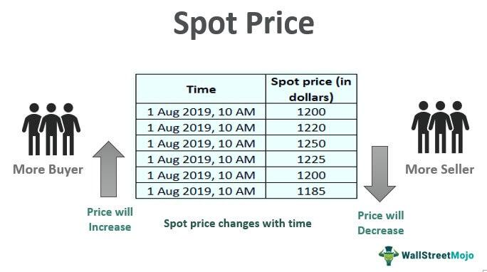

Price comparison in trading involves evaluating the prices of financial instruments across different markets or forms, primarily focusing on futures and spot prices. A futures price refers to the agreed-upon price for the future delivery of an asset as determined by a futures contract, whereas the spot price is the current market price at which an asset can be bought or sold for immediate delivery. Understanding the differences between futures prices and spot prices is crucial for traders because these variations can inform hedging strategies, speculation, and risk management.

In financial markets, algorithmic trading plays a significant role by using complex algorithms to execute trades at high speed, often based on price differences between markets like futures and spot. Algorithms can rapidly identify and exploit these discrepancies, thus influencing trading strategies and contributing to liquidity and efficiency in markets.



Price comparison between futures and spot prices impacts trading strategies by highlighting opportunities for arbitrage—buying low in one market and selling high in another. This process helps in aligning the two prices closer through what is known as the convergence process, where the futures prices tend to move towards the spot prices as the delivery date approaches. Conversely, divergence can occur due to changes in market conditions, creating opportunities or risks for traders depending on their positions.

The interaction between futures and spot prices and their relative movements form the basis for developing trading strategies. Understanding this relationship helps traders anticipate market dynamics and make informed decisions. The subsequent sections will explore how these elements interplay, the strategies employed by traders involving price comparisons, and how algorithmic trading utilizes these differences for potential gains.

## Table of Contents

## Understanding Futures Prices

Futures contracts are standardized agreements to buy or sell an asset at a predetermined future date and price. These contracts are traded on futures exchanges and cover various underlying assets, including commodities, indices, and currencies. The price of a futures contract, known as the futures price, is influenced by several complex interrelated factors.

**Determination of Futures Prices**

Futures prices are primarily determined by the forces of supply and demand, market sentiment, and traders' expectations regarding future price movements. Supply and demand dynamics play a critical role as they reflect the availability of the underlying asset and the market's appetite for risk. Market sentiment affects how traders perceive the value of the futures contract, which in turn influences their trading decisions. Expectations regarding economic conditions, interest rates, and other macroeconomic factors also heavily impact futures prices.

A mathematical representation commonly used to calculate futures prices, especially for commodities and financial instruments, is given by:

$$
F = S \times e^{(r + c)t}
$$

Where:
- $F$ is the futures price,
- $S$ is the spot price of the underlying asset,
- $r$ is the risk-free interest rate,
- $c$ is the cost of carry,
- $t$ is the time to maturity of the futures contract in years.

**Contango and Backwardation**

Futures markets can exhibit states known as contango and backwardation. Contango occurs when the futures price is above the expected future spot price. This situation often arises when the costs of carrying the underlying asset, such as storage and insurance, make holding the asset expensive. Conversely, backwardation is when the futures price is below the expected future spot price, which can happen when the asset is in short supply, leading to higher immediate demand.

**Roles of Hedgers and Speculators**

In futures markets, participants include hedgers and speculators. Hedgers use futures contracts to mitigate the risk of price fluctuations in the underlying asset, effectively locking in prices to avoid adverse movements. On the other hand, speculators attempt to profit from price changes by predicting market movements. Speculators add [liquidity](/wiki/liquidity-risk-premium) to the market and facilitate efficient price discovery, although their activities may also increase [volatility](/wiki/volatility-trading-strategies).

**Examples of Commonly Traded Futures**

The futures market encompasses a broad range of products. Commodities futures include contracts for agricultural products like wheat and corn, energy products such as oil and natural gas, and metals like gold and silver. Financial futures include stock indices such as the S&P 500, Treasury bonds, and various currency pairs. These futures contracts are integral to the global economy, providing essential tools for risk management and investment diversification.

In summary, understanding how futures prices are determined involves analyzing multiple market factors, recognizing the impact of contango and backwardation, acknowledging the contributions of hedgers and speculators, and exploring the variety of products available in the futures markets.

## Understanding Spot Prices

Spot prices refer to the current market price at which a particular asset can be bought or sold for immediate delivery and settlement. This price reflects the real-time dynamics of supply and demand in the market, providing an accurate representation of an asset's value at a particular moment. Spot prices are crucial in financial trading as they serve as a reference point for various derivatives and contractual agreements.

Several factors influence spot prices. Market liquidity is a primary [factor](/wiki/factor-investing), where highly liquid markets typically exhibit more stable spot prices due to the ease of buying and selling. Conversely, markets with low liquidity can experience more volatility and wider bid-ask spreads. Economic events, such as central bank announcements, geopolitical developments, or sudden market disruptions, can also lead to fluctuations in spot prices. These events can cause shifts in investor sentiment and alter the demand-supply equilibrium.

When comparing spot trading with futures trading, several differences in risks and benefits become apparent. Spot trading involves the immediate exchange of assets, allowing traders to capitalize on current market conditions. This immediacy equates to a lower level of obligation, but exposes traders to short-term market volatility. On the other hand, futures trading involves a contract to buy or sell an asset at a predetermined future date and price, which can hedge against price fluctuations but also entails a commitment and potential for margin calls if market conditions move against the trader's position.

Spot prices are integral as benchmarks for futures contracts. Futures prices often represent an anticipation of future spot prices, adjusted for factors such as storage costs, interest rates, or expected changes in demand and supply. The relationship between spot and futures prices is pivotal to pricing and risk management strategies in trading.

Real-world examples of assets commonly traded at spot prices include commodities and foreign exchange ([forex](/wiki/forex-system)). Commodities such as oil, gold, and agricultural products are frequently traded in spot markets, where prices can quickly respond to market news or environmental factors affecting supply. Similarly, forex trading operates heavily in the spot realm, whereby currencies are exchanged based on their current market value, influenced by factors such as economic indicators, trade balances, and geopolitical tensions.

Understanding spot prices and their determinants is essential for traders and investors operating within financial markets. Whether engaging in spot transactions or formulating futures contracts, recognizing the factors influencing spot prices helps in making informed decisions and managing risk effectively. This knowledge also underscores the importance of spot prices as fundamental indicators in the broader trading landscape.

## Price Comparison Between Futures and Spot Prices

Price comparison between futures and spot prices is a critical component of trading strategies, affecting both market dynamics and investment decisions. Understanding the relationship between these two price points involves analyzing convergence and divergence, market conditions, and the role of [arbitrage](/wiki/arbitrage).

### Convergence and Divergence

Futures prices and spot prices are interconnected, with futures prices typically reflecting the market's expectation of future spot prices. Convergence occurs as the futures contract approaches its expiration date, when futures prices and spot prices tend to equalize. Conversely, divergence refers to the gap that may exist between the futures and spot prices prior to expiration, often due to changing market conditions or expectations.

### Role of Arbitrage

Arbitrage plays a crucial role in aligning futures and spot prices. Traders exploit price discrepancies between these markets to achieve risk-free profits. For instance, if the futures price is higher than the spot price plus carrying costs (e.g., storage and interest), traders may buy the underlying asset in the spot market and sell in the futures market, awaiting convergence to capture the spread. This activity helps drive prices towards equilibrium.

### Impact of Market Conditions

Market volatility, liquidity, and geopolitical events significantly influence the price relationship between futures and spot markets. Volatile markets can widen the gap between futures and spot prices, as uncertainty affects expectations and risk premium. Geopolitical events often cause abrupt changes in supply and demand dynamics, further impacting this relationship. For example, a geopolitical conflict affecting oil supply can lead to significant disparities between spot and futures oil prices.

### Statistical Methods

Statistical analysis is essential for understanding and predicting the differences between futures and spot prices. Methods such as regression analysis, cointegration analysis, and time-series modeling are frequently used.

- **Cointegration Analysis**: This assesses whether long-term relationships exist between futures and spot price series, indicating potential convergence. Two price series that are cointegrated will tend to move together over time.

- **Regression Analysis**: Useful for modeling the dependency of futures prices on spot prices and other factors like interest rates or seasonal patterns.

Here's an example of a simple regression model using Python:

```python
import numpy as np
import statsmodels.api as sm

# Dummy data for futures and spot prices
spot_prices = np.array([100, 102, 101, 105, 110])
futures_prices = np.array([102, 103, 104, 108, 115])

# Adding a constant term for the intercept
spot_with_constant = sm.add_constant(spot_prices)

# Performing regression analysis
model = sm.OLS(futures_prices, spot_with_constant)
results = model.fit()

print(results.summary())
```

### Case Studies

A notable case study involves the commodity markets during the financial crisis of 2008. Significant divergences were observed between spot and futures prices for various agricultural products due to supply chain disruptions. Traders who could accurately forecast the convergence patterns based on historical data and economic indicators profited by implementing arbitrage strategies.

Another example is the equity index futures market, where high-frequency trading algorithms monitor real-time data to identify temporary divergences between index futures and corresponding cash indices, executing trades in milliseconds to capture small price differences with large volumes.

In summary, understanding and analyzing the price comparison between futures and spot markets is crucial for developing profitable trading strategies. Employing arbitrage, monitoring market conditions, and leveraging statistical methods can help traders effectively navigate and capitalize on these differences.

## Algorithmic Trading Strategies Involving Price Comparison

Algorithmic trading involves the use of computer algorithms to automate and execute trading decisions in financial markets. Its growing influence in modern markets is marked by the speed, precision, and capability of processing vast amounts of data in real time. These algorithms analyze market conditions, identify trading opportunities, and execute trades faster than humanly possible, contributing to increased market efficiency and liquidity.

One of the key types of [algorithmic trading](/wiki/algorithmic-trading) strategies that utilize price comparison is [statistical arbitrage](/wiki/statistical-arbitrage). This strategy involves the simultaneous purchase and sale of similar securities to exploit price discrepancies, particularly between spot and futures markets. By identifying price inefficiencies, algorithms can perform mean reversion tactics or trend-following strategies, ensuring that the profit is maximized when prices converge.

Machine learning (ML) and [artificial intelligence](/wiki/ai-artificial-intelligence) (AI) play a significant role in enhancing these strategies by offering advanced data analysis capabilities. These technologies can process historical and real-time data to predict future price movements and optimize trading strategies. Algorithms embedded with ML models, for instance, can identify patterns and correlations that are not apparent to traditional statistical methods. AI further enhances these strategies by continuously learning from new data, adjusting models in response to market dynamics and improving decision-making accuracy.

Despite the high potential returns, there are risks associated with using algorithms for price comparison trading. One such risk is the potential for model overfitting, where algorithms perform well on historical data but poorly in live markets. Additionally, algorithms may misinterpret data during volatile market conditions, causing significant losses. Nevertheless, the rewards often include increased trading efficiency, reduced transaction costs, and the ability to exploit fleeting market opportunities.

An example of a simple algorithm that exploits price differences is a pairs trading strategy. Consider two correlated assets, A and B. An algorithm monitors the price ratio of A to B, triggering buy or sell orders when the ratio deviates significantly from its historical mean. Here's a basic Python script illustrating this concept:

```python
import numpy as np
import pandas as pd

# Historical price data for assets A and B
prices_a = np.random.normal(loc=100, scale=5, size=100)
prices_b = np.random.normal(loc=100, scale=5, size=100)
data = pd.DataFrame({'Asset_A': prices_a, 'Asset_B': prices_b})

# Calculate price ratio
data['Ratio'] = data['Asset_A'] / data['Asset_B']

# Define trading logic for mean reversion
mean = np.mean(data['Ratio'])
std_dev = np.std(data['Ratio'])

buy_signal = mean - std_dev
sell_signal = mean + std_dev

# Generate trade signals
data['Signal'] = 0
data.loc[data['Ratio'] < buy_signal, 'Signal'] = 1  # Buy Asset A, Sell Asset B
data.loc[data['Ratio'] > sell_signal, 'Signal'] = -1 # Sell Asset A, Buy Asset B

print(data[['Asset_A', 'Asset_B', 'Ratio', 'Signal']])
```

This script showcases how historical price relationships can be leveraged to make systematic trading decisions. Real-world applications of such algorithms are far more complex, utilizing high-frequency data, robust statistical techniques, and advanced computation to improve the efficacy and reliability of trading strategies.

## Risks and Considerations in Algorithmic Trading

Algorithmic trading, while offering significant advantages in speed and efficiency, presents a variety of risks that necessitate thorough consideration and mitigation strategies. One of the foremost concerns is technical failure. The reliance on automated systems means that any bug or hardware malfunction can lead to substantial financial losses. For instance, an algorithm might execute trades based on erroneous data due to a software glitch, resulting in incorrect positions and significant monetary impact. Such technical failures underscore the importance of robust testing and redundancies in trading algorithms.

Market anomalies also pose a risk to algorithmic trading. These anomalies, which may include unexpected price movements or patterns, can disrupt the expected operation of trading algorithms, leading to unanticipated outcomes. Algorithms are often designed based on historical data, meaning their effectiveness can be compromised in the face of novel market conditions or anomalies.

Regulatory considerations are crucial in algorithmic trading to ensure compliance with laws and uphold market integrity. Regulators around the world, such as the U.S. Securities and Exchange Commission (SEC) and the European Securities and Markets Authority (ESMA), have established frameworks to govern algorithmic trading. Compliance with these regulations is vital to avoid penalties and maintain a firm’s reputation. It involves implementing precise record-keeping, applying risk controls, and ensuring transparency in operations.

Latency, the delay between a signal and its execution, significantly impacts algorithmic trading strategies. High-frequency trading, in particular, is sensitive to latency, as even millisecond delays can lead to missed opportunities or incorrect pricing. Market fragmentation, where trades occur across multiple venues, further complicates this issue by requiring algorithms to process data from disparate sources efficiently. Reducing latency and managing fragmentation involves optimizing network infrastructure and implementing sophisticated algorithms capable of handling large data volumes swiftly.

Risk management policies and stress testing are essential components of a robust algorithmic trading system. Policies should encompass limit controls, position size restrictions, and real-time monitoring to avert excessive losses. Stress testing, on the other hand, involves simulating extreme market scenarios to evaluate the resilience of trading algorithms against unexpected conditions. This process helps identify weaknesses and establish safeguards to prevent catastrophic failures.

Traders can mitigate the risks inherent in algorithmic trading by employing a combination of technical and strategic measures. Regular software updates and audits ensure systems function correctly and adhere to regulatory standards. Diversifying strategies and markets can also reduce exposure to specific risks associated with market anomalies or regulatory changes. Furthermore, employing [machine learning](/wiki/machine-learning) techniques can enhance the adaptability of trading algorithms, allowing them to respond to dynamic market conditions better.

In conclusion, while algorithmic trading offers substantial efficiencies and opportunities, it is accompanied by specific risks that require comprehensive management strategies. By prioritizing technical robustness, regulatory compliance, and proactive risk management, traders can navigate the complexities of algorithmic trading and optimize their returns.

## Conclusion

Understanding the dynamics between futures prices and spot prices is crucial for traders aiming to optimize their trading strategies in today's financial markets. Futures contracts, representing agreements to buy or sell an asset at a predetermined future price, are influenced by various factors such as market sentiment, supply and demand imbalances, and economic forecasts. On the other hand, spot prices reflect the current market price for immediate settlement, providing a benchmark for evaluating futures contracts. The interplay between these prices, often analyzed through concepts like contango and backwardation, offers essential insights into market conditions and future expectations.

Algorithmic trading has transformed how traders approach these concepts, using technology to identify and exploit price discrepancies between futures and spot markets. This strategy leverages advanced algorithms, often fueled by machine learning and artificial intelligence, to process vast amounts of market data at unprecedented speeds. While this presents significant profit opportunities, it also introduces risks, such as technical failures and market anomalies, necessitating robust risk management practices.

For traders and investors, the continued advancement of algorithmic trading represents both a challenge and an opportunity. It's imperative to understand the underlying mechanics of futures and spot prices and how they interact to develop effective trading strategies. Engaging with financial experts and conducting thorough research can provide further insights and strategies to navigate this complex landscape.

As technology continues to advance, the potential for innovation within the trading industry is vast. By embracing these changes while managing potential risks, traders can position themselves to capitalize on future opportunities, thereby driving growth and transformation in global financial markets.

## References & Further Reading

[1]: Hull, J. C. (2012). ["Options, Futures, and Other Derivatives."](https://www.semanticscholar.org/paper/Options%2C-Futures%2C-and-Other-Derivatives-Hull/89bdee500c8623864fc9eb7a471546aa713acc44) Pearson.

[2]: Harris, L. (2003). ["Trading and Exchanges: Market Microstructure for Practitioners."](https://books.google.com/books/about/Trading_and_Exchanges.html?id=xNfnCwAAQBAJ) Oxford University Press.

[3]: Black, F., & Scholes, M. (1973). ["The Pricing of Options and Corporate Liabilities."](https://www.jstor.org/stable/1831029) Journal of Political Economy, 81(3), 637-654.

[4]: Lopez de Prado, M. (2018). ["Advances in Financial Machine Learning."](https://books.google.com/books/about/Advances_in_Financial_Machine_Learning.html?id=oU9KDwAAQBAJ) Wiley.

[5]: Chan, E. P. (2008). ["Quantitative Trading: How to Build Your Own Algorithmic Trading Business."](https://github.com/ftvision/quant_trading_echan_book) Wiley Trading.

[6]: Aronson, D. R. (2006). ["Evidence-Based Technical Analysis: Applying the Scientific Method and Statistical Inference to Trading Signals."](https://www.amazon.com/Evidence-Based-Technical-Analysis-Scientific-Statistical/dp/0470008741) Wiley.

[7]: Jansen, S. (2020). ["Machine Learning for Algorithmic Trading."](https://github.com/stefan-jansen/machine-learning-for-trading) Packt Publishing.

[8]: Wilmott, P. (2006). ["Paul Wilmott Introduces Quantitative Finance."](https://www.wiley.com/en-us/Paul+Wilmott+Introduces+Quantitative+Finance,+2nd+Edition-p-9781118836798) Wiley.