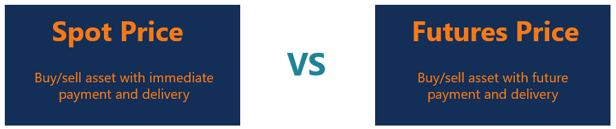

## Table of Contents

## What is a spot price?

A spot price is the current price at which a particular asset, like a commodity or currency, can be bought or sold right now. It's the price for immediate delivery and payment. For example, if you want to buy gold today, the spot price of gold is what you would pay per ounce at that moment.

Spot prices are important because they reflect the current market value of an asset. They can change quickly based on supply and demand. If more people want to buy gold, the spot price might go up. If fewer people want it, the price might go down. This makes spot prices a key piece of information for traders and investors who need to know the value of assets in real-time.

## What is a futures price?

A futures price is what someone agrees to pay for an asset at a future date. It's different from the spot price, which is what you pay right now. When people trade futures, they're making a deal to buy or sell something like oil, wheat, or stocks at a set price on a specific day in the future. This helps businesses and investors plan ahead because they know what they'll pay later, even if the spot price changes.

For example, a farmer might sell wheat futures to lock in a price for their crop before it's harvested. This way, they know how much money they'll get, no matter what happens to the spot price of wheat between now and the time they deliver it. On the other hand, a bakery might buy those futures to make sure they can buy wheat at a known price, protecting them from sudden price jumps. Futures prices are influenced by what people think the spot price will be in the future, plus things like interest rates and storage costs.

## How do spot prices and futures prices differ?

Spot prices and futures prices are two different ways to value an asset, like gold or oil. A spot price is what you pay for something right now. If you want to buy gold today, the spot price is what you'll pay per ounce at that moment. It changes all the time based on how many people want to buy or sell the asset right away.

A futures price, on the other hand, is what someone agrees to pay for an asset at a future date. It's like making a deal now to buy or sell something later. For example, if a farmer sells wheat futures, they're agreeing on a price today for wheat that will be delivered months from now. Futures prices can be different from spot prices because they include guesses about what the spot price will be in the future, plus other costs like interest and storage.

These two prices help people in different ways. Spot prices tell you what an asset is worth right now, which is useful for immediate buying and selling. Futures prices help businesses and investors plan for the future by locking in prices ahead of time, protecting them from sudden price changes.

## Can you provide an example of a spot price in a commodity market?

Imagine you want to buy silver today. The price you would pay right now is called the spot price of silver. If the spot price is $25 per ounce, that means you can buy one ounce of silver for $25 at that moment. This price changes all the time because it depends on how many people want to buy or sell silver right away.

For example, if a jewelry maker needs silver to make new pieces, they would look at the spot price to know how much they'll pay for the silver they need today. If the spot price of silver goes up to $26 per ounce later in the day, the jewelry maker would have to pay more if they wait to buy. That's why the spot price is important for anyone who needs to buy or sell a commodity right now.

## Can you provide an example of a futures price in a commodity market?

Imagine a farmer who grows corn. They want to know how much money they will get for their corn when it's ready to sell in the fall. So, in the spring, they agree to sell their corn at a futures price of $4 per bushel for delivery in October. This means no matter what happens to the price of corn between now and October, the farmer will get $4 per bushel for their corn. This helps them plan their finances because they know exactly what they'll earn.

On the other side, a cereal company might want to buy that corn to make their products. They're worried that the price of corn might go up by the time they need it in the fall. So, they agree to buy corn at the futures price of $4 per bushel. This way, even if the spot price of corn goes up to $5 per bushel in October, the cereal company will still pay only $4 per bushel. This helps them keep their costs steady and plan their budget better.

## What factors influence spot prices?

Spot prices are influenced by how many people want to buy or sell something right now. If more people want to buy a commodity like oil, the spot price goes up because there's more demand. On the other hand, if fewer people want to buy it, the spot price goes down because there's less demand. This is called supply and demand. If there's a lot of something and not many people want it, the price goes down. If there's not much of something and lots of people want it, the price goes up.

Other things can also affect spot prices. For example, big news events can change how people feel about buying or selling. If there's a big storm that might damage crops, people might rush to buy those crops before the storm hits, pushing up the spot price. Also, changes in the economy, like interest rates or inflation, can influence spot prices. If money becomes more expensive to borrow, it can affect how much people are willing to spend, which in turn affects spot prices.

## What factors influence futures prices?

Futures prices are influenced by what people think the spot price will be in the future. If lots of people think the price of oil will go up in six months, the futures price for oil in six months will be higher. This is because they're willing to pay more now to buy it later at what they think will be a good deal. Also, things like how much it costs to store the commodity until the future date can affect the futures price. If it's expensive to keep oil in storage, that cost gets added to the futures price.

Other things that can change futures prices are big news and changes in the economy. For example, if there's news about a new law that might affect how much wheat farmers can grow, the futures price for wheat might change because people will guess how that news will affect the future spot price. Also, if interest rates go up, it can make borrowing money more expensive, which can affect how much people are willing to pay for futures contracts. All these things together help decide what the futures price will be.

## How do traders use the difference between spot and futures prices?

Traders use the difference between spot and futures prices to make money. This difference is called the "basis." If the futures price is higher than the spot price, it's called "contango." Traders might buy the commodity now at the lower spot price and sell a futures contract at the higher price, hoping to make a profit when they deliver the commodity later. If the spot price is higher than the futures price, it's called "backwardation." In this case, traders might sell the commodity now at the higher spot price and buy a futures contract at the lower price, again hoping to make a profit when they buy back the commodity later.

Traders also use this difference to guess what might happen to prices in the future. If the futures price is much higher than the spot price, it might mean that people think the commodity will be more valuable later. This can help traders decide whether to buy or sell now or wait. By looking at how the basis changes over time, traders can get clues about what the market thinks will happen next, helping them make smarter trading decisions.

## What is the concept of contango in relation to futures prices?

Contango is when the futures price of a commodity is higher than its spot price. Imagine you want to buy oil. The price to buy oil right now is the spot price. But if you want to buy oil to be delivered in six months, you might have to pay more. That higher price you pay for future delivery is the futures price, and when it's higher than the spot price, it's called contango.

This happens because people expect the price of the commodity to go up in the future. They are willing to pay more now to get it later at what they think will be a good deal. Also, costs like storing the commodity until the future date can add to the futures price, making contango more likely. Traders watch contango because it can tell them what the market thinks will happen to prices in the future, helping them decide when to buy or sell.

## What is the concept of backwardation in relation to futures prices?

Backwardation is when the futures price of a commodity is lower than its spot price. Imagine you want to buy wheat. The price to buy wheat right now is the spot price. But if you want to buy wheat to be delivered in six months, you might pay less. That lower price you pay for future delivery is the futures price, and when it's lower than the spot price, it's called backwardation.

This happens because people expect the price of the commodity to go down in the future. They are willing to pay less now to get it later at what they think will be a good deal. Traders watch backwardation because it can tell them what the market thinks will happen to prices in the future, helping them decide when to buy or sell.

## How can understanding spot and futures prices help in risk management?

Understanding spot and futures prices helps with risk management by letting people know what things cost now and what they might cost later. If you know the spot price, you can decide if it's a good time to buy or sell something right away. For example, if you need oil for your business and the spot price is low, you might buy it now to save money. But if the spot price is high, you might wait and hope it goes down.

Futures prices are also important because they help you plan for the future. If you're worried that the price of wheat might go up in six months, you can buy a futures contract now to lock in a lower price. This way, even if the spot price goes up later, you know you'll pay the lower futures price. This can protect your business from big price changes and help you budget better. By using both spot and futures prices, you can make smarter decisions and manage risks more effectively.

## What advanced strategies involve using both spot and futures markets?

One advanced strategy that uses both spot and futures markets is called "cash and [carry](/wiki/carry-trading) [arbitrage](/wiki/arbitrage)." This happens when the futures price is higher than the spot price, which is known as contango. A trader might buy the commodity at the lower spot price and at the same time sell a futures contract for a higher price. They store the commodity until the futures contract comes due, then deliver it and make a profit from the difference between the spot and futures prices. This strategy helps traders take advantage of price differences and manage risks by locking in profits.

Another strategy is called "reverse cash and carry arbitrage," which works when the spot price is higher than the futures price, known as backwardation. In this case, a trader might sell the commodity at the higher spot price and buy a futures contract at the lower price. They then buy back the commodity at the lower futures price when the contract comes due, making a profit from the difference. Both strategies help traders make money from the differences between spot and futures prices and manage their risks better by planning their trades carefully.

## What is the understanding of Futures Prices?

Futures contracts are standardized agreements to buy or sell an asset at a predetermined future date and price. These contracts are traded on futures exchanges and cover various underlying assets, including commodities, indices, and currencies. The price of a futures contract, known as the futures price, is influenced by several complex interrelated factors.

**Determination of Futures Prices**

Futures prices are primarily determined by the forces of supply and demand, market sentiment, and traders' expectations regarding future price movements. Supply and demand dynamics play a critical role as they reflect the availability of the underlying asset and the market's appetite for risk. Market sentiment affects how traders perceive the value of the futures contract, which in turn influences their trading decisions. Expectations regarding economic conditions, interest rates, and other macroeconomic factors also heavily impact futures prices.

A mathematical representation commonly used to calculate futures prices, especially for commodities and financial instruments, is given by:

$$
F = S \times e^{(r + c)t}
$$

Where:
- $F$ is the futures price,
- $S$ is the spot price of the underlying asset,
- $r$ is the risk-free interest rate,
- $c$ is the cost of carry,
- $t$ is the time to maturity of the futures contract in years.

**Contango and Backwardation**

Futures markets can exhibit states known as contango and backwardation. Contango occurs when the futures price is above the expected future spot price. This situation often arises when the costs of carrying the underlying asset, such as storage and insurance, make holding the asset expensive. Conversely, backwardation is when the futures price is below the expected future spot price, which can happen when the asset is in short supply, leading to higher immediate demand.

**Roles of Hedgers and Speculators**

In futures markets, participants include hedgers and speculators. Hedgers use futures contracts to mitigate the risk of price fluctuations in the underlying asset, effectively locking in prices to avoid adverse movements. On the other hand, speculators attempt to profit from price changes by predicting market movements. Speculators add [liquidity](/wiki/liquidity-risk-premium) to the market and facilitate efficient price discovery, although their activities may also increase [volatility](/wiki/volatility-trading-strategies).

**Examples of Commonly Traded Futures**

The futures market encompasses a broad range of products. Commodities futures include contracts for agricultural products like wheat and corn, energy products such as oil and natural gas, and metals like gold and silver. Financial futures include stock indices such as the S&P 500, Treasury bonds, and various currency pairs. These futures contracts are integral to the global economy, providing essential tools for risk management and investment diversification.

In summary, understanding how futures prices are determined involves analyzing multiple market factors, recognizing the impact of contango and backwardation, acknowledging the contributions of hedgers and speculators, and exploring the variety of products available in the futures markets.

## References & Further Reading

[1]: Hull, J. C. (2012). ["Options, Futures, and Other Derivatives."](https://www.semanticscholar.org/paper/Options%2C-Futures%2C-and-Other-Derivatives-Hull/89bdee500c8623864fc9eb7a471546aa713acc44) Pearson.

[2]: Harris, L. (2003). ["Trading and Exchanges: Market Microstructure for Practitioners."](https://books.google.com/books/about/Trading_and_Exchanges.html?id=xNfnCwAAQBAJ) Oxford University Press.

[3]: Black, F., & Scholes, M. (1973). ["The Pricing of Options and Corporate Liabilities."](https://www.jstor.org/stable/1831029) Journal of Political Economy, 81(3), 637-654.

[4]: Lopez de Prado, M. (2018). ["Advances in Financial Machine Learning."](https://books.google.com/books/about/Advances_in_Financial_Machine_Learning.html?id=oU9KDwAAQBAJ) Wiley.

[5]: Chan, E. P. (2008). ["Quantitative Trading: How to Build Your Own Algorithmic Trading Business."](https://github.com/ftvision/quant_trading_echan_book) Wiley Trading.

[6]: Aronson, D. R. (2006). ["Evidence-Based Technical Analysis: Applying the Scientific Method and Statistical Inference to Trading Signals."](https://www.amazon.com/Evidence-Based-Technical-Analysis-Scientific-Statistical/dp/0470008741) Wiley.

[7]: Jansen, S. (2020). ["Machine Learning for Algorithmic Trading."](https://github.com/stefan-jansen/machine-learning-for-trading) Packt Publishing.

[8]: Wilmott, P. (2006). ["Paul Wilmott Introduces Quantitative Finance."](https://www.wiley.com/en-us/Paul+Wilmott+Introduces+Quantitative+Finance,+2nd+Edition-p-9781118836798) Wiley.