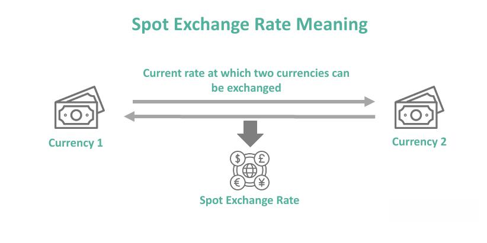

The foreign exchange market, or forex, is a globally decentralized market for trading currencies, notable for its high liquidity and substantial trading volumes. Operating continuously five days a week, it provides unmatched accessibility to traders around the world. This market is characterized by the rapid movement of currency prices, driven by an array of factors including economic indicators, geopolitical events, and market sentiment.

At the heart of the forex market lies the concept of the spot rate, which represents the current exchange rate at which one currency can be exchanged for another. This rate is crucial for traders as it determines the immediate cost of currency transactions and plays a significant role in formulating trading strategies. Understanding spot rates allows traders to make informed decisions, essential for capturing short-term trading opportunities.



In recent years, the integration of algorithmic trading in the forex market has revolutionized trading methodologies. Algorithms, based on pre-determined criteria, execute trades with speed and precision, minimizing human errors and allowing the adaptation of complex strategies. The synergy between algorithmic trading and spot rates is pivotal as it enables traders to leverage real-time data for maximum efficiency and accuracy in executing trades.

This article aims to provide comprehensive insights into the impact of spot rates and algorithmic trading on the forex market, exploring how these factors together enhance trading strategies and influence market dynamics. Understanding their relationship is vital for any trader seeking to optimize their approach in this fast-paced environment.

## Table of Contents

## Understanding the Spot Rate in Forex

The spot rate in forex represents the immediate price at which one currency can be exchanged for another. It is a crucial aspect of forex trading due to its real-time reflection of the current market situation. Spot rates are determined by the market's supply and demand dynamics. Traders constantly assess various factors that influence these rates, including economic indicators, interest rates, inflation data, and the fiscal policies of national governments. 

These rates are also highly sensitive to geopolitical events and market sentiment, which can cause rapid fluctuations. For instance, a political event affecting economic stability can lead to a swift adjustment in the spot rate as traders react to the anticipated impact on a currency's value.

The role of spot rates extends beyond mere price quoting in live [forex](/wiki/forex-system) trading. They are instrumental in establishing the benchmark for pricing currency futures and options. Futures and options are derivative instruments that enable traders to hedge against potential currency risks or speculate on future price movements. The spot rate serves as a foundational reference point for these contracts, allowing traders and investors to make well-informed decisions about their short-term financial strategies.

In summary, the spot rate is an essential element in forex trading, reflecting real-time currency valuations and serving as a vital tool for traders involved in setting future pricing in derivative markets. Understanding the nuances and influencers of spot rates aids traders in navigating the forex market more effectively.

## The Forex Market and The Significance of Spot Rates

The forex market, also known as the foreign exchange market, is recognized as the largest and most liquid financial marketplace globally, with a daily trading [volume](/wiki/volume-trading-strategy) exceeding $6 trillion. Operating 24 hours a day, five days a week, the forex market lacks a centralized exchange, enabling a continuous flow of currency trading activities worldwide. The decentralized nature of this market facilitates trading through a network of banks, financial institutions, and individual traders, who engage in buying and selling currencies based on their varying exchange rates.

Spot rates play a pivotal role in forex trading by providing the immediate exchange rate for currency pairs, reflecting the current market price for exchanging one currency for another. This real-time pricing mechanism allows traders to capitalize on short-term market movements and enables rapid decision-making. For instance, if a trader observes a favorable spot rate for a currency pair, they can execute a transaction almost instantaneously to benefit from the advantageous pricing.

The spot rate is not only a benchmark for on-the-spot currency transactions but also serves as a crucial reference point for pricing derivatives, such as futures and options. These financial instruments rely on spot rates to determine the underlying value of the contracts, which is essential for traders and investors who aim to make informed short-term and speculative decisions.

Moreover, the influence of spot rates extends to the strategic planning of currency traders, especially those involved in [algorithmic trading](/wiki/algorithmic-trading). By closely monitoring spot rates, traders can devise strategies that exploit minute price changes, thereby maximizing potential profits. For example, during a period of high [volatility](/wiki/volatility-trading-strategies), a small shift in the spot rate of a currency pair could present an opportunity for traders to achieve rapid gains.

In summary, the significance of spot rates in the forex market is underscored by their ability to provide up-to-the-minute pricing information, enabling traders to harness fleeting opportunities presented by the ever-changing dynamics of the global currency market.

## Algorithmic Trading: Revolutionizing the Forex Market

Algorithmic trading utilizes computer programs to automate trading strategies based on predefined criteria. This technological advancement has transformed the forex market by introducing a level of speed and precision that is unattainable for human traders. By automating trade executions, algorithmic trading minimizes human errors, which are often prevalent in manual trading, thereby enhancing the efficiency of the trading process.

The automation facilitated by algorithmic trading allows for complex strategies to be executed seamlessly within the forex market. These strategies can range from simple order management to sophisticated models involving statistical [arbitrage](/wiki/arbitrage) or [machine learning](/wiki/machine-learning). The inherent capacity for such programs to analyze vast datasets quickly and execute trades based on specific algorithms enables traders to respond to market changes in real time. This immediate responsiveness is crucial in the forex market, where currency prices can fluctuate rapidly.

Moreover, as algorithms become more sophisticated, forex traders increasingly rely on data-driven strategies to optimize their trading decisions. These strategies take advantage of historical and real-time market data to identify patterns, trends, and potential opportunities. For instance, machine learning algorithms can be designed to learn from past trading data, continually adapting and refining trading strategies to improve performance over time. This adaptability provides a significant competitive edge in the fast-paced forex environment.

A basic example of an algorithmic trading strategy in Python might involve using historical price data to identify trends:

```python
import pandas as pd
import numpy as np

# Sample data import
data = pd.read_csv('forex_data.csv')
prices = data['Close']

# Simple moving average strategy
window_size = 20
moving_avg = prices.rolling(window=window_size).mean()

def generate_signals(prices, moving_avg):
    signals = np.zeros(len(prices))
    signals[window_size:] = np.where(prices[window_size:] > moving_avg[window_size:], 1.0, 0.0) # Buy signal
    return signals

signals = generate_signals(prices, moving_avg)
```

This example illustrates a simple moving average crossover strategy where buy signals are generated when the current price surpasses the moving average. In real-world applications, these algorithms would be more sophisticated, incorporating multiple indicators and potentially evolving as new data becomes available.

In summary, algorithmic trading revolutionizes the forex market by leveraging advanced algorithms to enhance trading precision and efficiency. By continuously integrating new data, traders can refine their strategies to align with the latest market conditions, thereby maximizing their potential returns.

## Spot Rate and Algorithmic Trading: A Synergy

Algorithmic trading systems incorporate spot rates to enable high-frequency trading, executing orders with speed and accuracy in response to market fluctuations. These advanced systems capitalize on slight and transient price shifts, allowing traders to exploit arbitrage opportunities. Arbitrage, in this context, refers to the simultaneous buying and selling of a currency pair across different platforms or markets to profit from minor price differences. 

Algorithmic trading excels in identifying such discrepancies quickly, executing trades before manual trading could feasibly react. This precision involves constantly monitoring real-time data, where the spot rate serves as a pivotal element for decision-making. The rapid execution enabled by algorithmic systems ensures that traders gain a competitive advantage over those relying on traditional methods.

Considerable computational resources are utilized to devise algorithms that can detect price discrepancies across various trading venues for spot currency pairs. The spot rate's immediacy is crucial, as even minute delays can lead to potential profit erosion due to market changes. Algorithmic systems guarantee precise order execution, often managing multiple trades simultaneously to optimize outcomes.

For example, an algorithm might be programmed to monitor the EUR/USD pair across multiple exchanges. When the system detects a variation in the spot rate between platforms, it executes buy and sell orders almost instantaneously to harness the price differential. Here's a simplified Python example illustrating a basic concept of such a strategy:

```python
import time

def check_price_discrepancy(exchange1_rate, exchange2_rate):
    threshold = 0.0001  # Arbitrage threshold
    if abs(exchange1_rate - exchange2_rate) > threshold:
        return True
    return False

def execute_trade(buy_exchange, sell_exchange, amount):
    # Placeholder for trading logic
    print(f"Buying on {buy_exchange}, Selling on {sell_exchange}, Amount: {amount}")

while True:
    # Dummy data for spot rates from two exchanges
    rate_exchange1 = 1.1235
    rate_exchange2 = 1.1238

    if check_price_discrepancy(rate_exchange1, rate_exchange2):
        execute_trade("Exchange1", "Exchange2", 10000)

    # Sleep to simulate time delay
    time.sleep(1)
```

This script illustrates a rudimentary operation where an algorithm checks for discrepancies between two exchange rates and executes trades based on predefined conditions. Such automated systems significantly enhance trading efficacy by executing complex strategies without human intervention, making instantaneous decisions grounded on data-driven insights.

Utilizing spot rates in algorithmic trading not only improves execution speed but also aligns with market conditions, ensuring that traders can effectively operate in the volatile forex landscape. The seamless integration of algorithms and spot rates offers a substantial edge, enabling a proactive approach to detecting and acting upon trading opportunities.

## A Financial Example of Spot Rate Algorithmic Trading

In the forex market, algorithmic trading has increasingly become a tool of choice for traders looking to exploit minor price movements in currency pairs like EUR/USD. Consider a scenario where an advanced algorithm is tasked with executing trades based on the real-time spot rate of EUR/USD. This algorithm, often called a "trading bot," continuously monitors market data streams for discrepancies in the spot rate that emerge due to inefficiencies in the forex market.

When these discrepancies are detected, typically in the order of milliseconds, the algorithm initiates rapid buy or sell orders, depending on the direction of the inefficiency. Suppose the algorithm, which employs a simple moving average (SMA) strategy, identifies an opportunity because a short-term SMA of the spot rate crosses below a long-term SMA. In this case, it may trigger a sell order to capitalize on an anticipated downward movement.

The example of an algorithm exploiting such small deviations highlights its core advantage: the ability to process and react to market data far quicker than a human could. The automation of these trades allows for thousands of transactions to be managed simultaneously, leading to efficient trading at a scale unimaginable with manual trading.

Moreover, this high-frequency trading method relies heavily on statistical models and machine learning algorithms that predict and adapt to ever-changing market conditions. The implementation of such an algorithm could be illustrated in Python, leveraging libraries like NumPy for numerical calculations and pandas for data handling.

```python
import pandas as pd
import numpy as np

# Example data representing spot rate fluctuations
data = {'timestamp': pd.date_range(start='1/1/2021', periods=100, freq='T'),
        'spot_rate': np.random.random(100) + 1.1}  # simple random data for illustration
df = pd.DataFrame(data)

# Calculating short-term and long-term simple moving averages
df['SMA_short'] = df['spot_rate'].rolling(window=5).mean()
df['SMA_long'] = df['spot_rate'].rolling(window=20).mean()

# Identifying discrepancies for trading
df['signal'] = 0
df.loc[df['SMA_short'] > df['SMA_long'], 'signal'] = 1  # buy signal
df.loc[df['SMA_short'] < df['SMA_long'], 'signal'] = -1  # sell signal

# Performing trades based on signals
def trade(row):
    if row['signal'] == 1:
        # execute buy order
        return "Buy"
    elif row['signal'] == -1:
        # execute sell order
        return "Sell"
    return "Hold"

df['trade_action'] = df.apply(trade, axis=1)

print(df[['timestamp', 'spot_rate', 'SMA_short', 'SMA_long', 'trade_action']])
```

This Python snippet demonstrates a simplified version of how a trading algorithm might execute buy and sell orders based on moving average crossovers. Through such methods, traders can efficiently exploit fleeting market opportunities, thereby optimizing trading operations. However, algorithmic trading does encompass challenges like technology and latency issues, which must be carefully managed to maintain an edge in this competitive market.

## Risks and Challenges in Spot Rate Algorithmic Trading

Algorithmic trading in the forex market, while advantageous, presents several complexities and challenges that traders must navigate. One significant risk stems from technology failures. Given the reliance on sophisticated software and hardware to execute trades, any malfunction can result in substantial financial losses. System crashes, connectivity issues, or incorrect data feeds can hinder the execution of trading strategies, potentially leading to missed opportunities or unintended trades.

Liquidity shortages represent another risk in algorithmic trading. The forex market operates continuously, but [liquidity](/wiki/liquidity-risk-premium) can vary significantly across different periods and currency pairs. During times of low liquidity, such as geopolitical events or economic announcements, large orders might face slippage, affecting the predictability and profitability of trades. Algorithms designed to execute high-frequency trades must account for these fluctuations to maintain their effectiveness.

Continuous monitoring and frequent updates of algorithms are essential due to the dynamic nature of financial markets. Algorithms based on historical data may perform inadequately in changing market conditions. Traders need to ensure their algorithms are adaptive, using techniques like machine learning to improve decision-making processes. Despite rigorous [backtesting](/wiki/backtesting), the adage "past performance is not indicative of future results" underscores the uncertainty inherent in algorithmic trading.

Regulatory challenges also pose a significant hurdle. Markets worldwide are under increasing scrutiny to ensure fair trading practices and prevent market manipulation. Consequently, algorithmic traders must comply with regulations specific to the jurisdictions in which they operate. Adhering to guidelines on transparency, risk management, and reporting is critical for maintaining operational integrity.

Finally, ethical considerations play a crucial role in algorithmic trading. The use of advanced algorithms has sparked debates around market fairness and the potential for exacerbating market volatility. Traders must design algorithms that operate within ethical boundaries, avoiding strategies that could disrupt market stability or disadvantage other market participants.

In summary, while algorithmic trading leverages technology to enhance trading efficiency and precision in the forex market, it is fraught with risks that demand robust management strategies. Addressing technology reliability, liquidity management, regulatory compliance, and ethical trading practices are pivotal for traders aiming to responsibly and successfully utilize algorithmic trading systems.

## Conclusion

Understanding the complex dynamics between spot rates, forex markets, and algorithmic trading is of paramount importance for traders aiming to refine their strategies within the forex sector. The spot rate serves as a real-time measurement of currency value, crucial for executing trades effectively. Algorithmic trading, which harnesses this real-time data, allows traders to capitalize on small market inefficiencies swiftly and accurately, thereby increasing the precision and reliability of trading outcomes.

However, the successful application of algorithmic trading in the forex market is contingent upon managing inherent risks. These risks include potential technology failures, liquidity shortages, and market volatility, all of which can impact the effectiveness of algorithmically-driven strategies. Moreover, regulatory challenges must be carefully navigated to maintain ethical and transparent trading practices.

To thrive in the ever-evolving forex environment, continuous learning and adaptation are essential. This involves staying updated with technological advancements, economic indicators, and geopolitical events that influence currency values. By doing so, traders can ensure that their strategies remain robust and responsive to the latest market conditions. This proactive approach promotes resilience and profitability in the dynamic landscape of forex trading.

## References & Further Reading

[1]: ["Algorithmic Trading and DMA: An Introduction to Direct Access Trading Strategies"](https://www.semanticscholar.org/paper/Algorithmic-trading-%26-DMA-%3A-an-introduction-to-Johnson/aa5de1ab883d5e23b6651faa7c1807586d688e4b) by Barry Johnson

[2]: Harris, L. (2003). ["Trading and Exchanges: Market Microstructure for Practitioners"](https://academic.oup.com/book/52292). Oxford University Press.

[3]: Katz, J. O., & McCormick, D. L. (2000). ["The Encyclopedia of Trading Strategies"](https://www.amazon.com/Encyclopedia-Trading-Strategies-Jeffrey-Ph-D/dp/0070580995). McGraw-Hill.

[4]: ["Forex Trading: The Basics Explained in Simple Terms"](https://zoboko.com/book/24v935me/forex-trading-the-basics-explained-in-simple-terms) by Jim Brown

[5]: T. Hendershott, C. M. Jones, & A. J. Menkveld. (2011). ["Does Algorithmic Trading Improve Liquidity?"](https://onlinelibrary.wiley.com/doi/full/10.1111/j.1540-6261.2010.01624.x) Review of Financial Studies.

[6]: Tsay, R. S. (2005). ["Analysis of Financial Time Series"](https://cpb-us-w2.wpmucdn.com/blog.nus.edu.sg/dist/0/6796/files/2017/03/analysis-of-financial-time-series-copy-2ffgm3v.pdf). Wiley-Interscience.

[7]: Aldridge, I. (2010). ["High-Frequency Trading: A Practical Guide to Algorithmic Strategies and Trading Systems"](https://www.ahmetbeyefendi.com/wp-content/uploads/2020/07/High-Frequency-Trading-Irene-Aldridge.pdf). Wiley.

[8]: ["Algorithmic and High-Frequency Trading"](https://assets.cambridge.org/97811070/91146/frontmatter/9781107091146_frontmatter.pdf) by Álvaro Cartea, Sebastián Jaimungal, and José Penalva