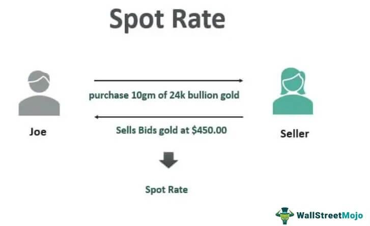

## Table of Contents

## What is a spot rate?

A spot rate is the current price at which a currency can be bought or sold for immediate delivery. It's the exchange rate you see when you check how much one currency is worth in terms of another currency right now. For example, if you want to exchange US dollars for Euros, the spot rate tells you how many Euros you get for each dollar at that moment.

Spot rates are important for businesses and travelers who need to convert money quickly. They are used in the foreign exchange market, where currencies are traded around the clock. Unlike forward rates, which are set for future transactions, spot rates apply to transactions that happen right away. This makes them useful for immediate needs, but they can change frequently due to various economic factors.

## How is the spot rate determined?

The spot rate is determined by the forces of supply and demand in the foreign exchange market. When more people want to buy a certain currency, its value goes up, and when more people want to sell it, its value goes down. This constant push and pull between buyers and sellers sets the spot rate at any given time. Many things can affect this, like interest rates, inflation rates, political stability, and economic performance of countries. If a country's economy is doing well, more people might want to invest there, increasing the demand for that country's currency.

In addition to supply and demand, the spot rate can also be influenced by the actions of central banks and governments. Central banks can buy or sell their own currency to try to keep its value stable or to reach other economic goals. For example, if a central bank thinks its currency is too weak, it might sell some of its foreign currency reserves to buy its own currency, which can help raise its value. Governments can also affect the spot rate through policies that make their country more or less attractive to investors. All these factors together help decide the spot rate that you see when you want to exchange money right away.

## Why is the spot rate important in financial markets?

The spot rate is very important in financial markets because it helps people and businesses know the current value of different currencies. When someone needs to exchange money right away, they use the spot rate. This rate tells them how much of one currency they can get for another currency at that moment. For example, if a business in the United States wants to buy goods from Europe, they need to know the spot rate to figure out how many Euros they will get for their dollars.

Spot rates also help investors make decisions. If an investor thinks a currency's value will go up, they might buy it at the current spot rate and hope to sell it later for a profit. On the other hand, if they think a currency's value will go down, they might sell it at the current spot rate to avoid losing money. Because spot rates can change quickly due to many factors like interest rates and economic news, they are closely watched by people in the financial markets.

## Can you explain the difference between spot rate and forward rate?

The spot rate is the price you pay to exchange one currency for another right now. It's what you see when you check how much one currency is worth in terms of another currency at this very moment. For example, if you want to change your dollars into Euros today, the spot rate tells you how many Euros you get for each dollar. It's used for immediate transactions and can change quickly because of things like economic news or interest rates.

The forward rate, on the other hand, is the price set today for exchanging currencies at a future date. It's like making a deal now to trade money later. For example, if you know you'll need Euros in six months, you can agree on a forward rate now, so you know exactly how many Euros you'll get for your dollars in the future. This can be useful for businesses that need to plan their expenses or for investors who want to protect against future changes in currency values. Forward rates help people manage the risk of currency fluctuations over time.

## How do spot rates affect currency exchange?

Spot rates are the prices you see when you want to change one currency into another right now. They are important because they tell you how much of one currency you can get for another at that moment. For example, if you want to change your dollars into Euros, the spot rate tells you how many Euros you will get for each dollar. This rate changes all the time because of things like how well a country's economy is doing, interest rates, and even news about politics. When more people want to buy a currency, its spot rate goes up, and when more people want to sell it, the spot rate goes down.

When you go to a bank or use an online service to exchange money, they use the spot rate to figure out how much you get. If the spot rate is high, you get more of the other currency for your money. If it's low, you get less. This can make a big difference, especially if you are exchanging a lot of money. Businesses that buy and sell things in different countries need to watch spot rates closely because they can affect how much they pay for goods or how much they earn from sales. Travelers also need to pay attention to spot rates because they can change how much their trip costs.

## What are some common factors that influence spot rates?

Spot rates are affected by many things. One big thing is how much people want to buy or sell a currency. If more people want to buy a currency, its spot rate goes up. If more people want to sell it, the spot rate goes down. This is all about supply and demand. Another thing that can change spot rates is interest rates. If a country's interest rates go up, more people might want to invest there, which can make the currency's spot rate go up. On the other hand, if interest rates go down, the spot rate might go down too.

Economic news and how well a country's economy is doing also play a big role. If a country's economy is doing well, more people might want to invest there, which can push the spot rate up. But if the economy is not doing well, the spot rate might go down. Political stability is another [factor](/wiki/factor-investing). If a country is stable and safe, more people might want to invest there, which can help the spot rate. But if there is a lot of political trouble, the spot rate might go down because people might not want to invest there. All these things together help decide the spot rate you see when you want to exchange money right away.

## How can an individual or business use spot rates to their advantage?

Individuals and businesses can use spot rates to their advantage by keeping an eye on them and making smart decisions about when to exchange money. For example, if someone knows they need to pay for something in another country soon, they can watch the spot rate. If the rate is good, meaning they get more of the other currency for their money, they can exchange their money at that time. This way, they can save money or get more value out of their exchange. Businesses that buy and sell things in different countries can also do this. They can plan their purchases or sales around times when the spot rate is in their favor, which can help them make more money or spend less.

Another way to use spot rates to their advantage is by understanding how they change and why. If an individual or business knows that certain events, like changes in interest rates or big economic news, can affect spot rates, they can predict when rates might go up or down. For example, if a country's central bank is about to raise interest rates, the spot rate for that country's currency might go up. By exchanging money just before this happens, they can get a better rate. This kind of planning can help them save money or make more money from their currency exchanges.

## What role do central banks play in influencing spot rates?

Central banks play a big role in influencing spot rates. They do this by buying or selling their own currency. If a central bank thinks its currency is too weak, it might sell some of its foreign currency reserves to buy its own currency. This can help raise the value of their currency because more people want to buy it. On the other hand, if the central bank thinks its currency is too strong, it might sell its own currency and buy foreign currency. This can help lower the value of their currency because more people want to sell it.

Central banks also influence spot rates through their [interest rate](/wiki/interest-rate-trading-strategies) policies. If a central bank raises interest rates, it can make the country's currency more attractive to investors. More people might want to invest in that country to get the higher interest, which can push the spot rate up. If the central bank lowers interest rates, the opposite can happen. The currency might become less attractive, and the spot rate might go down. By using these tools, central banks can help keep their currency's value stable or reach other economic goals.

## How do geopolitical events impact spot rates?

Geopolitical events can have a big effect on spot rates. These events can make people feel more or less safe about investing in a country. If there is a war, a political crisis, or some other big problem, people might not want to invest in that country. They might sell the country's currency, which can make its spot rate go down. On the other hand, if a country is doing well and seems safe, more people might want to invest there. This can make the demand for the country's currency go up, which can push the spot rate higher.

Sometimes, geopolitical events can also change how people think about the future. For example, if there is a big election coming up, people might wait to see what happens before they decide to buy or sell a currency. If they think the new government will be good for the economy, they might buy the currency, which can raise the spot rate. But if they think the new government will cause problems, they might sell the currency, which can lower the spot rate. All these things show how important it is to keep an eye on what's happening around the world when you're thinking about exchanging money.

## What are the risks associated with trading at spot rates?

Trading at spot rates comes with some risks. One big risk is that spot rates can change very quickly. If you exchange money at the spot rate and it changes right after, you might end up losing money. For example, if you buy Euros with dollars and the spot rate for Euros goes down right after, you would have been better off waiting. This can be a problem for businesses that need to buy or sell things in different countries because they can lose money if the spot rate changes against them.

Another risk is not knowing enough about what can affect spot rates. Things like interest rates, economic news, and even big events like wars or elections can change spot rates a lot. If you don't keep an eye on these things, you might exchange money at a bad time. For example, if you don't know that a country's central bank is about to raise interest rates, you might miss out on getting a better spot rate for that country's currency. It's important to stay informed and understand what can move spot rates to make smarter decisions.

## How do spot rates interact with interest rate parity?

Interest rate parity is a theory that says the difference in interest rates between two countries should be equal to the difference in their spot and forward exchange rates. This means that if you know the interest rates in two countries, you can figure out what the spot rate should be compared to the forward rate. For example, if the interest rate in the United States is higher than in Europe, the spot rate for the dollar against the Euro should be lower than the forward rate. This helps keep things balanced so that people can't make easy money just by moving money between countries.

Spot rates and interest rate parity work together to make sure that the foreign exchange market stays in balance. If the spot rate doesn't match what interest rate parity says it should be, people might start buying or selling currencies to take advantage of the difference. This buying and selling can push the spot rate back to where it should be according to interest rate parity. So, even though spot rates can change a lot because of things like economic news or political events, interest rate parity helps guide them over time.

## What advanced strategies can be employed to hedge against spot rate volatility?

One advanced strategy to hedge against spot rate [volatility](/wiki/volatility-trading-strategies) is to use forward contracts. A forward contract lets you agree on a spot rate today for exchanging money in the future. This can help you avoid the risk of the spot rate changing in a way that hurts you. For example, if you know you will need to buy Euros in six months, you can use a forward contract to lock in today's spot rate. This way, even if the spot rate for Euros goes up in the future, you still get the rate you agreed on, which can save you money.

Another strategy is to use currency options. A currency option gives you the right, but not the obligation, to exchange money at a certain spot rate in the future. This can be useful if you're not sure whether the spot rate will go up or down. If the spot rate moves in your favor, you don't have to use the option, and you can exchange money at the better spot rate. But if the spot rate moves against you, you can use the option to exchange money at the rate you agreed on, which can protect you from losing money. Both forward contracts and currency options can help you manage the risk of spot rate volatility and make your financial plans more stable.

## References & Further Reading

[1]: ["Algorithmic Trading and DMA: An Introduction to Direct Access Trading Strategies"](https://www.semanticscholar.org/paper/Algorithmic-trading-%26-DMA-%3A-an-introduction-to-Johnson/aa5de1ab883d5e23b6651faa7c1807586d688e4b) by Barry Johnson

[2]: Harris, L. (2003). ["Trading and Exchanges: Market Microstructure for Practitioners"](https://academic.oup.com/book/52292). Oxford University Press.

[3]: Katz, J. O., & McCormick, D. L. (2000). ["The Encyclopedia of Trading Strategies"](https://www.amazon.com/Encyclopedia-Trading-Strategies-Jeffrey-Ph-D/dp/0070580995). McGraw-Hill.

[4]: ["Forex Trading: The Basics Explained in Simple Terms"](https://zoboko.com/book/24v935me/forex-trading-the-basics-explained-in-simple-terms) by Jim Brown

[5]: T. Hendershott, C. M. Jones, & A. J. Menkveld. (2011). ["Does Algorithmic Trading Improve Liquidity?"](https://onlinelibrary.wiley.com/doi/full/10.1111/j.1540-6261.2010.01624.x) Review of Financial Studies.

[6]: Tsay, R. S. (2005). ["Analysis of Financial Time Series"](https://cpb-us-w2.wpmucdn.com/blog.nus.edu.sg/dist/0/6796/files/2017/03/analysis-of-financial-time-series-copy-2ffgm3v.pdf). Wiley-Interscience.

[7]: Aldridge, I. (2010). ["High-Frequency Trading: A Practical Guide to Algorithmic Strategies and Trading Systems"](https://www.ahmetbeyefendi.com/wp-content/uploads/2020/07/High-Frequency-Trading-Irene-Aldridge.pdf). Wiley.

[8]: ["Algorithmic and High-Frequency Trading"](https://assets.cambridge.org/97811070/91146/frontmatter/9781107091146_frontmatter.pdf) by Álvaro Cartea, Sebastián Jaimungal, and José Penalva