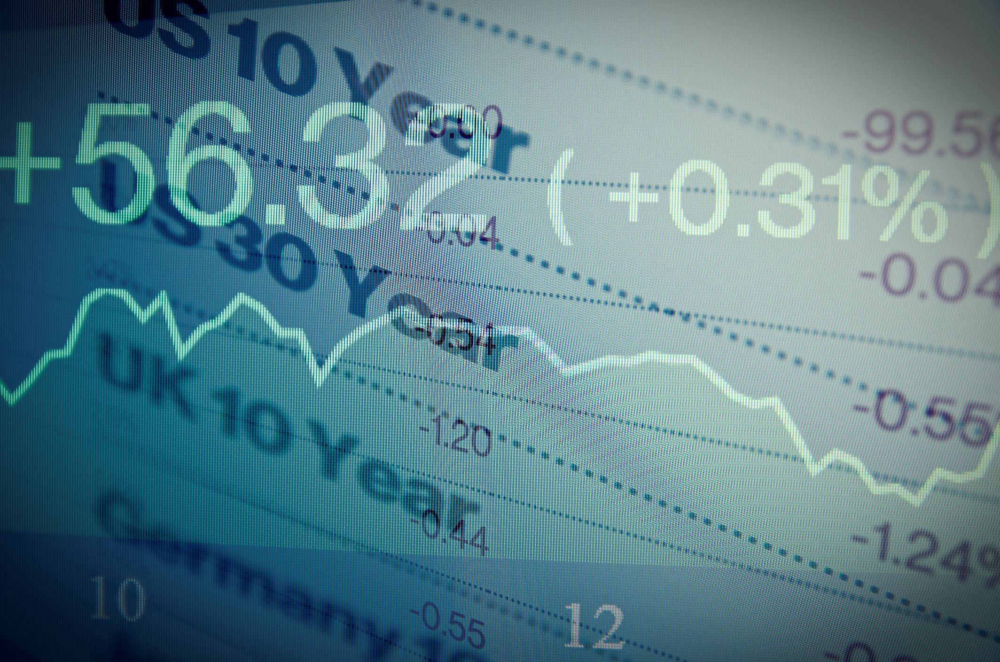

The intersection of financial analysis and algorithmic trading has emerged as a transformative force in the financial sector, significantly altering how investors leverage market indicators. At the core of this transformation lies the comprehension of the treasury curve and spot rates, both of which are instrumental in crafting robust and efficient trading algorithms. The treasury curve, which graphically represents the yields on U.S. Treasury securities across various maturities, serves as a vital barometer of economic sentiment, influencing interest rate forecasts and investment strategies.

Spot rates, defined as the interest rates applicable for immediate settlement of financial instruments, follow this yield curve closely and are integral to pricing fixed-income securities. These rates offer deep insights into current market conditions and investor expectations, thereby serving as fundamental components for the valuation models used in algorithmic trading. By analyzing the shape and shifts of the yield curve, traders can gauge potential economic scenarios and interest rate trends, providing a strategic advantage in adapting to dynamic market conditions.



This article seeks to explore the role of treasury curve and spot rate analysis in algorithmic trading. It aims to provide insights into how contemporary traders utilize these financial tools to optimize their strategies by integrating macroeconomic indicators and leveraging technological advancements. In doing so, the article will highlight the synergy between traditional financial analysis and cutting-edge trading technology that defines modern investment strategies.

## Table of Contents

## Understanding the Treasury Curve and Spot Rates

The treasury curve, commonly referred to as the yield curve, is a graphical representation of the interest rates on U.S. Treasury securities at different maturities. It serves as a fundamental tool in financial analysis, reflecting market expectations about future interest rates and economic activity. The curve typically plots yields on the vertical axis and maturities, ranging from three months to 30 years, on the horizontal axis.

Spot rates, which are key components of the yield curve, are the interest rates used for instantaneous settlement of financial transactions. Each point on the yield curve corresponds to a spot rate, indicating the yield an investor anticipates receiving if they hold a zero-coupon bond until maturity. Spot rates are crucial for understanding the term structure of interest rates, which is essential for valuing various fixed-income securities and financial derivatives.

The shape and behavior of the yield curve offer valuable insights into economic conditions. Typically, the curve assumes three primary configurations: normal (upward sloping), inverted (downward sloping), and flat. A normal yield curve suggests that longer-maturity securities have higher yields compared to shorter-maturity securities, reflecting expectations of economic growth and potential inflation. An inverted yield curve, where short-term yields exceed long-term yields, is often seen as a precursor to economic recession, as it suggests that investors expect future interest rates to decline due to economic slowdown. A flat yield curve, where short and long-term yields are similar, may indicate transitional phases in the economy or uncertainty about future economic conditions.

Changes in the yield curve can also signal shifts in monetary policy and investor sentiment. For instance, a steepening yield curve might suggest rising inflation expectations or increased economic growth prospects, potentially prompting central banks to raise interest rates. Conversely, a flattening curve could imply lower growth expectations and a decrease in inflationary pressures.

The analysis of the treasury curve and spot rates requires an understanding of various economic indicators and models. Financial analysts frequently use models like the Nelson-Siegel or Svensson model to estimate and interpret the term structure of interest rates, providing a more nuanced understanding of the yield curve dynamics. These models help to extract risk-free spot rates from observable data, enabling precise bond valuation and risk management.

Understanding the yield curve's intricacies allows traders to forecast [interest rate](/wiki/interest-rate-trading-strategies) movements and adjust investment strategies accordingly. By analyzing the yield curve's expressions of market perceptions, traders and investors can make informed decisions that align with economic forecasts and monetary policy expectations.

## The Role of Spot Rates in Financial Analysis

Spot rates play a crucial role in the valuation of bonds and other fixed-income securities, especially in markets where [algorithmic trading](/wiki/algorithmic-trading) prevails. These rates represent the interest rates for zero-coupon bonds, which are essential in determining the present value of future cash flows. Understanding and utilizing spot rates enable financial analysts to assess market expectations accurately and discount future cash flows effectively.

The calculation of spot rates is instrumental for yield curve construction. The yield curve reflects how interest rates of bonds with different maturities compare over time, and its analysis can provide insights into economic conditions and future interest rate movements. Analysts use spot rates derived from the yield curve to price bonds more accurately than using the nominal yield alone, which assists in making more informed investment decisions.

One of the crucial methods employed in deriving spot rates is bootstrapping. Bootstrapping is a technique used to extract a zero-coupon yield curve from the prices of various coupon-bearing instruments, usually government bonds. The process involves iteratively solving for the spot rate by using the prices of bonds at different maturities and their respective yields. This iterative method allows analysts to build a complete spot rate curve, enabling the precise pricing of bonds with different cash flow structures.

The bootstrapping process can be mathematically represented as follows. Suppose we have a bond with $n$ cash flows, $C_1, C_2, \ldots, C_n$, occurring at times $t_1, t_2, \ldots, t_n$. The price $P$ of the bond can be equated to the present value of its cash flows:

$$
P = \frac{C_1}{(1 + r_1)^{t_1}} + \frac{C_2}{(1 + r_2)^{t_2}} + \cdots + \frac{C_n}{(1 + r_n)^{t_n}}
$$

Where $r_i$ represents the spot rate for each cash flow at time $t_i$. Solving these equations sequentially for each bond, analysts derive the spot rate curve.

In practical applications, coding tools like Python can automate the bootstrapping process. The following Python code snippet illustrates a basic approach to derive a spot rate curve from bond prices:

```python
import numpy as np

# Sample bond data: [(time to maturity, cash flow, bond price)]
bonds = [(1, 105, 100), (2, 110, 100), (3, 115, 100)]

# Bootstrapping to derive spot rates
spot_rates = []
for (t, cf, price) in bonds:
    if t == 1:
        r = (cf / price) - 1
    else:
        sum_pvs = sum([cf / (1 + rate)**time for time, rate in enumerate(spot_rates, start=1)])
        r = (cf / (price - sum_pvs))**(1/t) - 1
    spot_rates.append(r)

# Output the spot rates
for t, rate in enumerate(spot_rates, start=1):
    print(f"Year {t}: Spot Rate = {rate:.4%}")
```

Overall, spot rates are indispensable to financial analysts who employ them to evaluate bonds and predict market conditions effectively. Their importance is particularly pronounced in the context of algorithmic trading, where precision in pricing and an understanding of market trends can significantly enhance the accuracy and profitability of trading strategies. Bootstrapping remains a critical technique for deriving these rates, further underlining the role of mathematical and computational methods in financial analysis.

## Algorithmic Trading: Technology and Strategy

Algorithmic trading involves the use of computer algorithms to execute trades with precision and speed according to predefined criteria. This approach leverages computational power and data analysis to identify and act on trading opportunities that manual trading would typically miss. The technology behind algorithmic trading allows for rapid execution, reduced transaction costs, and the capacity to manage large volumes of trades in real time.

### Key Strategies

#### Statistical Arbitrage
Statistical [arbitrage](/wiki/arbitrage) is a key strategy in algorithmic trading that capitalizes on mean reversion and price movement patterns. This strategy involves identifying price discrepancies between related financial instruments that may be temporary. By using statistical and quantitative models, algorithms predict the probability of these price discrepancies converging in the future, allowing traders to profit from the anticipated price movements.

For example, a simple [pair trading](/wiki/pair-trading) strategy might analyze the correlation between two stocks historically and execute trades when these stocks diverge from their typical correlation level. Using Python, traders can implement this strategy using libraries like NumPy and pandas to perform statistical calculations and manage data:

```python
import numpy as np
import pandas as pd

# Sample data
stock_a_prices = pd.Series([100, 102, 104, 103, 105])
stock_b_prices = pd.Series([98, 97, 99, 100, 96])

# Calculate the spread
spread = stock_a_prices - stock_b_prices

# Determine entry and exit points
entry_threshold = 1.5
exit_threshold = 0.5

# Signal generation based on spread
signal = np.where(spread > entry_threshold, -1, np.where(spread < -entry_threshold, 1, 0))

# Example output:
print("Trading signals:", signal)
```

#### Market Making
Market making is another critical strategy where algorithms are employed to provide [liquidity](/wiki/liquidity-risk-premium) to markets by continuously quoting buy and sell prices for financial instruments. Algorithms in this strategy earn a profit from the bid-ask spread by executing buy orders at lower prices and sell orders at higher prices. The automation ensures quick turnaround and reduces the risk of holding large positions.

Technological advances lay the groundwork for efficient [market making](/wiki/market-making), as high-frequency trading systems are used to submit and cancel large numbers of orders in milliseconds. The market maker benefits from the small price differences while facilitating other traders in executing their transactions.

### Technological Framework

The technological framework of algorithmic trading systems is built around a robust infrastructure that consists of hardware and software capable of processing vast amounts of financial data. Real-time data feeds, low-latency execution platforms, and sophisticated modeling tools form the backbone of algorithm trading operations.

The impact of algorithmic trading on financial markets is substantial. It enhances market efficiency by providing liquidity and narrowing bid-ask spreads. However, it can also contribute to market [volatility](/wiki/volatility-trading-strategies) and has been scrutinized for its role in events like the "flash crash" of May 2010, when markets experienced a rapid sell-off and recovery. Thus, understanding the operation and regulation of these systems is vital for ensuring stable and efficient financial market conditions. 

In conclusion, algorithmic trading and its various strategies, such as [statistical arbitrage](/wiki/statistical-arbitrage) and market making, underscore a transformative element in contemporary finance, pushing towards faster, more data-driven trading environments that align with the evolving landscape of global markets.

## Integrating Yield Curves into Algo Trading Systems

Algorithmic trading systems benefit greatly from integrating yield curve data, as yield curves are crucial indicators of economic conditions and interest rate environments. By incorporating this data, these systems can more accurately identify trading opportunities and forecast market conditions. Yield curve movements often precede economic shifts, providing valuable foresight to traders focused on interest rate-sensitive assets. 

At the core of utilizing yield curves in algorithmic trading is the analytical model, which processes changes in yield curves to adjust trading positions and manage risks. A common approach is to evaluate the differences in yields between short-term and long-term Treasury securities. A steepening or flattening yield curve might be interpreted as a signal to rebalance portfolios or enter into trades that capitalize on anticipated interest rate changes. These models often rely on statistical methods and [machine learning](/wiki/machine-learning) algorithms to analyze vast amounts of historical yield data, seeking patterns that may predict future movements.

For practical integration, traders employ programming languages like Python to analyze and visualize yield curve data. Python libraries such as NumPy, pandas, and matplotlib are invaluable tools for data manipulation and charting. Furthermore, the Python ecosystem offers specialized packages for accessing and processing financial data, including yield curves.

Here's a simplified example of how Python can be used to integrate yield curve data into an algorithmic trading model:

```python
import numpy as np
import pandas as pd
import matplotlib.pyplot as plt
from scipy.interpolate import interp1d

# Sample yield curve data for various maturities
maturities = np.array([1, 2, 5, 10, 20, 30])
yields = np.array([0.5, 0.6, 1.0, 1.5, 2.0, 2.5])

# Interpolating the yield curve to get continuous data
yield_curve_function = interp1d(maturities, yields, kind='cubic')

# Generate finer granularity for the yield curve
fine_maturities = np.linspace(1, 30, 300)
fine_yields = yield_curve_function(fine_maturities)

# Plotting the yield curve
plt.plot(maturities, yields, 'o', fine_maturities, fine_yields, '-')
plt.title('Yield Curve')
plt.xlabel('Maturity (years)')
plt.ylabel('Yield (%)')
plt.grid(True)
plt.show()

# Analyzing changes in the yield curve
def detect_yield_curve_shift(current_yields):
    # Example logic for detecting notable changes
    if current_yields[-1] - current_yields[0] > 1.0:  # Simple steepening check
        return "Steepening", "Consider longer-duration assets"
    elif current_yields[0] - current_yields[-1] > 1.0:  # Simple flattening check
        return "Flattening", "Consider shorter-duration assets"
    else:
        return "Stable", "Maintain current portfolio"

# Example usage:
action, advice = detect_yield_curve_shift(fine_yields)
print(f"Yield Curve Status: {action}, Recommendation: {advice}")
```

In this code, we simulate a simplified approach to processing yield curve data. We interpolate yield data for various maturities and analyze the results to determine whether the yield curve is steepening, flattening, or stable. In a real-world scenario, such an analysis would be more complex, incorporating historical trends, macroeconomic data, and machine learning models to optimize trade execution based on predicted market shifts.

In conclusion, yield curve integration into algorithmic trading systems empowers traders to better anticipate economic developments and make informed decisions. As financial markets continue to evolve, the ability to dynamically react to changes in key economic indicators like the yield curve will be increasingly vital for maintaining a competitive trading advantage.

## Implications for Investors and Market Participants

Understanding yield curves and spot rates is a fundamental aspect of effective algorithmic trading strategies. These financial instruments provide critical insights into interest rate movements, allowing investors to adapt their strategies according to prevailing and anticipated market conditions. In algorithmic trading, where decisions are driven by predefined rules and quantitative models, yield curves and spot rates offer a dynamic framework for assessing market sentiment and potential price movements.

Yield curves, which plot the interest rates of bonds with different maturities, have traditionally signaled economic outlooks and potential shifts in monetary policy. An upward-sloping yield curve often suggests economic expansion and rising interest rates, whereas an inverted curve can indicate an impending recession. For investors utilizing algorithmic trading strategies, these interpretations are critical in programming algorithms that react to changes in the yield curve.

Spot rates are equally significant, offering the pure interest rates for varying maturities without the influence of future expectations. By using spot rates to discount future cash flows, traders can determine the present value of securities more accurately. This is essential for the valuation models driving algorithmic trades. Moreover, the ability to bootstrap a spot rate curve from available data provides traders with a comprehensive tool for assessing the market's interest rate expectations.

Incorporating these indicators into trading algorithms enables investors to manage risk with greater precision. For instance, algorithms can be designed to execute trades automatically when the yield curve shifts in a way that suggests increased market volatility or changing economic conditions. This real-time response capability allows investors to optimize their trading strategies, mitigating risk while capitalizing on market opportunities.

Continuous monitoring of financial indicators like yield curves and spot rates is crucial for maintaining the efficacy of these algorithmic systems. As market conditions change, the parameters of the trading algorithms may need adjustment to align with new economic realities. This adaptive approach ensures algorithms remain relevant and effective in optimizing investment returns.

Here is a simple Python example illustrating how yield curve data might be used to adjust trading algorithms:

```python
import numpy as np
import pandas as pd

# Sample yield curve data
yield_curve_data = {
    'Maturity': [1, 2, 3, 5, 10],
    'Rate': [0.5, 0.8, 1.2, 1.5, 2.0]
}
df = pd.DataFrame(yield_curve_data)

# Calculate the slope of the yield curve
df['Slope'] = df['Rate'].diff() / df['Maturity'].diff()

def adjust_trading_strategy(yield_slope):
    if yield_slope.iloc[-1] < 0:
        return "Increase long positions, decrease short positions"
    else:
        return "Decrease long positions, increase short positions"

# Determine strategy adjustment based on latest yield curve slope
strategy = adjust_trading_strategy(df['Slope'])
print("Trading Strategy Adjustment:", strategy)
```

This code evaluates the slope of the yield curve and suggests adjustments to the trading strategy based on the latest data. Such algorithmic adjustments illustrate the blend of quantitative analysis and strategic decision-making that characterizes modern algorithmic trading. Understanding and applying insights from yield curves and spot rates are pivotal in navigating the complexities of today's financial markets, ensuring investors can manage risk while optimizing their portfolios for future growth.

## Conclusion

The synergy between treasury curve analysis and algorithmic trading epitomizes a significant shift in modern financial strategy. This evolution has marked a transition from traditional, intuitive methods of investment decision-making to a more data-driven, analytical approach. By leveraging technological advancements, such as powerful computational tools and sophisticated algorithms, traders now incorporate macroeconomic indicators like the treasury yield curve to refine their strategies and enhance decision-making processes.

Treasury curves offer vital insights into economic expectations, interest rate forecasts, and potential shifts in monetary policy. The precise and rapid interpretation of these curves is critical for algorithmic trading systems that need to respond to market movements with speed and accuracy. Algorithms equipped with the capabilities to analyze large datasets can integrate yield curve dynamics to identify arbitrage opportunities, manage risks, and optimize portfolio allocations.

The future of financial markets is poised to increasingly depend on the integration of robust data analysis and algorithm-driven trading. As technological tools become more advanced and accessible, investors will continue to benefit from these innovations. Developments in machine learning and [artificial intelligence](/wiki/ai-artificial-intelligence) stand to further enhance the predictive power of trading algorithms, offering competitive advantages to those who adeptly apply these technologies. Moreover, the adaptability of such systems ensures that traders can respond effectively to the ever-evolving market landscapes, bolstering their strategies' efficacy and resilience.

In summary, the continuous interplay between treasury curve analysis and algorithmic trading not only exemplifies the transformation of financial strategy but also paves the way for more informed and agile investment practices. This evolution highlights the importance of integrating data-driven insights into trading frameworks, setting the stage for the financial markets of tomorrow.

## References & Further Reading

[1]: Diebold, F. X., & Rudebusch, G. D. (2013). ["Yield Curve Modeling and Forecasting: The Dynamic Nelson-Siegel Approach."](https://www.sas.upenn.edu/~fdiebold/papers/paper109/EIRLintro.pdf) Princeton University Press.

[2]: Hull, J. C. (2018). ["Options, Futures, and Other Derivatives"](https://www.semanticscholar.org/paper/Options%2C-Futures%2C-and-Other-Derivatives-Hull/89bdee500c8623864fc9eb7a471546aa713acc44) (10th ed.). Pearson.

[3]: Shiryaev, A. N. (1999). ["Essentials of Stochastic Finance: Facts, Models, Theory."](https://archive.org/details/essentialsofstoc0000shir) World Scientific Publishing Company.

[4]: Jarrow, R., & Turnbull, S. (2000). ["Derivative Securities"](https://archive.org/details/derivativesecuri0000jarr) (2nd ed.). South-Western College Pub.

[5]: ["Advances in Financial Machine Learning"](https://www.amazon.com/Advances-Financial-Machine-Learning-Marcos/dp/1119482089) by Marcos Lopez de Prado