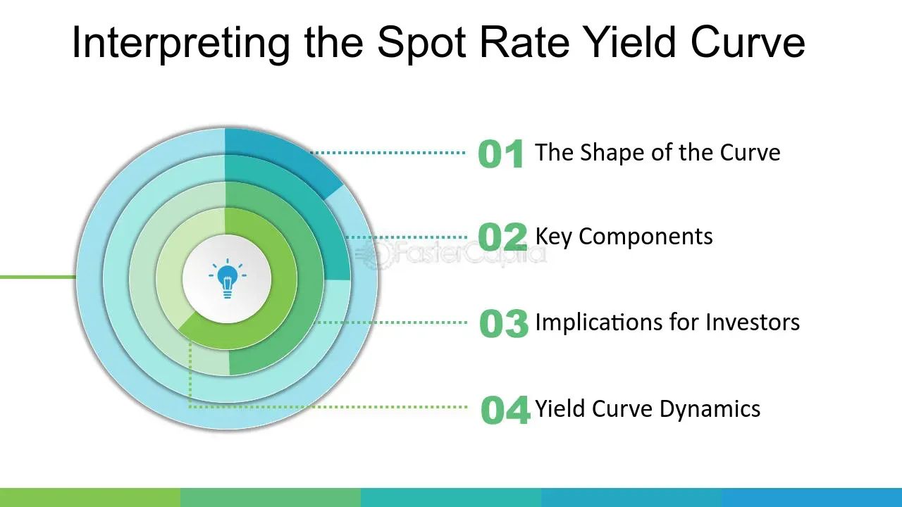

## Table of Contents

## What is the Spot Rate Treasury Curve?

The Spot Rate Treasury Curve, often just called the Treasury Curve, is a line that shows the interest rates for U.S. Treasury securities of different lengths of time, from short to long term. These securities are like loans to the government, and the interest rate, or spot rate, is what the government pays to borrow money for a specific period. By looking at the curve, you can see how much it costs to borrow money from the government for different lengths of time, like 1 month, 2 years, or 30 years.

The curve is important because it helps people understand the economy. When the curve goes up, it means longer-term loans have higher interest rates than shorter-term ones. This is normal and shows that people expect the economy to grow. But if the curve is flat or goes down, it might mean people are worried about the future, and it could be a sign that a recession is coming. Economists, investors, and policymakers all watch the Treasury Curve to make decisions about money and the economy.

## How is the Spot Rate Treasury Curve constructed?

The Spot Rate Treasury Curve is made by looking at the prices of U.S. Treasury securities that are sold today. These securities come in different lengths, from a few months to many years. To build the curve, people take the prices of these securities and figure out the interest rate, or spot rate, for each one. The spot rate is what the government would pay if it borrowed money for that exact length of time. By connecting these spot rates, you get a line that shows how interest rates change as the time to pay back the loan gets longer.

To make sure the curve is as accurate as possible, people use a method called "bootstrapping." This method starts with the shortest-term securities and works its way up to the longer ones. For the shortest securities, like a 3-month Treasury bill, the spot rate is easy to find because it's the same as the [interest rate](/wiki/interest-rate-trading-strategies) of the bill. For longer securities, you need to use the rates of shorter securities to figure out the spot rate. By doing this step by step, you can build a complete curve that shows the spot rates for all the different lengths of time. This curve helps everyone understand what's happening with interest rates and the economy.

## What are the key differences between the Spot Rate Treasury Curve and the Yield Curve?

The Spot Rate Treasury Curve and the Yield Curve both show how interest rates change over different time periods, but they do it in different ways. The Spot Rate Treasury Curve shows the interest rate, or spot rate, for borrowing money for a specific length of time, like 1 month or 10 years. It's made by looking at the prices of Treasury securities and figuring out what the interest rate would be if you borrowed money for that exact time. The Yield Curve, on the other hand, shows the yield, or the total return, you would get if you bought a Treasury security and held it until it matured. The yield is a bit different because it takes into account the interest payments you get along the way, not just the final amount.

The main difference between the two is what they measure. The Spot Rate Treasury Curve gives you the interest rate for a specific moment in time, which is useful for figuring out the cost of borrowing money right now. The Yield Curve, however, gives you an idea of what you would earn if you held a bond until it matures, which can be helpful for planning investments. Both curves are important for understanding the economy, but they give different pieces of information that people use in different ways.

## Why is the Spot Rate Treasury Curve important for financial analysis?

The Spot Rate Treasury Curve is really important for financial analysis because it shows the cost of borrowing money from the government for different lengths of time. By looking at this curve, financial analysts can see how much interest rates change as the time to pay back the loan gets longer. This helps them understand what's happening in the economy right now. For example, if the curve is going up, it means longer-term loans cost more than shorter-term ones, which is usually a good sign for the economy. But if the curve is flat or going down, it might mean people are worried about the future, and it could be a sign that tough times are coming.

Analysts also use the Spot Rate Treasury Curve to make decisions about investments and to plan for the future. Since the curve shows the interest rates for borrowing money at different times, it helps them figure out what kind of returns they might get from different investments. For example, if they want to invest in bonds, they can use the curve to see what kind of interest rates they can expect. This information is really useful for making smart choices about where to put their money. Overall, the Spot Rate Treasury Curve is a key tool that helps financial analysts understand and predict what's happening in the economy and the financial markets.

## How can the Spot Rate Treasury Curve be used to price bonds?

The Spot Rate Treasury Curve can be used to figure out the price of bonds by helping us find the present value of the bond's future cash flows. A bond pays money to the person who owns it in two ways: through regular interest payments, called coupons, and through the final payment when the bond matures. To find out how much a bond is worth today, we need to know what these future payments are worth right now. The Spot Rate Treasury Curve gives us the interest rates for different times in the future, which we can use to discount these future payments back to today's value.

Here's how it works: for each coupon payment and the final payment, we use the spot rate that matches the time until that payment is made. For example, if a coupon is due in one year, we use the one-year spot rate from the curve to figure out what that coupon payment is worth today. We do this for all the payments the bond will make, and then we add up all these present values to get the total price of the bond. By using the Spot Rate Treasury Curve, we make sure we're using the right interest rates for each payment, which gives us a more accurate price for the bond.

## What role does the Spot Rate Treasury Curve play in interest rate risk management?

The Spot Rate Treasury Curve helps people who manage money to understand and handle interest rate risk. Interest rate risk is the chance that changes in interest rates could hurt the value of investments like bonds. By looking at the Spot Rate Treasury Curve, these managers can see how much it costs to borrow money for different lengths of time. This helps them figure out how sensitive their investments are to changes in interest rates. For example, if the curve shows that long-term rates are much higher than short-term rates, managers might choose to invest in shorter-term bonds to avoid the risk of long-term rates going down.

Using the Spot Rate Treasury Curve, managers can also use a strategy called immunization to protect their investments from interest rate changes. Immunization involves matching the duration of assets and liabilities so that changes in interest rates affect them in the same way. The Spot Rate Treasury Curve helps them calculate the duration of their bonds accurately by providing the right interest rates for each cash flow. This way, they can make sure their investments are protected from big swings in interest rates, keeping their portfolios stable even when the economy changes.

## How does the Spot Rate Treasury Curve help in forecasting economic conditions?

The Spot Rate Treasury Curve helps people guess what might happen in the economy by showing how much it costs to borrow money for different times. When the curve goes up, it means longer-term loans cost more than shorter-term ones. This usually means people think the economy will grow because they expect higher interest rates in the future. But if the curve is flat or goes down, it might mean people are worried about the economy. A flat or inverted curve can be a warning sign that a recession might be coming because people think interest rates will go down.

Economists and investors watch the Spot Rate Treasury Curve closely to make decisions. If the curve looks like it's going to change, they might change their investments or make different plans. For example, if the curve starts to flatten, they might move their money into safer investments to protect it from a possible downturn. By understanding the curve, they can get a better idea of what might happen in the economy and be ready for it.

## What are the common methodologies used to estimate the Spot Rate Treasury Curve?

One common way to estimate the Spot Rate Treasury Curve is called bootstrapping. This method starts with the shortest-term Treasury securities, like a 3-month bill, and works its way up to longer-term ones. For the shortest securities, the spot rate is easy to find because it's the same as the interest rate on the bill. For longer securities, you need to use the rates of shorter securities to figure out the spot rate. By doing this step by step, you can build a complete curve that shows the spot rates for all the different lengths of time. This method is popular because it uses real market prices to create the curve, making it accurate and reliable.

Another method is called spline interpolation. This approach uses a mathematical function, called a spline, to smooth out the curve between the known points, which are the interest rates of different Treasury securities. Spline interpolation helps create a smooth curve that fits the data well, even when there are gaps between the securities. This method is useful because it can handle missing data and still give a good estimate of the spot rates. Both bootstrapping and spline interpolation are important tools that help people understand the cost of borrowing money at different times, which is crucial for making financial decisions.

## How do changes in monetary policy affect the Spot Rate Treasury Curve?

When the government changes its monetary policy, it can affect the Spot Rate Treasury Curve a lot. Monetary policy is about how the government controls the amount of money in the economy and the interest rates. If the government decides to raise interest rates to slow down the economy, the Spot Rate Treasury Curve will usually go up. This means it will cost more to borrow money for all lengths of time. On the other hand, if the government lowers interest rates to help the economy grow, the curve will usually go down, making borrowing cheaper.

These changes in monetary policy can also change the shape of the Spot Rate Treasury Curve. For example, if the government only changes short-term interest rates, the curve might get steeper because the difference between short-term and long-term rates gets bigger. But if the government is worried about the economy and expects to keep interest rates low for a long time, the curve might get flatter or even invert, with long-term rates lower than short-term rates. This can be a sign that people are worried about the future and expect the economy to slow down.

## What are the limitations and challenges in using the Spot Rate Treasury Curve?

Using the Spot Rate Treasury Curve can be tricky because it's based on what's happening right now in the market. If the market is really busy and prices are jumping around a lot, the curve might not be as accurate as we want it to be. Also, the curve only shows what's happening with U.S. Treasury securities, so it might not tell us everything we need to know about other kinds of loans or investments. Sometimes, there aren't enough Treasury securities for all the different times we want to look at, so we have to guess a bit to fill in the gaps. This can make the curve less reliable.

Another challenge is that the Spot Rate Treasury Curve can be affected by things that aren't directly related to the economy, like changes in government rules or big events around the world. These things can make the curve move in ways that are hard to predict. Also, the curve assumes that people can borrow and lend money at the same rate, which isn't always true in real life. This can make it harder to use the curve to make decisions about investments or to plan for the future. Even with these challenges, the Spot Rate Treasury Curve is still a really useful tool for understanding the economy and making financial decisions.

## How can advanced statistical models enhance the accuracy of the Spot Rate Treasury Curve?

Advanced statistical models can make the Spot Rate Treasury Curve more accurate by using fancy math to fill in the gaps where we don't have enough data. For example, models like spline interpolation can create a smooth curve that fits the data we have, even if there are missing pieces. These models can also take into account how much the market is moving around, which helps make the curve more reliable. By using these models, we can get a better picture of what's happening with interest rates and make smarter decisions about money.

Another way advanced statistical models help is by looking at other information that might affect the curve, like changes in the economy or big events around the world. These models can use this extra information to predict how the curve might change in the future. This is really useful for people who need to plan ahead and make sure their investments are safe. By using these models, we can understand the Spot Rate Treasury Curve better and use it to make better choices about borrowing and investing money.

## What are the latest research developments and future trends in the application of the Spot Rate Treasury Curve?

Recent research on the Spot Rate Treasury Curve has focused on using new technology and data to make it more accurate and useful. One big trend is using [machine learning](/wiki/machine-learning) to predict how the curve might change in the future. These models can look at a lot of different information, like economic reports and news events, to guess what might happen next. This can help people make better decisions about their investments and plan for the future. Another area of research is looking at how the curve can be used in different countries, not just the U.S. By studying how the curve works in other places, researchers can learn more about how global events affect interest rates and the economy.

Looking ahead, the Spot Rate Treasury Curve is likely to become even more important for understanding the economy and making financial decisions. As more data becomes available and technology gets better, people will be able to use the curve in new ways. For example, real-time data and advanced models could help people see changes in the curve as they happen, making it easier to react quickly to new information. Also, as the world becomes more connected, the curve might be used to understand how events in one country can affect interest rates in another. This could help people make better decisions about global investments and manage their money more effectively.

## What is the role of spot rates in financial analysis?

Spot rates play a crucial role in the valuation of bonds and other fixed-income securities, especially in markets where [algorithmic trading](/wiki/algorithmic-trading) prevails. These rates represent the interest rates for zero-coupon bonds, which are essential in determining the present value of future cash flows. Understanding and utilizing spot rates enable financial analysts to assess market expectations accurately and discount future cash flows effectively.

The calculation of spot rates is instrumental for yield curve construction. The yield curve reflects how interest rates of bonds with different maturities compare over time, and its analysis can provide insights into economic conditions and future interest rate movements. Analysts use spot rates derived from the yield curve to price bonds more accurately than using the nominal yield alone, which assists in making more informed investment decisions.

One of the crucial methods employed in deriving spot rates is bootstrapping. Bootstrapping is a technique used to extract a zero-coupon yield curve from the prices of various coupon-bearing instruments, usually government bonds. The process involves iteratively solving for the spot rate by using the prices of bonds at different maturities and their respective yields. This iterative method allows analysts to build a complete spot rate curve, enabling the precise pricing of bonds with different cash flow structures.

The bootstrapping process can be mathematically represented as follows. Suppose we have a bond with $n$ cash flows, $C_1, C_2, \ldots, C_n$, occurring at times $t_1, t_2, \ldots, t_n$. The price $P$ of the bond can be equated to the present value of its cash flows:

$$
P = \frac{C_1}{(1 + r_1)^{t_1}} + \frac{C_2}{(1 + r_2)^{t_2}} + \cdots + \frac{C_n}{(1 + r_n)^{t_n}}
$$

Where $r_i$ represents the spot rate for each cash flow at time $t_i$. Solving these equations sequentially for each bond, analysts derive the spot rate curve.

In practical applications, coding tools like Python can automate the bootstrapping process. The following Python code snippet illustrates a basic approach to derive a spot rate curve from bond prices:

```python
import numpy as np

# Sample bond data: [(time to maturity, cash flow, bond price)]
bonds = [(1, 105, 100), (2, 110, 100), (3, 115, 100)]

# Bootstrapping to derive spot rates
spot_rates = []
for (t, cf, price) in bonds:
    if t == 1:
        r = (cf / price) - 1
    else:
        sum_pvs = sum([cf / (1 + rate)**time for time, rate in enumerate(spot_rates, start=1)])
        r = (cf / (price - sum_pvs))**(1/t) - 1
    spot_rates.append(r)

# Output the spot rates
for t, rate in enumerate(spot_rates, start=1):
    print(f"Year {t}: Spot Rate = {rate:.4%}")
```

Overall, spot rates are indispensable to financial analysts who employ them to evaluate bonds and predict market conditions effectively. Their importance is particularly pronounced in the context of algorithmic trading, where precision in pricing and an understanding of market trends can significantly enhance the accuracy and profitability of trading strategies. Bootstrapping remains a critical technique for deriving these rates, further underlining the role of mathematical and computational methods in financial analysis.

## References & Further Reading

[1]: Diebold, F. X., & Rudebusch, G. D. (2013). ["Yield Curve Modeling and Forecasting: The Dynamic Nelson-Siegel Approach."](https://www.sas.upenn.edu/~fdiebold/papers/paper109/EIRLintro.pdf) Princeton University Press.

[2]: Hull, J. C. (2018). ["Options, Futures, and Other Derivatives"](https://www.semanticscholar.org/paper/Options%2C-Futures%2C-and-Other-Derivatives-Hull/89bdee500c8623864fc9eb7a471546aa713acc44) (10th ed.). Pearson.

[3]: Shiryaev, A. N. (1999). ["Essentials of Stochastic Finance: Facts, Models, Theory."](https://archive.org/details/essentialsofstoc0000shir) World Scientific Publishing Company.

[4]: Jarrow, R., & Turnbull, S. (2000). ["Derivative Securities"](https://archive.org/details/derivativesecuri0000jarr) (2nd ed.). South-Western College Pub.

[5]: ["Advances in Financial Machine Learning"](https://www.amazon.com/Advances-Financial-Machine-Learning-Marcos/dp/1119482089) by Marcos Lopez de Prado