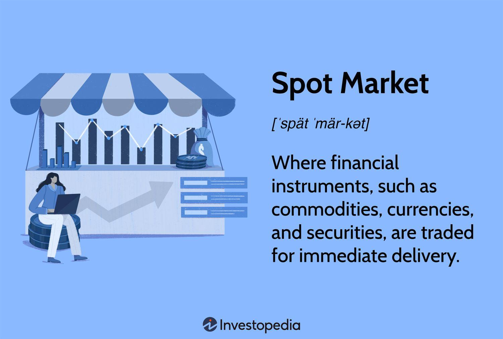

## Table of Contents

## What is spot trading in financial markets?

Spot trading in financial markets is when people buy and sell things like stocks, currencies, or commodities right away. It's called "spot" because the trade happens on the spot, or immediately. For example, if you want to buy some euros with your dollars, you can do a spot trade and get the euros right away at the current price.

In spot trading, the price you see is the price you get. This is different from other types of trading where you might agree on a price now but actually trade later. Spot trading is popular because it's simple and quick. People use it a lot in the foreign exchange market, where they trade different currencies, but it's also used for other things like gold or oil.

## How does spot trading differ from other types of trading?

Spot trading is different from other types of trading because it happens right away. When you do a spot trade, you get what you're buying or selling immediately at the current price. It's like going to a store and buying something off the shelf. You pay the price that's shown and take the item home right then. Other types of trading, like futures or options, involve agreeing on a price now but actually trading later. This can be compared to ordering something online and waiting for it to be delivered at a later date.

In futures trading, for example, you agree to buy or sell something at a future date for a price you set now. This can be useful if you want to lock in a price to protect against future price changes. Options trading gives you the right, but not the obligation, to buy or sell something at a set price before a certain date. This is like having a coupon that you can choose to use or not. Spot trading doesn't have these extra steps or choices; it's straightforward and immediate, which is why it's popular for things like currency exchange or buying commodities like gold.

## What are the basic steps to start spot trading?

To start spot trading, first, you need to choose a reliable trading platform or broker. Look for one that offers the assets you want to trade, like currencies or commodities, and has good reviews. Once you've picked a platform, you'll need to open an account. This usually involves filling out some personal information and verifying your identity, which might mean sending in a copy of your ID or a utility bill.

After your account is set up, you'll need to add money to it. This is called funding your account. You can usually do this by transferring money from your bank or using a credit card. Once your account is funded, you can start trading. On the platform, you'll see the current prices for different assets. To make a trade, you just pick the asset you want, decide if you want to buy or sell, and enter the amount. The trade happens right away at the price you see, and you'll get a confirmation of your trade.

## What are the most common assets traded on spot markets?

The most common assets traded on spot markets are currencies and commodities. In the foreign exchange market, people trade different currencies like the US dollar, the Euro, and the Japanese Yen. This is called the [forex](/wiki/forex-system) market, and it's the biggest spot market in the world. People trade currencies to do business across borders or to invest in different countries.

Commodities are another big part of spot trading. These are things like gold, oil, and agricultural products like wheat or corn. People trade commodities because they are important for industries and everyday life. For example, someone might buy gold on the spot market if they think the price will go up, or a company might buy oil to use in their business.

## What are the risks associated with spot trading?

Spot trading can be risky because prices can change very fast. If you buy something and the price goes down right after, you could lose money. This can happen with currencies or commodities like gold or oil. It's hard to predict what will happen next, so you might not always make the right choice. Also, if you're trading with borrowed money, called leverage, you can lose more than what you started with, which makes it even riskier.

Another risk is that you might not know enough about what you're trading. If you don't understand how the market works or what affects the price of the asset, you might make bad decisions. Plus, there are risks with the trading platforms themselves. Some might not be trustworthy, and you could lose your money if they go out of business or if they are scams. It's important to do your homework and be careful when choosing where to trade.

## How can one manage risk when engaging in spot trading?

Managing risk in spot trading starts with knowing what you're doing. You need to learn about the assets you want to trade, like currencies or commodities, and understand what can make their prices go up or down. It's also a good idea to start small. Don't put all your money into one trade. Instead, spread it out over different trades. This way, if one trade goes bad, you won't lose everything. Another important thing is to use stop-loss orders. These are like safety nets that automatically sell your asset if the price drops to a certain level, helping you limit your losses.

Another way to manage risk is to be careful with leverage. Leverage lets you borrow money to trade more than you have, but it can make your losses bigger if things go wrong. So, if you use leverage, use it carefully and only with money you can afford to lose. Also, always check the reliability of the trading platform you use. Make sure it's trustworthy and has good security to protect your money. By taking these steps, you can make spot trading less risky and more manageable.

## What are the key factors to consider before executing a spot trade?

Before you do a spot trade, think about why you want to trade and what you hope to get out of it. Are you trying to make money quickly, or do you want to hold onto the asset for a while? Knowing your goals will help you decide if spot trading is right for you. You should also look at the current market conditions. Check the prices and see if they are going up or down. This can help you decide if it's a good time to buy or sell.

Another important thing to consider is how much risk you're willing to take. Spot trading can be risky because prices can change fast. Decide how much money you can afford to lose and stick to that amount. It's also a good idea to know about the asset you want to trade. Understand what can affect its price, like news or economic reports. Finally, make sure you're using a reliable trading platform. A good platform will help you trade safely and give you the information you need to make smart choices.

## How do market liquidity and volatility affect spot trading?

Market [liquidity](/wiki/liquidity-risk-premium) is about how easy it is to buy or sell an asset without changing its price too much. In spot trading, if an asset has high liquidity, it means you can trade it quickly and easily. This is good because you can get in and out of trades without waiting too long, and the price won't move a lot just because you're trading. But if an asset has low liquidity, it can be hard to trade. You might have to wait longer to find someone to trade with, and the price might change a lot when you do trade. This can make spot trading riskier and less predictable.

Volatility is about how much the price of an asset goes up and down. In spot trading, high [volatility](/wiki/volatility-trading-strategies) means the price can change a lot in a short time. This can be good if you're trying to make money from quick price changes, but it's also risky. If the price moves against you, you could lose money fast. Low volatility means the price stays more steady, which can make spot trading safer but might also mean fewer chances to make big profits. So, when you're thinking about doing a spot trade, it's important to look at how liquid and how volatile the market is, because these things can really affect your trading.

## What are some advanced strategies used in spot trading?

One advanced strategy in spot trading is called [scalping](/wiki/gamma-scalping). Scalpers try to make small profits from lots of quick trades. They look for small price changes that happen very fast and trade in and out of the market quickly. This can be exciting but also risky because it needs a lot of attention and fast decisions. Scalpers often use charts and other tools to help them see these quick price changes and make their trades.

Another strategy is called swing trading. Swing traders hold onto their trades for a bit longer, maybe a few days or weeks, trying to catch bigger price moves. They look for patterns in the market that tell them when prices might go up or down. This strategy needs patience and a good understanding of what can affect the price of the asset they're trading. Swing traders might use technical analysis, which is like using math and charts to predict what the market will do next, to help them decide when to buy and sell.

Some traders also use a strategy called [arbitrage](/wiki/arbitrage). This is when they buy an asset in one market and sell it in another market at the same time for a higher price. This can work well in spot trading because it's all about trading right away. Arbitrage traders need to be very quick and have good information about prices in different markets. This strategy can be less risky if done right, but it's hard to find these opportunities and they don't last long.

## How do regulatory environments impact spot trading?

Regulatory environments can have a big impact on spot trading. Different countries have different rules about who can trade, what they can trade, and how they can trade. These rules are made to protect people from losing money and to make sure trading is fair. For example, some countries might require traders to have a certain amount of money before they can start trading, or they might limit the amount of leverage traders can use. This can make spot trading safer but might also limit how much money traders can make.

Regulations can also affect the platforms where people do spot trading. Some countries have strict rules about what platforms can do and how they must protect their users' money. This can make it harder for new platforms to start up, but it can also make existing platforms safer and more trustworthy. Traders need to know the rules in their country and make sure they follow them, or they could get in trouble. So, understanding the regulatory environment is important for anyone who wants to do spot trading.

## What role do technological tools and platforms play in spot trading?

Technological tools and platforms are really important for spot trading. They make it easy for people to buy and sell things like currencies or commodities right away. These platforms show you the current prices and let you trade with just a few clicks. They also have tools like charts and graphs that help you see what's happening in the market. This can help you make better decisions about when to buy or sell. Plus, many platforms let you set up automatic trades, so you can tell the platform to buy or sell for you when the price reaches a certain level.

These tools also help keep your trades safe and secure. Good platforms use strong security to protect your money and personal information. They also have ways to make sure the trades happen fairly and that no one can cheat. Technology has made spot trading faster and easier than ever before. But it's important to choose a reliable platform because not all of them are the same. A good platform can make a big difference in how well you do with your spot trading.

## How can one analyze the performance and effectiveness of their spot trading strategies?

To analyze how well you're doing with your spot trading strategies, start by keeping track of your trades. Write down when you buy or sell, how much you spend, and what you make. This way, you can see if you're making money or losing it over time. Look at how much you're [earning](/wiki/earning-announcement) compared to how much you're risking. If you're making more money than you're losing, your strategy might be working well. But if you're losing more than you're making, it might be time to change things up.

Another way to check your strategy is by looking at how often you're right about the market. If you're guessing right more than you're guessing wrong, that's a good sign. Also, think about how long it takes for your trades to work out. If you're making money quickly, that's great, but if it's taking a long time, you might need to adjust your approach. It's also smart to compare your results with the overall market. If the market is doing well and you're not, your strategy might need some work. By looking at these things, you can figure out if your spot trading strategy is effective and what you might need to do differently.

## References & Further Reading

[1]: Bergstra, J., Bardenet, R., Bengio, Y., & Kégl, B. (2011). ["Algorithms for Hyper-Parameter Optimization."](https://dl.acm.org/doi/10.5555/2986459.2986743) Advances in Neural Information Processing Systems 24.

[2]: ["Advances in Financial Machine Learning"](https://www.amazon.com/Advances-Financial-Machine-Learning-Marcos/dp/1119482089) by Marcos Lopez de Prado

[3]: ["Evidence-Based Technical Analysis: Applying the Scientific Method and Statistical Inference to Trading Signals"](https://www.amazon.com/Evidence-Based-Technical-Analysis-Scientific-Statistical/dp/0470008741) by David Aronson

[4]: ["Machine Learning for Algorithmic Trading"](https://github.com/stefan-jansen/machine-learning-for-trading) by Stefan Jansen

[5]: ["Quantitative Trading: How to Build Your Own Algorithmic Trading Business"](https://www.amazon.com/Quantitative-Trading-Build-Algorithmic-Business/dp/1119800064) by Ernest P. Chan