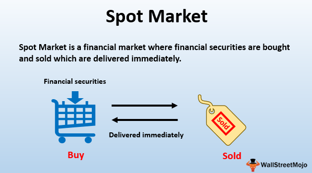

In the digitally driven world of finance, trading is continuously evolving. As new technologies emerge, they reshape the strategies employed for engaging with financial markets. Algorithmic trading, the method of utilizing computer algorithms to automate the decision-making and execution of trades, has become a cornerstone in modern financial markets. Its significance lies in the remarkable advantages it offers in terms of speed, precision, and efficiency. 

The spot market, where financial instruments such as currencies, commodities, and securities are traded for immediate delivery, particularly benefits from algorithmic trading—often referred to as algo trading. This is because the spot market requires quick decision-making and execution, areas where computers intrinsically outperform human capabilities. Algorithms facilitate trading decisions executed in real-time, thus enabling traders to capitalize on minute market movements and execute large volumes of trades with reduced errors and at speeds unattainable by human traders.



This article aims to explore the connection between spot market asset exchanges and financial trading practices, highlighting the transformative role played by algorithmic trading. It will cover the historical development of spot market trading and its transition from manual processes to automated systems. Furthermore, the article will address the functionality that underpins these algorithmic systems, as well as the advantages they offer, such as increased market opportunities and efficiency. Despite these benefits, the implementation of algorithmic trading in spot markets also presents several challenges that require careful consideration and management.

Overall, algorithmic trading has ushered a new era of trading in financial markets, particularly in the fast-paced environment of spot markets. As technology continues to advance, the role of algorithmic trading is not only poised to grow but also to redefine the future landscape of financial trading.

## Table of Contents

## Understanding Spot Market Asset Exchange

Spot market asset exchange refers to the process of buying and selling financial instruments such as currencies, commodities, and securities with the agreement for immediate delivery. This is distinct from futures or options markets, where transactions commit to delivery at a specified future date. The immediacy of the spot market demands quick decision-making due to the instantaneous nature of transactions.

The spot market operates on the principle of immediate execution of trades at the current price, known as the spot price. This spot price is determined by supply and demand dynamics in the market for the underlying asset. As a result, traders must be prepared to make rapid decisions based on the latest market information. This necessity for speed underscores the importance of having access to real-time data and the ability to quickly interpret and act on it.

Historically, spot market trading was entirely manual. Traders relied heavily on their judgment, timing, and experience to make decisions. The manual nature of historical spot market trading involved direct communication between parties to negotiate prices and settle transactions. This process was not only time-consuming but also prone to human error and subjectivity.

For example, a trader dealing in foreign exchange would need to keep a constant watch on currency price movements, geopolitical events, and economic indicators, all of which could influence currency values. Decisions had to be made swiftly to capitalize on market movements or to mitigate risks.

In conclusion, spot market asset exchange is characterized by the immediate execution of trades, which necessitates quick decision-making and historically relied on manual operations and human intuition. This foundational understanding of spot markets sets the stage for recognizing how [algorithmic trading](/wiki/algorithmic-trading) has revolutionized the speed and precision of trading in contemporary markets.

## What is Algorithmic Trading?

Algorithmic trading involves the use of advanced computer algorithms to automate trading activities, significantly enhancing the speed and efficiency of trade execution. These algorithms are designed to process vast amounts of market data at high frequencies, identify patterns and trends, and execute trades according to complex and pre-defined strategies. Unlike traditional trading, where decisions are often influenced by human emotions or time constraints, algorithmic trading ensures consistency and objectivity by relying on mathematical models and statistical analysis.

A typical algorithmic trading system comprises several components, including data analysis, signal generation, and trade execution. Initially, the system gathers large volumes of market data, which may include historical prices, trading volumes, and other relevant financial indicators. This data is then analyzed in real-time using techniques such as quantitative analysis, statistical [arbitrage](/wiki/arbitrage), and [machine learning](/wiki/machine-learning) models to identify potential trading opportunities.

Once a trading signal is generated, the algorithm determines the most opportune moment to execute a trade, optimizing for parameters like price, [volume](/wiki/volume-trading-strategy), and timing. This process occurs within fractions of a second, allowing traders to capitalize on market inefficiencies more effectively than manual trading methods.

To illustrate, consider a Python implementation of a basic moving average crossover strategy, a common algorithmic trading approach:

```python
import pandas as pd
import numpy as np

# Load market data (e.g., stock prices)
data = pd.read_csv('market_data.csv')
data['Short_MA'] = data['Close'].rolling(window=50, min_periods=1).mean()
data['Long_MA'] = data['Close'].rolling(window=200, min_periods=1).mean()

# Generate trading signals
data['Signal'] = np.where(data['Short_MA'] > data['Long_MA'], 1, 0)

# Calculate positions (1 = buy, 0 = sell)
data['Position'] = data['Signal'].diff().fillna(0)

# Print trading positions
print(data[['Close', 'Short_MA', 'Long_MA', 'Signal', 'Position']])
```

In this example, the algorithm computes two moving averages (short-term and long-term) to generate buy or sell signals based on crossovers. The system automatically goes long (buys) when the short-term moving average is above the long-term moving average and sells when the opposite is true.

Algorithmic trading not only removes human error and emotional bias from trading decisions but also enables scalability across multiple markets and assets. Furthermore, it allows traders to backtest strategies using historical data to fine-tune parameters before deploying them in live trading environments.

Despite its advantages, successful algorithmic trading relies on robust technological infrastructure and expertise in both financial markets and programming. Continuous monitoring and optimization are required to ensure the algorithms adapt to evolving market conditions and uphold their effectiveness.

## Integration of Algo Trading in Spot Markets

Spot algorithmic trading is characterized by the swift execution of trades, predominantly facilitated by the computational power of modern computers. This approach is becoming increasingly integral to spot markets due to its ability to handle large volumes of data rapidly and execute trades efficiently. Key components of the integration process include data collection and analysis, signal generation, trade execution, risk management, and continuous optimization, each of which plays a vital role in enhancing the effectiveness of trading strategies.

Firstly, data collection is pivotal in spot algorithmic trading. Algorithms gather extensive datasets from various sources, including market prices, trading volumes, and economic indicators. This data is then analyzed to identify actionable patterns and trends. Advanced data analytics techniques, such as machine learning and statistical modeling, are employed to enhance the precision of these analyses. For instance, algorithms can be designed to use moving averages or other statistical indicators to detect potential trading opportunities. In Python, this can be achieved with libraries such as Pandas for data manipulation and Scikit-learn for implementing machine learning models.

The signal generation phase follows data analysis. Algorithms formulate trading signals based on pre-defined criteria, which might include statistical anomalies or preset price thresholds. These signals dictate whether to buy or sell assets in real-time. The decision-making process relies heavily on complex algorithms that can identify opportunities quicker than human traders. For instance, a simple moving average crossover strategy could be implemented in Python as follows:

```python
import pandas as pd

# Calculate moving averages
data['SMA_short'] = data['Price'].rolling(window=50).mean()
data['SMA_long'] = data['Price'].rolling(window=200).mean()

# Generate buy/sell signals
data['Signal'] = 0
data.loc[data['SMA_short'] > data['SMA_long'], 'Signal'] = 1
data.loc[data['SMA_short'] < data['SMA_long'], 'Signal'] = -1
```

Once signals are generated, the trade execution component ensures trades are performed instantaneously. This is crucial in spot markets where price changes can happen in moments. The execution can be automated via trading platforms that support API integrations, allowing algorithms to place trades without human intervention.

Risk management is another critical component. Incorporating risk management strategies within algorithms helps safeguard investments against adverse market conditions. Techniques such as stop-loss orders, position sizing, and diversification are often programmed into these algorithms. Algorithms can be designed to monitor live market conditions and dynamically adjust trading parameters to mitigate risk.

Continuous monitoring and optimization of algorithms ensure they adapt to changing market conditions. This involves [backtesting](/wiki/backtesting) strategies against historical data to refine parameters and improve performance over time. Additionally, deployment of machine learning techniques allows algorithms to learn from past trading outcomes and enhance decision-making processes.

In conclusion, the integration of algorithmic trading within spot markets is a significant advancement, offering benefits such as increased speed, volume handling, and precision in trade execution. The combination of data-driven insights and automated processes not only reduces human error but also provides a competitive edge in the fast-paced environment of financial trading.

## Case Study: Spot Trading Firm

Spot Trading was a proprietary trading firm based in Chicago that significantly influenced the landscape of spot market and algorithmic trading. Established in 1999 by Stephen Brodsky, Spot Trading quickly evolved into a major player in the industry by emphasizing technological innovation and the seamless integration of expertise from finance, engineering, and data science.

The firm's early adoption of cutting-edge technology set it apart in the competitive world of trading. Spot Trading focused on developing sophisticated computer algorithms to automate trading activities, allowing the firm to execute trades at high speed and with remarkable accuracy. This technological adeptness allowed it to capitalize on market efficiencies and discrepancies that traditional manual trading could not achieve.

A significant component of Spot Trading's strategy was fostering collaboration among professionals from various disciplines. By creating teams that combined the skills of traders, engineers, and quantitative analysts, the firm was able to design and implement advanced trading strategies. This multidisciplinary approach facilitated the continuous improvement and optimization of their trading algorithms, ensuring that they remained competitive.

Spot Trading was noted for its commitment to innovation in algorithmic trading. The firm invested heavily in research and development to refine its trading systems continually. By leveraging data analytics and machine learning, Spot Trading could analyze vast amounts of market data in real-time, making informed trading decisions swiftly and effectively.

Despite its success and influence on the industry, Spot Trading ceased operations in 2018. The closure marked the end of a significant era, but it left behind critical lessons on the integration of technology in financial markets. Spot Trading's journey underlines the importance of adaptability and innovation in a rapidly changing market environment. It highlighted the potential of algorithmic trading to transform financial markets, setting a precedent for future firms aiming to harness technology to gain a competitive edge.

In retrospect, Spot Trading's history offers valuable insights into the evolving interplay between technology and trading strategies. The firm's rise and eventual closure underscore the dynamic nature of the trading industry and the continuous evolution required to maintain relevance in such a competitive field. As technology progresses, the legacy of firms like Spot Trading will likely inform the next generation of trading innovations.

## Advantages of Spot Algorithmic Trading

Spot algorithmic trading offers unmatched speed and efficiency in trade execution, setting itself apart from traditional manual methods. The use of algorithms allows for rapid processing of vast amounts of market data, enabling traders to execute orders at lightning-fast speeds. This capability is crucial in the spot market, where time is of the essence, and even microsecond delays can significantly impact profitability.

One of the principal advantages of algorithmic trading is the introduction of consistency and discipline in executing trades. Algorithms operate based on predefined rules and conditions, which helps eliminate the influence of human emotions, such as fear or greed, that can lead to irrational decision-making. By adhering to a systematic approach, traders can achieve greater precision and reliability in their trading activities.

Advanced algorithms are designed to implement and manage complex trading strategies. These algorithms can process multifaceted datasets, identify and capitalize on patterns, and execute transactions across multiple markets simultaneously. For instance, an algorithm might be programmed to pursue an arbitrage strategy, identifying price discrepancies between different markets and executing simultaneous buy and sell orders to exploit these inefficiencies.

Risk management is another critical area where spot algorithmic trading excels. Algorithms can continuously monitor market conditions and adjust trading tactics in real time to mitigate potential losses. This is achieved through dynamic adjustment of stop-loss orders, position sizing, and other risk control measures that can be seamlessly integrated into the trading algorithm.

Moreover, the scalability of algorithmic trading systems allows traders to manage substantial volumes of transactions without a corresponding increase in operational costs. This scalability is advantageous for institutional traders who require the capacity to engage in large-scale trading without losing the efficiency and speed benefits provided by automation.

The quantitative prowess of algorithmic trading can be demonstrated through backtesting and optimization techniques. Traders often use historical market data to test the performance of their algorithms, identifying potential weaknesses and making data-driven improvements to enhance efficacy. This approach ensures that the trading strategy is robust and capable of adapting to evolving market trends.

Consider the following example of a simple moving average crossover strategy implemented in Python, which shows the consistent application of rules:

```python
import numpy as np
import pandas as pd

# Sample market data
data = {'Price': [101, 102, 100, 105, 104]}
df = pd.DataFrame(data)

# Calculate moving averages
short_window = 2
long_window = 3

df['Short_MA'] = df['Price'].rolling(window=short_window).mean()
df['Long_MA'] = df['Price'].rolling(window=long_window).mean()

# Generate trading signals
df['Signal'] = np.where(df['Short_MA'] > df['Long_MA'], 1, 0)

print(df)
```

This code snippet illustrates a simple strategy where buy signals are generated when the short-term moving average (Short_MA) surpasses the long-term moving average (Long_MA), highlighting how algorithmic trading can execute predefined trading strategies consistently.

In summary, spot algorithmic trading enhances market operations by offering speed, precision, and the ability to manage intricate strategies across diverse markets. Its reliance on systematic execution and sophisticated risk management underscores its strategic value, making it a pivotal tool in the modern trading landscape.

## Challenges of Implementing Spot Algorithmic Trading

Implementing spot algorithmic trading offers numerous advantages, but it is not without its challenges. One primary challenge is the complexity involved in coding and maintaining these algorithms. Spot algorithmic trading requires expertise that spans both financial markets and programming. Developing robust algorithms demands a deep understanding of trading strategies, market conditions, and regulatory requirements. Additionally, the algorithms must be meticulously coded to reduce bugs and errors. This often involves using sophisticated programming languages like Python, C++, or Java, and requires ongoing adjustments and optimizations to align with dynamic market conditions.

Market risks remain inherent even in algorithmic trading. Algorithms are designed to operate based on predefined criteria, and while they are exceptionally efficient in processing large datasets and executing trades at high speeds, they might not be nimble enough to anticipate sudden market shifts. Such events, often referred to as "black swans", are rare but can lead to significant financial losses if the algorithm's strategies are misaligned with the new market reality. For example, an unforeseen geopolitical event or an unexpected economic announcement can trigger massive market reactions that algorithms may not account for, leading to substantial financial exposure.

There is also a heavy reliance on technology infrastructure in spot algorithmic trading. The efficacy of algorithmic trading largely depends on the robustness and stability of the technology infrastructure it operates on. Any disruptions in network connectivity, power supplies, or data feeds can severely impact trading operations. For instance, latency issues or server downtimes can delay the execution of trades, resulting in missed market opportunities or unintended trades. Moreover, cybersecurity threats pose another critical risk, as breaches can compromise sensitive data or even manipulate trading algorithms.

To mitigate these challenges, firms often invest heavily in building and maintaining resilient technological ecosystems. This involves deploying advanced cybersecurity measures, ensuring redundant systems and backups, and employing real-time monitoring tools to detect and address issues promptly. Furthermore, regular updates and rigorous testing of algorithms are imperative to ensuring their continued effectiveness and adaptability to changing market conditions.

## Conclusion

Spot algorithmic trading has revolutionized modern market operations by offering significant advantages to traders operating in the fast-paced environment of financial markets. The automation and speed provided by algorithmic trading systems enable traders to execute trades with precision, minimizing the potential for human error and emotional bias. This consistency and reliance on predefined strategies help maintain disciplined trading, which is particularly crucial in the unpredictably changing markets.

The integration of advanced algorithms facilitates not only increased speed but also enhanced risk management capabilities. By continuously analyzing vast amounts of market data and responding to predefined triggers, these systems can manage and mitigate risks more effectively than traditional manual trading approaches. The complexity of strategies employed through spot algorithmic trading allows participants to execute intricate trading strategies while scaling their operations across multiple markets and asset classes.

Despite the evident advantages, challenges persist in implementing and maintaining spot algorithmic trading systems. The development and maintenance of sophisticated algorithms require a high level of expertise in both financial markets and software engineering. Additionally, the reliance on technology infrastructure presents its own risks, with potential system failures or cyber threats posing significant challenges. Moreover, while algorithms can effectively handle many market scenarios, they might not predict unforeseen market shifts, which can lead to potential financial losses.

As technological advancements continue to unfold, the adaptability and efficiency of algorithmic trading systems are expected to improve further. Continuous progress in machine learning and [artificial intelligence](/wiki/ai-artificial-intelligence) promises even more refined trading strategies and enhanced market adaptability. This evolution suggests that the role of algorithmic trading in spot markets will continue to grow, providing even greater opportunities for traders to achieve an edge through increased speed, precision, and robust risk management in future financial landscapes.

## References & Further Reading

[1]: Bergstra, J., Bardenet, R., Bengio, Y., & Kégl, B. (2011). ["Algorithms for Hyper-Parameter Optimization."](https://dl.acm.org/doi/10.5555/2986459.2986743) Advances in Neural Information Processing Systems 24.

[2]: ["Advances in Financial Machine Learning"](https://www.amazon.com/Advances-Financial-Machine-Learning-Marcos/dp/1119482089) by Marcos Lopez de Prado

[3]: ["Evidence-Based Technical Analysis: Applying the Scientific Method and Statistical Inference to Trading Signals"](https://www.amazon.com/Evidence-Based-Technical-Analysis-Scientific-Statistical/dp/0470008741) by David Aronson

[4]: ["Machine Learning for Algorithmic Trading"](https://github.com/stefan-jansen/machine-learning-for-trading) by Stefan Jansen

[5]: ["Quantitative Trading: How to Build Your Own Algorithmic Trading Business"](https://www.amazon.com/Quantitative-Trading-Build-Algorithmic-Business/dp/1119800064) by Ernest P. Chan