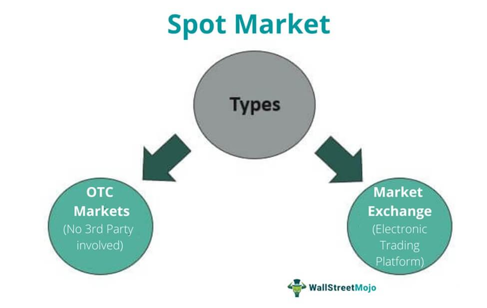

## Table of Contents

## What is spot trading and how does it work?  

Spot trading is a straightforward way to buy and sell assets, like stocks, cryptocurrencies, or commodities, where the transaction happens "on the spot." That means you purchase or sell an asset at its current market price, and the deal is settled almost immediately—typically within a couple of days, depending on the market. It’s the most basic form of trading, often what people picture when they think of buying something like Bitcoin or a share of a company.

Here’s how it works: you decide you want to buy an asset, say a cryptocurrency. You check the market price, place your order through a platform (like an exchange), and if there’s a seller willing to match your price, the trade executes. You pay for it—usually with cash or another asset—and the asset lands in your account shortly after. Selling works the same way in reverse. The price you get is determined by supply and demand at that exact moment, so timing can matter a lot.

Unlike some other trading styles, there’s no borrowing or leverage involved unless you choose to add that layer. You’re just swapping what you have for what’s available, right then and there. It’s simple, fast, and tied directly to real-time market conditions.

## How does spot trading differ from other types of trading like futures or margin trading?  

Spot trading stands apart from futures and margin trading mainly in its simplicity and immediacy. When you spot trade, you’re buying or selling an asset at its current market price, and the transaction wraps up almost instantly—usually within a day or two. You own the asset outright, no strings attached, and there’s no obligation beyond that moment.

Futures trading, on the other hand, is like making a promise. You agree to buy or sell an asset at a set price on a specific date down the road. It’s not about owning something now; it’s a contract betting on where the price will go. You don’t need to hold the asset upfront, and settlement happens later. This can amplify gains (or losses) since you’re often dealing with leverage—borrowed funds—rather than just your own cash. It’s more speculative and complex than spot trading’s “here and now” approach.

Margin trading sits closer to spot trading but with a twist: borrowing. You’re still trading assets at current prices, but you’re using loaned money from a broker or exchange to boost your buying power. Say you have $100 but borrow another $100 to trade with—you’re now in for $200. If the price moves your way, profits can be bigger, but if it tanks, you owe the difference plus interest. Spot trading skips all that; you only trade what you’ve got, no debt involved.

So, spot trading is direct ownership with no delays or loans. Futures is about future commitments, and margin is about amplifying the present with borrowed muscle. Each has its own risks and rewards, but spot keeps it simplest.

## What are the basic factors that influence spot trading profitability?  

Spot trading profitability hinges on a few core factors that determine whether you walk away with a gain or a loss. First off, price movement is king. Since you’re buying and selling at current market rates, your profit depends on the asset’s price rising (if you’re buying) or falling (if you’re selling short, though that’s less common in basic spot trading) between the time you enter and exit the trade. Timing those shifts is everything.

Next, transaction costs eat into your returns. Every trade comes with fees—exchange charges, network fees in crypto, or spreads between bid and ask prices. If those costs outweigh your price gains, you’re in the red, no matter how smart your move was. Low-fee platforms or bigger trades can help offset this.

Market liquidity matters too. If there aren’t enough buyers or sellers at your price point, you might get stuck or forced to take a worse deal. High liquidity means smoother trades at the price you want, keeping your profits intact. Thin markets can widen spreads and sap your edge.

Then there’s volatility. Big price swings can mean big wins if you catch the wave, but they can just as easily wipe you out if you’re on the wrong side. Steady markets might limit upside but also reduce the risk of sudden drops.

Lastly, your strategy and execution play a role. Knowing when to buy, sell, or hold—based on research, trends, or gut—ties it all together. Misjudge the timing or overpay on fees, and even a good market can leave you empty-handed. It’s a mix of external forces and your own moves that decides the outcome.

## How do transaction fees impact spot trading profits?  

Transaction fees can quietly chip away at spot trading profits, sometimes turning a winning trade into a break-even or a loss. When you buy or sell an asset on the spot market, you’re hit with costs—exchange fees, network fees (especially in crypto), or the spread between bid and ask prices. These aren’t optional; they’re baked into every move you make. The impact depends on how big they are relative to your trade size and price movement.

Say you buy $1,000 worth of an asset, and the platform charges a 0.5% fee—that’s $5 gone right there. You sell later for $1,050, a $50 gain before fees, but another $5.25 fee kicks in. Your gross profit of $50 shrinks to $39.75 net. That’s a 20% haircut just from fees. If the price only moves a little, like $10 instead of $50, those same fees could wipe out your profit entirely or push you into the red.

Small trades feel this the most. A $100 trade with a $1 fee needs a 2% price jump just to break even—twice as hard as a $1,000 trade with a $5 fee. Frequent trading compounds it; ten trades a day with tiny margins can bleed you dry if fees outpace gains. On the flip side, bigger trades or low-fee platforms soften the blow, letting more profit stay in your pocket.

It’s a simple math game: fees reduce your effective return. To stay profitable, you need price moves that outrun those costs, or you pick markets and strategies—like fewer, larger trades—where fees don’t dominate. Ignore them, and they’ll erode even the sharpest calls.

## What role does market volatility play in spot trading success?  

Market volatility is a double-edged sword in spot trading—it can turbocharge your success or tank it entirely. Since spot trading hinges on buying low and selling high (or vice versa) at current prices, how much those prices swing directly shapes your outcome. Volatility measures those swings: high volatility means big, fast price jumps; low volatility means smaller, slower shifts.

When the market’s wild, opportunities pop up. A 10% spike in an hour—common in crypto or during big news—could mean a quick profit if you time it right. You buy at $100, sell at $110, and pocket the difference, minus fees. High volatility hands you more chances for those gaps, especially if you’re nimble and watching closely. But it’s a gamble; that same 10% could drop just as fast, leaving you underwater if you mistime the exit.

Low volatility, though, tightens the game. If prices barely budge—say, 1% a day—your gains shrink, and fees or spreads might eat most of it. It’s safer, sure, but harder to make meaningful profits without bigger positions or perfect precision. Steady markets favor patience over quick flips, and missteps hurt less.

Your success ties to how well you read and ride those waves. Volatile markets reward sharp timing and tolerance for risk; calm ones demand efficiency and discipline. Either way, volatility sets the pace—too much and you’re dodging chaos, too little and you’re scraping for scraps. Match your moves to it, and you’ve got a shot.

## How can beginners develop a profitable spot trading strategy?  

Beginners can build a profitable spot trading strategy by starting simple, staying disciplined, and focusing on a few key principles that stack the odds in their favor. It’s less about genius moves and more about consistent, smart habits.

First, pick a market you understand—whether it’s crypto, stocks, or forex—and learn its basics. What drives prices? News? Trends? Get a feel for how it moves before jumping in. Then, start small. Use only money you can afford to lose, so emotions don’t cloud your judgment. A $50 trade teaches you plenty without breaking the bank.

Next, set clear rules. Decide your entry point (say, a price dip you’ve researched), your exit point (like a 5% gain), and a stop-loss (maybe a 2% drop) to cap losses. Stick to these no matter what—greed or panic kills beginners fast. For example, if you buy a coin at $10 aiming for $10.50, sell when it hits that, not when it’s $12 because “it might go higher.” Consistency beats chasing.

Use basic tools to spot opportunities. Free charting platforms like TradingView can show price trends or support levels—say, where an asset often bounces back. Pair that with one or two indicators, like moving averages, to confirm your hunch. Don’t overcomplicate it; too many signals confuse more than they help.

Factor in fees and volatility. Choose a low-cost platform and trade assets with enough movement to outpace those costs, but not so wild you’re guessing blindly. Practice first—most exchanges offer demo accounts to test your strategy without real cash.

Finally, track everything. Write down every trade: what worked, what didn’t, why. Over time, you’ll see patterns and refine your approach. It’s slow, unglamorous work, but it builds a system that can profit—without relying on luck.

## What tools or platforms are best for analyzing spot trading opportunities?  

For analyzing spot trading opportunities, you’ll want tools and platforms that deliver real-time data, strong charting capabilities, and features to spot trends or price movements quickly. Here’s a rundown of some of the best options based on what traders typically rely on.

TradingView stands out for its charting power. It’s got a massive range of indicators—over 100 built-in ones like RSI, MACD, and Bollinger Bands—plus customizable drawing tools for trendlines and Fibonacci retracements. You can track multiple assets (stocks, crypto, forex) in real time, set alerts, and even test ideas with its replay feature. The free version is solid for beginners, but the paid plans (starting around $15/month) unlock faster data and more charts per screen, which is clutch for active spot traders.

MetaTrader 4 (MT4) and MetaTrader 5 (MT5) are go-tos, especially for forex and crypto spot trading. They’re free through most brokers, offering 30+ indicators, customizable charts, and real-time quotes. MT5 edges out with more timeframes and advanced order types, but MT4’s simplicity keeps it popular. If you’re into automation, both support scripting to build your own tools. The catch? They’re broker-dependent, so your experience varies with who you trade through.

For crypto-specific spot trading, Coinigy’s a strong pick. It connects to 45+ exchanges, giving you a unified view of markets like Binance or Coinbase. Real-time data, depth charts, and technical indicators are all there, plus portfolio tracking. It’s not free—starts at $18/month—but the cross-exchange access saves time if you’re juggling multiple platforms.

Thinkorswim by TD Ameritrade is a heavy hitter for stocks and forex. It’s free if you’ve got an account, packing advanced charting, 400+ technical studies, and a scanner to find trade setups. The paper trading mode lets you test spot strategies without risking cash. Downside: it’s desktop-heavy, so mobile users might feel limited.

If you’re after AI-driven insights, Trade Ideas is worth a look. It scans markets in real time, flagging high-probability setups with over 60 algorithms. It’s pricier (around $84/month minimum), but the automation can spot opportunities you’d miss manually. Best for active traders who can handle the learning curve.

For a budget option, Yahoo Finance gives you basic charting, real-time quotes, and news feeds for free. It’s not as deep as the others, but it’s solid for casual spot traders who just need a quick pulse on the market.

Each shines depending on your focus—TradingView for versatility, MT4/MT5 for forex, Coinigy for crypto, Thinkorswim for stocks, and Trade Ideas for AI edge. Pick based on your asset, trading pace, and whether you’re cool with a subscription. Most offer demos, so test what clicks for you.

## How do liquidity and order execution affect spot trading outcomes?  

Liquidity and order execution are make-or-break factors in spot trading outcomes—they dictate how smoothly your trades go through and at what price, directly hitting your profits or losses.

Liquidity is about how easily an asset can be bought or sold without messing with its price. High liquidity means tons of buyers and sellers are active, so you can trade big volumes at the market price without much slippage—that’s when your order fills at a worse price than you expected. Say you want to buy 10 units of something at $100 each. In a liquid market, you get it done fast and close to that $100 mark. In a thin market, low liquidity might mean only 2 units are available at $100, and the rest jump to $102 or higher, costing you extra. That spread eats into your gains or widens your losses.

It also affects speed. High liquidity gets your order filled instantly, which matters in spot trading where prices shift by the second. Low liquidity can leave you waiting—or worse, partially filled—missing the move you aimed for. Think of crypto: Bitcoin’s liquid, so trades fly; some obscure altcoin might lag, leaving you stuck.

Order execution ties right into this. It’s how your trade actually happens—market orders, limit orders, whatever you pick. Good execution means your broker or platform fills it fast and at the price you want. In a liquid market with solid execution, a market order to sell at $50 might hit $49.98, no big deal. In a choppy, illiquid one with slow execution, it could slip to $48, slashing your return. Limit orders help control this, but if liquidity’s low, they might not fill at all, leaving you out of the game.

Bad execution—like delays or requotes—can also sting in volatile moments. You see $100, click buy, but a lag means you pay $101. That’s a 1% hit before you even start. High liquidity usually pairs with tighter spreads and better execution, keeping costs down. Low liquidity amplifies execution risks, widening spreads and making every trade pricier.

So, high liquidity and sharp execution keep your trades efficient and profitable; low liquidity and sloppy execution bleed you through slippage and delays. Pick liquid markets and reliable platforms, and you’ve got a better shot at coming out ahead.

## What are the common risks associated with spot trading and how can they be managed?  

Spot trading comes with a handful of common risks that can derail your profits if you’re not careful, but each has ways to manage it effectively.

First up is market risk—prices moving against you. Since spot trading locks in the current price, a sudden drop after you buy or a spike after you sell can leave you with losses. To handle this, set stop-loss orders. If you buy at $100, a stop-loss at $98 cuts your downside to 2% if the market tanks. Researching trends or news beforehand also helps you avoid jumping in at shaky moments.

Volatility risk ties into that. Big price swings can be a goldmine or a graveyard. A 10% jump sounds great until it reverses before you cash out. Manage it by sizing your trades small—don’t bet the farm on one move—and sticking to assets with volatility you can stomach. Check historical ranges (like ATR on charts) to know what’s normal.

Liquidity risk hits when you can’t buy or sell at the price you want—or at all—because the market’s too thin. You might get stuck holding a bag or paying way more than planned. Stick to high-volume assets (think Bitcoin over random altcoins) and trade during peak hours when activity’s up. Avoid obscure markets unless you’re ready to wait.

Execution risk comes from delays or slippage. Your order might fill at $101 when you aimed for $100, especially in fast markets. Use limit orders to cap your price, and pick platforms with a rep for speed—check user reviews or test with small trades first.

Fees are a sleeper risk. They pile up, especially if you trade often, shrinking your net gains. A 1% fee on a 2% profit leaves you with half what you expected. Shop for low-fee platforms and make fewer, bigger trades to spread the cost. Always calculate fees into your target profit.

Lastly, emotional risk—panic-selling or greed—can sabotage you. A dip might spook you into dumping at a loss, or FOMO might push you to buy high. Write a plan (entry, exit, stop-loss) and follow it like gospel. Automation, like alerts or trailing stops, can take your feelings out of it.

The fix for all these? Prep and discipline. Know your market, use tools to limit damage, and don’t wing it. Risks won’t vanish, but you can keep them from running the show.

## How do experienced traders use technical analysis to boost spot trading profits?  

Experienced traders lean on technical analysis to boost spot trading profits by decoding price patterns, momentum, and market psychology—turning charts into a roadmap for when to buy or sell. It’s less about guessing and more about stacking probabilities in their favor.

They start with price action—raw candlestick patterns like doji, engulfing, or pin bars—to spot reversals or continuations. Say a bullish engulfing forms at a key support level (a price where the asset often bounces); that’s a signal to buy, expecting an upmove. They confirm it with volume—if it’s spiking, the move’s got legs. No volume? It’s a fakeout, and they skip it.

Indicators are their next layer. Moving averages (like 50-day or 200-day) show trends—buy when a shorter one crosses above a longer one, signaling upward momentum. RSI (Relative Strength Index) flags overbought (above 70) or oversold (below 30) conditions; they might sell at 75 if prices look stretched or buy at 25 if panic’s oversold it. MACD tracks momentum shifts—crossover above the signal line screams “buy,” below it says “sell.”

Support and resistance levels are gold. They draw lines where prices historically stall or reverse—say, $100 keeps rejecting upward moves. If the price nears $100 and slows with a bearish candle, they short or sell, betting on a drop. If it breaks through with volume, they ride the breakout long. Fibonacci retracements help here, pinpointing likely pullback zones (like 61.8%) to enter trades cheaper.

Timing’s everything, so they use multiple timeframes. A 4-hour chart might show a trend, but a 15-minute chart nails the entry—say, a pullback to a moving average. They wait for confluence: trend, indicator, and level aligning. No rush; missed trades beat bad ones.

Risk management ties it together. They risk 1-2% per trade, setting stops below support or above resistance. If they buy at $100 with a stop at $98, they aim for $104— a 2:1 reward-to-risk ratio. Position size shrinks if volatility’s high (check ATR), keeping losses tight.

It’s not magic—just pattern recognition, discipline, and math. They backtest setups (like RSI at 30 plus support) on past data to prove they work, then execute without hesitation. That’s how they tilt spot trading from a coin flip to a paycheck.

## What advanced techniques can experts use to maximize returns in spot trading?  

Experts maximize spot trading returns by layering advanced techniques that exploit market inefficiencies, optimize timing, and amplify precision—going beyond basic analysis into territory where edge meets execution.

One go-to is arbitrage—snagging price differences across platforms. If an asset’s $99 on Exchange A and $101 on Exchange B, they buy low, sell high, pocketing $2 minus fees. Speed’s critical; they use bots or APIs to scan and trade in milliseconds before prices align. Cross-market arbitrage (like crypto vs. fiat pairs) or triangular arbitrage (swapping three assets on one exchange) can juice returns, but it needs low-latency setups and capital to cover transfer costs.

Scalping’s another weapon. They jump on tiny price moves—say, 0.5%—dozens of times a day, banking on high volume to compound gains. Picture buying at $100, selling at $100.50, rinse, repeat. Tight spreads and liquid markets (think BTC/USD) are musts, so they pick platforms with minimal fees and fast execution. Limit orders and pre-set exits keep it mechanical; emotions kill this game.

Experts also lean on algorithmic trading. They code strategies—like buying when RSI dips below 30 and a moving average crosses up—into bots that run 24/7. Backtesting on historical data (say, a year of 5-minute charts) proves profitability first. They tweak for volatility (using Bollinger Bands or VWAP) and pair it with real-time order book analysis to dodge slippage. It’s hands-off profit if the market behaves.

Order book spoofing detection gives them an edge too. They watch depth charts for fake walls—big buy/sell orders meant to scare the market—then fade them. If a $1M sell wall at $100 vanishes as price nears, they buy, riding the rebound. Tools like heatmaps or level 2 data from exchanges like Binance or Nasdaq help spot this.

They master iceberg orders to hide intent. Instead of dumping 1,000 units at $100 and tanking the price, they break it into small, discreet chunks—say, 50 units every few seconds—keeping the market stable and their profits fat. Exchanges with advanced order types make this seamless.

Pair trading’s a sly move. They trade correlated assets—like two stocks in the same sector—betting on their spread. If Stock A’s usually $5 above Stock B but drops to $3, they buy A, short B, and wait for the gap to normalize. It’s market-neutral, dodging broader swings.

Risk gets surgical. They use dynamic position sizing—bigger bets in high-probability setups (confirmed by, say, a triple bottom plus volume surge), smaller when signals clash. Kelly Criterion math (balancing win rate and reward-to-risk) keeps them from overexposure. Stop-losses trail tighter in choppy markets, locked to ATR multiples.

Experts also tap sentiment data—like X posts or news APIs—to catch momentum before charts show it. A flood of bullish chatter might trigger a preemptive buy, paired with a breakout pattern for confirmation.

These tricks demand tools (fast APIs, premium data feeds), capital, and grit. They’re not foolproof—markets can still whip—but experts stack them to squeeze every drop from spot trading’s chaos.

## How do macroeconomic events influence long-term spot trading profitability?

Macroeconomic events shape long-term spot trading profitability by driving the big-picture trends and shifts that move asset prices over months or years—stuff like interest rates, inflation, GDP growth, or geopolitical shocks. Since spot trading locks in current prices, these forces don’t hit your trade instantly like volatility does, but they set the stage for whether your holdings gain or bleed over time.

Take interest rates. When central banks hike them—like the Fed raising rates to cool inflation—cash gets pricier, and investors often dump riskier assets (crypto, growth stocks) for bonds or savings. If you’re holding Bitcoin in a spot trade, a 2022-style rate climb could shave 20-50% off its value long-term as sentiment sours. Flip it: rate cuts juice liquidity, pumping risk assets. Traders who bought spot gold in 2020 after cuts saw it climb from $1,500 to $2,000 as money flowed in.

Inflation’s another driver. High inflation erodes cash value, so spot traders pile into “safe havens” like gold or commodities, pushing prices up. If you’re long on spot crude oil when CPI spikes—like in 2021—you might ride a 60% surge as demand outstrips supply. But if inflation cools unexpectedly, those assets can stall or drop, leaving your trade flat.

GDP growth signals demand. Strong growth boosts equities and industrial metals—spot copper might jump 30% in a boom year as factories churn. Weak growth or recession fears tank them; look at 2008, when spot oil crashed from $140 to $40 as economies shrank. Timing your entry before these signals firm up can lock in gains.

Geopolitical chaos—like wars or sanctions—spikes volatility and redirects capital. Russia’s 2022 Ukraine invasion sent spot oil and gas soaring (Brent hit $120+), while tech stocks sagged as uncertainty grew. Traders holding energy assets long-term cleaned up; those in Nasdaq spot ETFs ate losses.

Currency moves matter too, especially in forex or crypto spot trading. A strong dollar (say, from U.S. rate hikes) crushes emerging market currencies or Bitcoin—USD/BTC might drop 15% in a year. A weakening dollar lifts them. If you’re trading EUR/USD spot, Fed policy echoes in every pip.

These events don’t guarantee profit—they’re messy and overlapping—but they tilt the field. Smart traders watch calendars (FOMC meetings, CPI releases), track leading indicators (bond yields, PMI data), and position early. Say you buy spot gold before a rate cut cycle starts; you’re betting on a multi-month uptrend. Hedge with diversification—mix assets like stocks and commodities—to dodge a single macro misfire.

Long-term, it’s about reading the economic wind. Misjudge it, and your spot trade’s a slow bleed; nail it, and you’re sitting on steady gains. Patience and homework turn those macro waves into cash.

## References & further reading

[1]: ["What Is Spot Trading and How Do You Profit? How It Works"](https://www.investopedia.com/terms/s/spottrade.asp) - Investopedia

[2]: ["What is Spot Trading and How Do You Trade Spot Markets?"](https://www.ig.com/en/spot-trading/how-to-trade-spot-markets) - IG International

[3]: ["What is Spot Trading and Is It Profitable?"](https://www.tokenmetrics.com/blog/spot-trading) - TokenMetrics

[4]: ["Spot Fees: Top Crypto Exchange Rates, What to Know"](https://www.nerdwallet.com/article/investing/crypto-spot-fees) - NerdWallet

[5]: ["Volatility: Meaning in Finance and How It Works With Stocks"](https://www.investopedia.com/terms/v/volatility.asp) - Investopedia

[6]: ["Spot Trading Tutorial | Brokers & Tips"](https://www.swingtrading.com/spot-trading) - Swing Trading

[7]: ["5 Best Trading Platforms For Technical Analysis Ranked"](https://www.daytrading.com/technical-analysis/platforms) - DayTrading.com

[8]: ["Best Technical Analysis Software and Tools in 2024"](https://tradersunion.com/interesting-articles/best-stock-analysis-tools/) - Traders Union

[9]: ["Technical Analysis: What It Is and How to Use It in Investing"](https://www.investopedia.com/terms/t/technicalanalysis.asp) - Investopedia

[10]: ["What Is a Liquidity Sweep and How Can You Use It in Trading?"](https://www.investopedia.com/trading/liquidity-sweep/) - Investopedia

[11]: ["Spot Market - Overview, Characteristics, and Types"](https://corporatefinanceinstitute.com/resources/career-map/sell-side/capital-markets/spot-market/) - Corporate Finance Institute

[12]: ["What Are the Different Types of Risks in Trading?"](https://www.investopedia.com/ask/answers/042215/what-are-different-types-risks-trading.asp) - Investopedia

[13]: ["Understanding Spot Trades - Spot Trade Analysis: Fundamental and Technical Approaches"](https://fastercapital.com/content/Spot-Trade-Analysis--Fundamental-and-Technical-Approaches.html) - FasterCapital

[14]: ["Mastering Technical Analysis: A Trader’s Guide to Identifying Profitable Market Opportunities"](https://ultimamarkets.medium.com/mastering-technical-analysis-a-traders-guide-to-identifying-profitable-market-opportunities-11db2f1df9a8) - Medium

[15]: ["Macroeconomic Indicators That Affect the US Stock Market"](https://www.investopedia.com/articles/investing/031413/economic-indicatiors-affect-us-stock-market.asp) - Investopedia

[16]: ["Spot Trading Fee Rate"](https://www.binance.com/en/fee/trading) - Binance

[17]: ["Best Tools For Trading"](https://www.wallstreetzen.com/blog/best-tools-for-trading/) - WallStreetZen

[18]: ["Best Technical Analysis Software for Trading"](https://money.com/best-technical-analysis-software-for-trading/) - Money

[19]: ["Best Trading Platforms: 2025 Top Picks"](https://www.nerdwallet.com/best/investing/online-brokers-platforms-for-day-trading) - NerdWallet

[20]: ["Top 36 Crypto Tools for Analysis, Trading & Research in 2025"](https://ninjapromo.io/best-crypto-tools-for-analysis-trading-research) - NinjaPromo

[21]: ["Market Liquidity and Why Is It Important?"](https://www.ig.com/en/trading-strategies/what-is-market-liquidity-and-why-is-it-important--190214) - IG

[22]: ["Liquidity Map: How Understanding Order Flow Determines Liquidity in Trading Success"](https://bookmap.com/blog/understanding-liquidity) - Bookmap

[23]: ["Strategies for Effective Execution of Spot Orders in Financial Trading"](https://medium.com/@emmanuellasam52/strategies-for-effective-execution-of-spot-orders-in-financial-trading-d66c95428705) - Emmanuellasam

[24]: ["Order execution: Efficient Order Execution in Secondary Liquidity"](https://fastercapital.com/content/Order-execution--Efficient-Order-Execution-in-Secondary-Liquidity.html) - FasterCapital

[25]: ["What is Spot Trading: Types and Advantages"](https://www.bajajbroking.in/blog/what-is-spot-trading) - Bajaj Broking

[26]: ["Spot Trading Strategies for Maximizing Profits"](https://medium.com/@BitNasdaq/spot-trading-strategies-for-maximizing-profits-c4d15ca7d3e8) - BitNasdaq

[27]: ["8 Proven Strategies for Successful Spot Trading"](https://wemastertrade.com/strategies-for-successful-spot-trading/) - WeMasterTrader

[28]: ["Technical Analysis: Technical Analysis Techniques for Spot Trading Success"](https://fastercapital.com/content/Technical-Analysis--Technical-Analysis-Techniques-for-Spot-Trading-Success.html) - FasterCapital

[29]: ["Option Trading Strategies: Maximizing Profits with Advanced Techniques"](https://www.beginnerstockguide.com/option-trading-strategies-maximizing-profits-with-advanced-techniques/) - BeginnerStockGuide

[30]: ["What is Spot Trading and its Benefits?"](https://www.myespresso.com/share-market-knowledge/share-market/spot-trading) - Espresso

[31]: ["How Macroeconomic Variables Impact Sector Performance"](https://www.ssga.com/us/en/individual/insights/how-macroeconomic-variables-impact-sector-performance) - SSGA

[32]: ["Market Events - How Do Major Events Affect Financial Markets?"](https://www.earn2trade.com/blog/trading-market-events/) - Earn2Trade

[33]: ["4 Factors That Shape Market Trends"](https://www.investopedia.com/articles/trading/09/what-factors-create-trends.asp) - Investopedia

[34]: ["What is spot trading — Bitpanda Academy"](https://www.bitpanda.com/academy/en/lessons/what-is-spot-trading/) - Bitpanda Academy

[35]: ["Day Trading Tips for Beginners: Getting Started"](https://www.investopedia.com/articles/trading/06/daytradingretail.asp) - Investopedia

[36]: ["Technical Analysis Strategies"](https://trendspider.com/learning-center/technical-analysis-strategies/) - TrendSpider

[37]: ["What Is Spot Trading? How to Trade Spot Markets?"](https://coinmarketcap.com/academy/article/what-is-spot-trading/) - CoinMarketCap

