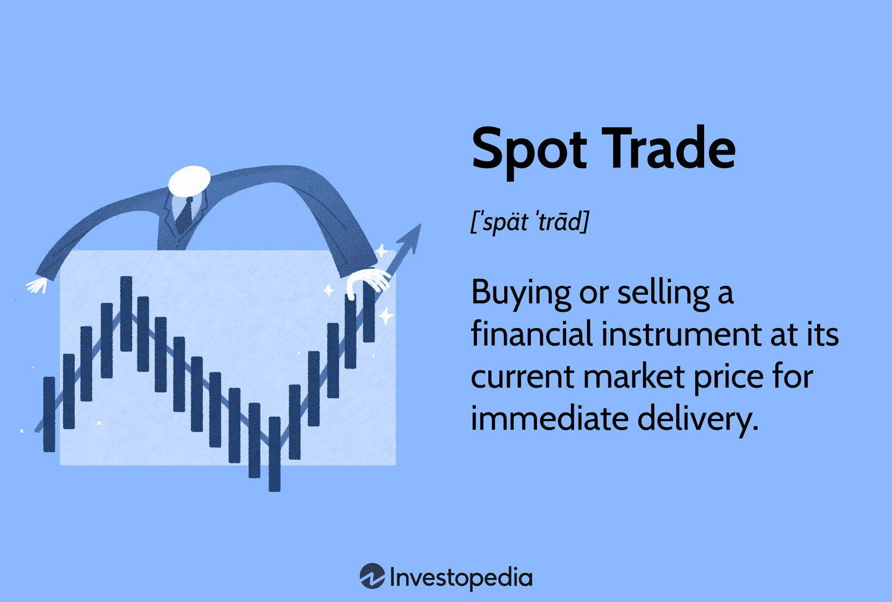

## Table of Contents

## What is spot trading and how does it work?

Spot trading is when you buy or sell something right away at the current price. It's like going to a store and buying a candy bar. You pay the price that's on the shelf and take the candy home with you. In spot trading, you're trading things like stocks, currencies, or cryptocurrencies, and you get them right after you pay.

When you do spot trading, you look at the current price of what you want to buy or sell. If you think the price is good, you make a trade. For example, if you want to buy some Bitcoin, you check the price and decide if you want to buy it now. If you do, you complete the trade and the Bitcoin is yours. It's simple and quick, and you don't have to wait to get what you traded for.

## What are the basic principles of trading that beginners should know?

Trading is all about buying and selling things like stocks, currencies, or cryptocurrencies to make a profit. The basic idea is to buy something when its price is low and sell it when the price goes up. This sounds easy, but it can be tricky because prices can go up and down a lot. It's important to do your homework and learn about what you're trading. You need to understand what can make the price go up or down, like news or trends. Also, you should start small and not risk too much money at first. It's better to learn slowly and not lose a lot of money while you're still figuring things out.

Another key principle is to have a plan and stick to it. This means deciding ahead of time when you will buy and sell, and not letting your emotions make you change your mind. It's easy to get excited or scared when prices move a lot, but good traders stay calm and follow their plan. It's also helpful to use tools like stop-loss orders, which can help you limit how much money you might lose if the price goes against you. Remember, trading is not just about making quick money; it's about learning, planning, and being patient.

## How can beginners start spot trading?

To start spot trading, beginners should first choose a reliable trading platform or exchange. Look for one that is easy to use and has good reviews. You'll need to sign up for an account, which usually involves providing some personal information and verifying your identity. Once your account is set up, you'll need to deposit money into it. This money will be used to buy whatever you want to trade, like stocks or cryptocurrencies. Make sure to start with an amount you're comfortable losing, as trading can be risky.

After setting up your account and adding money, you can start trading. Begin by picking what you want to trade. It's a good idea to start with something you know about or have researched. Look at the current price of what you want to buy, and if you think it's a good price, you can place an order to buy it. Once you own it, you can sell it later if the price goes up. Remember to take your time and learn as you go. Trading takes practice, so don't be discouraged if you don't make money right away.

## What are the risks associated with spot trading?

Spot trading can be risky because prices can go up and down a lot. If you buy something and the price goes down, you could lose money. This is called market risk. Another risk is that you might not know enough about what you're trading. If you don't do your homework, you might make bad choices and lose money. Also, sometimes trading platforms can have problems or even go out of business, which could mean you lose your money or can't trade when you want to.

Another thing to watch out for is your own feelings. It's easy to get excited or scared when prices move a lot, and this can make you do things you hadn't planned on. For example, you might sell something too soon because you're scared the price will keep going down, even if your plan was to hold onto it longer. This is called emotional risk. To manage these risks, it's important to learn as much as you can, start with small amounts of money, and always have a plan for when to buy and sell.

## How can traders manage their risk when spot trading?

To manage risk when spot trading, traders should first start with a clear plan. This means deciding ahead of time what to buy, when to buy it, and when to sell it. Using tools like stop-loss orders can help limit how much money you might lose if the price goes down. A stop-loss order automatically sells your trade if the price drops to a certain level, so you don't lose more than you're okay with. It's also smart to only use money you can afford to lose, so you don't get into financial trouble if things go wrong.

Another way to manage risk is by spreading your money around, which is called diversification. Instead of putting all your money into one thing, you can buy different kinds of things. This way, if one goes down in price, the others might go up and help balance out your losses. It's also important to keep learning and staying updated on what's happening in the market. The more you know, the better you can predict what might happen and make smarter choices. Remember, trading involves risk, but by planning ahead and being careful, you can manage that risk better.

## What are the key factors that affect profitability in spot trading?

The main thing that affects how much money you can make in spot trading is the price of what you're trading. If you buy something and the price goes up, you can sell it for more money and make a profit. But if the price goes down, you might lose money. So, it's really important to understand what can make the price go up or down. Things like news, trends, and even what other people are doing can change prices. If you can guess these things right, you have a better chance of making money.

Another big factor is how much you know about trading. If you don't know much, you might make bad choices and lose money. But if you learn a lot and do your homework, you can make better choices and maybe make more money. It's also important to have a good plan and stick to it. If you let your feelings make you change your mind, you might not do as well. So, learning, planning, and staying calm can really help you make more money in spot trading.

## How can technical analysis be used to improve spot trading profitability?

Technical analysis is a way to look at past prices and other data to try to guess what prices will do next. It can help you spot patterns and trends that might tell you when to buy or sell. For example, if you see that a price has been going up and down in a certain way, you might think it will keep doing that. You can use charts and tools like moving averages or support and resistance levels to help you make these guesses. By looking at these things, you can make better choices about when to trade and maybe make more money.

Using technical analysis also helps you set clear rules for when to buy and sell. This can stop you from making quick decisions based on your feelings. For example, if you see that a price is about to hit a support level, you might decide that's a good time to buy. Or if it's about to break through a resistance level, you might decide to sell. By sticking to these rules, you can make your trading more organized and less risky. Over time, this can help you make more money by making smarter and more disciplined choices.

## What role does fundamental analysis play in spot trading?

Fundamental analysis is about looking at the basic things that can affect the price of what you're trading. It's like checking if a company is doing well or if a country's economy is strong. For example, if you're trading stocks, you might look at a company's earnings, how much money it makes, and what people think about its future. If you're trading currencies, you might look at things like a country's interest rates, how much it's growing, and what's happening in its economy. By understanding these things, you can make better guesses about whether the price will go up or down.

Using fundamental analysis can help you make smarter choices in spot trading. If you think a company's earnings will go up, you might decide to buy its stock now, hoping to sell it later for more money. Or if you think a country's economy is going to get worse, you might decide to sell its currency. This kind of analysis takes time and research, but it can give you a good idea of what might happen in the future. By combining fundamental analysis with other tools like technical analysis, you can make more informed decisions and maybe make more money in spot trading.

## How do market trends and economic indicators influence spot trading decisions?

Market trends and economic indicators are really important for making good choices in spot trading. Market trends are like the general direction that prices are going. If you see that a lot of people are buying a certain stock or currency, it might be a good time for you to buy it too. Economic indicators are things like how many people have jobs, how much stuff a country is making, and how much prices are going up. These things can tell you if an economy is doing well or not. If the economy is doing well, prices might go up, and that could be a good time to buy.

When you're spot trading, you need to keep an eye on these trends and indicators. For example, if you see that a country's unemployment rate is going down, that might mean more people have money to spend, which could make the country's currency go up in value. Or if you see that a company is making more money than before, that might make its stock price go up. By watching these things, you can guess what might happen next and make better choices about when to buy or sell. It's like putting together a puzzle to see the bigger picture of what's happening in the market.

## What advanced strategies can expert traders use to maximize profitability in spot trading?

Expert traders often use a strategy called scalping to make quick, small profits from tiny price changes. They watch the market very closely and might make many trades in a single day. This requires a lot of focus and fast decision-making. Scalpers use technical analysis tools like charts and indicators to spot short-term trends and patterns. They also need to manage their risk carefully, often using stop-loss orders to limit how much they might lose on each trade. This way, even if they don't win every time, they can still make money overall.

Another advanced strategy is called swing trading, where traders hold onto their trades for a few days or weeks to catch bigger price moves. They use both technical and fundamental analysis to find good times to buy and sell. Swing traders look for patterns in the market that suggest a price might go up or down soon. They also keep an eye on news and economic reports that could affect what they're trading. By combining these different kinds of information, swing traders can make more informed decisions and aim for bigger profits, but they also need to be patient and stick to their plan.

## How can traders use algorithmic trading to enhance their spot trading performance?

Algorithmic trading is when you use computer programs to make trades for you. These programs can look at a lot of information really fast and make decisions based on rules you set up. For example, you can tell the program to buy a stock if its price goes below a certain level, or to sell it if the price goes above another level. This can help you spot good trading chances quicker than if you were doing it all by yourself. It also helps you stick to your plan and not let your feelings mess up your trading.

Using algorithmic trading can make your spot trading better because it can handle a lot of trades at the same time. This means you can trade more things and maybe make more money. It's also good for strategies like scalping, where you need to make quick trades based on tiny price changes. But you need to be careful and keep an eye on your algorithms to make sure they're working right. Sometimes, the market can change in ways you didn't expect, and you need to be ready to change your rules if that happens.

## What are the psychological aspects of trading that can impact profitability and how can they be managed?

Trading can be hard on your mind because it can make you feel a lot of different emotions. When prices go up and down a lot, you might feel excited, scared, or even greedy. These feelings can make you do things you hadn't planned on, like selling too soon because you're scared or holding onto something too long because you're hoping for more money. This is called emotional trading, and it can make you lose money if you don't watch out. It's important to know that everyone feels these emotions when they trade, but good traders learn how to control them.

To manage these feelings, you need to have a good plan and stick to it. This means deciding ahead of time when you will buy and sell, and not letting your emotions change your mind. It can also help to take breaks and not trade all the time. Sometimes, stepping away from the screen can help you think more clearly. Another good idea is to talk to other traders or a mentor who can help you stay calm and focused. By learning to control your emotions, you can make better choices and maybe make more money in the long run.

