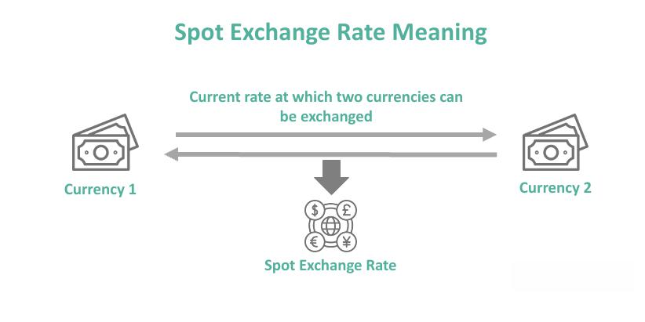

Algorithmic trading, commonly known as algo trading, has significantly transformed financial markets by automating trading processes and enhancing decision-making accuracy. This method employs advanced computing algorithms to execute trades at speeds and frequencies that are impossible for human traders. Spot algo trading, a specific subset of algorithmic trading, is particularly noted for its ability to operate effectively in real-time markets. Unlike derivatives such as futures or options, which commit to trades at a later date, spot markets involve the immediate exchange of financial instruments, such as currencies and commodities. 

Spot algo trading leverages high-speed data processing and sophisticated algorithms to execute these rapid transactions, ensuring that trades align with the latest market conditions. This capability to quickly adapt and execute actions enables traders to optimize their strategies and improve return on investment. With its focus on immediacy, spot algo trading is particularly suited for markets characterized by high liquidity and rapid price changes, such as foreign exchange (Forex) and commodities. 



The increased adoption of spot algo trading is largely driven by its potential to offer significant advantages in speed, efficiency, and risk management, enhancing the agility with which traders can react to market fluctuations. As a result, it has become a favored approach for traders looking to capitalize on the fast-paced nature of financial markets. Understanding the implementation of spot algo trading and its implications is crucial for navigating the increasingly complex trading landscape effectively.

## Table of Contents

## Understanding Spot Algorithmic Trading

Spot algorithmic trading utilizes sophisticated algorithms to execute trades in the spot market efficiently and effectively. The spot market is characterized by transactions for immediate delivery of assets, such as currencies, commodities, and securities. This immediacy distinguishes spot trading from derivatives markets like futures or options, which are scheduled for future execution. The real-time nature of spot trading necessitates rapid decision-making, which is precisely where algorithmic trading excels.

Algorithms deployed in spot trading are designed to process vast amounts of market data swiftly, enabling them to identify profitable trading opportunities almost instantaneously. This capability is crucial for exploiting small price differences in highly liquid markets where conditions can change in fractions of a second. The automation inherent in algorithmic systems ensures that trades are executed not only quickly but also with high precision, minimizing human error and maximizing potential gains.

One of the core strengths of algorithmic trading in the spot market is its ability to operate without emotional bias. Unlike human traders, algorithms make decisions based solely on predefined criteria and data analysis. This consistency can lead to more disciplined trading strategies, as the algorithms adhere strictly to the set rules and do not deviate due to fear or greed.

Moreover, spot [algorithmic trading](/wiki/algorithmic-trading) can seamlessly integrate risk management strategies within its framework. Algorithms can dynamically adjust trade sizes, set stop-loss levels, and apply hedging techniques based on real-time market assessments, thereby safeguarding investments against sudden market fluctuations.

By leveraging the computational power of modern technology, spot algorithmic trading manages to achieve a level of efficiency and responsiveness that is unattainable through traditional trading methods. As such, it serves as a vital tool for traders who operate in markets that demand immediacy and accuracy.

## How Spot Algorithmic Trading Works

Spot algorithmic trading, or spot algo trading, involves a series of methodical processes aimed at optimizing the execution of trades in the spot market. Here's how it works:

1. **Data Collection and Analysis**: The foundation of spot algo trading is the collection and analysis of real-time market data. Algorithms continuously gather vast amounts of data from the market, including price movements, trading volumes, and other relevant indicators. This data is then analyzed to identify trading signals, which are cues or patterns that suggest potential trading opportunities. The analysis often involves statistical methods, machine learning algorithms, and historical data comparison to enhance accuracy and predictive power.

2. **Signal Generation**: After analyzing the data, the algorithm generates precise trading signals. These signals specify the exact conditions under which a trade should be executed, such as when a particular asset reaches a certain price or when market conditions align with a designated pattern. Signal generation is crucial because it removes human emotion and bias from the decision-making process, leading to more objective and consistent trading decisions.

3. **Trade Execution**: Once a trading signal is generated, the algorithm has the capability to execute trades automatically. This automation ensures that trades are conducted quickly and at the optimal prices, essential in the fast-paced spot markets where delays can result in missed opportunities or suboptimal prices. Automated execution also allows traders to exploit short-lived market inefficiencies.

4. **Risk Management**: Effective risk management is a core component of spot algo trading. Algorithms incorporate strategies to manage risk by adjusting trade sizes, diversifying trade positions, and setting stop-loss orders. These measures help in mitigating potential losses due to market volatility and unforeseen events. By continuously monitoring risk exposure, the algorithm maintains an equilibrium between the potential profit and the acceptable level of risk.

5. **Continuous Monitoring and Optimization**: The performance of trading algorithms is not static; they require ongoing evaluation and refinement. Continuous monitoring ensures that the algorithm adapts to changing market conditions and maintains efficiency. This involves tweaking the algorithm parameters, incorporating new data insights, and updating the underlying models. Modern spot algo trading systems often employ machine learning techniques to self-optimize, thereby improving accuracy and trading outcomes over time.

Each of these processes contributes to the robustness of spot algorithmic trading systems, enabling them to function effectively in dynamic and liquid financial markets. As technology and data analytics advance, the potential for further enhancements in these processes continues to grow, offering more sophisticated tools for traders.

## Advantages of Spot Algorithmic Trading

Spot algorithmic trading offers numerous advantages that significantly enhance trading operations in financial markets:

1. **Speed and Efficiency**: The ability of algorithms to execute trades at speeds unattainable by human traders is a crucial factor in gaining competitive advantages in fast-paced markets. Algorithms can complete complex computations and place trades in milliseconds. This speed ensures that traders can capitalize on fleeting market opportunities and optimal pricing points, significantly reducing latency and slippage, which are common issues associated with manual trading.

2. **Consistency and Discipline**: One of the greatest challenges human traders face is controlling emotional responses that can lead to inconsistent decision-making. Spot algorithmic trading mitigates these issues by adhering strictly to predefined rules and criteria for executing trades. This rule-based approach eliminates emotional biases and enhances the consistency of trading strategies, ensuring that trades are executed based solely on logical market analysis.

3. **Complex Strategy Handling**: Spot algorithmic trading systems are capable of managing and executing complex trading strategies that would be challenging for a human to oversee simultaneously. These strategies often involve multiple assets and diverse markets, allowing traders to achieve better diversification and risk management. Algorithms can instantly evaluate multiple data sources and hedge positions to minimize risk while maximizing potential returns.

4. **Effective Risk Management**: Enhanced risk management is another prominent benefit of spot algorithmic trading. Algorithms incorporate sophisticated risk management frameworks, such as stop-loss orders, trailing stops, and position-sizing techniques, which help protect the portfolio from adverse market movements. Moreover, algorithms can dynamically adjust trading positions based on real-time market data and volatility metrics, offering a robust defense against unexpected market conditions.

5. **Scalability**: Unlike manual trading, which limits the number of trades a human can effectively manage, algorithmic trading systems can handle vast amounts of data and execute numerous trades simultaneously. This scalability allows traders to manage extensive portfolios and engage with several markets at once, potentially leading to increased profit opportunities. The ability to scale operations without an accompanying rise in human resource costs makes spot algorithmic trading particularly attractive to institutional investors and hedge funds.

Each of these advantages positions spot algorithmic trading as a formidable tool for modern traders, providing a strategic edge in an increasingly complex and dynamic financial landscape.

## Challenges of Spot Algorithmic Trading

Spot algorithmic trading, despite its myriad benefits, is not devoid of challenges that traders and developers must acknowledge and manage adeptly. 

1. **Technical Complexity**: Spot algorithmic trading demands a sophisticated understanding of both financial markets and programming. Developing effective trading algorithms necessitates knowledge of market microstructure, financial instruments, and statistical techniques for signal processing and analysis. Furthermore, coding these algorithms requires proficiency in programming languages such as Python or C++. Below is a simple Python example illustrating a basic trading strategy using the Pandas library to calculate moving averages, a common tool in algorithmic trading:

    ```python
    import pandas as pd

    # Load historical price data into a DataFrame
    data = pd.read_csv('historical_prices.csv')

    # Calculate short and long moving averages
    short_ma = data['Close'].rolling(window=5).mean()
    long_ma = data['Close'].rolling(window=20).mean()

    # Generate trade signals
    data['Signal'] = 0
    data.loc[short_ma > long_ma, 'Signal'] = 1  # Buy signal
    data.loc[short_ma < long_ma, 'Signal'] = -1  # Sell signal

    # Display signals
    print(data[['Date', 'Signal']])
    ```

2. **Market Risks**: Algorithms, while powerful, are not infallible. They operate based on historical data and predefined rules, which can lead to misinterpretation of market trends if the market behavior deviates from the established patterns. For instance, sudden geopolitical events or anomalous financial disclosures can result in erratic market movements that algorithms might not be configured to handle effectively. Constant monitoring and adjustment of algorithms are necessary to ensure that they continue to operate optimally in volatile conditions. 

3. **Technology Dependency**: Spot algo trading is heavily reliant on technology infrastructure, which introduces potential vulnerabilities. The health of server operations, the quality of data feeds, and network latency are critical components that influence the performance of trading algorithms. A failure in any part of this infrastructure, such as server downtime or data feed interruptions, can have significant financial implications. Furthermore, cybersecurity threats pose another layer of risk, as trading platforms are potential targets for cyber attacks that could disrupt operations or compromise sensitive financial data.

Understanding and addressing these challenges is crucial for traders seeking to harness the full potential of spot algorithmic trading. Maintaining a balanced focus on algorithmic strategy development and infrastructure reliability is essential to navigate the technical complexities and market uncertainties inherent in this trading approach.

## Conclusion

Spot algorithmic trading represents a powerful toolset for traders aiming for rapid and seamless market engagement. The use of sophisticated algorithms enables immediate execution of trades, providing a notable edge in fast-paced trading environments where timing and precision are crucial. This technology facilitates not only speed but also consistency by eliminating human biases and emotional decision-making, allowing for more disciplined trading practices.

Despite its numerous advantages, spot algorithmic trading presents certain challenges. The technical complexity of developing and deploying these algorithms demands a profound understanding of both financial markets and programming skills. Furthermore, while algorithms are designed to interpret vast amounts of market data swiftly, they can occasionally misread market trends, necessitating vigilant oversight. Additionally, the dependence on technological infrastructure subjects these systems to potential vulnerabilities, such as outages or cyber threats.

Traders aiming to capitalize on the benefits of spot algorithmic trading must navigate these intricacies thoughtfully. A comprehensive grasp of the associated risks and technical requirements is indispensable to leveraging its full potential effectively. Mastery over these elements will allow traders to harness the advantages of spot algorithmic trading, thereby enhancing their strategic capability in the modern financial landscape.

## References & Further Reading

[1]: Bergstra, J., Bardenet, R., Bengio, Y., & Kégl, B. (2011). ["Algorithms for Hyper-Parameter Optimization."](https://dl.acm.org/doi/10.5555/2986459.2986743) Advances in Neural Information Processing Systems 24.

[2]: ["Advances in Financial Machine Learning"](https://www.amazon.com/Advances-Financial-Machine-Learning-Marcos/dp/1119482089) by Marcos Lopez de Prado

[3]: ["Evidence-Based Technical Analysis: Applying the Scientific Method and Statistical Inference to Trading Signals"](https://www.amazon.com/Evidence-Based-Technical-Analysis-Scientific-Statistical/dp/0470008741) by David Aronson

[4]: ["Machine Learning for Algorithmic Trading"](https://github.com/stefan-jansen/machine-learning-for-trading) by Stefan Jansen

[5]: ["Quantitative Trading: How to Build Your Own Algorithmic Trading Business"](https://books.google.com/books/about/Quantitative_Trading.html?id=j70yEAAAQBAJ) by Ernest P. Chan