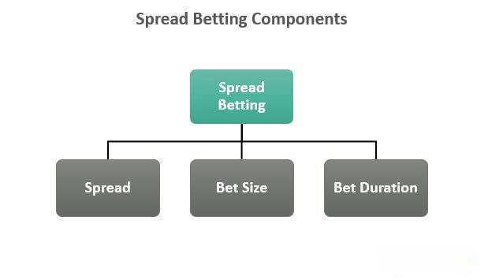

In the ever-evolving world of financial markets, traders constantly seek innovative ways to gain an edge. Two such prominent methods are spread betting and algorithmic trading. Spread betting involves speculating on the price movements of financial instruments without owning the underlying assets, allowing for high leverage and potential tax advantages in certain jurisdictions. On the other hand, algorithmic trading employs computer algorithms to execute trades swiftly based on predefined criteria, optimizing trading strategies through speed and precision.

Understanding these concepts is essential for traders aiming to harness technology and market strategies to maximize potential profits. With spread betting, traders can place bets on price movements, thereby engaging in a speculative form of financial trading offering flexibility and significant risk-reward potential. Algorithmic trading enables rapid decision-making by automating the trading process, often capitalizing on small market inefficiencies with precision.



This article explores the mechanics of financial betting, particularly focusing on the interaction between spread betting and algorithmic trading. Spanning the basics of each method, their respective benefits, and their integration, it provides a detailed view of how these strategies coalesce to form sophisticated trading strategies. By understanding their individual and combined functionalities, traders can refine their approach and enhance their trading performance.

By the conclusion of this article, you will gain a comprehensive understanding of how these financial betting mechanisms operate in practice. Whether considering the tax benefits of spread betting or the precision of algorithmic strategies, integrating these methods can potentially yield significant enhancements in trade execution and profitability, paving the way for success in complex financial markets.

## Table of Contents

## Understanding Financial Betting

Financial betting revolves around predicting the future movement of asset prices, allowing traders to adopt long or short positions based on their market forecasts. Unlike traditional investing, which involves the purchase and ownership of financial instruments, financial betting focuses on speculating about price changes without actual ownership of the asset. This fundamental difference provides unique opportunities and risks, attracting traders who seek both high returns and flexibility.

A defining appeal of financial betting is its potential for significant profits. Traders can generate returns by correctly predicting market movements, without having to manage or maintain an investment portfolio. This possibility of high returns comes with the necessity for a comprehensive understanding of market dynamics, as financial markets are influenced by a myriad of factors including macroeconomic indicators, geopolitical events, and market sentiment.

Key terminologies and mechanisms are essential to understand in financial betting. This encompasses comprehending terms such as 'spreads', 'leverage', and 'margins', as well as understanding how these components interact in a trading environment. A spread, for example, is the difference between the buy and sell prices set by a broker, which can significantly impact the cost of executing trades.

Spread betting and [algorithmic trading](/wiki/algorithmic-trading) represent two prevalent approaches within financial betting. While spread betting allows traders to speculate on price movements in a leveraged manner with potential tax advantages, algorithmic trading leverages computer algorithms to automate trading decisions based on predefined rules and strategies. Each method employs distinct tools and strategies, providing different pathways for traders to achieve their financial objectives. Understanding these methods is essential for traders seeking to engage in financial betting, as they offer a spectrum of possibilities for market participation without owning the assets involved.

## What is Spread Betting?

Spread betting is a leveraged trading strategy that allows traders to speculate on the price movement of financial markets without the necessity of owning the underlying asset. It operates on the principle of predicting whether an asset's price will increase or decrease over a set time period. When traders correctly anticipate an asset's trajectory, they profit proportional to the extent of the price movement. The profitability hinges on the accuracy of the price prediction and the magnitude of the asset's price change.

In practical terms, the spread in spread betting refers to the difference between the buying (bid) and selling (ask) prices set by the broker. This spread functions as the broker's profit margin and is a critical [factor](/wiki/factor-investing) traders need to consider when placing bets. For instance, if a broker quotes a spread of 2 points on a particular stock trading at 100, then the buy price would be 101, and the sell price would be 99.

A notable advantage of spread betting, particularly in several jurisdictions such as the United Kingdom, is its tax effectiveness. In these regions, profits from spread betting are often exempt from capital gains tax, allowing traders to retain a larger portion of their earnings. This tax exemption, however, is contingent on specific regulations and might not apply universally, necessitating traders to verify their local tax laws.

Despite the allure of potential tax-free gains and the flexibility spread betting offers, it is associated with significant risks, primarily due to its leverage nature. Leverage amplifies both potential profits and losses, meaning that traders can lose more than their initial stake. For example, with a leverage of 10:1, a 5% adverse market move could lead to a 50% loss on the initial investment. Thus, risk management strategies, such as setting stop-loss orders, are pivotal in mitigating these amplified risks. Understanding and effectively managing leverage is crucial for anyone engaging in spread betting to avoid substantial financial losses.

 to Algorithmic Trading

Algorithmic trading, or algo trading, leverages the power of computer algorithms to execute trades based on pre-established criteria and strategies. This advanced trading method allows for rapid decision-making and trade execution, often capitalizing on small inefficiencies in the market that might be difficult for human traders to detect. 

In algorithmic trading, these algorithms are designed to follow strict and predefined rules. For example, a trader might develop an algorithm to buy a stock when its 50-day moving average surpasses its 200-day moving average—a classic indication of a potential upward trend. The programmability of these algorithms means they can be tailored to a wide range of trading strategies, incorporating inputs such as technical indicators, market news events, or even sentiment analysis derived from social media trends.

Algorithmic trading has gained substantial traction among institutional investors due to its ability to manage and execute trades at a scale and speed unattainable by humans alone. The advent of technology, however, is making algo trading increasingly accessible to retail traders, democratizing access to tools that were once exclusive to large financial firms.

An essential benefit of algorithmic trading is its ability to minimize human errors and emotional biases, which often lead to suboptimal trading decisions. Algorithms systematically process input data and produce output decisions without the inconsistencies of human traders. This quality becomes particularly advantageous in high-frequency trading, where the speed of execution significantly impacts profitability.

Despite its advantages, algorithmic trading does demand a profound understanding of both coding and market dynamics. Traders must not only be proficient in programming languages like Python or C++ but also possess a keen insight into financial markets to develop algorithms that can navigate complex market conditions. While Python is often favored for its simplicity and robust libraries, C++ and other languages are also common in environments where execution speed is critical.

Moreover, the deployment and maintenance of trading algorithms require robust infrastructure and constant monitoring. Market conditions can change rapidly, and algorithms must be adaptable to such changes. Technical challenges, such as software glitches or network issues, must be addressed promptly to minimize potential financial losses.

In summary, algorithmic trading represents a fusion of financial acumen and technological innovation. As access to algo trading tools becomes more widespread, both institutional and retail traders increasingly rely on this method to gain an edge in competitive financial markets.

## How Spread Betting and Algo Trading Integrate

Integrating spread betting with algorithmic trading offers traders an innovative approach that leverages the advantages of both methodologies. This integration creates a strategy that combines the leverage inherent in spread betting with the speed and precision afforded by algorithmic trading. 

Algorithmic trading can significantly enhance the process of spread betting by automating trades, thereby minimizing human error and enabling the execution of trades at optimal prices. This automation is particularly beneficial in volatile markets where rapid price fluctuations occur. By employing algorithms, traders can swiftly respond to market movements, ensuring that their positions are continuously aligned with their strategic objectives.

To utilize algorithms effectively in spread betting, traders employ sophisticated systems to analyze vast amounts of data and identify trading opportunities. These systems use various inputs, such as technical indicators, historical data, and real-time market data, to make informed trading decisions. For example, an algorithm may monitor specific price levels where a trader intends to enter or [exit](/wiki/exit-strategy) a trade based on predefined criteria. Python, with its extensive libraries like NumPy and pandas, is a popular choice for developing such algorithms, as illustrated in the basic structure below:

```python
import numpy as np
import pandas as pd

# Simulated example of a simple trading algorithm
def moving_average_strategy(data, short_window, long_window):
    signals = pd.DataFrame(index=data.index)
    signals['price'] = data['price']
    signals['short_mavg'] = data['price'].rolling(window=short_window, min_periods=1).mean()
    signals['long_mavg'] = data['price'].rolling(window=long_window, min_periods=1).mean()
    signals['signal'] = 0.0

    # Generate signals
    signals['signal'][short_window:] = np.where(signals['short_mavg'][short_window:] > signals['long_mavg'][short_window:], 1.0, 0.0)
    signals['positions'] = signals['signal'].diff()

    return signals

# Example usage with dummy data
data = pd.DataFrame({'price': np.random.rand(100)})
signals = moving_average_strategy(data, short_window=5, long_window=20)
```

Traders can manage multiple spread betting transactions simultaneously through algorithmic trading, significantly enhancing efficiency and scalability. The effective development of these integrated strategies requires a strong command of technical skills, including programming and statistical analysis. These skills enable traders to build and refine algorithms that can adapt to changing market conditions and refine trading strategies over time.

Despite the potential for high returns, such integrations should not be approached lightly. The complexity involved requires a deep understanding of both market dynamics and technical disciplines. However, when executed correctly, the strategic combination of spread betting and algorithmic trading has the potential to maximize profits by fully leveraging the strengths of both methods. This integration represents a fusion of quantitative analysis and market insight, offering traders an edge in a competitive financial landscape.

## Risks and Challenges

Both spread betting and algorithmic trading present significant risks that traders must recognize and manage effectively to mitigate potential losses. The leverage inherent in spread betting can magnify losses just as it can amplify gains, meaning that traders might face significant financial hits if their market predictions are incorrect. Employing risk management tools such as stop-loss orders can help manage these risks. A stop-loss order automatically sells a security when its price falls to a certain point, thereby reducing the potential loss.

Algorithmic trading introduces a different set of challenges. It relies heavily on robust systems and requires constant monitoring to ensure that the algorithms function correctly. Market conditions can change quickly, and algorithms must adapt to these changes to maintain effectiveness. Moreover, technical issues like software glitches, network latency, or even hardware failures can result in unintended trades or missed opportunities, potentially leading to financial losses. Therefore, traders must ensure that they operate on reliable and efficient trading platforms capable of supporting their strategies.

Market [volatility](/wiki/volatility-trading-strategies) represents another risk factor for both spread betting and algorithmic trading. Rapid market fluctuations can lead to unexpected price movements, impacting trading outcomes. Hence, traders need to continuously monitor market conditions and be prepared to adjust their strategies accordingly.

Regulatory changes also pose potential risks to traders. Financial markets are subject to regulatory oversight, and changes in laws and regulations can affect trading strategies and profitability. Traders should remain informed about any regulatory developments in the markets they operate in to avoid compliance issues and to adjust their strategies as needed.

In summary, while spread betting and algorithmic trading offer the potential for substantial returns, they also require traders to be vigilant about the associated risks. Effective risk management, ongoing system monitoring, awareness of market conditions, and regulatory compliance are essential for minimizing risks and achieving successful outcomes in these complex trading environments.

## Conclusion

Financial betting, particularly the combination of spread betting with algorithmic trading, presents compelling prospects for traders today. This integration stands out due to its potential to maximize profitability through leveraging technology and strategic market interactions. However, the journey toward such promising returns necessitates a deep comprehension of both the mechanics involved and the inherent risks.

The integration of spread betting and algorithmic trading is not merely a blending of techniques; it requires traders to be well-versed in financial instruments, market behaviors, and the technological frameworks that underpin these strategies. Algorithmic trading, known for its efficiency and precision, can greatly enhance the execution in spread betting markets. Yet, this sophistication comes with challenges that must be diligently managed. An understanding of risk management tools, such as stop-loss orders, and an awareness of market volatility are indispensable to mitigate potential downsides.

As technological advancements continue to reshape trading paradigms, the interplay between spread betting and algorithmic trading is likely to intensify, unlocking new pathways for traders to explore. This ongoing evolution underscores the importance of staying informed about emerging trends and technological innovations. Continuous learning and adaptation are crucial for maintaining a competitive edge and ensuring sustained success in the financial markets.

Embracing the synergy of spread betting and algorithmic trading could redefine trading strategies, offering a blend of leverage and automated precision. Yet, this potential is contingent upon a trader's willingness to remain vigilant, informed, and strategically adaptable to the ever-changing financial landscape.

## References & Further Reading

[1]: Bergstra, J., Bardenet, R., Bengio, Y., & Kégl, B. (2011). ["Algorithms for Hyper-Parameter Optimization."](https://papers.nips.cc/paper/4443-algorithms-for-hyper-parameter-optimization) Advances in Neural Information Processing Systems 24.

[2]: ["Advances in Financial Machine Learning"](https://www.amazon.com/Advances-Financial-Machine-Learning-Marcos/dp/1119482089) by Marcos Lopez de Prado

[3]: ["Evidence-Based Technical Analysis: Applying the Scientific Method and Statistical Inference to Trading Signals"](https://www.amazon.com/Evidence-Based-Technical-Analysis-Scientific-Statistical/dp/0470008741) by David Aronson

[4]: ["Machine Learning for Algorithmic Trading"](https://github.com/stefan-jansen/machine-learning-for-trading) by Stefan Jansen

[5]: ["Quantitative Trading: How to Build Your Own Algorithmic Trading Business"](https://www.amazon.com/Quantitative-Trading-Build-Algorithmic-Business/dp/1119800064) by Ernest P. Chan