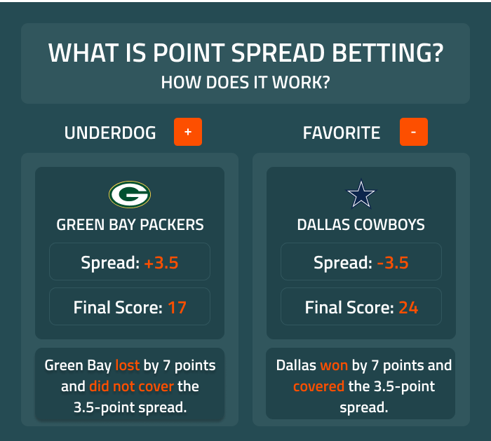

## Table of Contents

## What is spread betting and how does it differ from traditional betting?

Spread betting is a type of betting where you don't just bet on who will win or lose. Instead, you bet on how much a team will win or lose by. For example, if a football team is expected to win by 10 points, you can bet on whether they will win by more or less than 10 points. The amount you win or lose depends on how right or wrong your bet is. If you bet $10 per point and the team wins by 12 points, you win $20 because they won by 2 points more than expected.

Spread betting is different from traditional betting because traditional betting usually involves picking a winner or a specific outcome. For example, in traditional betting, you might bet $100 on a team to win, and if they win, you get a fixed amount back. With spread betting, the amount you win or lose can change a lot because it depends on the final score. This makes spread betting more exciting but also riskier because your potential losses can be bigger if you're wrong.

## What are the key components of a spread bet?

The first key part of a spread bet is the spread itself. This is a number set by the bookmaker that predicts how much one team will beat another by. For example, if the spread is 7 points, the bookmaker thinks one team will win by 7 points. You can bet on whether the team will win by more or less than that number. If you think they'll win by more, you bet on the favorite. If you think they'll win by less, or even lose, you bet on the underdog.

The second key part is the stake, which is how much money you bet per point. If you bet $5 per point and the team wins by 3 more points than the spread, you win $15. But if they win by 3 fewer points than the spread, you lose $15. The amount you win or lose depends on how close your bet is to the actual result. This makes spread betting different from regular betting where you usually win or lose a fixed amount.

## How does the spread work in spread betting?

In spread betting, the spread is a number that the bookmaker sets to predict how much one team will win by. For example, if the spread is 7 points, the bookmaker thinks one team will win by 7 points more than the other team. You can bet on whether the team will win by more than 7 points or less than 7 points. If you think they'll win by more, you bet on the favorite. If you think they'll win by less, or even lose, you bet on the underdog.

The amount you win or lose in spread betting depends on how close your bet is to the actual result. If you bet $5 per point and the team wins by 10 points, which is 3 points more than the spread of 7, you win $15. But if they win by only 4 points, which is 3 points less than the spread, you lose $15. This makes spread betting different from regular betting where you usually win or lose a fixed amount.

## What markets can you bet on using spread betting?

Spread betting is not just for sports. You can use it to bet on many different things, like stocks, shares, and even things like the weather or political events. For example, you might bet on whether the price of a stock will go up or down by a certain amount. Or you could bet on how many inches of rain will fall in a certain area, or how many votes a politician will get in an election.

In sports, spread betting is very popular. You can bet on football, basketball, baseball, and many other sports. The spread is a number that says how much one team is expected to win by. You bet on whether the team will win by more or less than that number. This makes the betting more exciting because your winnings or losses can change a lot depending on the final score.

## What is the difference between going long and going short in spread betting?

In spread betting, going long means you think the price or score will go up. For example, if you're betting on a stock, going long means you think the stock price will be higher than the spread. If you're betting on a sports team, going long means you think they'll win by more points than the spread says. If you're right and the price or score goes up more than the spread, you make money. But if it goes up less than the spread or goes down, you lose money.

Going short is the opposite. It means you think the price or score will go down. If you're betting on a stock, going short means you think the stock price will be lower than the spread. In sports, going short means you think a team will win by fewer points than the spread, or they might even lose. If you're right and the price or score goes down more than the spread, you make money. But if it goes down less than the spread or goes up, you lose money.

## How is the profit or loss calculated in spread betting?

In spread betting, your profit or loss depends on how close your bet is to the actual result. Let's say you bet $5 per point and the spread is 7 points. If you go long and the team wins by 10 points, which is 3 points more than the spread, you make a profit. You multiply the difference (3 points) by your stake ($5 per point), so you win $15. But if the team only wins by 4 points, which is 3 points less than the spread, you lose. You multiply the difference (3 points) by your stake ($5 per point), so you lose $15.

The same idea applies if you go short. If you bet $5 per point and the spread is 7 points, going short means you think the team will win by less than 7 points or lose. If the team wins by only 4 points, which is 3 points less than the spread, you win. You multiply the difference (3 points) by your stake ($5 per point), so you win $15. But if the team wins by 10 points, which is 3 points more than the spread, you lose. You multiply the difference (3 points) by your stake ($5 per point), so you lose $15.

## What are the risks associated with spread betting?

Spread betting can be risky because you can lose more money than you bet. If you bet $5 per point and the result is very different from what you thought, you could lose a lot. For example, if you bet on a team to win by more than the spread and they lose by a lot, you could lose a lot of money. This is different from regular betting where you can only lose what you bet.

Another risk is that spread betting can be hard to understand. It's not just about [picking](/wiki/asset-class-picking) a winner; you have to guess how much a team will win or lose by. This can be tricky and if you get it wrong, you lose money. Also, spread betting can make you want to bet more because it's exciting, but this can lead to bigger losses if you're not careful.

## What strategies can be used to manage risk in spread betting?

One way to manage risk in spread betting is to set a budget and stick to it. Decide how much money you can afford to lose and don't bet more than that. This helps you avoid losing more money than you can handle. Another strategy is to use stop-loss orders. This means you set a limit on how much you're willing to lose on a bet. If the bet goes against you and reaches that limit, it automatically closes, so you don't lose more than you planned.

Another good idea is to bet on markets you know well. If you understand the sport or the stock you're betting on, you'll make better guesses about the spread. It's also smart to start with small bets. This way, you can learn how spread betting works without risking too much money. As you get better and more confident, you can slowly bet more if you want to.

Lastly, don't bet too often. It can be exciting, but betting all the time can lead to big losses. Take breaks and think about each bet carefully. Remember, spread betting is risky, so always be careful and think about the risks before you bet.

## How does leverage work in spread betting and what are its implications?

Leverage in spread betting means you can bet with more money than you actually have. For example, if you have $100, you might be able to bet with $1,000. This is like borrowing money from the bookmaker to make a bigger bet. If you win, you can make a lot more money than if you bet with just your own money. But if you lose, you can lose a lot more money too. This makes spread betting very risky because your losses can be much bigger than your original bet.

The implications of using leverage are important to understand. Because you can bet with more money, the potential for big wins is there, but so is the potential for big losses. If the market moves against you, you could lose more than you put in. This is why it's crucial to use leverage carefully and always have a plan for managing your risks. If you're not careful, leverage can lead to big financial problems, so it's important to know what you're doing before you start using it in spread betting.

## What are the tax implications of spread betting?

Spread betting is treated differently for taxes than regular betting. In many countries, like the UK, spread betting is considered gambling. This means you don't have to pay taxes on your winnings. If you make money from spread betting, you get to keep it all without the government taking a share. This is different from other types of investments, where you might have to pay taxes on your profits.

However, the tax rules can change depending on where you live. It's a good idea to check the tax laws in your country to make sure you're following them. Even though spread betting might be tax-free in one place, it could be different somewhere else. Always do your research or talk to a tax expert to make sure you know what you need to do about taxes when you're spread betting.

## How can one start spread betting and what platforms are available?

To start spread betting, you first need to choose a reliable spread betting platform. Look for platforms that are regulated and have good reviews. Once you've picked a platform, you'll need to sign up and create an account. You'll have to give some personal information and maybe some documents to prove who you are. After your account is set up, you can add money to it. Most platforms let you use a credit card, bank transfer, or other ways to put money in. Once you have money in your account, you can start making bets.

There are many platforms where you can do spread betting. Some popular ones are IG, Spreadex, and Sporting Index. These platforms let you bet on lots of different things, like sports, stocks, and even the weather. Each platform has its own way of working, so it's a good idea to try a few to see which one you like best. Some platforms also let you practice with fake money before you start betting with real money. This can help you learn how spread betting works without risking your own cash.

## What advanced techniques can experts use to enhance their spread betting performance?

Experts in spread betting often use advanced techniques like technical analysis to predict how prices or scores will move. They look at charts and patterns to guess what might happen next. For example, they might use moving averages to see if a stock price is going up or down over time. They also use indicators like the Relative Strength Index (RSI) to see if a stock is overbought or oversold. This helps them decide when to go long or short. By understanding these patterns and indicators, experts can make better guesses about the spread and increase their chances of winning.

Another technique experts use is called hedging. This means they make bets that can protect them from losing too much money if things go wrong. For example, if they bet on a stock to go up, they might also bet on it to go down, but with less money. This way, if the stock goes down, they lose less money overall. Hedging can be tricky, but it's a way to manage risk and keep losses small. By using these advanced techniques, experts can improve their spread betting performance and make smarter bets.

## References & Further Reading

[1]: Bergstra, J., Bardenet, R., Bengio, Y., & Kégl, B. (2011). ["Algorithms for Hyper-Parameter Optimization."](https://papers.nips.cc/paper/4443-algorithms-for-hyper-parameter-optimization) Advances in Neural Information Processing Systems 24.

[2]: ["Advances in Financial Machine Learning"](https://www.amazon.com/Advances-Financial-Machine-Learning-Marcos/dp/1119482089) by Marcos Lopez de Prado

[3]: ["Evidence-Based Technical Analysis: Applying the Scientific Method and Statistical Inference to Trading Signals"](https://www.amazon.com/Evidence-Based-Technical-Analysis-Scientific-Statistical/dp/0470008741) by David Aronson

[4]: ["Machine Learning for Algorithmic Trading"](https://github.com/stefan-jansen/machine-learning-for-trading) by Stefan Jansen

[5]: ["Quantitative Trading: How to Build Your Own Algorithmic Trading Business"](https://www.amazon.com/Quantitative-Trading-Build-Algorithmic-Business/dp/1119800064) by Ernest P. Chan