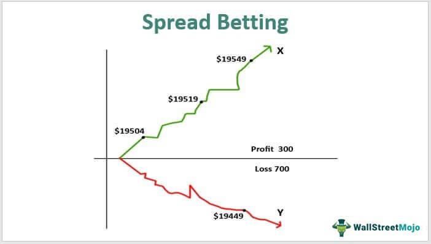

Risk management is essential in financial trading, particularly within the speculative domains of spread betting and algorithmic trading. These financial activities emphasize the importance of strategies to manage risks effectively, ensuring that traders can safeguard their investments while pursuing lucrative opportunities.

Spread betting, inherently speculative, allows traders to take positions on the price movements of various financial markets without owning the underlying assets. This method of trading offers the potential for significant gains; however, it also carries substantial risks, which necessitates robust risk management practices. Key to successful spread betting is the capacity to minimize potential losses, a goal that can be achieved through methods like setting stop-loss orders and leveraging market analysis tools.



Similarly, algorithmic trading, a more data-driven approach, employs automated systems to execute trades based on predefined rules and strategies. The promise of algorithmic trading lies in its ability to process vast amounts of data at high speeds, creating opportunities for profit that manual trading could overlook. However, the volatile nature of financial markets demands comprehensive risk assessment and management to mitigate the risks associated with algorithmic systems. This involves continually refining algorithms to adapt to changing market dynamics and employing real-time monitoring to adjust strategies swiftly in response to market fluctuations.

The interplay between spread betting, algorithmic trading, and risk management showcases the necessity of understanding and managing the trade-offs between risk and reward. By integrating systematic risk management practices, traders can enhance their ability to optimize trades for profitability while mitigating the potential downsides inherent in these speculative markets. Through disciplined strategies, informed decision-making, and the use of advanced tools, traders can effectively navigate the complexities of spread betting and algorithmic trading, securing better outcomes in the financial landscape.

## Table of Contents

## Understanding Spread Betting and Algorithmic Trading

Spread betting and algorithmic trading are two distinct yet increasingly popular methods in financial trading. Both allow traders to capitalize on market fluctuations, but each operates with unique mechanisms and strategies.

Spread betting enables traders to speculate on the price movement of a variety of financial markets without purchasing the underlying asset. Instead, traders bet on whether the price will rise or fall. The spread refers to the difference between the buy (ask) and sell (bid) prices presented by the spread betting company. Profit or loss is determined by the extent to which the market moves in the trader's favor and the size of the bet, usually measured in currency units per point of movement. The flexibility offered by spread betting lies in its ability to trade on margin, providing leverage that can amplify both gains and losses. In jurisdictions like the United Kingdom, spread betting may offer tax advantages, as profits are typically exempt from capital gains tax.

Algorithmic trading, on the other hand, involves the use of computer systems to execute trades based on pre-defined criteria without direct human intervention. These algorithms can analyze market conditions and historical data to identify potential trading opportunities, executing trades at speeds and frequencies impossible for a human trader. The decision-making process in [algorithmic trading](/wiki/algorithmic-trading) relies heavily on mathematical models and statistical analyses to predict short-term price movements and trends. For example, a simple moving average crossover strategy might buy an asset when its short-term moving average surpasses the long-term moving average and sell when the opposite occurs.

Despite the differences, both spread betting and algorithmic trading are underpinned by risk management strategies to protect trades from significant losses. Effective risk assessment is crucial, given the leverage involved in spread betting and the automated nature of algorithmic trading, where a single flaw in the algorithm could lead to substantial financial consequences. By maintaining comprehensive risk management procedures, traders in both domains can optimize their strategies to enhance profitability and minimize potential losses. Techniques such as setting strict stop-loss levels, portfolio diversification, and constant monitoring of strategies are essential components of these risk management practices.

## Key Concepts in Risk Management

Risk management is essential for navigating financial markets effectively, as it helps in mitigating potential losses and optimizing gains. It primarily involves identifying, analyzing, and mitigating risks associated with various financial activities.

One of the fundamental techniques in risk management is setting stop-loss orders. A stop-loss order is a pre-set instruction to sell a security when it reaches a certain price, thereby limiting the trader's potential loss on a position. These orders are particularly useful in volatile markets, where prices can fluctuate rapidly. In spread betting, guaranteed stop-loss orders provide an additional layer of security. A guaranteed stop-loss order ensures that a position is closed at the specified price, even in instances of market gapping or extreme [volatility](/wiki/volatility-trading-strategies), for a small premium fee.

Diversification of portfolios is another critical concept in risk management. It involves spreading investments across various assets to reduce exposure to any single asset or risk. This technique helps in balancing potential returns against potential losses, reducing the overall risk associated with the investment portfolio.

Leverage management is vital in both spread betting and algorithmic trading. Leverage allows traders to control larger positions with a smaller amount of capital, thereby magnifying potential gains. However, it also increases the risk, as losses are similarly magnified. Effective leverage management requires determining the appropriate level of leverage based on the trader's risk tolerance and market conditions. For example, using a leverage ratio, $\mathrm{Leverage} = \frac{\text{Total Exposure}}{\text{Equity}}$, traders can assess the extent of their exposure compared to their actual capital.

In algorithmic trading, risk management extends beyond traditional methods due to the high speed and [volume](/wiki/volume-trading-strategy) of trades executed by algorithms. It requires constant monitoring and the use of statistical models to evaluate the risk-reward setup of each trade. Position sizing and capital allocation models are often used to manage the risk associated with each trade initiated by an algorithm.

Overall, effective risk management strategies are tailored to the specific needs of the trading method, whether it be spread betting or algorithmic trading. Incorporating these practices into trading plans can significantly improve the potential for sustaining profitability while mitigating risks.

## Strategies for Managing Risks in Spread Betting

Spread betting offers traders a way to speculate on price movements without owning the underlying asset. However, it inherently carries risks that need to be effectively managed. Several strategies can be employed to manage these risks, ensuring that potential losses are minimized and profitability is maximized.

### Stop-Loss and Take-Profit Orders

The use of stop-loss and take-profit orders is fundamental in managing risk in spread betting. A stop-loss order is a predetermined price level at which a trade will be automatically closed to prevent further losses. Similarly, a take-profit order sets a target price at which a trader exits the position to lock in profits. These tools are crucial in volatile markets, where prices can move rapidly. For instance, by setting a stop-loss order at a specific percentage below the entry price, traders can ensure that losses are limited to a manageable level. The formula for a stop-loss can be expressed as:

$$
\text{Stop-Loss Price} = \text{Entry Price} - \left( \text{Entry Price} \times \text{Stop-Loss Percentage} \right)
$$

Similarly, the take-profit formula is:

$$
\text{Take-Profit Price} = \text{Entry Price} + \left( \text{Entry Price} \times \text{Take-Profit Percentage} \right)
$$

### Tax Benefits and Leverage Advantages

Different jurisdictions offer varied tax benefits and leverage opportunities that can be used to mitigate risk. In some regions, profits from spread betting are not subject to capital gains tax, offering an advantage over other forms of trading. However, this may not be applicable everywhere, so traders must understand the tax regulations specific to their location.

Leverage, on the other hand, allows traders to control larger positions with a smaller amount of capital. While this amplifies potential returns, it also increases potential losses. Effective use of leverage involves balancing risk exposure with the ability to control larger market positions. Leveraging excessively without adequate risk management can lead to significant losses.

### Arbitrage Opportunities in Risk Mitigation

Arbitrage forms an integral part of financial markets and can be utilized in spread betting to mitigate risk. It involves exploiting price discrepancies in different markets or instruments to secure a risk-free profit. For example, if a discrepancy exists between the price of a stock on a traditional market versus its valuation in a spread betting market, a trader might simultaneously buy and sell the stock to capture the price difference, thereby reducing risk.

Traders can employ algorithmic strategies to identify and execute [arbitrage](/wiki/arbitrage) opportunities. Python code can be utilized to track and capitalize on these opportunities efficiently:

```python
import numpy as np

# Example function to identify arbitrage opportunities
def identify_arbitrage(spread_betting_price, market_price):
    if np.abs(spread_betting_price - market_price) > threshold:
        return True
    return False

# Constants
threshold = 0.5

# Example prices
spread_betting_price = 100.5
market_price = 100.0

# Identify arbitrage opportunity
if identify_arbitrage(spread_betting_price, market_price):
    print("Arbitrage opportunity identified!")
```

Incorporating these strategies aids in managing risk effectively in spread betting, allowing traders to optimize their trades and preserve capital amidst market fluctuations.

## Risk Management in Algorithmic Trading

Algorithmic trading strategies are integral to modern financial markets, leveraging statistical analysis and mathematical models to optimize trade execution. A pivotal component of these strategies is risk management, which ensures that potential losses are minimized while maximizing profit opportunities. 

Backtesting is a fundamental process in algorithmic trading. It involves evaluating trading algorithms using historical data to assess their performance and identify potential risks. Through [backtesting](/wiki/backtesting), traders can gauge the efficacy of their models by analyzing past trading signals and determining whether similar conditions might occur in the future. The primary metrics analyzed during backtesting include the strategy's profitability, risk-adjusted returns, maximum drawdown, and volatility. An effective backtesting procedure should include realistic transaction costs and slippage to provide accurate performance insights.

Real-time monitoring is essential in algorithmic trading to manage risks effectively. The dynamic nature of financial markets means that conditions can shift rapidly, necessitating vigilant oversight of trading algorithms. Real-time monitoring allows traders to detect and respond to abnormalities or unexpected market conditions, such as sudden price movements or spikes in volatility. This process often requires sophisticated software tools that can track trades, market data, and performance metrics continuously.

Adaptive strategies are another critical aspect of risk management in algorithmic trading. These strategies utilize [machine learning](/wiki/machine-learning) and [artificial intelligence](/wiki/ai-artificial-intelligence) to enhance decision-making processes. By continuously analyzing market data, adaptive algorithms can adjust their parameters and rules to align with current market conditions, thereby reducing the risk of losses stemming from outdated or ineffective trading models. This adaptability is crucial for maintaining the relevance and effectiveness of trading strategies as market conditions evolve.

Risk management in algorithmic trading is thus an iterative process involving robust backtesting, continuous real-time monitoring, and the application of adaptive strategies to ensure that trading systems remain resilient and responsive to market changes. By implementing these techniques, traders can enhance the stability and performance of their algorithmic trading portfolios, safeguarding against potential financial setbacks.

## Integrating Risk Management in Algo Trading Systems

In algorithmic trading systems, integrating robust risk management protocols is essential for automating decision-making and mitigating potential losses. These systems should be inherently designed to assess and manage risks effectively, thereby ensuring a stable trading environment. One approach to achieving this is through the implementation of machine learning techniques, which enhance the system's adaptability to constantly evolving market dynamics.

Machine learning algorithms can be employed to analyze large datasets, identify patterns, and anticipate market movements. For instance, supervised learning models such as regression and classification algorithms can predict price movements while unsupervised learning models can cluster similar market behaviors for risk assessment. Reinforcement learning, a technique where algorithms learn optimal trading strategies through trial and error, can be particularly effective in adapting to unforeseen market changes.

The formula for a basic linear regression model, which is a commonly used machine learning technique, is given by:

$$
\hat{y} = \beta_0 + \beta_1 x_1 + \beta_2 x_2 + \ldots + \beta_n x_n
$$

where $\hat{y}$ is the predicted variable, $x_1, x_2, \ldots, x_n$ are the features (market indicators), and $\beta_0, \beta_1, \ldots, \beta_n$ are the coefficients estimated from the data.

Moreover, integrating machine learning within trading systems necessitates a strategy for continuous refinement. This includes regular updating of algorithms with the latest market data to refine predictions and improve model performance. Backtesting remains a critical component, allowing algorithms to simulate trades using historical data and adjust strategies accordingly.

The Python programming language offers robust libraries such as TensorFlow and Scikit-learn that facilitate the development and refinement of machine learning models in trading systems. Here's a simple example of how a linear regression model can be implemented in Python using Scikit-learn:

```python
from sklearn.model_selection import train_test_split
from sklearn.linear_model import LinearRegression
import numpy as np

# Example dataset
X = np.array([[1, 2], [2, 3], [3, 4], [4, 5]])
y = np.array([5, 7, 9, 11])

# Split the dataset into training and testing sets
X_train, X_test, y_train, y_test = train_test_split(X, y, test_size=0.2)

# Initialize the model
model = LinearRegression()

# Train the model
model.fit(X_train, y_train)

# Make predictions
predictions = model.predict(X_test)

print(predictions)
```

Implementing these machine learning techniques and maintaining a culture of continual refinement and evaluation is pivotal to optimizing algorithms for better performance in algorithmic trading. As the trading environment is inherently dynamic, algorithmic systems must evolve in response to new market conditions, ensuring that risk management remains both proactive and effective.

## Conclusion

Effective risk management is central to achieving success in both spread betting and algorithmic trading. These financial activities, characterized by their potential for high returns, inherently [carry](/wiki/carry-trading) significant risk. Thus, a balanced approach to managing this risk, paired with the utilization of sophisticated tools and strategies, is pivotal.

In spread betting, the ability to leverage one's position can amplify both gains and losses, making risk management techniques crucial. This includes the use of stop-loss orders, which automatically close a trade at a predetermined price to prevent excessive losses. Additionally, diversifying investments and employing guaranteed stop-loss orders can provide further security, ensuring that traders do not exceed their acceptable risk thresholds.

Algorithmic trading, meanwhile, necessitates a similar disciplined approach. The reliance on automated systems to execute trades based on complex algorithms introduces both efficiency and new layers of risk. Real-time monitoring is essential to promptly address unexpected market movements, and the continuous refinement of trading algorithms helps to enhance their resilience and effectiveness. Utilizing backtesting allows traders to evaluate the potential performance and risks of these algorithms against historical data, thereby fostering informed decision-making.

For traders participating in either spread betting or algorithmic trading, staying informed is vital. Markets are dynamic, with fluctuating variables and conditions that necessitate a willingness to learn and adapt. By remaining aware of the latest market trends, regulatory changes, and advancements in trading technologies, traders can optimize their strategies and maintain a competitive edge.

Ultimately, the goal of risk management in these contexts is not to eliminate risk entirely but to control and minimize it while capitalizing on potential opportunities for profit. By marrying disciplined risk management practices with cutting-edge tools and continuous learning, traders can effectively balance risk and reward, paving the way for sustainable success in their trading endeavors.

## References & Further Reading

Explore additional materials and references for a comprehensive exploration of risk management and trading strategies in spread betting and algorithmic trading. Below is a curated list of [books](/wiki/algo-trading-books) and research papers that provide in-depth knowledge and advanced methods in these fields.

### Books

1. **Advances in Financial Machine Learning by Marcos Lopez de Prado**
   This book offers insights into the latest machine learning techniques tailored for financial markets, covering both theoretical foundations and practical implementations. Key areas include portfolio management, trading strategies, and backtesting methodologies. The text is particularly useful for understanding how machine learning can enhance risk management and decision-making processes in trading.

2. **Options, Futures, and Other Derivatives by John C. Hull**
   John Hull's comprehensive guide to derivatives markets is an essential resource for anyone looking to understand the intricacies of various financial instruments. The book investigates into options, futures, swaps, and more, with emphasis on practical applications and risk management strategies. It effectively bridges the gap between theoretical finance and real-world applications, making it valuable for traders and risk managers alike.

### Research Papers and Articles

1. **Financial Risk Management: Models, History, and Institutions**
   This paper explores the development and application of risk management models across the financial industry. It emphasizes the importance of adapting historical risk management principles to modern trading environments, including algorithmic and high-frequency trading contexts.

2. **Algorithmic Trading Strategies: A Quantitative Approach**
   Focused on the quantitative aspects of algorithmic trading, this article discusses various strategies employed by traders to achieve optimal trade execution. It also examines the role of statistical and mathematical models in developing robust trading systems and mitigating risk.

3. **Backtesting in Algorithmic Trading: Pitfalls and Opportunities**
   Backtesting is a critical step in evaluating the effectiveness of trading algorithms. This research paper highlights common challenges faced during the backtesting process, such as data-snooping bias and overfitting, while offering solutions to enhance the reliability of backtest results.

These resources offer valuable insights and practical guidance for both novice and experienced traders. Staying informed and continually updating one's knowledge base is imperative to mastering the art of risk management in today's rapidly evolving financial markets.