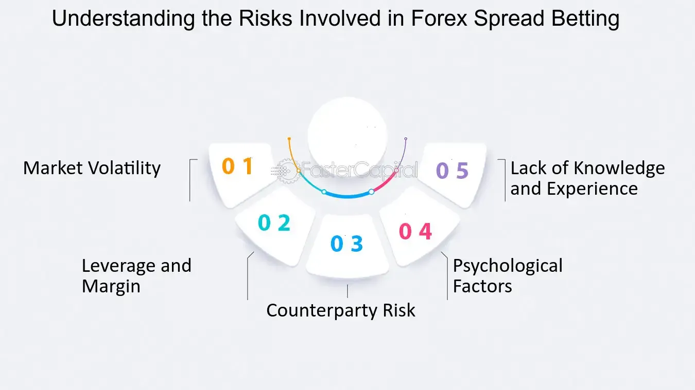

## Table of Contents

## What is spread betting and how does it work?

Spread betting is a way to bet on the outcome of a financial market, like stocks or forex, without actually owning the asset. It's called "spread" betting because you bet on whether the price of the asset will be above or below a certain range, or "spread," set by the betting company. If you think the price will go up, you place a "buy" bet, and if you think it will go down, you place a "sell" bet. The amount you win or lose depends on how much the price moves in your favor or against you.

When you place a spread bet, you don't need to pay the full value of the asset. Instead, you only need to deposit a small amount as a margin. This makes spread betting a high-risk, high-reward activity because you can potentially win or lose a lot of money with a small initial investment. It's important to understand that spread betting is regulated differently in various countries, and it's often considered a form of gambling. Therefore, it's crucial to do your research and understand the risks before you start spread betting.

## What are the key differences between spread betting and traditional betting?

Spread betting and traditional betting are different in a few key ways. With traditional betting, you bet on specific outcomes, like which team will win a sports game or which horse will win a race. You know exactly how much you can win before you place your bet. Spread betting, on the other hand, is more about guessing if a price will go up or down. You bet on how much the price will move, not just if it will win or lose. This means your winnings or losses can change a lot depending on how much the price moves.

Another big difference is how much money you need to start. In traditional betting, you usually have to pay the full amount of your bet upfront. With spread betting, you only need to put down a small deposit, called a margin. This can make spread betting riskier because you can lose more than you initially put in if the market moves against you. Also, spread betting is often seen as a form of financial trading and might be taxed differently than traditional betting, depending on where you live.

## What types of markets can you spread bet on?

Spread betting lets you bet on many different types of markets. You can bet on financial markets like stocks, which are shares in companies, or forex, which is short for foreign exchange and involves trading different currencies. You can also bet on commodities, which are things like gold, oil, or wheat. These markets can change a lot, so spread betting on them can be exciting but also risky.

Besides financial markets, you can also spread bet on sports and other events. For example, you can bet on how many points a team will score in a football game or how many goals will be scored in a soccer match. Some places even let you bet on things like the weather or political events, like who will win an election. The key is that you're betting on how much something will change, not just if it will win or lose.

## How do you place a spread bet?

To place a spread bet, first, you need to choose a market you want to bet on, like stocks, forex, or a sports event. Then, you need to decide if you think the price will go up or down. If you think it will go up, you place a "buy" bet. If you think it will go down, you place a "sell" bet. Next, you need to decide how much you want to bet. This is called your stake. You don't need to pay the full value of the asset; you just need to put down a small deposit called a margin.

Once you've made your choices, you can place your bet through a spread betting company, usually online. The company will set a "spread," which is a range of prices for the asset. If you're right about the price moving in your favor, you can make money. The more the price moves in your direction, the more you can win. But if you're wrong and the price moves against you, you can lose money. The amount you win or lose depends on how much the price changes and the size of your stake.

## What are the basic terms and concepts in spread betting?

Spread betting has some basic terms and ideas you need to know. One is the "spread," which is a range of prices set by the betting company. When you bet, you're guessing if the price will be higher or lower than this spread. Another term is "stake," which is how much money you want to bet. Your stake decides how much you can win or lose. "Buy" bets mean you think the price will go up, and "sell" bets mean you think it will go down. 

Another important idea is "margin." This is a small amount of money you need to put down to place your bet, instead of paying the full value of the asset. This makes spread betting risky because you can lose more than your margin if the price moves against you. "Stop loss" is a tool that can help limit your losses by closing your bet if the price moves too far against you. Understanding these terms and concepts can help you make better decisions when you're spread betting.

## What are the potential benefits of spread betting?

Spread betting can be good because it lets you bet on many different things without buying them. You can bet on stocks, forex, sports, and even things like the weather. This means you can try to make money from lots of different markets. Also, you only need to put down a small amount of money, called a margin, to start betting. This can make it easier to get started, but it also means you can lose more than you put in if things go wrong.

Another benefit is that you can make money whether prices go up or down. If you think a price will go up, you can place a "buy" bet, and if you think it will go down, you can place a "sell" bet. This gives you more ways to make money than just betting on one thing to win. Plus, spread betting is often tax-free in some places, which can mean you keep more of what you win. But remember, spread betting is risky, so it's important to understand the risks and have a plan before you start.

## What are the risks associated with spread betting?

Spread betting can be risky because you might lose more money than you put in. When you bet, you only need to pay a small deposit called a margin. But if the price moves against you, you could lose a lot more than that margin. This is because you're betting on how much the price will change, not just if it will go up or down. So, if the price moves a lot in the wrong direction, your losses can be big.

Another risk is that spread betting can be hard to understand. There are many terms and ideas you need to know, like the spread, stake, and stop loss. If you don't understand these things, you might make bad decisions and lose money. Also, spread betting is often seen as a form of gambling, and it can be addictive. It's important to only bet with money you can afford to lose and to think carefully about the risks before you start.

## How can beginners manage their risks when starting with spread betting?

When you're new to spread betting, it's smart to start small. Only bet with money you can afford to lose, and don't put too much money into one bet. This way, if you lose, you won't lose everything. It's also a good idea to use a "stop loss" order. This tool can help you limit your losses by closing your bet if the price moves too far against you. Think of it like a safety net that stops you from losing too much money.

Another way to manage risk is to learn as much as you can before you start betting. Understand the terms like spread, stake, and margin, and how they work. It's also helpful to practice with a demo account first. Many spread betting companies let you try out betting with fake money so you can get a feel for it without risking real money. Remember, spread betting can be fun, but it's also risky, so take your time and be careful.

## What advanced strategies can be used to manage risk in spread betting?

One advanced strategy for managing risk in spread betting is called hedging. This means you place bets that can help balance out your losses. For example, if you have a "buy" bet on a stock, you might also place a "sell" bet on the same stock but at a different price. This way, if the price goes down, your "sell" bet can help cover the losses from your "buy" bet. Hedging can make things more complicated, but it can also help you lose less money if the market moves against you.

Another strategy is using technical analysis. This means looking at charts and patterns to try to guess where the price might go next. By understanding these patterns, you can make better decisions about when to place your bets and when to close them. You can also use tools like moving averages or support and resistance levels to help you decide where to set your stop loss orders. These strategies take time to learn, but they can help you manage your risks better and make more informed bets.

## How does leverage work in spread betting and what are its implications?

Leverage in spread betting means you can bet on a big amount of money using only a small deposit, called a margin. For example, if you want to bet on a stock that costs $100, you might only need to put down $10 as a margin. This can make your potential winnings bigger because you're betting on a larger amount than you actually paid for. But it also makes things riskier because if the price moves against you, your losses can be much bigger than your margin.

The main implication of using leverage is that it can make spread betting very risky. If the price moves in your favor, you can make a lot of money quickly. But if the price moves against you, you can lose a lot more than the money you put down. This is why it's important to use tools like stop loss orders to help limit your losses. Also, you need to be careful and understand that leverage can make spread betting more like gambling, so you should only bet with money you can afford to lose.

## What are the tax implications of spread betting?

Spread betting is often seen as a form of gambling, and in many places, like the UK, winnings from spread betting are not taxed. This means you don't have to pay taxes on the money you win from spread betting. But this can be different in other countries, so it's a good idea to check the rules where you live before you start betting.

Even though you might not have to pay taxes on your winnings, you still need to be careful. Spread betting can be risky because you can lose a lot of money, especially if you use leverage. So, it's important to understand the risks and only bet with money you can afford to lose. Also, remember that tax laws can change, so it's always a good idea to keep up to date with any new rules that might affect your spread betting.

## How can one use technical analysis to improve spread betting outcomes?

Technical analysis is a way to look at charts and patterns to guess where the price of something might go next. When you're spread betting, you can use technical analysis to help you decide when to place your bets and when to close them. For example, you might see a pattern called a "head and shoulders" on a chart, which some people think means the price will go down soon. If you see this pattern, you might decide to place a "sell" bet, hoping to make money when the price falls. By understanding these patterns, you can make better choices about your bets.

Another way to use technical analysis is by looking at things called moving averages. These are lines on a chart that show the average price of an asset over time. If the price of the asset goes above the moving average, it might be a good time to place a "buy" bet because the price could keep going up. On the other hand, if the price goes below the moving average, you might want to place a "sell" bet because the price could keep going down. Using tools like moving averages can help you find the best times to bet and can also help you set stop loss orders to limit your losses if the price moves against you.

## What are the strategies for managing risks in spread betting?

Spread betting offers traders a way to speculate on price movements without owning the underlying asset. However, it inherently carries risks that need to be effectively managed. Several strategies can be employed to manage these risks, ensuring that potential losses are minimized and profitability is maximized.

### Stop-Loss and Take-Profit Orders

The use of stop-loss and take-profit orders is fundamental in managing risk in spread betting. A stop-loss order is a predetermined price level at which a trade will be automatically closed to prevent further losses. Similarly, a take-profit order sets a target price at which a trader exits the position to lock in profits. These tools are crucial in volatile markets, where prices can move rapidly. For instance, by setting a stop-loss order at a specific percentage below the entry price, traders can ensure that losses are limited to a manageable level. The formula for a stop-loss can be expressed as:

$$
\text{Stop-Loss Price} = \text{Entry Price} - \left( \text{Entry Price} \times \text{Stop-Loss Percentage} \right)
$$

Similarly, the take-profit formula is:

$$
\text{Take-Profit Price} = \text{Entry Price} + \left( \text{Entry Price} \times \text{Take-Profit Percentage} \right)
$$

### Tax Benefits and Leverage Advantages

Different jurisdictions offer varied tax benefits and leverage opportunities that can be used to mitigate risk. In some regions, profits from spread betting are not subject to capital gains tax, offering an advantage over other forms of trading. However, this may not be applicable everywhere, so traders must understand the tax regulations specific to their location.

Leverage, on the other hand, allows traders to control larger positions with a smaller amount of capital. While this amplifies potential returns, it also increases potential losses. Effective use of leverage involves balancing risk exposure with the ability to control larger market positions. Leveraging excessively without adequate risk management can lead to significant losses.

### Arbitrage Opportunities in Risk Mitigation

Arbitrage forms an integral part of financial markets and can be utilized in spread betting to mitigate risk. It involves exploiting price discrepancies in different markets or instruments to secure a risk-free profit. For example, if a discrepancy exists between the price of a stock on a traditional market versus its valuation in a spread betting market, a trader might simultaneously buy and sell the stock to capture the price difference, thereby reducing risk.

Traders can employ algorithmic strategies to identify and execute [arbitrage](/wiki/arbitrage) opportunities. Python code can be utilized to track and capitalize on these opportunities efficiently:

```python
import numpy as np

# Example function to identify arbitrage opportunities
def identify_arbitrage(spread_betting_price, market_price):
    if np.abs(spread_betting_price - market_price) > threshold:
        return True
    return False

# Constants
threshold = 0.5

# Example prices
spread_betting_price = 100.5
market_price = 100.0

# Identify arbitrage opportunity
if identify_arbitrage(spread_betting_price, market_price):
    print("Arbitrage opportunity identified!")
```

Incorporating these strategies aids in managing risk effectively in spread betting, allowing traders to optimize their trades and preserve capital amidst market fluctuations.

## How can risk management be integrated into algorithmic trading systems?

In algorithmic trading systems, integrating robust risk management protocols is essential for automating decision-making and mitigating potential losses. These systems should be inherently designed to assess and manage risks effectively, thereby ensuring a stable trading environment. One approach to achieving this is through the implementation of machine learning techniques, which enhance the system's adaptability to constantly evolving market dynamics.

Machine learning algorithms can be employed to analyze large datasets, identify patterns, and anticipate market movements. For instance, supervised learning models such as regression and classification algorithms can predict price movements while unsupervised learning models can cluster similar market behaviors for risk assessment. Reinforcement learning, a technique where algorithms learn optimal trading strategies through trial and error, can be particularly effective in adapting to unforeseen market changes.

The formula for a basic linear regression model, which is a commonly used machine learning technique, is given by:

$$
\hat{y} = \beta_0 + \beta_1 x_1 + \beta_2 x_2 + \ldots + \beta_n x_n
$$

where $\hat{y}$ is the predicted variable, $x_1, x_2, \ldots, x_n$ are the features (market indicators), and $\beta_0, \beta_1, \ldots, \beta_n$ are the coefficients estimated from the data.

Moreover, integrating machine learning within trading systems necessitates a strategy for continuous refinement. This includes regular updating of algorithms with the latest market data to refine predictions and improve model performance. Backtesting remains a critical component, allowing algorithms to simulate trades using historical data and adjust strategies accordingly.

The Python programming language offers robust libraries such as TensorFlow and Scikit-learn that facilitate the development and refinement of machine learning models in trading systems. Here's a simple example of how a linear regression model can be implemented in Python using Scikit-learn:

```python
from sklearn.model_selection import train_test_split
from sklearn.linear_model import LinearRegression
import numpy as np

# Example dataset
X = np.array([[1, 2], [2, 3], [3, 4], [4, 5]])
y = np.array([5, 7, 9, 11])

# Split the dataset into training and testing sets
X_train, X_test, y_train, y_test = train_test_split(X, y, test_size=0.2)

# Initialize the model
model = LinearRegression()

# Train the model
model.fit(X_train, y_train)

# Make predictions
predictions = model.predict(X_test)

print(predictions)
```

Implementing these machine learning techniques and maintaining a culture of continual refinement and evaluation is pivotal to optimizing algorithms for better performance in algorithmic trading. As the trading environment is inherently dynamic, algorithmic systems must evolve in response to new market conditions, ensuring that risk management remains both proactive and effective.

## References & Further Reading

Explore additional materials and references for a comprehensive exploration of risk management and trading strategies in spread betting and algorithmic trading. Below is a curated list of [books](/wiki/algo-trading-books) and research papers that provide in-depth knowledge and advanced methods in these fields.

### Books

1. **Advances in Financial Machine Learning by Marcos Lopez de Prado**
   This book offers insights into the latest machine learning techniques tailored for financial markets, covering both theoretical foundations and practical implementations. Key areas include portfolio management, trading strategies, and backtesting methodologies. The text is particularly useful for understanding how machine learning can enhance risk management and decision-making processes in trading.

2. **Options, Futures, and Other Derivatives by John C. Hull**
   John Hull's comprehensive guide to derivatives markets is an essential resource for anyone looking to understand the intricacies of various financial instruments. The book investigates into options, futures, swaps, and more, with emphasis on practical applications and risk management strategies. It effectively bridges the gap between theoretical finance and real-world applications, making it valuable for traders and risk managers alike.

### Research Papers and Articles

1. **Financial Risk Management: Models, History, and Institutions**
   This paper explores the development and application of risk management models across the financial industry. It emphasizes the importance of adapting historical risk management principles to modern trading environments, including algorithmic and high-frequency trading contexts.

2. **Algorithmic Trading Strategies: A Quantitative Approach**
   Focused on the quantitative aspects of algorithmic trading, this article discusses various strategies employed by traders to achieve optimal trade execution. It also examines the role of statistical and mathematical models in developing robust trading systems and mitigating risk.

3. **Backtesting in Algorithmic Trading: Pitfalls and Opportunities**
   Backtesting is a critical step in evaluating the effectiveness of trading algorithms. This research paper highlights common challenges faced during the backtesting process, such as data-snooping bias and overfitting, while offering solutions to enhance the reliability of backtest results.

These resources offer valuable insights and practical guidance for both novice and experienced traders. Staying informed and continually updating one's knowledge base is imperative to mastering the art of risk management in today's rapidly evolving financial markets.

