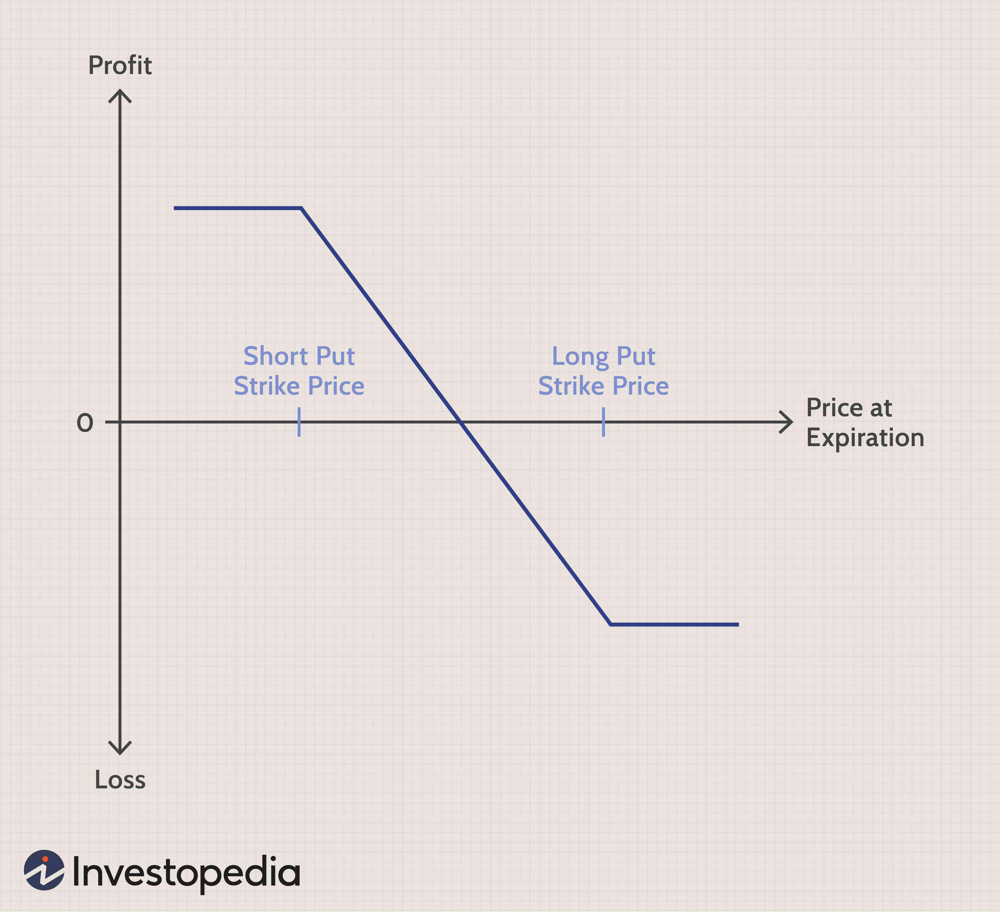

Forex trading, also known as foreign exchange trading, involves the buying and selling of currencies. As a decentralized global market, it boasts a daily trading volume exceeding $6 trillion, making it one of the most actively traded financial markets worldwide. Participants range from large banks and financial institutions to individual retail traders, all seeking to profit from the fluctuations in exchange rates.

A fundamental aspect of forex trading is understanding the forex spread. The spread is the difference between the buying price (bid) and the selling price (ask) of a currency pair. This difference is crucial as it represents the primary cost of trading foreign currencies and plays a significant role in the profitability of trades. The spread size can vary based on factors such as market volatility, liquidity, and the time of day. Thus, grasping the mechanics and implications of forex spreads is essential for any participant aiming to succeed in this market.



This article explores the intricacies of forex spreads, focusing on how they are calculated and their impact on trading strategies, particularly in algorithmic trading. Understanding spreads is not just about comprehension for manual trading; it is crucial for algorithmically driven strategies where the spread can influence decision-making parameters, including trade entry and exit points. By examining these components, traders can better navigate the forex market landscape, optimizing their strategies to minimize costs and enhance potential profits.

## Table of Contents

## Understanding Forex Trading

Forex trading, or foreign exchange trading, is the process of buying and selling national currencies in the global marketplace. The primary aim of forex trading is to profit from changes in exchange rates. Traders speculate on the potential appreciation or depreciation of one currency against another. Unlike other financial markets, forex operates with currency pairs, meaning a trader is always buying one currency while simultaneously selling another. For instance, in the currency pair USD/EUR, a trader buys USD while selling EUR or vice versa.

The market functions continuously, allowing transactions 24 hours a day, five days a week, due to the overlapping time zones of major financial centers such as London, New York, Tokyo, and Sydney. This characteristic makes the forex market one of the most liquid and dynamic globally. In forex trading, the potential for profit lies in the 'spread' between the purchase price (ask) and the sale price (bid) of currency pairs. A trader can capitalize on these differences by entering the market at an opportune time—buying at a lower price and selling at a higher price or short selling at a higher price and purchasing back at a lower one.

Understanding currency pairs is fundamental to forex trading. The first currency in a pair is the base currency, and the second is the quote currency. The price of a currency pair represents how much of the quote currency is needed to purchase one unit of the base currency. For example, if the USD/EUR exchange rate is 1.2000, it means that 1 USD is equivalent to 1.2000 EUR.

Before engaging in the more technical aspects of [forex](/wiki/forex-system) trading—such as calculating the spread or using algorithmic strategies—it is crucial for traders to understand the market's basic functionalities. This includes learning about the factors that influence exchange rates, such as economic indicators, geopolitical events, and market sentiment. Traders must also be familiar with the different types of analysis used in forex, including technical analysis, which focuses on statistical trends in the forex data, and [fundamental analysis](/wiki/fundamental-analysis), which considers economic and news factors impacting currency values.

In summary, a solid foundation in forex trading essentials is vital for making informed decisions and reducing risks. As traders advance, they can explore more complex strategies and tools to enhance their trading performance.

## How Currencies Are Quoted

Forex quotes consist of two primary components: the bid price and the ask price. These are the prices at which a trader can sell or buy a currency pair, respectively. Understanding these terms is crucial for anyone engaging in forex transactions.

In a currency pair, the first currency is referred to as the base currency, and the second one is termed the quote currency. For instance, in the pair USD/CAD, USD is the base currency, while CAD is the quote currency. The quote itself involves two figures: a bid and an ask price. If a quote reads 1.2500/1.2505, it means the bid price is 1.2500 and the ask price is 1.2505.

The bid price, typically lower, is the maximum price that a buyer is willing to pay for the base currency in exchange for the quote currency. Conversely, the ask price is the minimum price that a seller is ready to accept for selling the base currency in exchange for the quote currency. The difference between the ask and bid prices is known as the spread, reflecting the cost of executing a trade.

In forex trading, price movements are often measured in pips, which stands for "percentage in point" or "price interest point". A pip is typically the smallest price move that an exchange rate can make based on market convention. For currencies such as USD/JPY, a pip is the equivalent of a 0.01 movement in price, while for most other currency pairs like USD/CAD or EUR/USD, a pip corresponds to a 0.0001 movement in price.

In summary, grasping the structure and significance of forex quotes is foundational for understanding how currencies are traded globally. This knowledge provides a basis for analyzing market trends and executing trades effectively.

## How the Spread Is Calculated in the Forex Market

The spread in the forex market is calculated as the difference between the ask price and the bid price of a currency pair. This spread serves as a transaction cost for trading activities and directly influences a trader's potential profit margin. In mathematical terms, it can be represented as:

$$
\text{Spread} = \text{Ask Price} - \text{Bid Price}
$$

Spreads are commonly expressed in pips, which stand for "percentage in point" and are the smallest price movement units used for forex quotes. For most currency pairs, a single pip is equivalent to a 0.0001 change in price, except for pairs involving the Japanese yen, where a pip is equal to 0.01.

The characteristics of the spread can indicate the [liquidity](/wiki/liquidity-risk-premium) level within the forex market. A low or tight spread generally signifies high liquidity and an active market, meaning there are many buyers and sellers willing to trade. Conversely, a wide spread often suggests lower liquidity, which could occur during market closures, economic announcements, or when trading less frequently exchanged currency pairs.

Understanding how to calculate and interpret spreads is fundamental for forex traders as it impacts their overall strategy and potential profitability. Automated trading systems, particularly [algorithmic trading](/wiki/algorithmic-trading) strategies, frequently incorporate spread size as a decision-making criterion, optimizing trade executions based on real-time spread fluctuations.

## Impact of Spreads on Forex Trading

Spreads directly influence the cost of executing trades in the forex market, thereby affecting potential profit margins. A spread, being the difference between the bid and ask price, is a fundamental cost component for any forex transaction. When spreads narrow, or become tighter, this reduction in trading costs is favorable for traders, particularly those relying on frequent trades or [scalping](/wiki/gamma-scalping) strategies. Tighter spreads often signal a more liquid market, meaning that there are numerous buyers and sellers, facilitating efficient trade execution with minimal cost impact.

Conversely, during periods of high market [volatility](/wiki/volatility-trading-strategies) or low liquidity, spreads tend to widen. Such conditions can occur during economic news releases, geopolitical events, or when market participant [volume](/wiki/volume-trading-strategy) is low, like during off-peak hours. Wider spreads increase the cost of trading as the difference between buying and selling prices expands, which can erode profit margins particularly for traders employing short-term strategies. Traders need to be acutely aware of these fluctuations and may adjust their trading tactics to minimize costs when spreads show signs of widening.

For example, if the bid price of a currency pair is 1.2500 and the ask price is 1.2505, the spread is calculated as follows:

$$
\text{Spread} = \text{Ask Price} - \text{Bid Price} = 1.2505 - 1.2500 = 0.0005
$$

In forex jargon, this spread of 0.0005 is equivalent to 5 pips. If this spread were to widen to 10 pips during periods of low liquidity, traders would incur higher transaction costs, potentially affecting the profitability of trades. It is vital for traders to leverage real-time data and analysis tools to anticipate and respond to changes in spreads, thereby optimizing their trading strategies for cost efficiency.

## How Forex Spreads Influence Algorithmic Trading

Algorithmic trading in the forex market relies on automated systems that execute trades based on specific, predefined criteria, where spread size plays a critical role. The spread, defined as the difference between the bid and ask price of a currency pair, is an integral cost that algorithmic trading systems must account for. Real-time monitoring of spreads enables these algorithms to identify optimal trading conditions and execute trades when spreads are narrow, which typically indicates a more liquid market.

A narrow spread reduces transaction costs, making it more favorable for high-frequency trades which are commonly employed in algorithmic trading. The cost of the spread can be accounted for in the algorithm's decision-making process to ensure trades are executed only when the spread is deemed acceptable according to the predefined parameters. This functionality allows algorithms to either capitalize on favorable conditions or abstain from trading during periods of wide spreads, which often occur during times of high volatility or low liquidity.

The impact of spread size on algorithmic trading is further evidenced by its role in determining trade execution timing and frequency. For example, a trading strategy that anticipates or targets specific spread sizes can use the following Python function to calculate the spread in pips and make decisions about trade execution:

```python
def calculate_spread(bid, ask, pip_value):
    spread = ask - bid
    spread_in_pips = spread / pip_value
    return spread_in_pips

# Example usage: 
bid_price = 1.2500
ask_price = 1.2505
pip_value = 0.0001  # For most major currency pairs
spread_pips = calculate_spread(bid_price, ask_price, pip_value)
print(f"Spread in pips: {spread_pips}")
```

By utilizing real-time data, algorithms can adjust dynamically, optimizing trading frequency and timing to maximize profitability while minimizing risk. Strategies such as Statistical Arbitrage or Market Making rely heavily on maintaining a positive edge over the spread, requiring precise monitoring and quick adaptation to market changes.

Spread size can also influence risk management strategies within algorithmic trading. Algorithms can be programmed to adjust position sizes or halt trading if spreads exceed certain thresholds, providing a mechanism to mitigate risk associated with increased transaction costs.

In summary, forex spreads are a pivotal [factor](/wiki/factor-investing) in algorithmic trading strategies. By continuously evaluating spread conditions, algorithmic systems can adapt their trading strategies to align with market conditions, thereby optimizing performance through cost-efficient trading.

## Tools for Spread Calculation

Various online tools and calculators are designed to help traders swiftly and accurately calculate forex spreads. These tools serve as invaluable resources for traders, providing essential spread information in both pips and percentage terms. This enables traders to make informed decisions that can significantly impact their trading strategies and outcomes.

Real-time data integration is a crucial feature in these tools. By accessing live market data, traders can monitor bid and ask prices continuously, ensuring they are always aware of the current spread for any given currency pair. This real-time feature is vital for those engaged in high-frequency or algorithmic trading, as it allows algorithms to make split-second trading decisions based on the most current data.

Customization options further enhance the usefulness of these tools. Traders can tailor the display and functionality to suit their individual trading strategies and preferences. For example, they might choose to highlight specific currency pairs or configure alerts for when spreads reach certain thresholds. These customizations allow traders to focus on pertinent data points, improving efficiency and response times in volatile market situations.

Python, a popular programming language for financial applications, can also be employed to create custom spread calculators. Using financial packages such as `pandas` and `numpy`, traders can develop bespoke solutions that fit their precise needs. Here is a basic example of how a forex spread can be calculated in Python:

```python
def calculate_spread(bid_price, ask_price):
    spread = ask_price - bid_price
    return spread

bid = 1.2500
ask = 1.2505
spread = calculate_spread(bid, ask)
print(f"Spread: {spread:.4f} pips")
```

In the code above, the `calculate_spread` function takes bid and ask prices as inputs and returns the spread. This simple function can be expanded with additional logic to accommodate more complex trading scenarios, such as real-time data feeds or integration with trading algorithms.

Overall, the combination of robust online tools and customizable programming solutions empowers traders to effectively manage forex spreads, optimize algorithms, and enhance their trading strategies in an ever-changing market environment.

## Conclusion

Understanding and calculating forex spreads is essential for successful forex trading, especially for those leveraging algorithmic strategies. Spreads represent the cost of trading and directly impact both the potential profitability and overall strategy effectiveness. For traders utilizing algorithms, constant monitoring of spreads allows for timely and efficient decision-making, optimizing trading maneuvers to capitalize on favorable market conditions.

The use of tools to assist in the calculation and monitoring of spreads can significantly enhance trading outcomes. By employing advanced tools that offer real-time data and customizable features, traders can fine-tune their strategies to minimize costs. Such precision is crucial in high-frequency trading environments where even minor spread differences can affect profit margins.

As the forex market continuously evolves, staying informed about spread changes provides a vital edge. Traders who actively track spread fluctuations can adjust algorithms to adapt to varying liquidity conditions, ensuring resilience and efficiency in their trading operations. Taking full advantage of technological advancements in spread analysis can yield substantial benefits in maintaining a competitive position in the forex market.

## References & Further Reading

[1]: ["The Basics of Forex Trading"](https://www.forextime.com/education/forex-trading-for-beginners) by Investopedia

[2]: ["Algorithmic and High-Frequency Trading"](https://www.cambridge.org/us/universitypress/subjects/mathematics/mathematical-finance/algorithmic-and-high-frequency-trading) by Álvaro Cartea, Sebastian Jaimungal, and José Penalva

[3]: ["Foreign Exchange: A Practical Guide to the FX Markets"](https://www.amazon.com/Foreign-Exchange-Practical-Guide-Markets/dp/0471732036) by David F. DeRosa

[4]: ["Forex Trading: The Basics Explained in Simple Terms"](https://www.amazon.com/FOREX-TRADING-Explained-Beginners-Strategies/dp/1535198567) by Jim Brown

[5]: ["Trading and Exchanges: Market Microstructure for Practitioners"](https://www.acsu.buffalo.edu/~keechung/MGF743/Readings/Trading-Exchanges-Market-Microstructure-Practitioners%20Draft%20Copy.pdf) by Larry Harris