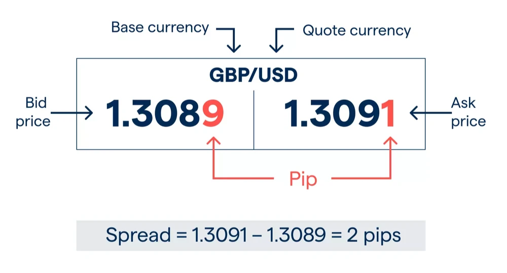

## Table of Contents

## What is a spread in the Forex market?

In the Forex market, a spread is the difference between the buying price (ask price) and the selling price (bid price) of a currency pair. When you want to buy a currency, you pay the ask price, and when you want to sell, you receive the bid price. The spread is how brokers make money, as they usually buy at the lower bid price and sell at the higher ask price.

The size of the spread can vary depending on several factors, including the liquidity of the currency pair and the overall market conditions. More liquid currency pairs, like EUR/USD, usually have smaller spreads because they are easier to buy and sell. During times of high volatility or economic news, spreads can widen as it becomes harder for brokers to match buy and sell orders. Understanding spreads is important for traders because it affects the cost of trading and can impact potential profits.

## How is the spread calculated in Forex trading?

In Forex trading, the spread is calculated by taking the difference between the ask price and the bid price of a currency pair. The ask price is what you pay to buy a currency, and the bid price is what you get when you sell it. For example, if the EUR/USD has an ask price of 1.1050 and a bid price of 1.1048, the spread is 0.0002, or 2 pips.

Pips are the smallest price move that a currency pair can make. In most currency pairs, a pip is the fourth decimal place, but for pairs involving the Japanese yen, it's the second decimal place. The spread is usually shown in pips, which makes it easy to see how much it costs to trade. A smaller spread means lower trading costs, which is good for traders.

## What is the difference between a fixed and a variable spread?

A fixed spread stays the same all the time. It doesn't change no matter what is happening in the market. This can be good for traders because they know exactly how much it will cost to trade. But, if the market gets very busy or there is big news, the broker might not be able to keep the spread fixed and might have to change it.

A variable spread changes all the time. It goes up and down depending on how busy the market is. When lots of people are trading, the spread gets bigger. When things are calm, the spread gets smaller. This can be good because you might get a smaller spread when the market is quiet, but it can be bad because you never know what the spread will be when you want to trade.

## Why is the spread important for Forex traders?

The spread is important for Forex traders because it affects how much it costs to trade. When you buy or sell a currency, you have to pay the spread. If the spread is big, it costs more to trade. If the spread is small, it costs less. Traders want to make money, so they need to think about the spread because it can eat into their profits.

Also, the spread can tell traders about how easy or hard it is to trade a currency pair. If the spread is small, it means lots of people are trading that pair, and it's easy to buy and sell. If the spread is big, it might mean fewer people are trading it, or the market is busy and it's harder to trade. Knowing about the spread helps traders pick the best times and currency pairs to trade.

## How does the spread affect trading costs?

The spread is like a fee you pay every time you trade in the Forex market. When you buy a currency, you pay the ask price, which is a bit higher than the bid price. When you sell, you get the bid price, which is lower than the ask price. The difference between these two prices is the spread. So, every time you make a trade, you start off losing a little bit of money because of the spread. This means that for you to make a profit, the price of the currency has to move enough to cover the spread and then some more.

The size of the spread can change how much it costs to trade. If the spread is small, like 1 or 2 pips, it costs less to trade. But if the spread is big, like 10 or 20 pips, it costs a lot more. Traders need to think about the spread because it can eat into their profits. If the spread is too big, it might be harder to make money, especially if you are doing a lot of trades. So, understanding the spread helps traders know how much it will cost them to trade and plan their trades better.

## What factors influence the spread in the Forex market?

The spread in the Forex market can change because of many things. One big thing is how many people are trading. If lots of people want to buy and sell a currency pair, it's easy for the broker to match them up, and the spread stays small. But if not many people are trading, it's harder for the broker, and the spread gets bigger. Another thing that changes the spread is what's happening in the world. If there's big news or something important happening, like a meeting of central bankers, the market can get busy, and the spread can get bigger.

Also, the type of currency pair can affect the spread. Some pairs, like EUR/USD, are very popular and traded a lot, so they usually have small spreads. Other pairs, like exotic currencies, are not traded as much, so their spreads are bigger. The time of day matters too. When the big markets like London and New York are open, more people are trading, and spreads are usually smaller. But when it's quiet, like at night, fewer people are trading, and spreads can be bigger.

## How can traders minimize the impact of spreads on their trading?

Traders can minimize the impact of spreads on their trading by choosing the right times to trade. When the big markets like London and New York are open, more people are trading, and the spreads are usually smaller. So, if you trade during these times, you can pay less in spreads. Also, sticking to popular currency pairs like EUR/USD can help because these pairs have smaller spreads since lots of people trade them.

Another way to minimize the impact of spreads is to use a broker with tight spreads. Some brokers offer better spreads than others, so it's a good idea to shop around and find one that fits your trading style. Also, traders can think about their trading strategy. If you do lots of trades in a short time, small spreads are very important. But if you hold onto trades for a longer time, the spread might not matter as much because the price can move enough to cover the spread and still make a profit.

## What is the relationship between liquidity and spread?

Liquidity in the Forex market means how easy it is to buy and sell a currency pair. When a currency pair has high liquidity, lots of people are trading it, so it's easy for brokers to match buyers and sellers. This makes the spread smaller because the broker doesn't have to work as hard to find someone to trade with. On the other hand, if a currency pair has low liquidity, not many people are trading it, so it's harder for the broker to find someone to trade with. This makes the spread bigger because the broker has to work harder and might have to offer a bigger difference between the buy and sell prices to get people to trade.

The relationship between liquidity and spread is important for traders to understand. When the market is very liquid, like during the times when big markets like London and New York are open, the spreads are usually smaller. This is good for traders because it costs less to trade. But when the market is not very liquid, like at night or with less popular currency pairs, the spreads can be bigger. This means it costs more to trade, and traders need to be careful because the bigger spread can eat into their profits.

## How do different Forex brokers handle spreads?

Different Forex brokers handle spreads in different ways. Some brokers offer fixed spreads, which means the spread stays the same no matter what is happening in the market. This can be good for traders because they know exactly how much it will cost to trade. But if the market gets very busy or there is big news, the broker might not be able to keep the spread fixed and might have to change it. Other brokers offer variable spreads, which means the spread can change all the time. It goes up and down depending on how busy the market is. When lots of people are trading, the spread gets bigger. When things are calm, the spread gets smaller.

Brokers also compete to offer the best spreads to attract traders. Some brokers might offer very tight spreads, especially on popular currency pairs like EUR/USD, to make their trading costs lower. This can be good for traders who do lots of trades in a short time. But sometimes, brokers with very tight spreads might charge other fees, like a commission, to make up for the smaller spread. It's important for traders to look at everything the broker offers, not just the spread, to understand the total cost of trading.

## What are the typical spread sizes for major, minor, and exotic currency pairs?

Major currency pairs, like EUR/USD, GBP/USD, and USD/JPY, usually have the smallest spreads. This is because lots of people trade these pairs, so it's easy for brokers to match buyers and sellers. The spreads for major pairs can be as small as 0.1 to 1 pip during normal market times. When the market gets busy, like during big news events, the spreads might get a bit bigger, but they are still small compared to other pairs.

Minor currency pairs, also called cross currency pairs, have slightly bigger spreads than major pairs. These pairs don't have the US dollar in them, like EUR/GBP or AUD/CAD. The spreads for minor pairs can be around 1 to 3 pips. They are not as liquid as major pairs, so it's a bit harder for brokers to match trades, which makes the spreads bigger.

Exotic currency pairs have the biggest spreads. These pairs include one major currency and one from a smaller or emerging market, like USD/TRY or EUR/ZAR. The spreads for exotic pairs can be 50 pips or even more. This is because not many people trade these pairs, so it's hard for brokers to find someone to trade with. The bigger spread means it costs more to trade exotic pairs, and traders need to be careful because it can eat into their profits.

## How does market volatility affect Forex spreads?

Market volatility can make Forex spreads bigger. When the market is very busy and prices are moving a lot, it's harder for brokers to match buyers and sellers. They might have to offer a bigger difference between the buy and sell prices to get people to trade. This means the spread gets bigger. Big news, like when central banks make announcements or there are big economic reports, can make the market very busy and cause the spreads to grow.

Even though bigger spreads can make trading more expensive, traders can still use this to their advantage. If you know that the market will be busy because of a big event, you can plan your trades around it. You might decide to wait until the market calms down before trading, or you might be okay with paying a bigger spread if you think the price will move a lot and you can make a bigger profit. Knowing how market volatility affects spreads can help you make better trading decisions.

## What advanced strategies can traders use to take advantage of spread fluctuations?

Traders can use a strategy called 'scalping' to take advantage of spread fluctuations. Scalping means making lots of small trades in a short time. When the market is calm and the spreads are small, scalpers can trade quickly and make small profits from each trade. They need to be fast because the small profits can add up. But if the market gets busy and the spreads get bigger, scalpers might stop trading because the bigger spreads can eat into their profits. So, they need to watch the market and know when to trade and when to wait.

Another strategy is to use 'straddle' trades around big news events. A straddle means buying both a call option and a put option at the same time. When there's big news coming, like a central bank meeting, the market can get very busy and the spreads can get bigger. Traders can use a straddle to bet on big price moves without knowing which way the price will go. If the price moves a lot after the news, the trader can make money from one of the options, even though they have to pay a bigger spread. This strategy can be risky, but it can also be a way to take advantage of the bigger spreads and the big price moves that come with them.

## How is the spread calculated in the Forex market?

The spread in the forex market is calculated as the difference between the ask price and the bid price of a currency pair. This spread serves as a transaction cost for trading activities and directly influences a trader's potential profit margin. In mathematical terms, it can be represented as:

$$
\text{Spread} = \text{Ask Price} - \text{Bid Price}
$$

Spreads are commonly expressed in pips, which stand for "percentage in point" and are the smallest price movement units used for forex quotes. For most currency pairs, a single pip is equivalent to a 0.0001 change in price, except for pairs involving the Japanese yen, where a pip is equal to 0.01.

The characteristics of the spread can indicate the [liquidity](/wiki/liquidity-risk-premium) level within the forex market. A low or tight spread generally signifies high liquidity and an active market, meaning there are many buyers and sellers willing to trade. Conversely, a wide spread often suggests lower liquidity, which could occur during market closures, economic announcements, or when trading less frequently exchanged currency pairs.

Understanding how to calculate and interpret spreads is fundamental for forex traders as it impacts their overall strategy and potential profitability. Automated trading systems, particularly [algorithmic trading](/wiki/algorithmic-trading) strategies, frequently incorporate spread size as a decision-making criterion, optimizing trade executions based on real-time spread fluctuations.

## What is the impact of spreads on forex trading?

Spreads directly influence the cost of executing trades in the forex market, thereby affecting potential profit margins. A spread, being the difference between the bid and ask price, is a fundamental cost component for any forex transaction. When spreads narrow, or become tighter, this reduction in trading costs is favorable for traders, particularly those relying on frequent trades or [scalping](/wiki/gamma-scalping) strategies. Tighter spreads often signal a more liquid market, meaning that there are numerous buyers and sellers, facilitating efficient trade execution with minimal cost impact.

Conversely, during periods of high market [volatility](/wiki/volatility-trading-strategies) or low liquidity, spreads tend to widen. Such conditions can occur during economic news releases, geopolitical events, or when market participant [volume](/wiki/volume-trading-strategy) is low, like during off-peak hours. Wider spreads increase the cost of trading as the difference between buying and selling prices expands, which can erode profit margins particularly for traders employing short-term strategies. Traders need to be acutely aware of these fluctuations and may adjust their trading tactics to minimize costs when spreads show signs of widening.

For example, if the bid price of a currency pair is 1.2500 and the ask price is 1.2505, the spread is calculated as follows:

$$
\text{Spread} = \text{Ask Price} - \text{Bid Price} = 1.2505 - 1.2500 = 0.0005
$$

In forex jargon, this spread of 0.0005 is equivalent to 5 pips. If this spread were to widen to 10 pips during periods of low liquidity, traders would incur higher transaction costs, potentially affecting the profitability of trades. It is vital for traders to leverage real-time data and analysis tools to anticipate and respond to changes in spreads, thereby optimizing their trading strategies for cost efficiency.

## References & Further Reading

[1]: ["The Basics of Forex Trading"](https://www.forextime.com/education/forex-trading-for-beginners) by Investopedia

[2]: ["Algorithmic and High-Frequency Trading"](https://www.cambridge.org/us/universitypress/subjects/mathematics/mathematical-finance/algorithmic-and-high-frequency-trading) by Álvaro Cartea, Sebastian Jaimungal, and José Penalva

[3]: ["Foreign Exchange: A Practical Guide to the FX Markets"](https://www.amazon.com/Foreign-Exchange-Practical-Guide-Markets/dp/0471732036) by David F. DeRosa

[4]: ["Forex Trading: The Basics Explained in Simple Terms"](https://www.amazon.com/FOREX-TRADING-Explained-Beginners-Strategies/dp/1535198567) by Jim Brown

[5]: ["Trading and Exchanges: Market Microstructure for Practitioners"](https://www.acsu.buffalo.edu/~keechung/MGF743/Readings/Trading-Exchanges-Market-Microstructure-Practitioners%20Draft%20Copy.pdf) by Larry Harris