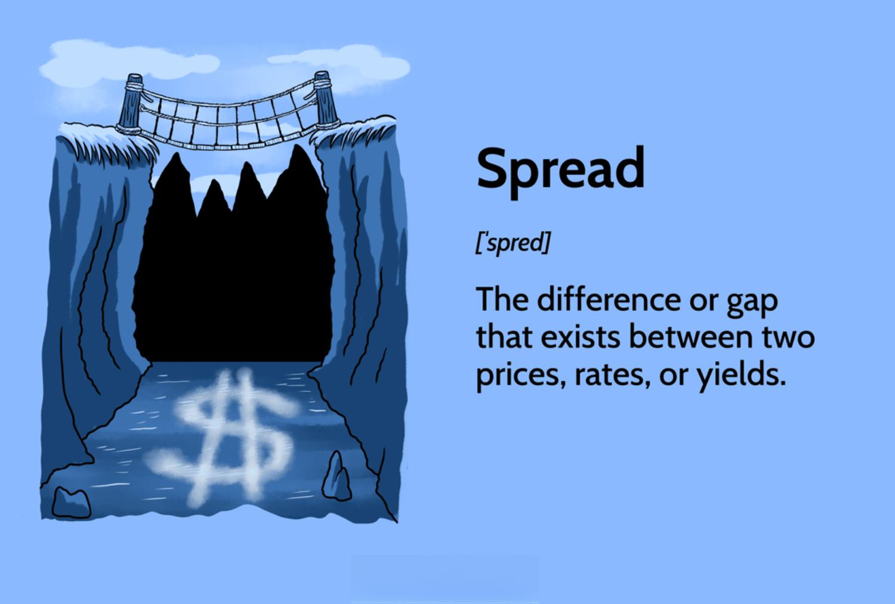

## Table of Contents

## What is the spread in financial trading?

In financial trading, the spread is the difference between the buying price (also known as the bid price) and the selling price (also known as the ask price) of a security, currency, or any other financial instrument. This difference exists because the market maker or broker needs to make a profit on each trade. For example, if the bid price for a stock is $10 and the ask price is $10.05, the spread is $0.05.

The spread is important for traders because it affects the cost of trading. A smaller spread means lower trading costs, which is beneficial for traders, especially those who trade frequently. On the other hand, a larger spread increases the cost of entering and exiting positions. The size of the spread can vary depending on factors such as the liquidity of the asset, market volatility, and the trading platform or broker being used.

## How is the spread calculated in trading?

The spread in trading is calculated by finding the difference between the bid price and the ask price. The bid price is what buyers are willing to pay for a security, and the ask price is what sellers are willing to accept. For example, if the bid price for a stock is $50 and the ask price is $50.10, you subtract the bid from the ask to get the spread, which in this case is $0.10.

The size of the spread can change based on different things. If a lot of people want to buy and sell a security, it usually has a smaller spread because there is more competition among buyers and sellers. On the other hand, if fewer people are trading, the spread might be bigger. Also, if the market is going up and down a lot, the spread might get bigger because it's riskier for the people who set the prices.

## What is the difference between a fixed and a variable spread?

A fixed spread stays the same no matter what is happening in the market. This means that the difference between the buying price and the selling price of a security does not change. Traders like fixed spreads because they know exactly how much it will cost to trade, which helps them plan their trades better. However, fixed spreads are usually offered by brokers and might not always reflect the real market conditions.

A variable spread, on the other hand, can change depending on what is happening in the market. If the market is calm, the spread might be small, but if the market is moving a lot, the spread can get bigger. Variable spreads are more common in the real market because they show what is really happening with supply and demand. Traders need to be careful with variable spreads because the cost of trading can go up suddenly, which can affect their profits.

## Why is the spread important for traders?

The spread is important for traders because it affects how much it costs to buy and sell things in the market. When the spread is small, it's cheaper for traders to make trades. This is good for people who buy and sell a lot because they can make more trades without spending too much money on the costs. On the other hand, if the spread is big, it costs more to trade. This can make it harder for traders to make money, especially if they are trading small amounts or if they trade often.

The spread also tells traders about how easy it is to buy or sell something. If the spread is small, it usually means there are a lot of people wanting to buy and sell, which makes it easier to trade. But if the spread is big, it might mean there aren't as many people trading, so it can be harder to find someone to buy from or sell to. Knowing about the spread helps traders pick the best times to trade and understand the market better.

## How does the spread affect trading costs?

The spread affects trading costs because it is the difference between the price you pay to buy something and the price you get when you sell it. When you buy a stock, you pay the ask price, which is higher than the bid price. When you sell, you get the bid price, which is lower. So, the spread is like a fee you pay every time you trade. If the spread is small, the cost of trading is lower, which is good for traders because they can make more trades without losing too much money to these costs.

If the spread is big, it costs more to trade. This can make it harder for traders to make money, especially if they are trading small amounts or if they trade a lot. A big spread means you need the price of the stock to move more just to break even on your trade. So, traders need to think about the spread when they decide to buy or sell because it can really affect how much money they make or lose.

## What factors influence the size of the spread?

The size of the spread is affected by how easy it is to buy and sell something. If lots of people want to trade a stock, it's called high liquidity. When there's high liquidity, the spread is usually small because there are many buyers and sellers, so it's easy to find someone to trade with. On the other hand, if fewer people are trading, the spread might be bigger. This is because it's harder to find someone to buy from or sell to, so the people making the prices need a bigger difference to make it worth their while.

Another thing that changes the spread is how much the market is moving around. If the market is calm, the spread might be small. But if the market is going up and down a lot, it can be riskier for the people setting the prices, so they might make the spread bigger to protect themselves. Also, the type of trading platform or broker you use can affect the spread. Some brokers might have fixed spreads that don't change, while others have variable spreads that go up and down with the market.

## Can the spread be used as an indicator of market liquidity?

Yes, the spread can be used as an indicator of market liquidity. When the spread is small, it usually means that there are a lot of people who want to buy and sell a stock. This is called high liquidity because it's easy to find someone to trade with. A small spread shows that the market is active and there's a good balance between buyers and sellers.

On the other hand, if the spread is big, it might mean that there aren't as many people trading. This is called low liquidity because it's harder to find someone to buy from or sell to. A big spread can show that the market for that stock is not very active, and it might take more time and cost more to make a trade.

## How do different types of financial instruments affect the spread?

Different types of financial instruments can affect the spread because of how easy or hard it is to trade them. Stocks that are popular and traded a lot, like those of big companies, usually have small spreads. This is because there are many people buying and selling these stocks, so it's easy to find someone to trade with. On the other hand, stocks of smaller companies might have bigger spreads because fewer people are trading them, making it harder to find a buyer or seller.

Bonds and other fixed-income securities can also have different spreads. Government bonds, which are seen as very safe, often have small spreads because a lot of people want to buy them. But, bonds from smaller or riskier companies might have bigger spreads because fewer people are willing to trade them. The same goes for other financial instruments like currencies and commodities; the more people want to trade them, the smaller the spread tends to be.

## What strategies can traders use to minimize the impact of the spread?

Traders can minimize the impact of the spread by choosing to trade during times when the market is very active. When a lot of people are buying and selling, the spread usually gets smaller. This makes it cheaper to trade. Traders can look at when the market is most busy, like during the opening and closing times of major stock exchanges, and try to make their trades then. Also, trading stocks or other financial instruments that are popular and have a lot of buyers and sellers can help keep the spread small.

Another way to reduce the impact of the spread is to use limit orders instead of market orders. With a limit order, a trader sets the price they want to buy or sell at, and the trade only happens if the market reaches that price. This can help traders avoid paying the higher ask price or getting the lower bid price that comes with the spread. By being patient and waiting for the market to come to their price, traders can save money on trading costs.

## How do market makers impact the spread?

Market makers are important people in the trading world because they help make sure there's always someone to buy from or sell to. They do this by setting the bid and ask prices for stocks and other things people trade. The difference between these prices is the spread. Market makers try to make the spread as small as possible when a lot of people are trading, so more people will trade with them. But if fewer people are trading, or if the market is going up and down a lot, market makers might make the spread bigger to protect themselves from losing money.

Market makers can also change the spread to make more money or to manage their risk. If they think a stock is going to move a lot, they might make the spread bigger to cover the risk of the price changing quickly. This can make it more expensive for traders to buy and sell. On the other hand, if the market is calm and there are a lot of people trading, market makers might make the spread smaller to attract more trades. So, the actions of market makers have a big impact on how much it costs to trade and how easy it is to find someone to trade with.

## What are the implications of spread for high-frequency trading?

The spread is very important for high-frequency traders because they make a lot of trades very quickly. When the spread is small, it's cheaper for high-frequency traders to buy and sell. This is good for them because they can make more trades without losing too much money to the costs of trading. High-frequency traders often use special computer programs to find the best times to trade when the spread is small, which helps them make more money.

However, if the spread gets bigger, it can be a problem for high-frequency traders. A bigger spread means it costs more to trade, which can eat into their profits. High-frequency traders need to be very careful and watch the spread all the time. They might use strategies like trading during busy times when the spread is smaller, or they might try to trade in markets where the spread is usually small. This way, they can keep their trading costs low and make more money.

## How does the spread vary across different trading platforms and brokers?

The spread can be different depending on which trading platform or broker you use. Some brokers offer fixed spreads, which means the difference between the buying and selling price stays the same no matter what's happening in the market. This can be good for traders because they know exactly how much it will cost to trade. But fixed spreads might not always match what's really happening in the market, and they can be higher than the spreads you'd find in the real market. Other brokers offer variable spreads, which change based on how much people want to buy and sell and how much the market is moving. Variable spreads can be smaller when a lot of people are trading, but they can get bigger if the market is going up and down a lot.

Different trading platforms also affect the spread because they might have different ways of showing the prices. Some platforms are very popular and have a lot of traders using them, which can make the spreads smaller because there are more people buying and selling. On the other hand, if a platform is not as popular, the spreads might be bigger because there are fewer people trading. Also, some platforms might charge extra fees that can make the spread seem bigger. So, it's important for traders to look at different platforms and brokers to find the best spreads for their trading.

## What are the key trading terms every trader should know?

Trading is abundant with terminology that can seem daunting to newcomers, yet understanding these terms is crucial for success in financial markets. This section focuses on defining and explaining four essential trading terms: bid-ask spread, liquidity, volatility, and margin.

**Bid-Ask Spread**

The bid-ask spread is the difference between the highest price a buyer is willing to pay for an asset (the bid) and the lowest price a seller is willing to accept (the ask). This spread is a key concept in trading as it represents the cost of executing a trade. A narrower spread typically indicates a more liquid market with less cost for entry and [exit](/wiki/exit-strategy), whereas a wider spread suggests a less liquid market with higher transaction costs.

Mathematically, the bid-ask spread can be expressed as:

$$
\text{Spread} = \text{Ask Price} - \text{Bid Price}
$$

Traders use the bid-ask spread to measure market liquidity and to gauge potential profits and costs associated with trading.

**Liquidity**

Liquidity refers to how easily an asset can be bought or sold in the market without affecting its price. A liquid market is characterized by high trading volumes and tight bid-ask spreads, which allows traders to enter or exit positions with minimal price impact. High liquidity is favorable as it ensures traders are able to execute trades quickly and at desired prices.

Illiquid markets, on the other hand, are more challenging as there might be fewer buyers and sellers, leading to wider spreads and higher potential costs. Understanding liquidity is vital for managing risk and timing trades effectively.

**Volatility**

Volatility indicates the degree of variation in the price of an asset over time. High volatility suggests that an asset's price can change dramatically over a short period in either direction, while low volatility indicates that an asset's price remains relatively stable. Volatility is a double-edged sword; it can present opportunities for profit but also increases the risk of loss.

Volatility can be quantified using statistical measures such as standard deviation or the variance of returns. For instance, a higher standard deviation signifies greater volatility, leading to potentially larger swings in asset prices.

**Margin**

Margin refers to the amount of money a trader borrows from a brokerage to buy securities. It is essentially a loan that allows traders to increase their position size by using leverage. Trading on margin magnifies both potential gains and potential losses.

The use of margin is governed by the margin requirement, which is the minimum amount a trader must deposit with the brokerage before they can trade on margin. Calculating equity in a margin account involves:

$$
\text{Equity} = \text{Market Value of Securities} - \text{Amount Borrowed}
$$

Understanding margin is crucial for risk management, as failing to meet margin requirements can lead to a margin call, requiring the trader to deposit additional funds or sell off assets to reduce the loan balance.

Mastering these trading terms not only helps in executing trades efficiently but also in making strategic decisions based on a comprehensive understanding of the financial markets. As one becomes more familiar with these concepts, the ability to make informed and calculated trading decisions improves, ultimately enhancing trading success.

## References & Further Reading

[1]: Bergstra, J., Bardenet, R., Bengio, Y., & Kégl, B. (2011). ["Algorithms for Hyper-Parameter Optimization."](https://papers.nips.cc/paper/4443-algorithms-for-hyper-parameter-optimization) Advances in Neural Information Processing Systems 24.

[2]: ["Advances in Financial Machine Learning"](https://www.amazon.com/Advances-Financial-Machine-Learning-Marcos/dp/1119482089) by Marcos Lopez de Prado

[3]: ["Evidence-Based Technical Analysis: Applying the Scientific Method and Statistical Inference to Trading Signals"](https://www.amazon.com/Evidence-Based-Technical-Analysis-Scientific-Statistical/dp/0470008741) by David Aronson

[4]: ["Machine Learning for Algorithmic Trading"](https://github.com/PacktPublishing/Machine-Learning-for-Algorithmic-Trading-Second-Edition) by Stefan Jansen

[5]: ["Quantitative Trading: How to Build Your Own Algorithmic Trading Business"](https://books.google.com/books/about/Quantitative_Trading.html?id=j70yEAAAQBAJ) by Ernest P. Chan