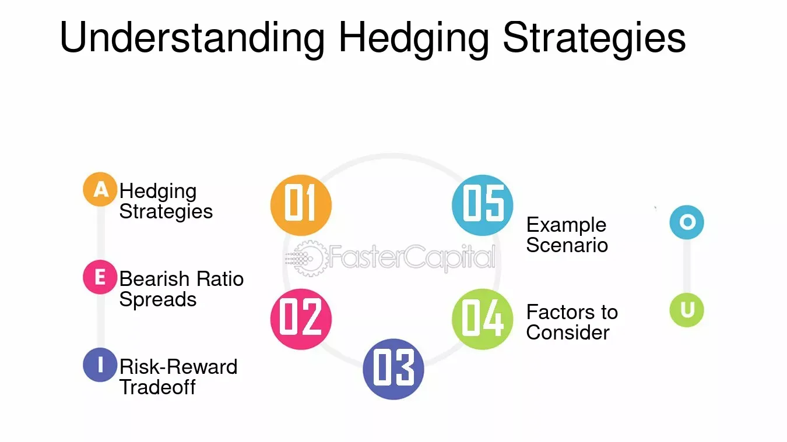

## Table of Contents

## What is spread hedging and why is it important?

Spread hedging is a way for people and businesses to manage the risk of price changes in different markets. It involves taking positions in two related markets to balance out any potential losses in one market with gains in the other. For example, if you are worried that the price of wheat might go down, you could buy wheat futures and sell corn futures, because the prices of wheat and corn often move in opposite directions.

This is important because it helps reduce the uncertainty that comes with price changes. When prices in one market go up or down, it can affect the profits of a business or the value of an investment. By using spread hedging, people can protect themselves from these ups and downs, making their financial planning more stable and predictable. This is especially useful for farmers, commodity traders, and anyone else whose income depends on the prices of goods that can change a lot.

## How does spread hedging differ from other types of hedging?

Spread hedging is different from other types of hedging because it involves taking positions in two related markets instead of just one. For example, in regular hedging, if you're worried about the price of oil going down, you might buy oil futures to lock in a price. But with spread hedging, you would buy oil futures and also sell gasoline futures, since oil and gasoline prices are connected. This way, if oil prices drop, you might lose money on the oil futures, but you could make money on the gasoline futures if gasoline prices also drop.

Other types of hedging, like direct hedging or options hedging, focus on one market. Direct hedging means you take a position that directly offsets your risk in that market. For example, if you own a lot of stock in a company, you might sell futures on that stock to protect against a price drop. Options hedging involves buying options, which give you the right but not the obligation to buy or sell an asset at a set price. This can be useful if you want to limit your risk but still have the chance to benefit if prices move in your favor. Spread hedging, on the other hand, uses the relationship between two markets to manage risk, making it a bit more complex but also potentially more effective in certain situations.

## What are the basic principles of spread hedging?

Spread hedging is all about using two related markets to manage risk. Imagine you're worried about the price of wheat going down. Instead of just buying wheat futures, you could also sell corn futures. This is because wheat and corn prices often move in opposite directions. If wheat prices drop, you might lose money on your wheat futures, but you could make money on your corn futures if corn prices also go down. This way, you balance out your losses and gains, making your overall risk smaller.

The key to spread hedging is understanding how different markets are connected. It's important to pick the right pair of markets where the prices tend to move together or in opposite ways. This relationship helps you offset losses in one market with gains in the other. Spread hedging is useful for people like farmers or commodity traders who need to protect themselves from big price swings. By using this method, they can make their financial planning more stable and predictable.

## Can you explain the operation of spread hedging with a simple example?

Imagine you're a farmer who grows wheat. You're worried that the price of wheat might go down before you sell your crop. To protect yourself, you decide to use spread hedging. You buy wheat futures, which means you agree to sell your wheat at today's price in the future. But you also sell corn futures because you know that wheat and corn prices often move in opposite directions. If wheat prices drop, you might lose money on your wheat futures, but if corn prices also drop, you'll make money on your corn futures. This way, the losses from wheat can be balanced out by the gains from corn, making your overall risk smaller.

Let's say the price of wheat does go down. Without spread hedging, you would lose money because you'd have to sell your wheat at a lower price. But because you also sold corn futures, and corn prices went down too, you make money on those corn futures. The money you make from corn helps cover the money you lose from wheat. By using spread hedging, you've managed to protect yourself from big price swings, making your financial planning more stable and predictable.

## What are the common financial instruments used in spread hedging?

Spread hedging often uses futures contracts as the main financial instruments. Futures are agreements to buy or sell something at a set price in the future. For example, if you're worried about wheat prices dropping, you might buy wheat futures and sell corn futures. This way, if wheat prices go down, you might lose money on your wheat futures, but you could make money on your corn futures if corn prices also drop. Futures are popular in spread hedging because they are easy to trade and have clear prices that move with the market.

Another common instrument used in spread hedging is options. Options give you the right, but not the obligation, to buy or sell an asset at a set price. For instance, you might buy a call option on wheat and sell a call option on corn. If wheat prices rise, you can use your wheat option to buy wheat at a lower price, while if corn prices rise, you won't have to buy corn at the higher price because you sold the option. Options can be a bit more complex than futures, but they offer more flexibility and can be useful in different spread hedging strategies.

## How do market conditions affect the effectiveness of spread hedging?

Market conditions can really change how well spread hedging works. If the markets you're using for your spread hedge move in the way you expect, like if wheat and corn prices go up and down together, then your hedging strategy can be very effective. You can balance out losses in one market with gains in the other, which helps keep your overall risk low. But if the markets don't move as expected, like if wheat prices go down but corn prices stay the same, then your spread hedge might not work as well. You could end up losing money on both sides of your hedge.

Another thing to think about is how much the markets move. If there's a lot of volatility, or big price swings, spread hedging can be more important because it helps protect against those big changes. But if the markets are calm and prices don't change much, then spread hedging might not be as useful. It's all about understanding the markets you're working with and making sure your hedging strategy matches what's happening in those markets.

## What are the risks associated with spread hedging?

Spread hedging can help you manage risk, but it also comes with its own set of risks. One big risk is that the markets you're using for your hedge might not move the way you expect. If you're betting that wheat and corn prices will move in opposite directions, but they don't, you could end up losing money on both sides of your hedge. This can happen if there's a big change in the market that affects both wheat and corn prices in the same way, like a new law or a natural disaster.

Another risk is that spread hedging can be more complex than other types of hedging. You need to understand how different markets are connected and how they might change in the future. If you make a mistake in your calculations or if the markets move in unexpected ways, your hedge might not work as well as you hoped. This can lead to bigger losses than if you had just used a simpler hedging strategy.

## How can one measure the success of a spread hedging strategy?

Measuring the success of a spread hedging strategy involves looking at how well it helps you manage risk and protect your profits. You can do this by comparing the results of your hedge to what would have happened if you hadn't hedged at all. For example, if wheat prices dropped and you lost money on your wheat futures but made money on your corn futures, you would look at the total impact on your finances. If the gains from corn helped cover the losses from wheat, then your hedge was successful in reducing your overall risk.

Another way to measure success is by looking at how stable your finances are over time. If your spread hedging strategy helps keep your profits steady, even when market prices are going up and down a lot, then it's working well. You can also use specific financial metrics, like the standard deviation of your profits, to see how much your earnings are fluctuating. A lower standard deviation means your hedging strategy is doing a good job of smoothing out the ups and downs in your income.

## What advanced techniques can be used to optimize spread hedging?

One advanced technique to optimize spread hedging is to use statistical analysis to understand the relationship between the two markets you're hedging with. This means looking at past data to see how often the prices of wheat and corn move together or in opposite directions. By using this data, you can make better guesses about how the markets might move in the future. This can help you choose the right times to buy and sell your futures contracts, making your hedge more effective. You can also use computer programs to do this analysis quickly and accurately, which can give you an edge over others who are not using these tools.

Another technique is to use options along with futures in your spread hedging strategy. Options can give you more flexibility because they let you choose whether or not to buy or sell at a set price. This can be helpful if you're not sure how the markets will move. For example, you could buy a call option on wheat and sell a call option on corn. If wheat prices go up, you can use your option to buy wheat at a lower price, and if corn prices go up, you won't have to buy corn at the higher price. Using options like this can help you fine-tune your hedge and protect your profits better.

## How do regulatory environments impact spread hedging practices?

Regulatory environments can really change how people do spread hedging. Rules set by governments or financial groups can affect what kinds of financial tools you can use and how you can use them. For example, some places might have strict rules about trading futures or options. If the rules are too tight, it might be hard to do spread hedging the way you want. On the other hand, if the rules are more relaxed, you might have more freedom to use different strategies and tools to manage your risk.

Different countries have different rules, so if you're doing spread hedging across borders, you need to know the rules in each place. This can make things more complicated because you have to keep track of more than one set of rules. But understanding the regulatory environment can help you plan better and make sure you're following the law. It's important to stay updated on any changes in the rules because they can affect how well your spread hedging strategy works.

## Can you discuss a real-world case study where spread hedging was effectively used?

A good example of spread hedging in action is how airlines use it to manage fuel costs. Airlines need a lot of jet fuel, and the price of jet fuel can change a lot. To protect themselves, airlines might buy jet fuel futures and sell crude oil futures. They do this because jet fuel and crude oil prices often move together. If jet fuel prices go up, the airlines might lose money on their jet fuel futures, but they can make money on their crude oil futures if crude oil prices also go up. This way, the airlines can balance out their losses and gains, making their fuel costs more predictable and helping them plan their budgets better.

In this case, spread hedging helped airlines manage the risk of changing fuel prices. By using this strategy, airlines could protect themselves from big price swings in the fuel market. This made it easier for them to keep ticket prices stable and avoid sudden losses due to rising fuel costs. The key was understanding how jet fuel and crude oil prices were connected and using that knowledge to create an effective hedge. This real-world example shows how spread hedging can be a powerful tool for businesses that need to manage the risk of price changes in related markets.

## What future trends might influence the use of spread hedging in financial markets?

In the future, technology will play a bigger role in how people use spread hedging. Computers and data analysis will get even better, making it easier to understand how different markets move together. This can help people make smarter choices about when to buy and sell futures and options. Also, new financial tools and trading platforms might come out, giving people more ways to hedge their risks. As these technologies improve, more businesses and investors might start using spread hedging to protect themselves from price changes.

Another trend that could affect spread hedging is changes in rules and laws. Governments and financial groups might make new rules about trading futures and options. These rules could make it easier or harder to use spread hedging. If the rules get stricter, it might be harder to use certain strategies. But if the rules become more relaxed, people might have more freedom to try new ways of hedging. Keeping up with these changes will be important for anyone who wants to use spread hedging effectively in the future.

## What are Financial Hedging Techniques?

Financial hedging is a critical technique designed to protect investments from adverse market movements, helping to mitigate risk and stabilize returns. Central to hedging is the use of derivatives such as options, futures, and forwards, which allow investors to manage and transfer risk effectively.

Options are versatile financial instruments that grant the holder the right, but not the obligation, to buy or sell an asset at a predetermined price before a specific expiration date. They function as a form of insurance against unfavorable price movements. For example, a put option offers protection against declines in stock prices, while a call option can preserve the opportunity to profit from upward movements.

Futures contracts obligate the buyer to purchase, or the seller to sell, an asset at a predetermined future date and price, often used to hedge against price fluctuations in commodities, currencies, or financial instruments. Forward contracts, similar to futures, are private agreements that allow for customized terms but lack standardization and are mainly traded over-the-counter.

Popular hedging strategies include pairs trading and diversification. Pairs trading involves taking opposing positions in two correlated assets, profiting from the relative performance difference. For instance, if two companies have closely correlated stock performances, a trader might seek to profit from potential divergences. The mathematical correlation between two assets can be calculated as follows:

$$
\text{Correlation} = \frac{\text{Cov}(X, Y)}{\sigma_X \sigma_Y}
$$

Where $\text{Cov}(X, Y)$ is the covariance of the two assets, and $\sigma_X$ and $\sigma_Y$ are their respective standard deviations.

Diversification, a foundational principle of modern portfolio theory, reduces risk by spreading investments across various asset classes, sectors, or geographies. It minimizes the impact of a poor performance in any single investment on the overall portfolio. Diversification typically reduces unsystematic risk without significantly affecting returns.

Asset allocation plays a vital role in hedging by determining the proportion of each asset class within a portfolio, which helps in balancing risk and potential returns. A well-diversified asset allocation strategy, often guided by an investor's risk tolerance and time horizon, optimizes the trade-off between risk and reward. The process of asset allocation can be mathematically modeled through the optimization problem:

$$
\text{maximize} \ E(R_p) - \frac{\lambda}{2} \sigma_p^2
$$

Subject to constraints, where $E(R_p)$ is the expected return of the portfolio, $\lambda$ is the investor's risk aversion coefficient, and $\sigma_p^2$ is the portfolio variance. This framework aids in configuring the portfolio to hedge against specific risks inherent in financial markets.

## References & Further Reading

[1]: Hull, J. C. (2018). ["Options, Futures, and Other Derivatives."](https://www.semanticscholar.org/paper/Options%2C-Futures%2C-and-Other-Derivatives-Hull/89bdee500c8623864fc9eb7a471546aa713acc44) Pearson Education.

[2]: Narang, R. K. (2009). ["Inside the Black Box: The Simple Truth About Quantitative Trading."](https://onlinelibrary.wiley.com/doi/book/10.1002/9781118267738) Wiley Finance.

[3]: Amir, R. (1996). ["Cooperation vs. Competition in a Diffusion Process."](https://www.semanticscholar.org/paper/Cooperation-vs.-competition-in-R%26D%3A-The-role-of-of-Amir-Wooders/857a8aea4f3474bf61f9d856bcfc4df819b0e50e) Journal of Financial and Quantitative Analysis.

[4]: Bookstaber, R. (2017). ["The End of Theory: Financial Crises, the Failure of Economics, and the Sweep of Human Interaction."](https://www.jstor.org/stable/j.ctvc776sc) Princeton University Press.

[5]: Aldridge, I. (2013). ["High-Frequency Trading: A Practical Guide to Algorithmic Strategies and Trading Systems."](https://www.amazon.com/High-Frequency-Trading-Practical-Algorithmic-Strategies/dp/1118343506) Wiley Trading.