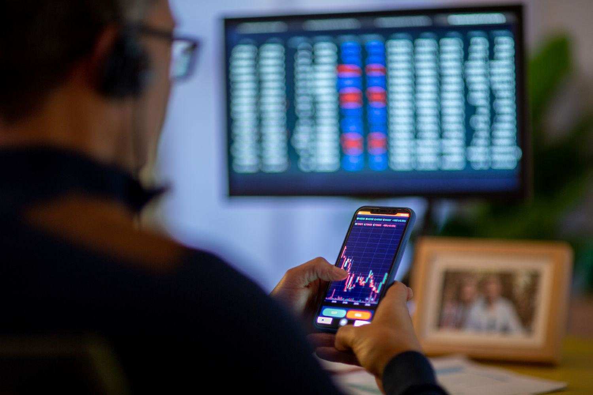

The world of financial trading is rapidly evolving, with technology playing a central role. Algorithmic trading, or 'algo trading', utilizes computer algorithms to automate trading decisions, offering efficiency and precision. As financial markets become more complex and volatile, understanding the mechanics of algo trading is increasingly crucial for traders aiming to stay competitive.

In this article, we explore the fundamentals of market metrics, financial analysis, spread indicators, and their roles in guiding algorithmic trading strategies. These components provide a framework for traders to assess market conditions, evaluate investment opportunities, and enhance their decision-making processes. Specifically, market metrics offer quantitative insights into market performance and liquidity, serving as a foundation for developing responsive trading algorithms. Financial analysis combines both fundamental and technical perspectives to enrich understanding of market trends, while spread indicators assist in evaluating trading costs and liquidity.



Understanding these components is essential for both novice and experienced traders looking to optimize their trading strategies in a dynamic market environment. As technology advances, traders have access to a wealth of data and sophisticated tools that can transform trading strategies from reactive to proactive. By integrating market metrics, financial analysis, and spread indicators, traders can design algorithmic systems that execute trades with precision, minimize risks, and maximize profitability.

We will examine how these elements interact to create robust algo trading systems. This article aims to break down complex trading concepts into actionable insights, empowering traders to leverage algorithmic trading effectively. Through this exploration, traders can gain a deeper understanding of how to harness technology to navigate the ever-changing financial landscapes, ensuring strategic success and sustained growth in their trading endeavors.

## Table of Contents

## Understanding Market Metrics

Market metrics are quantitative measures that provide essential insights into market performance, liquidity, and volatility. They form the basis of financial analysis and are integral to identifying trading opportunities and making informed decisions. In the context of algorithmic trading, these metrics are indispensable as they enable the creation and adjustment of algorithms to respond aptly to real-time market conditions.

One of the key market metrics is trading volume, which represents the total number of shares or contracts traded for a particular asset over a specified period. High trading volume typically indicates strong interest or momentum in a security, which can lead to more significant price movements. Volume trends are often used to confirm price trends; for example, an increasing price accompanied by increasing volume is generally seen as a bullish sign.

Price changes, another critical metric, help traders understand the short-term and long-term movements of asset prices. This metric is crucial in analyzing market trends and developing trading strategies. Market capitalization, which is the total market value of a company's outstanding shares, provides insights into the relative size and value of a company compared to others in the industry.

Volatility indexes, such as the VIX, measure the market's expectation of [volatility](/wiki/volatility-trading-strategies) over a specific period. High volatility often indicates a high-risk environment but may also present lucrative opportunities for traders who can effectively manage risk. Algorithmic trading systems frequently incorporate volatility metrics to adjust trading strategies based on expected market instability.

Incorporating accurate market metrics into trading strategies ensures better risk management by identifying when the market might experience high risk or provide significant opportunities. For example, by analyzing historical volatility and [volume](/wiki/volume-trading-strategy) patterns through a statistical or [machine learning](/wiki/machine-learning) model, traders can predict potential breakouts or reversals.

Here is a simple Python example showing how these metrics might be used in an [algorithmic trading](/wiki/algorithmic-trading) scenario:

```python
import yfinance as yf  # For more datasets, visit: https://paperswithbacktest.com/datasets
import numpy as np

# Download historical data for a stock
data = yf.download('AAPL', start='2022-01-01', end='2022-12-31')

# Calculate simple market metrics
volume = data['Volume']
price_changes = data['Close'].pct_change()
market_cap = data['Close'] * data['Volume']

# Calculate rolling 30-day volatility
rolling_volatility = data['Close'].rolling(window=30).std()

# Use metrics to make a trading decision
# Example: buy signal if price changes by more than 2% and volume is above average
average_volume = volume.mean()
signals = (price_changes > 0.02) & (volume > average_volume)

# Output the dates with buy signals
buy_signals_dates = signals[signals].index
print("Buy signals on:", buy_signals_dates.tolist())
```

This example illustrates the use of market metrics like volume and price changes to identify potential buy signals. By equipping algorithmic trading strategies with real-time market data, traders can enhance profitability while managing risks associated with market fluctuations.

## Role of Financial Analysis in Trading

Financial analysis is an indispensable tool in the trading landscape, playing a central role in the evaluation of investment opportunities and the determination of financial market health. This analysis can be bifurcated into [fundamental analysis](/wiki/fundamental-analysis) and technical analysis, each offering distinct insights into market dynamics.

Fundamental analysis involves a comprehensive assessment of economic indicators, financial statements, and other economic factors influencing a company’s intrinsic value. For instance, traders might examine metrics such as earnings per share (EPS), price-to-earnings ratio (P/E), and debt-to-equity ratio, alongside broader economic indicators like GDP growth rates and unemployment [statistics](/wiki/bayesian-statistics), to determine the long-term potential of an investment. By integrating such data and conducting a qualitative analysis, fundamental analysis aids in identifying undervalued or overvalued assets.

In contrast, technical analysis focuses on the study of past market data, primarily price and volume. This approach assumes that all current market information is reflected in asset prices, and patterns or trends that emerge are likely to repeat. Traders employ various tools, such as charts and indicators, to predict future price movements. Key technical indicators include moving averages, Relative Strength Index (RSI), and the Moving Average Convergence Divergence (MACD), each providing unique insights into market [momentum](/wiki/momentum) and potential price reversals. 

Algorithmic trading relies heavily on both fundamental and technical analyses to automate trading decisions. By predefining criteria based on financial analysis, algorithms can execute trades without human intervention, thus minimizing errors due to human emotions. For instance, a trading algorithm can be programmed to buy an asset when its RSI indicates it is oversold, or sell when a company's P/E ratio falls below a certain threshold in fundamental analysis. This automation enhances precision, allowing traders to exploit even minute [arbitrage](/wiki/arbitrage) opportunities swiftly.

Python is frequently used for creating such trading algorithms due to its simplicity and powerful libraries. Below is an example code snippet that utilizes a simple moving average crossover strategy, a common technical analysis technique:

```python
import pandas as pd
import numpy as np

# Assuming 'data' is a DataFrame containing historical stock prices with a column 'Close'
def moving_average_crossover_strategy(data, short_window=40, long_window=100):
    signals = pd.DataFrame(index=data.index)
    signals['signal'] = 0.0

    # Create short simple moving average over short_window
    signals['short_mavg'] = data['Close'].rolling(window=short_window, min_periods=1, center=False).mean()

    # Create long simple moving average over long_window
    signals['long_mavg'] = data['Close'].rolling(window=long_window, min_periods=1, center=False).mean()

    # Generate signals based on moving average cross
    signals['signal'][short_window:] = np.where(signals['short_mavg'][short_window:] > signals['long_mavg'][short_window:], 1.0, 0.0)

    return signals
```

Traders use financial analysis to craft strategies that align with their investment goals. Through the systematic evaluation of market data, predictions on future price movements become more reliable, enhancing decision-making processes. Both novice and seasoned traders can benefit immensely from employing financial analysis, optimizing their strategies amidst constantly evolving market conditions.

## Exploring Spread Indicators

Spread indicators are vital analytical tools that reflect the difference between the bid and ask prices of a financial instrument. They are particularly significant in [forex](/wiki/forex-system) and stock trading, where understanding market [liquidity](/wiki/liquidity-risk-premium) and transaction costs is crucial for making informed trading decisions.

A spread represents the cost of trading and is an implicit cost that traders must consider. Tight spreads generally indicate a high level of market liquidity, meaning there is a larger volume of trades and more participants in the market. This typically results in lower trading costs, as the difference between the price buyers are willing to pay (bid) and the sellers' asking price (ask) is minimal. Conversely, wider spreads suggest lower liquidity, higher volatility, or both, leading to higher transaction costs due to the larger discrepancy between bid and ask prices.

For traders, especially those engaged in algorithmic trading, monitoring spread indicators allows for the refinement of entry and [exit](/wiki/exit-strategy) strategies. A narrower spread can signal an opportune moment to enter or exit a trade, minimizing the costs associated with each transaction. In contrast, wider spreads may warrant caution, as they can lead to less favorable trading conditions.

When markets are volatile, spread indicators become even more crucial. Volatility can cause spreads to widen as liquidity providers adjust their quotes to manage risk. Traders equipped with a solid understanding of spread dynamics can better navigate such conditions, adapting their strategies to optimize performance.

To illustrate how spread indicators can be used programmatically in trading strategies, consider the following Python snippet that calculates and monitors spreads for a given financial instrument:

```python
import requests

def get_spread(bid_price, ask_price):
    return ask_price - bid_price

def monitor_spread(asset_symbol):
    try:
        response = requests.get(f'https://api.example.com/marketdata/{asset_symbol}')
        data = response.json()
        bid, ask = data['bid'], data['ask']
        spread = get_spread(bid, ask)
        print(f"Spread for {asset_symbol}: {spread}")
    except Exception as e:
        print(f"Error fetching data: {e}")

monitor_spread('EURUSD')
```

This script fetches real-time bid and ask prices for a specified asset (e.g., EUR/USD), calculates the spread, and prints it. Such automation is essential in algorithmic trading, where speed and precision are needed to take advantage of favorable spreads promptly.

In conclusion, understanding and utilizing spread indicators empower traders to optimize their trading strategies by reducing costs and maximizing efficiency. By considering these indicators in conjunction with other analytical tools, traders can better assess market conditions and refine their approach to align with their financial goals.

## Algorithmic Trading and Technical Indicators

Algorithmic trading utilizes technical indicators to automate trade execution and identify prevailing market trends, minimizing the subjective nature often associated with human trading decisions. Key indicators employed in algorithmic trading include Moving Averages, Relative Strength Index (RSI), and the Moving Average Convergence Divergence (MACD).

**Moving Averages** help smooth price data by creating a constantly updated average price. A simple moving average (SMA) is computed as the arithmetic mean of a given set of prices over a fixed period:
$$
\text{SMA} = \frac{P_1 + P_2 + \cdots + P_n}{n}
$$
where $P$ represents the price of an asset at each time $n$.

The RSI is a momentum oscillator that measures the speed and change of price movements. It ranges from 0 to 100, with values above 70 typically indicating overbought conditions and values below 30 suggesting oversold situations. The RSI is calculated using the formula:
$$
\text{RSI} = 100 - \frac{100}{1 + \frac{\text{Average Gain}}{\text{Average Loss}}}
$$

MACD showcases the relationship between two moving averages of a security’s price. The formula for MACD is:
$$
\text{MACD} = \text{EMA}_{\text{Short Term}} - \text{EMA}_{\text{Long Term}}
$$

Technical indicators like these serve as objective signals, mitigating the emotional influences that can detrimentally impact trading decisions. They provide a quantitative basis for trading strategies and are extensively used to backtest strategies, validating their efficacy against historical market data. This process of historical validation is crucial in algorithmic trading as it ensures that strategies are robust and capable of coping with varying market conditions.

The integration of technical indicators allows traders to build sophisticated algorithms that not only identify trends but also adapt dynamically to new market environments. For example, algorithms can be programmed to adjust parameters such as stop-loss limits and trade sizes in response to changing volatility levels, thereby optimizing trade executions and minimizing risks.

By harnessing these technical indicators, algorithmic traders enhance precision in executing trades, balancing risks effectively in volatile markets. Python, with its rich libraries such as Pandas and NumPy, is often used to implement these algorithms owing to its simplicity and efficiency in handling large datasets and performing statistical analyses.

In conclusion, the use of technical indicators in algorithmic trading empowers traders with actionable insights, paving the way for more strategic and less emotionally-driven trading outcomes. As market dynamics continue to evolve, the thoughtful application of these indicators will remain pivotal in developing resilient and adaptive trading strategies.

## Integration of Market Metrics and Algo Trading Strategies

Integrating market metrics with algorithmic trading strategies involves a sophisticated analysis of extensive datasets to recognize patterns, enabling the automation of trade executions. This integration is pivotal in facilitating decisions that rely on real-time data as well as historical metrics to optimize trading strategies continuously. Advanced algorithms are at the core of this process, capable of processing streams of real-time data to adjust trading behaviors in accordance with the prevailing market conditions.

High-frequency trading represents one of the significant advantages provided by this integration, offering enhanced liquidity management, which is a crucial component in a competitive trading environment. High-frequency trading allows for the execution of a large number of orders at extremely high speeds, a feat that is essential in markets that are characterized by tight spreads and fast price movements. By integrating market metrics, algorithms are adapted to not only execute trades with increased speed but also to manage market liquidity more efficiently.

The customization of algorithms according to specific trading objectives is another area where market metrics play a critical role. By leveraging these quantitative measures alongside technical analyses, traders can tailor algorithms to suit particular financial goals. The inclusion of both real-time and historical market data helps in refining algorithmic strategies, making them more responsive to bespoke trading goals.

For instance, a Python-based algorithm can be crafted to take in both historical and streaming data to ascertain market momentum:

```python
import pandas as pd
import numpy as np

def momentum_trading_strategy(data, lookback_period=5):
    data['Returns'] = data['Close'].pct_change()
    data['Momentum'] = data['Returns'].rolling(window=lookback_period).sum()

    buy_signals = data[data['Momentum'] > 0.01]
    sell_signals = data[data['Momentum'] < -0.01]

    return buy_signals, sell_signals

# Assume 'market_data' is a DataFrame with historical close prices
buy, sell = momentum_trading_strategy(market_data)
```

The ability to dynamically integrate market data with algorithmic strategies holds vast potential for improved trading outcomes. This dynamic fusion allows for the timely identification of trading opportunities and risks, facilitating the execution of more informed and beneficial trades. As it builds upon statistical analyses and adaptive algorithms, this integration enables a focused approach to developing trading systems that can intelligently adjust tactics in response to market developments. The strategic application of such technologies and methodologies can greatly enhance efficiency and competitiveness within the financial trading sector.

## Challenges and Opportunities in Algo Trading

Algorithmic trading, often termed as 'algo trading', revolutionizes the way trading is conducted by utilizing computer algorithms for automatic trade executions. However, this cutting-edge technology is accompanied by distinct challenges and opportunities that traders must navigate.

One significant challenge in algo trading is the necessity for a robust IT infrastructure. The efficacy of these automated systems relies heavily on real-time data processing and execution capabilities, making a sophisticated IT setup indispensable. Moreover, technical failures, such as system downtimes or connectivity issues, can severely impact trade executions. For instance, any latency in data transmission or processing can result in missed trade opportunities or the execution of trades at suboptimal prices. Therefore, ensuring the reliability and resilience of IT infrastructure is critical to mitigating these risks.

Algorithms must be continually refined to stay effective. The financial markets are inherently dynamic, influenced by a multitude of factors such as economic events, market sentiments, and regulatory changes. As these variables evolve, algorithms must adapt to maintain their efficacy. This requires ongoing analysis and fine-tuning to ensure that algorithms remain aligned with current market conditions and comply with regulatory requirements.

Despite these challenges, algo trading offers substantial opportunities to enhance trading efficiency and decision-making. By automating complex trading processes, algorithms can execute trades at the best possible prices, thereby reducing transaction costs. Additionally, algo trading facilitates the analysis of vast datasets far beyond human capacity, enabling traders to uncover insights and make informed decisions with unprecedented speed and accuracy.

Embracing technological advancements is pivotal for traders to fully harness the benefits of algorithmic trading. Innovations in machine learning and [artificial intelligence](/wiki/ai-artificial-intelligence) offer powerful tools to develop more sophisticated algorithms capable of recognizing complex patterns and predicting market movements. Furthermore, a culture of continuous learning and adaptation is essential for traders to keep pace with technological advancements and evolving market paradigms.

In conclusion, the future of trading lies in the strategic integration of algorithmic systems. Traders who successfully navigate the challenges and capitalize on the opportunities presented by algo trading will likely lead the way in an ever-evolving financial landscape. Balancing the demands of robust IT infrastructure, continuous algorithm refinement, and leveraging technological breakthroughs, traders can achieve significant advantages in the competitive world of finance.

## Conclusion

Algorithmic trading has revolutionized the financial markets by offering discernible advantages through the effective integration of market metrics, financial analysis, and spread indicators. This synthesis allows traders to craft strategies that are both precision-driven and resilient in the face of market volatility. In leveraging these tools, traders stand to enhance their decision-making processes, thereby increasing their chances of success in the competitive landscape of modern trading.

The evolution of technology is inextricably linked to the advancement of trading methodologies. As computational power and analytical capabilities grow, so do the techniques available to traders. This dynamic development requires traders to engage in continuous education and adaptation, ensuring that they remain at the forefront of trading innovation. The landscape of algorithmic trading thus demands agile strategies that accommodate an ever-changing array of market conditions.

Central to the effectiveness of algorithmic trading is the ability to harness technological advancements to create automated solutions that respond instantaneously to market fluctuations. These solutions typically involve the application of sophisticated algorithms capable of processing vast amounts of data in real-time, thereby enabling traders to exploit fleeting market inefficiencies. By embracing these capabilities, traders can minimize human bias and reaction time, increasing the probability of favorable outcomes.

The future of algorithmic trading is bright, characterized by continuous innovation and strategic foresight. To realize its full potential, traders and institutions must focus on developing knowledge-based approaches and investing in strategic planning. This forward-thinking approach will not only optimize current trading operations but also pave the way for future advancements in algorithm-based methodologies. 

In conclusion, algorithmic trading offers a powerful framework for navigating the complexities of today's financial markets. Through informed application and ongoing refinement, it remains a potent tool for achieving significant trading success and operational efficiency.

## References & Further Reading

[1]: Bergstra, J., Bardenet, R., Bengio, Y., & Kégl, B. (2011). ["Algorithms for Hyper-Parameter Optimization."](https://dl.acm.org/doi/10.5555/2986459.2986743) Advances in Neural Information Processing Systems 24.

[2]: ["Advances in Financial Machine Learning"](https://www.amazon.com/Advances-Financial-Machine-Learning-Marcos/dp/1119482089) by Marcos Lopez de Prado

[3]: ["Evidence-Based Technical Analysis: Applying the Scientific Method and Statistical Inference to Trading Signals"](https://www.amazon.com/Evidence-Based-Technical-Analysis-Scientific-Statistical/dp/0470008741) by David Aronson

[4]: ["Machine Learning for Algorithmic Trading"](https://github.com/stefan-jansen/machine-learning-for-trading) by Stefan Jansen

[5]: ["Quantitative Trading: How to Build Your Own Algorithmic Trading Business"](https://www.amazon.com/Quantitative-Trading-Build-Algorithmic-Business/dp/1119800064) by Ernest P. Chan