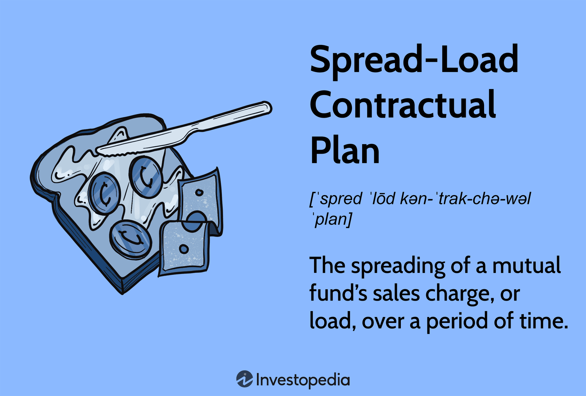

## Table of Contents

## What is a Spread-Load Investment Plan?

A Spread-Load Investment Plan is a type of investment where you pay fees over time instead of all at once. This plan helps spread out the costs of investing, making it easier to manage your money. Instead of paying a big fee when you start, you pay smaller fees as you go along. This can be helpful if you don't have a lot of money to start with or if you want to keep more of your money invested.

These plans are often used in mutual funds. When you invest in a mutual fund with a spread-load plan, you might pay a fee each year or each time you buy more shares. This can make the total cost of the investment higher over time, but it can also make it easier to keep investing without needing a large amount of money upfront. It's important to understand the fees and how they work before choosing this type of plan.

## How does a Spread-Load Investment Plan differ from other investment strategies?

A Spread-Load Investment Plan is different from other investment strategies because it spreads out the fees you pay over time. With other plans, you might have to pay a big fee right at the start, like with a front-end load plan. But with a spread-load plan, you pay smaller fees as you keep investing. This can be good if you don't have a lot of money to start with, because it lets you invest without needing a big chunk of money upfront.

Another way a Spread-Load Investment Plan differs is that it can make the total cost of your investment higher over time. While you're paying less at the start, the fees add up as you go along. This is different from a no-load plan, where you don't pay any fees to buy or sell the investment. With a no-load plan, you keep more of your money invested from the start, but you need to have enough money to get started. So, a spread-load plan can be a good choice if you want to keep investing over time without a big initial cost, but you need to be aware that it might cost more in the long run.

## What are the benefits of using a Spread-Load Investment Plan?

One of the main benefits of using a Spread-Load Investment Plan is that it allows you to start investing without needing a large amount of money right away. Instead of paying a big fee when you start, you pay smaller fees over time. This can make it easier for people who don't have a lot of money to begin with to start investing and keep adding to their investments over time. It helps spread out the cost, so you can keep more of your money working for you from the start.

Another benefit is that a Spread-Load Investment Plan can help you stay committed to your investment goals. Because you're paying fees as you go, it encourages you to keep investing regularly. This can be really helpful for building a habit of saving and investing. Over time, this regular investing can add up and help grow your money, even if you're only putting in small amounts each time.

## What are the potential risks associated with a Spread-Load Investment Plan?

One potential risk of using a Spread-Load Investment Plan is that it can end up costing you more money over time. Even though you're paying smaller fees as you go, those fees can add up. If you keep investing for a long time, you might end up paying more in total than you would with a plan that charges a one-time fee at the start. It's important to look at the fees and figure out if the spread-load plan will really save you money in the long run.

Another risk is that the ongoing fees might make you less likely to keep investing. If the fees start to feel like too much, you might decide to stop adding money to your investment. This can slow down your progress toward your financial goals. It's important to think about how the fees might affect your motivation to keep investing and whether you can handle the costs over time.

## How can someone start a Spread-Load Investment Plan?

To start a Spread-Load Investment Plan, you first need to find a mutual fund or investment company that offers this type of plan. You can do this by looking online or talking to a financial advisor. Once you've found a company that offers spread-load plans, you'll need to open an account with them. This usually involves filling out some forms with your personal information and choosing the specific mutual fund or investment you want to put your money into.

After you've set up your account, you can start investing. With a spread-load plan, you'll pay a small fee each time you add money to your investment. You can set up automatic contributions from your bank account, which makes it easier to keep investing regularly. It's important to read all the information about the fees and how they work so you know what you'll be paying over time. If you have any questions, don't be afraid to ask the investment company or a financial advisor for help.

## What types of assets are typically included in a Spread-Load Investment Plan?

Spread-Load Investment Plans are usually found in mutual funds. These mutual funds can include a mix of different types of assets like stocks, bonds, and sometimes even cash or cash equivalents. Stocks are pieces of ownership in companies, and they can grow in value over time. Bonds are like loans you give to companies or governments, and they pay you back with interest. Having a mix of these assets can help spread out the risk and make your investment more stable.

The specific mix of assets in a Spread-Load Investment Plan can vary depending on the goals of the mutual fund. Some funds might focus more on stocks if they want to grow quickly, while others might have more bonds if they want to be safer and provide steady income. It's important to look at the details of the mutual fund to see what kinds of assets it includes and how they fit with your own investment goals.

## How often should the portfolio in a Spread-Load Investment Plan be rebalanced?

Rebalancing your portfolio in a Spread-Load Investment Plan is important to keep your investments in line with your goals. How often you should rebalance depends on your personal situation and the rules of the mutual fund you're invested in. A common approach is to rebalance once a year. This helps you check if your mix of stocks, bonds, and other assets is still what you want it to be. If one type of asset has grown a lot more than the others, you might need to sell some of it and buy more of the other types to get back to your original plan.

Another way to decide when to rebalance is to set a percentage limit. For example, if any part of your portfolio grows or shrinks by more than 5% from your target, you might rebalance then. This can mean rebalancing more often than once a year, but it helps keep your investments closer to your goals. It's a good idea to talk to a financial advisor to figure out the best rebalancing plan for you, based on your comfort with risk and your long-term goals.

## What are the tax implications of a Spread-Load Investment Plan?

The tax implications of a Spread-Load Investment Plan depend on the type of account you use and the investments within the plan. If you invest in a taxable account, you'll need to pay taxes on any income or gains from your investments. For example, if your mutual fund pays dividends or if you sell shares for a profit, you'll owe taxes on those amounts. The fees you pay as part of the spread-load plan are not tax-deductible, so you can't use them to lower your taxable income.

If you use a tax-advantaged account like an IRA or 401(k) to invest in a Spread-Load Investment Plan, the tax rules are different. In these accounts, you might not have to pay taxes on your investment earnings until you take the money out, or you might get a tax break on the money you put in. It's important to understand the rules of your specific account to know how taxes will affect your investments. Talking to a tax advisor can help you figure out the best way to manage your taxes with a Spread-Load Investment Plan.

## How does market volatility affect a Spread-Load Investment Plan?

Market [volatility](/wiki/volatility-trading-strategies) can have a big impact on a Spread-Load Investment Plan. When the market goes up and down a lot, the value of your investments can change quickly. If you're adding money to your plan regularly, you might buy more shares when the price is low and fewer when the price is high. This can be good because it means you're buying at different prices, which can help you get a better average price over time. But it can also be scary because you might see the value of your investments drop a lot during times of high volatility.

Even though market volatility can make your investments seem risky, a Spread-Load Investment Plan can help you stay calm. Because you're paying fees over time and adding money regularly, you're less likely to make big changes to your plan just because the market is moving a lot. This can help you stick to your long-term goals and keep investing, even when the market is volatile. It's important to remember that investing is for the long term, and short-term ups and downs are normal.

## Can a Spread-Load Investment Plan be customized to individual financial goals?

Yes, a Spread-Load Investment Plan can be customized to fit your own financial goals. When you start a plan, you can choose the mutual fund that matches what you want to achieve. Some funds focus on growing your money quickly, which might be good if you're saving for something far in the future. Other funds might be safer and give you steady income, which could be better if you need money sooner. You can talk to a financial advisor to pick the right fund for your goals.

Once you've chosen your fund, you can also decide how much money to put in and how often. If you want to save a lot, you can add more money each time. If you're just starting out, you can start with smaller amounts and increase them as you go. This flexibility lets you adjust your plan as your life changes, so you can keep working toward your goals no matter what happens.

## What are advanced strategies for optimizing a Spread-Load Investment Plan?

One advanced strategy for optimizing a Spread-Load Investment Plan is to use dollar-cost averaging. This means you put the same amount of money into your investment at regular times, like every month. When the market is down, your money buys more shares, and when the market is up, it buys fewer. Over time, this can help you get a better average price for your shares. It's a good way to keep investing even when the market is moving a lot, and it can help you stay calm and stick to your plan.

Another strategy is to rebalance your portfolio regularly. This means checking your investments to make sure they still match your goals. If one part of your portfolio has grown a lot more than the others, you might sell some of it and buy more of the other parts to get back to your original plan. Rebalancing can help you keep your risk level where you want it and make sure your investments are working hard for you. It's a good idea to rebalance at least once a year, or more often if your investments change a lot.

## How do global economic trends influence the effectiveness of a Spread-Load Investment Plan?

Global economic trends can have a big impact on how well a Spread-Load Investment Plan works. When the world economy is doing well, companies make more money, and the value of stocks in your mutual fund might go up. This can be good for your plan because your investments could grow faster. But if the global economy is struggling, like during a recession, the value of your investments might go down. This can make it harder for your plan to grow, but because you're adding money regularly, you might be able to buy more shares when prices are low, which can help in the long run.

Even though global economic trends can affect your Spread-Load Investment Plan, the plan's design can help you handle these ups and downs. By paying fees over time and adding money regularly, you're less likely to make big changes to your plan just because the economy is moving a lot. This can help you stick to your long-term goals and keep investing, even when the world economy is volatile. It's important to remember that investing is for the long term, and short-term changes in the global economy are normal.

## References & Further Reading

[1]: Bergstra, J., Bardenet, R., Bengio, Y., & Kégl, B. (2011). ["Algorithms for Hyper-Parameter Optimization."](https://dl.acm.org/doi/10.5555/2986459.2986743) Advances in Neural Information Processing Systems 24.

[2]: ["Advances in Financial Machine Learning"](https://www.amazon.com/Advances-Financial-Machine-Learning-Marcos/dp/1119482089) by Marcos Lopez de Prado

[3]: ["Evidence-Based Technical Analysis: Applying the Scientific Method and Statistical Inference to Trading Signals"](https://www.amazon.com/Evidence-Based-Technical-Analysis-Scientific-Statistical/dp/0470008741) by David Aronson

[4]: ["Machine Learning for Algorithmic Trading"](https://github.com/stefan-jansen/machine-learning-for-trading) by Stefan Jansen

[5]: ["Quantitative Trading: How to Build Your Own Algorithmic Trading Business"](https://www.amazon.com/Quantitative-Trading-Build-Algorithmic-Business/dp/1119800064) by Ernest P. Chan