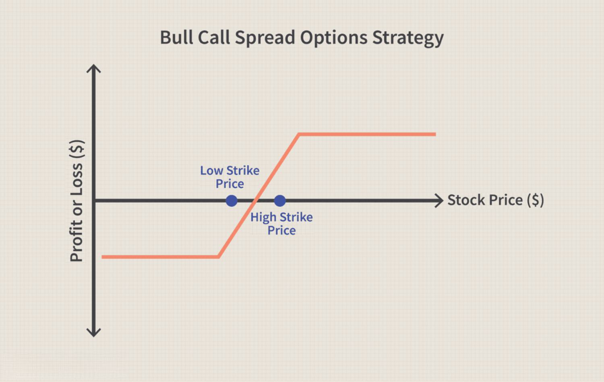

In the ever-evolving landscape of financial markets, investors continuously seek strategies to maximize their returns while mitigating risks. Among the array of financial instruments and methodologies available, spread options and algorithmic (algo) trading have garnered significant attention for their adaptability and potential for profit. Spread options are specialized derivative contracts that derive value from price differentials between two or more underlying assets, enabling traders to capitalize on relative price movements within diverse markets such as equities, commodities, and currencies.

One of the primary advantages of spread options lies in their ability to provide tailored exposure to market segments while managing risk through price differentials, rather than relying on absolute price movements. This can prove particularly beneficial in volatile market conditions, where direct investments might expose traders to substantial risks. Algorithmic trading, on the other hand, utilizes computer programs to execute trades based on predefined algorithms, enhancing the efficiency and precision of trading operations. By removing human emotions and biases, algorithmic trading allows for systematic decision-making, a critical element in successfully navigating complex market environments.



This article explores financial strategies involving investment examples in spread options and algo trading to present insights into their applications and benefits. Through real-world examples, we illustrate how spread options can leverage relationships between assets to yield financial gains. Furthermore, we explain the integration of automation through algorithmic trading, highlighting how it facilitates efficient and precise execution of complex trading strategies, such as spread trading. By understanding the core principles of both spread options and algorithmic trading, investors can develop comprehensive financial strategies that respond effectively to changing market dynamics.

## Table of Contents

## Understanding Spread Options

Spread options are a form of financial derivatives that derive their value from the price differential between two or more underlying assets. Unlike standard options that base their value on the price of a single asset, spread options hinge on the differences between prices, which makes them useful for various trading strategies and risk management purposes.

These options find their applications across different markets, including equities, commodities, and currencies. In equities, spread options can capture the relative performance between two stocks or index levels. For commodities, they are often used to trade the price differential between raw and processed goods, such as the crack spread in the energy sector or the crush spread in agriculture. In the currency markets, spread options are employed to capitalize on fluctuations between currency pairs.

Among the primary types of spread options are crack spreads, crush spreads, and currency spread options:

1. **Crack Spreads**: Predominantly used in the energy sector, crack spreads involve the price difference between crude oil and its refined products, such as gasoline and heating oil. This spread reflects the refinery margin, illustrating the profitability of refining crude oil into its specific products. 

2. **Crush Spreads**: In agriculture, crush spreads are popular among traders interested in the processing chain of raw soybeans into soybean oil and meal. These spreads allow traders to manage risks associated with fluctuation in the price relationship between raw soybeans and their derivative products.

3. **Currency Spread Options**: These involve the price differential between two different currency pairs. Traders can use these options to hedge against currency risk or to speculate on the movements in foreign exchange rates that may affect the relationship between two or more currencies.

Traders utilize spread options to hedge risks by offsetting potential losses in one asset with gains in another. They are also used to speculate on market movements, offering traders a leveraged opportunity to bet on the price relations between assets rather than their absolute values. Moreover, spread options allow for the exploitation of pricing inefficiencies between related assets, providing a mechanism to capitalize on mispricings in correlated markets.

Overall, spread options present an innovative way to manage and speculate on the price relationships of assets across diverse financial markets. They are integral tools for traders aiming to hedge risks, profit from relative price movements, or exploit market inefficiencies with a strategic approach.

## Investment Examples of Spread Options

In the energy market, an illustrative example of spread options is the crack spread. This involves the price difference between [crude oil](/wiki/crude-oil) and its refined products such as gasoline and heating oil. The crack spread is a vital indicator in the oil refining industry, reflecting the gross profit margin of refining. Traders may choose to invest in call options on the crack spread if they forecast an increase in refining margins due to rising demand for refined products or a decrease in crude oil supply. This strategic move allows traders to profit from favorable shifts in the price differential between crude oil and its derivatives.

In the agricultural sector, crush spread options provide another investment opportunity. These options exploit the profit discrepancies between raw soybeans and their processed products, namely soybean oil and soybean meal. Crush spreads are particularly significant given that soybeans are processed into multiple products with varying supply and demand dynamics. By carefully evaluating market conditions, traders can utilize crush spread options to hedge against unfavorable price movements or to capitalize on anticipated changes in the profitability of soybean processing.

These examples underscore the potential of spread options as a mechanism for leveraging relationships between commodities to achieve financial gains. By focusing on the price differentials of related assets, traders can employ spread options to engage in hedging, speculation, or [arbitrage](/wiki/arbitrage), ultimately enhancing their ability to manage risk and optimize returns in volatile markets.

 to Algo Trading

Algorithmic trading, commonly referred to as algo trading, leverages computer programs to execute a series of trades automatically based on predefined criteria and algorithms. This technological advancement plays a crucial role in enhancing the efficiency and precision of trading operations. By utilizing sophisticated algorithms, traders can instantly respond to changing market dynamics and conditions. 

One of the most significant advantages of algo trading is the minimization of human emotions and biases. Emotional decision-making can often lead to irrational trading behavior, causing erratic outcomes. Algorithms provide a systematic framework for decision-making, ensuring that trades are executed according to logical and consistent principles. This systemization enables traders to apply complex strategies such as spread trading effectively. Spread trading involves the simultaneous purchase and sale of related securities, such as the differences between futures contracts of commodities, and requires precise timing and execution across multiple market positions.

The nature of algo trading allows for high-frequency trading capabilities, where a large number of orders can be placed in fractions of a second. This speed is paramount when capturing small price discrepancies that occur rapidly in financial markets. Algorithms can be programmed to quickly identify arbitrage opportunities, market-making strategies, and other trading setups that demand split-second execution.

In implementing such strategies, languages like Python offer robust libraries and tools for [algorithmic trading](/wiki/algorithmic-trading). For example, a simple moving average crossover strategy can be coded in Python to automatically execute trades when specific moving averages converge or diverge. This can be swiftly done using libraries such as Pandas for data manipulation and analysis and NumPy for numerical operations. 

```python
import pandas as pd
import numpy as np

# Example: Simple Moving Average Crossover
def moving_average_strategy(prices, short_window, long_window):
    signals = pd.DataFrame(index=prices.index)
    signals['price'] = prices
    signals['short_mavg'] = prices.rolling(window=short_window, min_periods=1).mean()
    signals['long_mavg'] = prices.rolling(window=long_window, min_periods=1).mean()

    # Create signal events
    signals['signal'] = 0.0
    signals['signal'][short_window:] = np.where(signals['short_mavg'][short_window:] > signals['long_mavg'][short_window:], 1.0, 0.0)   
    signals['positions'] = signals['signal'].diff()

    return signals

# Example usage with hypothetical price data
price_data = pd.Series([100, 101, 102, 103, 90, 85, 80, 95, 100, 110])
short_window = 2
long_window = 4

signals = moving_average_strategy(price_data, short_window, long_window)
print(signals)
```

This precision and systematic approach empower traders to manage numerous simultaneous positions effectively without the limitations and delays characteristic of manual trading. Consequently, algo trading continues to revolutionize the landscape of modern financial markets by equipping traders with the tools necessary to navigate ever-changing environments with agility and confidence.

## Implementing Spread Options with Algo Trading

Incorporating algorithmic systems with spread options presents a highly efficient way to manage trades and execute strategies seamlessly. Algorithms can be meticulously programmed to identify optimal entry and [exit](/wiki/exit-strategy) points for spread trading based on predefined parameters and market data. These parameters might include technical indicators, statistical analysis, historical [volatility](/wiki/volatility-trading-strategies), and even [machine learning](/wiki/machine-learning) models that predict price movements.

Programmed algorithms continuously analyze market conditions and execute trades when criteria are met, reducing latency and improving accuracy in trade execution. This automation minimizes human error and ensures consistent decision-making, which is particularly crucial in spread options where precision is paramount.

A critical component of this process is [backtesting](/wiki/backtesting), a method by which traders test their algorithms on historical data to assess performance. Through backtesting, traders can refine their algorithms, simulating past trading conditions to identify strengths and weaknesses. This enables the adjustment of strategies to improve robustness before live deployment. For instance, a trader might use Python libraries such as pandas and NumPy to manipulate data and construct backtesting frameworks. Additionally, visualization libraries like Matplotlib can help interpret performance outcomes.

Platforms like QuantConnect provide an integrated environment for developing, backtesting, and deploying algorithmic strategies. QuantConnect supports multiple assets, including options, making it a suitable choice for implementing spread trading strategies. The platform provides cloud-based services, allowing for rapid scaling and deployment without the need for significant infrastructure investment.

An example of a simple algorithm in Python might involve calculating moving averages to determine entry or exit points for a spread option. Below is a rudimentary Python code snippet demonstrating this concept:

```python
import numpy as np
import pandas as pd

# Load historical data
data = pd.read_csv('spread_data.csv')

# Calculate moving averages
data['Short_MA'] = data['Spread_Price'].rolling(window=5).mean()
data['Long_MA'] = data['Spread_Price'].rolling(window=20).mean()

# Define entry and exit conditions
data['Signal'] = 0
data.loc[data['Short_MA'] > data['Long_MA'], 'Signal'] = 1  # Buy signal
data.loc[data['Short_MA'] < data['Long_MA'], 'Signal'] = -1 # Sell signal

# Backtest performance
data['Strategy_Return'] = data['Signal'].shift(1) * data['Spread_Return']
cumulative_returns = (data['Strategy_Return'] + 1).cumprod()

print('Cumulative Returns:', cumulative_returns.iloc[-1])
```

This code calculates short-term and long-term moving averages on the price of a spread option, generating signals to buy or sell based on their crossover. It then evaluates the strategy's performance through backtesting.

The integration of algorithmic trading in spread options not only automates the trading process but also enhances the ability to capitalize on market opportunities with precision and speed. This synergy between technology and financial instruments is reshaping the way traders approach the complexities of the market.

## Risks and Benefits of Algo-Based Spread Trading

While spread options and algorithmic trading offer numerous advantages, they are accompanied by certain risks that traders must be cognizant of. Key concerns include market volatility and [liquidity](/wiki/liquidity-risk-premium), which can significantly impact algorithmic performance and profitability.

### Market Volatility and Liquidity Concerns

Market volatility refers to the rate at which the price of a security increases or decreases for a given set of returns. High volatility increases the risk of executing trades at undesired prices, affecting the spread option's effectiveness. Liquidity, defined as the ability to quickly buy or sell an asset without causing a significant change in its price, might be insufficient during high volatility periods, leading to slippage—an occurrence when the actual execution price differs from the expected price.

### Profitability and Market Interpretation

The success of algo-based spread trading strategies is intricately linked to the trader's ability to interpret market conditions accurately. Algorithms depend on historical data patterns to predict future trends, which may not always account for unpredictable market behaviors or black swan events. Thus, ensuring robustness in algorithmic models is vital.

### Risk Management with Algorithmic Trading

Automation in trading introduces mechanisms to manage risk effectively. Algorithms can incorporate risk management strategies like stop-loss orders, which automatically sell an asset when it reaches a certain price to limit potential losses. Additionally, programming algorithms to include gain thresholds ensures profits are secured without exposing traders to unnecessary risks. For instance, a Python snippet to execute a simple stop-loss order might look like:

```python
def execute_trade(current_price, buy_price, stop_loss, target_gain):
    if current_price <= (buy_price * (1 - stop_loss)):
        print("Sell order executed at stop-loss price.")
    elif current_price >= (buy_price * (1 + target_gain)):
        print("Sell order executed at target gain price.")

# Example usage
execute_trade(current_price=95, buy_price=100, stop_loss=0.05, target_gain=0.10)
```

### Importance of a Disciplined Approach

Achieving success in algo-based spread trading requires a disciplined approach that integrates rigorous analysis and consistent strategy optimization. Traders must continually backtest strategies using a diverse range of market scenarios to ensure adaptability. Fine-tuning algorithm parameters in line with evolving market conditions can vastly enhance performance outcomes.

In conclusion, while algo-based spread trading holds the potential for substantial returns, a thoughtful incorporation of risk management mechanisms and a commitment to ongoing strategy refinement are indispensable for mitigating inherent risks and ensuring sustained profitability.

## Conclusion

Spread option strategies, combined with algorithmic trading, present a powerful approach for exploiting market inefficiencies. By leveraging automation through algorithms, traders can execute spread trading strategies with greater accuracy and efficiency. This precision allows for the effective management of complex market scenarios, providing traders with the capability to quickly respond to market changes.

The comprehension of both spread options and algorithmic trading principles is essential for investors aiming to develop robust financial strategies. Spread options offer the flexibility to hedge risks and capitalize on pricing disparities, while algorithmic trading facilitates the systematic execution of complex trades without emotional bias.

Furthermore, continuous learning and adaptation are imperative for maintaining a competitive edge in financial markets. As market conditions and technologies evolve, staying informed and refining trading strategies ensures that investors remain responsive to new opportunities and challenges. An adaptive approach enables traders to adjust their algorithms and spread strategies to meet the demands of an ever-changing financial environment, ultimately improving their chances of success.

## References & Further Reading

1. **'Advances in Financial Machine Learning' by Marcos Lopez de Prado**  
   This book addresses the latest developments in machine learning as applied to financial markets. It provides practical tips on algorithm design, data management, and model evaluation. De Prado offers insights into financial machine learning's impact on execution strategies and risk management, making it a valuable resource for those implementing spread options with algorithmic trading. More information can be explored in the context of identifying patterns and arbitrage opportunities using advanced computational techniques.

2. **'Evidence-Based Technical Analysis' by David Aronson**  
   Aronson's work investigates into the empirical validation of technical analysis strategies within financial trading. By emphasizing a scientific approach, the book suggests methodologies for hypothesis testing and statistical scrutiny, helping traders distinguish between profitable strategies and random chance. This evidence-based perspective is crucial for developing algorithms that efficiently execute spread options.

3. **'Machine Learning for Algorithmic Trading' by Stefan Jansen**  
   Jansen provides a comprehensive guide to using machine learning for trading across multiple asset classes. With examples in Python, the book showcases the implementation of algorithms for predictive modeling and portfolio optimization. Jansen’s insights can help refine algos for spread options, improving entry and exit strategy precision through data-centric approaches.

4. **'Options, Futures, and Other Derivatives' by John C. Hull**  
   This text offers foundational knowledge on derivatives, including spread options. Hull explains the pricing models, valuation techniques, and strategic applications of derivatives. Understanding these fundamentals aids in creating effective algorithms that can dynamically adjust to fluctuations in the price spreads of underlying assets.

5. **'Quantitative Trading' by Ernest P. Chan**  
   Chan's book provides a practical guide to developing quantitative strategies in trading. It covers the creation, testing, and implementation of algos in a trading environment, which can be applied to the systematic execution of spread options. The book also discusses risk management and backtesting, crucial for gauging the robustness and profitability of trading models.

