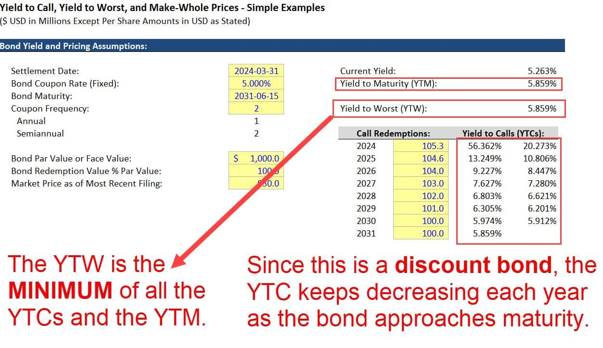

In the world of finance, making informed investment decisions is essential for optimizing returns and minimizing risks. The bond market, with its array of options and varying degrees of complexity, requires investors to use quantitative measures to evaluate potential returns effectively. Among these, Spread-to-Worst (STW) and Yield-to-Worst (YTW) stand out as significant indicators that help investors understand the lowest possible return they might receive from a bond, factoring in any pre-emptive actions by the issuer.

STW refers to the dispersion of returns between the worst-performing and best-performing securities in a market. It provides a comparative analysis that helps investors in determining the credit spread they might expect when investing in bonds, thereby giving insights into potential risks and performance variations. On the other hand, YTW is the lowest yield an investor can receive if the issuer decides to exercise any call options before the bond's maturity. This yield is crucial as it shields investors from unforeseen events such as changes in interest rates and issuer's strategies, thus enabling better projection of potential returns.



In recent years, technological advancements have significantly contributed to refining bond yield assessments. Algorithmic trading, which utilizes computer algorithms to automate trading processes, has provided a means to enhance the precision of these calculations. The implementation of algorithms in bond trading strategies facilitates real-time data processing, improves decision-making accuracy, and optimizes investment outcomes. Through such technological applications, assessing STW and YTW has become more effective, paving the way for investors to manage and mitigate risks while maximizing returns. The integration of algorithmic trading in investment strategies exemplifies the shift toward a more data-driven and analytical approach in the bond market, offering investors a comprehensive mechanism to analyze yields and spreads meticulously.

## Table of Contents

## Understanding Spread-to-Worst (STW) and Yield-to-Worst (YTW)

Spread-to-Worst (STW) and Yield-to-Worst (YTW) are essential metrics in bond investment analysis, providing insights into the potential downside risk associated with fixed-income securities.

STW measures the difference in returns between the worst-performing and best-performing securities within the same market segment. This metric is particularly valuable for assessing the range of returns that can occur in a portfolio of bonds. The spread is calculated by comparing the yield of a bond to a benchmark yield, such as the yield on a government bond with a similar maturity and credit quality. A wider spread indicates a higher level of perceived risk or potential underperformance relative to the benchmark.

YTW, on the other hand, calculates the lowest yield a bondholder can receive if the bond issuer exercises any call options before the bond's maturity. This calculation becomes crucial in scenarios where bonds [carry](/wiki/carry-trading) call options, allowing the issuer to redeem the bond before its scheduled maturity date. The formula for Yield-to-Worst is:

$$
\text{YTW} = \min(\text{YTM}, \text{YTC})
$$

Where:
- $\text{YTM}$ is the Yield-to-Maturity, the rate of return expected if the bond is held until maturity, assuming all coupon payments are reinvested at the same rate.
- $\text{YTC}$ is the Yield-to-Call, the rate of return expected if the bond is called at the earliest possible date.

Investors analyze YTW to understand the minimum yield they might receive, accounting for the possibility of early redemption by the issuer. This assessment helps in constructing a conservative estimate of potential returns, ensuring investors are prepared for less favorable outcomes.

Both STW and YTW are pivotal in comprehensively evaluating the risk and return profile of bonds, paving the way for more informed investment decisions in the bond market.

## Algorithmic Trading in Bond Markets

Algorithmic trading leverages sophisticated computer algorithms to automate and enhance trading strategies in bond markets, aiming to achieve greater precision, efficiency, and profitability. These algorithms function by executing pre-defined instructions for trading, which are based on timing, price, quantity, or any mathematical model. The use of [algorithmic trading](/wiki/algorithmic-trading) in bond markets has significantly transformed how yields are calculated and investments are made.

At the core of algorithmic trading lies the ability to process and analyze large datasets swiftly, which is particularly important in the bond market where pricing can be influenced by numerous variables such as interest rates, credit ratings, and macroeconomic indicators. Algorithms use complex mathematical models to predict price movements and make informed decisions on buying or selling bonds. This level of precision is crucial for calculating the yield of bonds, particularly when dealing with a myriad of options or callable bonds, where Yield-to-Worst (YTW) becomes an essential measurement.

The benefits of algorithmic trading in the bond markets are multifold. Firstly, the speed at which data can be processed and trades executed is unmatched. Algorithms can scan entire markets and execute trades within milliseconds. This speed advantage reduces the market impact cost of trades, providing better execution prices and enhancing profitability.

Secondly, algorithmic trading brings accuracy to trading operations, minimizing human error, and bias which may affect decision making. Algorithms operate using fixed criteria which ensures that trades are executed based on data-driven insights rather than emotional responses to market fluctuations.

Furthermore, algorithmic trading enhances the efficiency of trade execution by automating cumbersome manual processes. This automation not only allows traders to handle larger portfolios but also enables them to focus on developing and refining trading strategies rather than the repetitive steps of executing transactions.

The integration of [machine learning](/wiki/machine-learning) within algorithmic trading strategies is another advancement that optimizes bond yield calculations. Machine learning algorithms are capable of learning and adapting to changing market conditions, thereby refining predictions over time. This adaptability allows for more precise yield assessments and the identification of emerging trends within the bond market, potentially leading to more informed investment decisions.

Additionally, algorithmic trading allows for high-frequency trading ([HFT](/wiki/high-frequency-trading-strategies)) in the bond markets, which involves executing a large number of orders at extremely high speed. HFT capitalizes on small price discrepancies in the market, thereby increasing [liquidity](/wiki/liquidity-risk-premium) and narrowing spreads.

To conclude, the deployment of algorithmic trading in bond markets streamlines operations and enhances the ability to calculate bond yields and execute trades with remarkable speed and precision. As technology continues to progress, the use of algorithms in trading is expected to grow, further optimizing market outcomes and offering investors robust tools for navigating the complexities of bond investments.

## Calculating YTW with Algorithmic Trading

Integrating Yield-to-Worst (YTW) calculations into algorithmic trading requires a combination of mathematical precision and computational efficiency. This integration involves several key components, including data inputs and management, programming parameters, constraints, and the use of specialized software tools to achieve accurate and efficient calculations.

### Key Components of YTW Calculations

1. **Data Inputs and Management**: 
   Accurate YTW calculations start with comprehensive data gathering. Essential data inputs include bond characteristics such as coupon rates, call schedules, maturity dates, and current market yields. Data management tools help in organizing and cleaning the data, ensuring that input parameters are current and precise.

2. **Programming Parameters**:
   Calculating YTW involves specifying parameters within an algorithmic framework. These typically include setting up the algorithm to evaluate all possible call scenarios. The YTW is the minimum yield value that the bond could produce, considering all potential call dates and the maturity date. The formula for YTW is mainly driven by the present value equation, considering the earliest redeemable call date:
$$
   YTW = \min \left( \left\{ YTM_i \right\} \right)

$$

   Where $YTM_i$ is the yield to maturity calculated at each potential call date.

3. **Constraints**:
   Constraints are necessary to define the boundary conditions under which the algorithms operate. These may include market conditions, transaction costs, and legal constraints specific to financial markets. Effective implementation ensures that the computed YTW is realistic and applicable under current market conditions.

4. **Software Tools**:
   Advanced software tools like Python libraries (e.g., NumPy, pandas) facilitate complex financial calculations. Libraries such as QuantLib or custom-built modules can efficiently handle bond analytics, allowing for automated execution of YTW calculations.

### Step-by-Step Guide for Accurate YTW Calculations

1. **Gather Bond Data**:
   - Collect bond specifics: initial price, maturity, coupon rate, and call schedule.
   - Access market data for current interest rates.

   ```python
   import pandas as pd

   bond_data = pd.DataFrame({
       'Coupon Rate': [0.05],
       'Maturity': ['2030-12-31'],
       'Call Dates': ['2025-12-31', '2027-12-31'],
       'Current Yield': [0.045]
   })
   ```

2. **Set Up Computational Environment**:
   - Use Python for setting up computation models.
   - Implement financial functions to compute present values and yields.

3. **Implement YTW Calculation Algorithm**:
   - Iterate over all possible call dates to calculate yields.
   - Utilize Python functions to compute yields to each possible call until maturity.

   ```python
   from quantlib.instruments.bonds import FixedRateBond
   from quantlib.pricingengines.bond import DiscountingBondEngine
   from quantlib.termstructures.yields.flat_forward import FlatForward
   from quantlib.settings import Settings
   from quantlib.time.daycounters.actual_actual import ActualActual
   from quantlib.currency import USDCurrency
   from quantlib.time.api import today, Months, Period

   # Sample setup to create a bond and calculate YTW

   # Define bond parameters and engine
   calendar = Settings().evaluation_date_iso = today()
   fixed_rate_bond = FixedRateBond(settlement_days=3, face_amount=1000,
                                   schedule=bond_schedule, coupons=[0.05], day_counter=ActualActual())

   # Set up the yield curve
   yield_curve = FlatForward(ref_date=calendar,
                             forward=0.045,
                             daycounter=ActualActual())

   engine = DiscountingBondEngine(yield_curve)
   fixed_rate_bond.set_pricing_engine(engine)

   # Compute yield to each call and to maturity
   ytm_all = []
   for call_date in bond_data['Call Dates']:
       ytm = fixed_rate_bond.yield_price(bond_price, dc)
       ytm_all.append(ytm)

   ytw = min(ytm_all)
   ```

4. **Analyze Results & Optimize**:
   - Validate YTW calculations against market data trends.
   - Adjust parameters and constraints based on sensitivity analysis to optimize performance and accuracy.

By following these steps and utilizing algorithmic techniques, investors and traders can reliably compute YTW, thus enhancing decision-making processes and optimizing bond investment strategies effectively.

## Benefits and Challenges of Algorithmic Trading

Algorithmic trading has become an integral part of modern financial markets, including the bond market, where it enhances decision-making and risk management. The primary benefit of algorithmic trading is its ability to process vast amounts of data with high speed and accuracy, enabling investors to make more informed decisions. By analyzing market data, algorithms can identify trading opportunities and execute trades in milliseconds, significantly faster than human traders. This speed not only optimizes entry and [exit](/wiki/exit-strategy) points but also reduces the impact of market fluctuations on trading outcomes.

Another advantage of algorithmic trading is its precision. Algorithms follow predefined rules, minimizing emotional biases that often affect human traders. This leads to consistent strategy execution and enhances the reliability of trading decisions. Furthermore, algorithmic trading can incorporate risk management features, such as stop-loss orders and automated portfolio rebalancing, to mitigate potential losses and maintain desired risk levels.

Despite these benefits, there are challenges associated with algorithmic trading. Data integrity is crucial, as algorithms rely on high-quality, accurate data to function effectively. Poor data quality can lead to incorrect trading signals and substantial losses. Therefore, ensuring data accuracy and employing robust data cleansing processes are essential. Algorithm complexity is another challenge, as intricate algorithms require sophisticated programming skills and resources to develop and maintain. Moreover, complex algorithms may be difficult to interpret, making it challenging to understand their decision-making processes.

Market [volatility](/wiki/volatility-trading-strategies) can also impact algorithmic trading strategies. While algorithms are designed to capitalize on market movements, excessive volatility may result in erratic trade execution and unexpected losses. To address this, algorithms need to be adaptable and include volatility filters or safeguards.

Regulatory compliance poses an additional challenge. Financial markets are subject to stringent regulations, and algorithmic trading systems must adhere to these standards. Compliance requires maintaining transparent records and demonstrating that algorithms are not manipulating markets or violating trading regulations.

Advanced technologies such as machine learning offer solutions to some of these challenges. Machine learning can enhance data processing capabilities by identifying patterns and trends that may not be readily apparent through traditional analysis methods. It can also improve algorithm adaptability by enabling systems to learn from past performance and adjust strategies dynamically. For instance, machine learning algorithms can refine their predictive capabilities by analyzing historical trade outcomes and market conditions, enhancing decision-making accuracy.

In summary, algorithmic trading brings multiple benefits to bond markets, including speed, precision, and risk management. However, it also presents challenges related to data integrity, complexity, market volatility, and regulatory compliance. Leveraging advanced technologies like machine learning can help mitigate these challenges and enhance the effectiveness of algorithmic trading strategies.

## Strategies for Investing in Bonds Using Spreads and YTW

Investors seeking to optimize their bond portfolios often rely on spreads and Yield-to-Worst (YTW) as key indicators. Analyzing bond spreads, which are the differences in yield between various debt instruments and a benchmark, such as U.S. Treasuries, provides valuable insights into credit risk and potential returns. Spreads can widen due to increased credit risk or market pessimism, signaling opportunities for investors who can accurately assess the underlying issuer's financial health.

Yield-to-Worst (YTW) assesses the lowest possible yield an investor can receive on a callable bond, assuming the issuer exercises call options at the earliest opportunity. This measure is crucial for understanding downside risk, particularly in volatile [interest rate](/wiki/interest-rate-trading-strategies) environments, where issuers might choose to refinance debt if market rates decrease.

To uncover profitable bond investment opportunities using spreads and YTW, investors should consider the following strategies:

1. **Credit Spread Analysis**: By examining the credit spread over benchmarks, investors gain insight into the credit quality and specific risks associated with a bond. Wider spreads may indicate higher perceived risk, providing potential for higher returns if the risk is mispriced.

2. **Market Conditions Assessment**: In environments of rising interest rates, bonds with lower YTW may be less attractive due to potential calls, while those with higher YTW may offer relative value. Conversely, in declining rate environments, YTW becomes crucial for assessing reinvestment risk.

3. **Yield Curve Positioning**: Analyzing yield curves can help investors identify where spreads are most attractive, indicating potential points for entering or exiting positions. Strategic positioning on the yield curve can enhance portfolio yield, especially when combined with expectations of economic cycles.

4. **Diversification and Risk Management**: Deploying a diversified strategy mitigates idiosyncratic risk. By balancing bond portfolios across various sectors and maturities, the impact of any single bond's performance is minimized. YTW can guide diversification choices by helping assess callable features of potential investments.

5. **Algorithmic Tools Utilization**: Advanced algorithms can assist in real-time monitoring and analysis of spreads and YTW, identifying arbitrage opportunities or overpriced/underpriced securities faster than manual processes. For instance, Python libraries such as NumPy and pandas can be used to parse large datasets and perform calculations to assist in portfolio optimization.

```python
import numpy as np
import pandas as pd

# Example: Calculate average spread and identify potential high yield opportunities
bond_data = pd.DataFrame({
    'bond': ['Bond A', 'Bond B', 'Bond C'],
    'yield': [0.05, 0.06, 0.055],
    'benchmark_yield': [0.03, 0.03, 0.03]
})

bond_data['spread'] = bond_data['yield'] - bond_data['benchmark_yield']
mean_spread = bond_data['spread'].mean()

high_yield_opportunities = bond_data[bond_data['spread'] > mean_spread]
print(high_yield_opportunities)
```

This Python snippet demonstrates calculating bond spreads and identifying those with spreads above the average, potentially indicating higher yield opportunities.

By combining these strategies, investors can refine their approach to bond investing, leveraging spreads and YTW to enhance performance. Nonetheless, investors must remain cognizant of market risks and continuously re-evaluate their strategies in light of new information.

## Risks and Limitations of Using Spreads and YTW

Spreads and Yield-to-Worst (YTW) are invaluable tools for bond investors, offering insights into potential returns and associated risks. Yet, these metrics come with inherent limitations that investors should carefully consider, especially in the context of market volatility and liquidity concerns. 

Market volatility poses a significant risk when relying solely on spreads and YTW for bond investment decisions. Spreads can fluctuate widely due to changes in interest rates, geopolitical events, or economic data releases. Such volatility can affect the accuracy and reliability of spreads and can lead to misinterpretation of a bond's risk profile. Bond prices can be highly sensitive to interest rate changes, and the YTW, which assumes that the bond will be called at the worst possible date, can vary accordingly.

Liquidity is another crucial [factor](/wiki/factor-investing) impacting the effectiveness of spreads and YTW. In less liquid markets, large spreads can result from varying levels of buying and selling activity rather than actual changes in credit risk. During periods of financial stress, the liquidity premium — part of the spread attributed to low liquidity — can increase significantly, overshadowing insights provided by YTW and traditional credit spreads. This means that the YTW may not accurately reflect the true yield an investor can expect if the bond is not easily tradable.

Investors should navigate these risks by utilizing a combination of metrics to achieve a more holistic analysis of bond investments. By complementing spreads and YTW with other indicators, such as Duration, Convexity, or Credit Default Swap (CDS) spreads, investors can gain a more comprehensive understanding of bond dynamics. Such diversification in analysis methodologies aids in mitigating risks associated with over-reliance on a single measure.

For example, combining YTW with Duration, which measures a bond's price sensitivity to interest rate changes, offers a nuanced perspective on interest rate risk. Similarly, integrating CDS spreads can provide additional insights into credit risk that might not be fully captured by traditional spread analysis. Using sophisticated models and data analytics techniques, such as machine learning, can further refine these analyses, enabling investors to anticipate adverse market movements and enhance decision-making.

In conclusion, while spreads and YTW remain essential tools for bond market analysis, they should be part of a broader analytical toolkit. By recognizing their limitations and incorporating additional metrics, investors can enhance their understanding of market conditions, thereby optimizing investment strategies and better managing potential risks.

## Conclusion

Integrating Spread-to-Worst (STW) and Yield-to-Worst (YTW) assessments with algorithmic trading signifies a pivotal transition towards data-driven bond analysis. These methodologies empower investors to optimize returns and minimize risk in an increasingly complex market environment. The application of STW and YTW helps in evaluating the worst-case scenarios for bond yields, allowing for more informed decision-making. Through algorithmic trading, these assessments are performed with heightened speed, precision, and scalability, which are crucial in processing large volumes of financial data.

The integration of sophisticated algorithms automates repetitive tasks and enhances the accuracy of yield calculations. This integration caters to a rapid response mechanism in bond trading, thus ensuring that investors can adapt swiftly to market changes. By leveraging tools like machine learning and advanced data analytics within the framework of algorithmic trading, the predictive power of STW and YTW assessments is significantly improved. These technologies facilitate the identification of latent patterns and correlations within bond market data that human analysts might overlook.

Moreover, as technological innovations continue to evolve, the strategies underpinning bond market analysis will witness further enhancements. For instance, the incorporation of [artificial intelligence](/wiki/ai-artificial-intelligence) can refine algorithms to learn from past trading patterns, making real-time adjustments, and potentially predicting future market movements with greater accuracy. This adaptability presents a compelling advantage for investors who are prepared to embrace these technological advancements, offering them a competitive edge in maximizing returns while effectively managing risk. 

In conclusion, the amalgamation of STW and YTW assessments with algorithmic trading showcases a forward-thinking approach to bond market analysis. Investors who are adept at integrating these innovative strategies are likely to achieve superior investment outcomes, thereby capitalizing on the ongoing evolution of financial technologies.

## References & Further Reading

[1]: "Quantitative Trading: How to Build Your Own Algorithmic Trading Business" by Ernest P. Chan. [Link](https://www.amazon.com/Quantitative-Trading-Build-Algorithmic-Business/dp/1119800064)

[2]: Lopez de Prado, Marcos. "Advances in Financial Machine Learning." Wiley, 2018. [Link](https://www.amazon.com/Advances-Financial-Machine-Learning-Marcos/dp/1119482089)

[3]: Jansen, Stefan. "Machine Learning for Algorithmic Trading." Packt Publishing, 2020. [Link](https://github.com/stefan-jansen/machine-learning-for-trading)

[4]: Aronson, David. "Evidence-Based Technical Analysis: Applying the Scientific Method and Statistical Inference to Trading Signals." John Wiley & Sons, 2006. [Link](https://onlinelibrary.wiley.com/doi/book/10.1002/9781118268315)

[5]: Bergstra, J., Bardenet, R., Bengio, Y., & Kégl, B. (2011). "Algorithms for Hyper-Parameter Optimization." Advances in Neural Information Processing Systems 24. [Link](https://dl.acm.org/doi/10.5555/2986459.2986743)