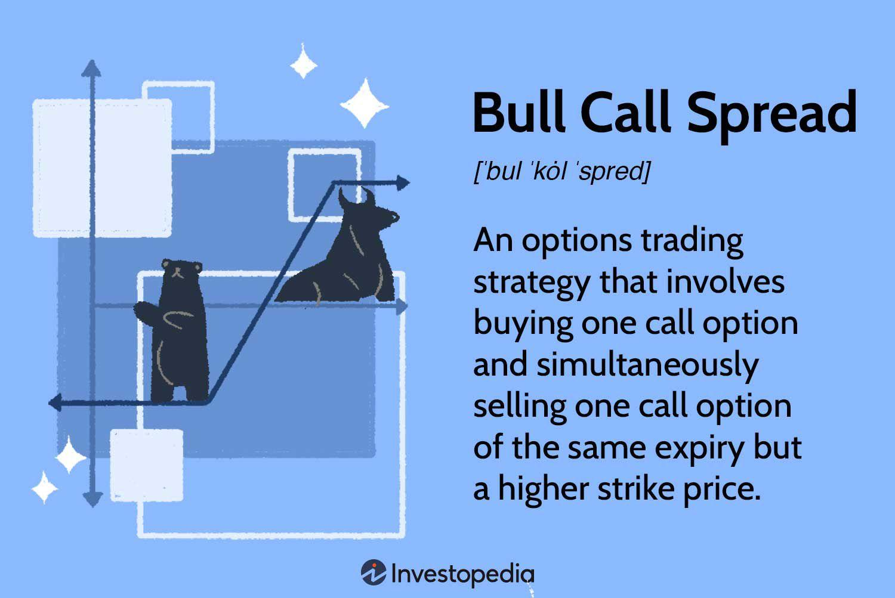

Spread trading is a well-established strategy in algorithmic trading that seeks to capitalize on price discrepancies between two or more financial instruments. The core idea behind this method is to simultaneously take opposing positions on related assets, aiming to profit from their relative price movements rather than their individual price directions. Spread trading offers a range of methodologies, each nuanced and suitable for specific market conditions. This article intends to explore these diverse spread trading techniques, enhancing your comprehensive understanding of their implementation within algorithmic trading.

By examining the varying strategies under the umbrella of spread trading, the reader will gain insight into how they can be applied to different financial scenarios. Moreover, the discussion will extend to the automation of spread trading, highlighting the incorporation of algorithmic processes to improve execution and manage potential risks. 



While spread trading presents valuable opportunities for profit, it is inherently accompanied by risks that require meticulous management and an understanding of complex market dynamics. This article aims to present these concepts in a manner accessible to both newcomers and seasoned traders in the domain, providing insights that can refine and optimize trading strategies in an ever-evolving market landscape.

## Table of Contents

## Understanding Spread Trading

Spread trading involves the concurrent purchase and sale of two distinct market positions within related financial instruments. This strategic trading method leverages the relative performance between the chosen positions, steering clear of reliance on their absolute price changes. By doing so, traders can potentially benefit from pricing inefficiencies or deviations between correlated instruments.

The concept hinges on a variety of contributing factors, such as supply and demand disparities, seasonal trends, or perceived market inefficiencies, which create opportunities for spread trading. For example, weather patterns might influence agricultural commodities, while geopolitical events could affect energy spreads. Traders aim to capitalize on these discrepancies, betting on price convergence or divergence between the paired instruments.

In the context of algorithmic trading, spread strategies are particularly advantageous due to their suitability for systematic coding, enabling automated decision-making and execution. These processes often involve the application of mathematical models and statistical analyses, which can be effectively implemented through programming languages. Python, with its robust libraries like NumPy, pandas, and statsmodels, is often used to conduct such tasks. For example:

```python
import numpy as np
import pandas as pd
import statsmodels.api as sm

# Simulated price data for two correlated instruments
prices_1 = np.random.normal(loc=100, scale=5, size=100)
prices_2 = np.random.normal(loc=95, scale=5, size=100)

# Calculate the spread
spread = prices_1 - prices_2

# Check the mean reversion of the spread using the Augmented Dickey-Fuller test
adf_test = sm.tsa.adfuller(spread)

# Determine the p-value
p_value = adf_test[1]

if p_value < 0.05:
    print("The spread is mean reverting, suitable for spread trading.")
else:
    print("The spread is not mean reverting.")
```

This reliance on algorithmic systems allows traders to execute complex financial models and statistical [arbitrage](/wiki/arbitrage) methods effectively. Statistical arbitrage focuses on exploiting pricing inefficiencies among related assets, a task well-suited for automation due to the rapid calculations and data analyses required. Through such approaches, traders can systematically implement strategies across large datasets, optimizing their decision-making processes and maximizing potential profitability.

Ultimately, spread trading forms a foundational element in the development of sophisticated trading models, offering a robust framework for exploiting inefficiencies in the financial markets. Its integration into algorithmic frameworks enhances the capability of traders to perform rapid, precise trades while minimizing human error and emotional biases.

## Types of Spread Trading Strategies

Spread trading encompasses a range of strategies, each tailored to capitalize on specific market scenarios and align with varied trader objectives. These strategies primarily involve taking two positions within related financial instruments to exploit the differences in their relative performance.

**Calendar Spread**: This strategy involves concurrently buying and selling options of the same underlying asset but with distinct expiration dates. By doing so, traders aim to leverage the time decay between the two positions to optimize returns. For instance, a trader might buy a long-term option and simultaneously sell a short-term option, betting on the price difference as the expiration dates approach. Mathematical models, such as the Black-Scholes Model, can be used to evaluate the fair value and implied volatility of these options, aiding in decision-making.

**Inter-Commodity Spread**: This type pertains to trading on the price differential between two related commodities, such as gold and silver. Traders analyze historical price correlations to identify potential opportunities. The goal is to profit from fluctuations in the relative value of these commodities, rather than changes in their absolute prices. This strategy often requires a nuanced understanding of the fundamental market factors influencing each commodity, such as supply chain dynamics, geopolitical influences, and macroeconomic indicators.

**Bull and Bear Spreads**: These strategies leverage options—calls and puts—based on market forecasts. A bull spread involves purchasing a call option with a lower strike price and selling another with a higher strike price. This is chosen when the trader anticipates a price rise in the underlying asset. Conversely, a bear spread hinges on the expectation of a price drop and involves buying a put option with a higher strike price while selling one with a lower strike price. These strategies can be crafted using specific Python libraries such as NumPy for numerical calculations and Matplotlib for plotting hypothetical profits and losses.

**Butterfly Spread**: This advanced strategy uses multiple options to limit potential losses and gains within a predetermined range. It involves buying two identical options with a middle strike price while concurrently selling one higher and one lower strike price option. The net effect is a position that profits if the underlying asset remains within a narrow price range, maximizing efficiency in stable markets.

**Condor Spread**: Similar to the Butterfly Spread, this strategy also uses four options but with different strike prices. This allows for greater flexibility and a wider range of potential profit, albeit with reduced maximum profitability compared to a butterfly spread. Traders use this approach to take a non-directional stance, benefiting from low volatility environments.

**Diagonal Spread**: Combining elements of calendar and vertical spreads, the diagonal spread involves buying and selling options of different strike prices and expiration dates. This strategy provides a dynamic approach to navigate both time and price dimensions within the market, allowing traders to adjust positions based on evolving market conditions.

Each of these strategies presents unique opportunities for profit and risk management. Successful implementation requires a comprehensive understanding of the underlying market mechanics and careful consideration of factors such as [volatility](/wiki/volatility-trading-strategies), [liquidity](/wiki/liquidity-risk-premium), and transaction costs. By selecting the appropriate spread trading strategy, traders can align their approach with their market outlook and risk tolerance, optimizing their overall trading performance.

## How to Implement Spread Trading in Algo Trading

Implementation of spread trading in [algorithmic trading](/wiki/algorithmic-trading) involves the careful programming of trading strategies which takes into account various market conditions and risks. The primary steps in executing a successful spread trading strategy using algorithms include programming, [backtesting](/wiki/backtesting), selecting appropriate algorithmic tools, risk management, and continuous monitoring.

Initially, it is crucial to program the chosen spread trading strategy into an algorithm. This requires a thorough understanding of both the strategy's components and the underlying financial instruments involved. Typically, these strategies are programmed using languages such as Python, known for its comprehensive libraries tailored for algorithmic trading, including `pandas` for data manipulation and `numpy` for numerical operations. The strategy logic needs to ensure trades are simultaneously executed on the buying and selling sides of the spread. Here's a basic skeleton of how a spread trade might be programmed in Python:

```python
import pandas as pd
import numpy as np

# Define parameters for the spread strategy
def spread_signal(spread):
    threshold = 0.05  # Example threshold
    return np.where(spread > threshold, "Sell", "Buy")

# Load data into a DataFrame
data = pd.DataFrame(...)

# Calculate the spread
data['spread'] = data['instrument1'] - data['instrument2']

# Generate trading signals
data['signal'] = spread_signal(data['spread'])
```

Backtesting is another pivotal stage where the algorithm's performance is tested against historical data to evaluate its robustness and effectiveness. The backtesting phase helps identify potential weaknesses in the strategy before it goes live, thereby reducing the risk of unexpected financial loss.

The selection of algorithmic tools and platforms is essential for effective implementation. Popular platforms like QuantConnect and [Interactive Brokers](/wiki/interactive-brokers-api) provide interfaces for developing and deploying trading algorithms. These platforms offer necessary data feeds, execution capabilities, and sometimes integrated backtesting frameworks.

Incorporating risk management techniques is critical in spread trading algorithms. Implementing stop-loss orders and optimizing position sizing are vital to control potential losses. For example, a stop-loss can be programmed to trigger once a trade's loss exceeds a predetermined percentage of account equity.

Continuous monitoring and adjustment of the algorithmic strategy is ongoing to maintain its effectiveness amidst changing market conditions. Algorithmic strategies need to be flexible enough to adjust parameters such as thresholds and positions based on real-time feedback from the market. Many traders utilize real-time analytical tools and [machine learning](/wiki/machine-learning) models to dynamically update strategy parameters.

In conclusion, implementing spread trading in algo trading requires a methodical approach involving precise programming, rigorous backtesting, and vigilant risk management. Choosing the right tools and maintaining continuous oversight help manage the evolving nature of financial markets, ensuring that strategies remain effective and aligned with market conditions.

## Risks and Profitability of Spread Trading

Spread trading is known for its potential to generate profits, but it also possesses a variety of risks that traders must navigate carefully. One significant risk is market volatility, which can cause the spread between the two or more traded positions to widen or narrow unpredictably. This movement can lead to substantial financial losses, particularly if the trades are leveraged. When leverage is employed, the magnification of gains is equally matched by the magnification of losses, sometimes resulting in losses that exceed the initial investments.

Profitability in spread trading is heavily contingent upon a trader's ability to understand and predict market dynamics accurately. This involves recognizing patterns and trends in how related financial instruments interact. Traders must execute their strategies with discipline, sticking to planned entry and [exit](/wiki/exit-strategy) points, and often incorporating risk management techniques such as stop-loss orders to protect against severe downturns. Calculating the expected value of trades can offer insights into potential profitability:

$$
\text{Expected Value} = \sum (\text{Probability of Outcome} \times \text{Payoff of Outcome})
$$

Experienced traders often include spread trading within a diversified portfolio to manage overall risk. Diversification aids in balancing the risk across various strategies, reducing the potential for significant losses from a single trade type. The principle is that while some trades may incur losses, others will generate gains, stabilizing the trader's returns.

Understanding and mitigating risks are crucial for long-term success in spread trading. Traders employ various strategies to manage these risks, such as diversification, stringent risk management practices, and thorough analysis of market conditions. Constant monitoring and adjustment of trading strategies are essential, especially as market conditions evolve over time.

Success in spread trading relies on a trader's ability to blend their understanding of financial markets with disciplined strategy execution and effective risk management. This ensures that profitable opportunities are maximized while potential risks are minimized, contributing to sustained profitability over time.

## Automating Spread Trading

Automation in spread trading offers significant advantages such as swift execution and the negation of emotional influences in trading operations. By incorporating machine learning and [artificial intelligence](/wiki/ai-artificial-intelligence), traders have the capability to refine their strategies by identifying intricate patterns that surpass human recognition capabilities. This not only enhances the decision-making process but also enables traders to efficiently manage multiple tactics and execute trades seamlessly across various market conditions.

A pivotal aspect of developing automated trading systems is a comprehensive understanding of both algorithmic principles and spread trading methodologies. Creating these systems involves converting trading strategies into code, which can then be used to evaluate historical market data through backtesting. This practice is crucial to ascertain the effectiveness and reliability of the strategies before they are deployed in live trading scenarios.

Moreover, the dynamic nature of financial markets necessitates continuous updates and optimizations of automated systems. This ensures that trading strategies remain aligned with current market conditions. Outdated algorithms may suffer from reduced performance, especially as market dynamics evolve, highlighting the importance of adaptive and flexible system designs.

Developing an example of a simple automated spread trading strategy in Python might look like this:

```python
import numpy as np
import pandas as pd

# Simulate market data
np.random.seed(42)
price_a = np.cumsum(np.random.randn(1000))  # Random walk for asset A
price_b = np.cumsum(np.random.randn(1000))  # Random walk for asset B

# Simple spread: Compute the spread between two asset prices
spread = price_a - price_b

# Calculate moving average and standard deviation
spread_ma = pd.Series(spread).rolling(window=50).mean()
spread_std = pd.Series(spread).rolling(window=50).std()

# Define buy/sell signals based on z-score of the spread
z_score = (spread - spread_ma) / spread_std
buy_signal = z_score < -2
sell_signal = z_score > 2

# Mimicking an execution function (for illustration; this will not execute trades)
def execute_trade(buy, sell):
    trades = []
    if buy:
        trades.append("Buy")
    if sell:
        trades.append("Sell")
    return trades

# Example execution
trade_decisions = [execute_trade(buy, sell) for buy, sell in zip(buy_signal, sell_signal)]
```

In the above example, the strategy monitors the spread between two assets, utilizing a z-score threshold to identify potential buy and sell signals. Though simple, this example underscores the foundational steps in developing automated trading strategies.

Ultimately, in order to sustain competitive performance in spread trading automation, traders must prioritize a disciplined approach to strategy development and risk management. Continuous learning and system enhancements are essential for adapting to the ever-evolving financial landscape.

## Conclusion

Spread trading presents a range of strategies adaptable to numerous market conditions, providing flexibility and diversification for traders. At its core, spread trading involves taking advantage of the price differentials between financial instruments, and its versatility makes it a valuable part of any trader's toolkit. However, while these strategies can be profitable, they also come with intrinsic risks that must be conscientiously managed. This includes understanding market dynamics, maintaining discipline in execution, and incorporating robust risk management measures to mitigate potential downsides.

The integration of spread trading techniques with algorithmic systems holds the promise of enhanced trading efficiency and profitability. By automating the process, traders can execute strategies more swiftly and with fewer emotional biases, capitalizing on opportunities as they arise. Automation can also optimize the handling of complex strategies and large data sets, which may be overwhelming for manual processes. It is essential, however, to ensure that these systems are rigorously tested and continuously monitored to adapt to evolving market conditions.

Success in spread trading within algorithmic trading requires a commitment to continuous learning and adaptation. The financial markets and technological landscapes are in constant flux, demanding that traders stay informed about new developments and refine their strategies accordingly. A disciplined approach to strategy development and risk management is crucial in navigating these changes. As traders acquire more experience and knowledge, they can better assess the potential benefits and pitfalls of different spread trading strategies, ultimately leading to increased competence and success in their trading endeavors.

## References & Further Reading

[1]: ["Advances in Financial Machine Learning"](https://www.amazon.com/Advances-Financial-Machine-Learning-Marcos/dp/1119482089) by Marcos Lopez de Prado

[2]: ["Evidence-Based Technical Analysis: Applying the Scientific Method and Statistical Inference to Trading Signals"](https://www.amazon.com/Evidence-Based-Technical-Analysis-Scientific-Statistical/dp/0470008741) by David Aronson

[3]: ["Machine Learning for Algorithmic Trading"](https://github.com/stefan-jansen/machine-learning-for-trading) by Stefan Jansen

[4]: ["Quantitative Trading: How to Build Your Own Algorithmic Trading Business"](https://books.google.com/books/about/Quantitative_Trading.html?id=j70yEAAAQBAJ) by Ernest P. Chan

[5]: ["Options, Futures, and Other Derivatives"](https://www.amazon.com/Options-Futures-Other-Derivatives-5th/dp/0130090565) by John C. Hull

[6]: Poterba, J. M., & Summers, L. H. (1988). ["Mean Reversion in Stock Prices: Evidence and Implications."](https://www.nber.org/papers/w2343) Journal of Financial Economics, 22(1), 27-59.

[7]: Fama, E. F., & French, K. R. (1993). ["Common risk factors in the returns on stocks and bonds."](https://people.hec.edu/rosu/wp-content/uploads/sites/43/2023/09/Fama-French-Common-risk-factors-1993.pdf) Journal of Financial Economics, 33(1), 3-56.