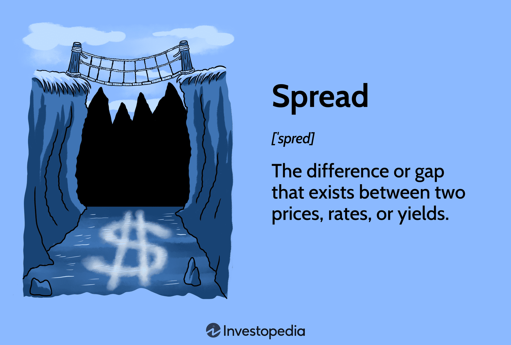

## Table of Contents

## What is spread trading?

Spread trading is a trading strategy where you buy one thing and sell another at the same time. The idea is to make money from the difference in price between the two things. For example, you might buy wheat and sell corn if you think wheat will go up in price more than corn. This way, even if the overall market goes down, you can still make money if the difference between the prices changes in your favor.

This type of trading is often used in futures markets, where people trade contracts for things like crops, oil, or financial instruments. It's popular because it can be less risky than just buying or selling one thing. By trading the spread, you are betting on the relationship between the two items rather than their individual prices. This can help protect you from big losses if the market moves against you.

## How does spread trading differ from other trading strategies?

Spread trading is different from other trading strategies because it involves trading two things at the same time. Instead of just buying or selling one thing, you buy one and sell another. This is called a spread. For example, if you think gold will go up more than silver, you might buy gold and sell silver. This way, you are not just betting on gold going up, but on gold going up more than silver. This can be safer because even if the market goes down, you might still make money if the difference between the prices changes in your favor.

Other trading strategies, like buying or selling one thing, are more straightforward. For example, if you think the price of oil will go up, you might just buy oil. This is called a directional trade because you are betting on the direction the price will move. It's riskier because if you're wrong about the direction, you can lose money. Spread trading, on the other hand, can protect you from some of that risk because you are betting on the difference between two things, not just one. This makes it a popular choice for traders who want to manage their risk better.

## What are the basic types of spread trades?

There are two main types of spread trades: intracommodity spreads and intercommodity spreads. Intracommodity spreads involve trading different delivery months of the same commodity. For example, you might buy wheat for delivery in March and sell wheat for delivery in June. This is also called a calendar spread. You do this because you think the price difference between the two months will change in a way that makes you money.

Intercommodity spreads, on the other hand, involve trading different but related commodities. For example, you might buy soybeans and sell soybean oil. This is because you think the price of soybeans will go up more than the price of soybean oil. This type of spread is used when you think the relationship between the two commodities will change. Both types of spreads are ways to trade the difference between prices rather than betting on the price of one thing going up or down.

## What are the benefits of spread trading for beginners?

Spread trading can be a good choice for beginners because it helps them manage risk. Instead of just buying or selling one thing, you trade two things at the same time. This means you're not betting on the price of one thing going up or down, but on the difference between two things changing. This can protect you from big losses if the market moves against you. For example, if you buy wheat and sell corn, and both prices go down, you might still make money if wheat goes down less than corn.

Another benefit for beginners is that spread trading can be easier to understand. Instead of trying to guess if one thing will go up or down, you're looking at how two things relate to each other. This can make the market seem less scary and more predictable. Plus, spread trading often uses less money upfront, which is good for beginners who might not have a lot to start with. By starting with spread trading, beginners can learn the ropes without risking too much money.

## How do you identify potential spread trading opportunities?

To find good spread trading opportunities, you need to look at how the prices of two things move compared to each other. For example, if you think the price of gold will go up more than the price of silver, you might want to buy gold and sell silver. You can use charts and data to see how these prices have moved in the past. This can help you guess how they might move in the future. You should also keep an eye on news and events that might affect the prices of the things you're trading. For example, if there's a big change in the weather, it might affect the price of crops like wheat and corn.

Another way to find spread trading opportunities is to look at the difference between different delivery months of the same thing. For example, if you think the price of oil in March will be higher compared to the price of oil in June, you could buy oil for March and sell oil for June. This is called a calendar spread. You can use historical data to see if this difference usually gets bigger or smaller at certain times of the year. By understanding these patterns, you can make better guesses about when to trade. Always remember to do your research and think about how much risk you're willing to take before you start trading.

## What are the common tools and platforms used for spread trading?

For spread trading, many people use special software and platforms that help them see the prices of different things and trade them easily. Some popular platforms are NinjaTrader, MetaTrader, and Thinkorswim. These platforms have tools like charts and graphs that show you how the prices of two things are moving compared to each other. They also let you set up and manage your spread trades without having to do everything by hand. This makes it easier for you to find good trading opportunities and act on them quickly.

Another important tool for spread trading is a good data feed. This is a service that gives you real-time information about the prices of the things you want to trade. Some platforms come with their own data feeds, while others let you connect to different data providers like Bloomberg or Reuters. Having a reliable data feed is important because it helps you make decisions based on the most up-to-date information. Without it, you might miss out on good trading opportunities or make trades based on old data, which can be risky.

## How do you calculate the potential profit and risk in a spread trade?

To calculate the potential profit in a spread trade, you need to look at the difference between the prices of the two things you're trading. For example, if you buy wheat at $5 per bushel and sell corn at $4 per bushel, the initial spread is $1. If the price of wheat goes up to $6 and the price of corn stays at $4, the new spread is $2. Your profit is the difference between the new spread and the initial spread, which is $2 - $1 = $1 per bushel. You then multiply this by the number of bushels you traded to get your total profit. So, if you traded 1000 bushels, your profit would be $1000.

Calculating the risk in a spread trade involves thinking about how much the spread could move against you. Using the same example, if the price of wheat stays at $5 but the price of corn goes up to $5, the new spread is $0. This means you would lose the initial spread of $1 per bushel. If you traded 1000 bushels, your loss would be $1000. To manage this risk, you can set stop-loss orders, which automatically close your trade if the spread moves against you by a certain amount. This helps limit your potential losses, but it's important to understand that spread trading, like any trading, always carries some level of risk.

## What are the key factors to consider when choosing a spread to trade?

When choosing a spread to trade, you need to think about how the prices of the two things you're trading move compared to each other. Look at past data to see if there are patterns in how the spread changes over time. For example, if you're trading wheat and corn, check if the price difference between them usually gets bigger or smaller at certain times of the year. Also, consider any news or events that might affect the prices of these things. Weather changes can impact crop prices, so keep an eye on those. Understanding these factors can help you pick a spread that has a good chance of moving in your favor.

Another important thing to think about is how much money you're willing to risk. Spread trading can be less risky than trading just one thing, but there's still a chance you could lose money. Look at how much the spread could move against you and decide if you're okay with that risk. You can use stop-loss orders to limit your losses, but remember that these can also close your trade before it has a chance to turn around. By carefully considering both the potential profit and the risk, you can choose a spread that fits your trading goals and risk tolerance.

## How do advanced traders use spread trading to hedge their portfolios?

Advanced traders use spread trading to hedge their portfolios by balancing their risk. They might own a lot of one thing, like stocks in a certain industry. If they think that industry might go down, they can use spread trading to protect themselves. For example, they might buy stocks in that industry and at the same time, sell futures contracts on an index that includes those stocks. This way, if the industry goes down, the loss on their stocks might be offset by the gain on the futures contracts. By doing this, they can reduce the risk of losing a lot of money if the market moves against them.

Another way advanced traders use spread trading to hedge is by trading related commodities. For example, if they have a lot of oil in their portfolio and they're worried about oil prices dropping, they might buy oil and sell gasoline. Oil and gasoline prices usually move together, but if oil prices drop more than gasoline prices, the trader can make money on the spread. This can help protect their overall portfolio from big losses. By carefully choosing the right spreads, advanced traders can manage their risk and keep their portfolios safer.

## What are some advanced spread trading strategies?

Advanced traders often use a strategy called intermarket spread trading. This involves trading the difference between two related markets, like the S&P 500 and the Nasdaq. For example, if they think technology stocks will do better than other stocks, they might buy Nasdaq futures and sell S&P 500 futures. This way, they can make money if the Nasdaq goes up more than the S&P 500, even if the overall market goes down. It's a way to bet on the relationship between markets rather than just one market going up or down.

Another advanced strategy is called ratio spread trading. This involves buying and selling different amounts of the same or related commodities. For example, a trader might buy two contracts of wheat and sell three contracts of corn. They do this because they think the price of wheat will go up more than the price of corn, but they want to adjust the amounts to balance the risk. This can be more complicated, but it allows traders to fine-tune their trades and potentially make more money if they're right about the price movements.

## How can you manage and adjust a spread trade after it's been placed?

After you place a spread trade, you need to keep an eye on it. You can use charts and data to see how the prices of the two things you're trading are moving compared to each other. If the spread is moving in your favor, you might want to keep the trade open to make more money. But if it's moving against you, you might want to close it to limit your losses. You can do this by setting stop-loss orders, which automatically close your trade if the spread moves against you by a certain amount. This helps you manage your risk and protect your money.

Sometimes, you might want to adjust your spread trade instead of closing it. If you think the spread will keep moving in your favor but not as much as you first thought, you can change the size of your trade. For example, if you bought wheat and sold corn, you might sell some of your wheat or buy back some of your corn to reduce your exposure. This can help you make the most of the trade while still managing your risk. By keeping an eye on your trade and being ready to make changes, you can do better at spread trading.

## What are the latest trends and developments in spread trading?

One of the latest trends in spread trading is the use of [algorithmic trading](/wiki/algorithmic-trading). More and more traders are using computers to find and place spread trades automatically. These algorithms can look at a lot of data very quickly and find good trading opportunities that a person might miss. They can also manage and adjust trades faster than a human can. This makes spread trading more efficient and can help traders make more money. But it also means that the market can move very quickly, so traders need to be careful and keep up with the latest technology.

Another development in spread trading is the growth of electronic trading platforms. These platforms make it easier for traders to see the prices of different things and place spread trades from anywhere. They often have tools like charts and graphs that help traders understand how the prices are moving. This makes spread trading more accessible to more people. But with more people trading, the market can get more crowded, which can make it harder to find good trading opportunities. Traders need to stay informed and use these new tools wisely to do well in this changing environment.

## How can one develop a successful spread trading algorithm?

Developing a successful spread trading algorithm involves several critical steps that ensure the strategy is effective, efficient, and adaptable to market changes. Here's a structured approach to achieving this:

### 1. Data Sourcing

The foundation of any algorithmic trading strategy is high-quality data. For spread trading, relevant data includes historical prices, [volume](/wiki/volume-trading-strategy) data, market depth, and macroeconomic indicators. 

- **Historical Data**: Gather price histories of the assets involved in the spread. This data should be granular enough to capture intraday movements if required.
- **Real-time Data**: Access to real-time market data is essential for executing spread trades effectively as market conditions change rapidly.

Data integrity is crucial; thus, the data should be cleaned and validated to remove errors and outliers which could distort the analysis.

### 2. Modeling

Modeling involves constructing a mathematical representation of the spread trading strategy. This requires understanding the relationship between the financial instruments involved in the spread.

- **Price Spread Calculation**: Define the spread mathematically, typically as the difference or ratio between prices of different assets. For example, in a simple butterfly spread:

$$
\text{Spread} = \text{Price}_{\text{Asset 1}} - \text{Price}_{\text{Asset 2}}
$$

- **Statistical Analysis**: Employ econometric models such as cointegration or correlation analysis to identify arbitrage opportunities. For instance, calculate the Z-score of the spread to identify points of entry and exit:

$$
Z\text{-score} = \frac{\text{Spread} - \mu}{\sigma}
$$

  Where $\mu$ is the mean of the spread and $\sigma$ is the standard deviation.

### 3. Backtesting

Before deploying any model live, it is essential to backtest the strategy using historical data. Backtesting helps evaluate how the strategy would have performed historically and identify potential weaknesses.

- **Backtest Framework**: Use platforms like Python with libraries such as `pandas`, `numpy`, and `backtrader` to test the model. Implement logic to simulate trading execution, accounting for transaction costs and slippage.

  ```python
  import pandas as pd
  import numpy as np

  # Example: Calculate Z-score and generate signals
  prices = pd.Series(...)  # Placeholder for price data
  spread = prices.diff()
  mean = spread.rolling(window=20).mean()
  std = spread.rolling(window=20).std()
  z_score = (spread - mean) / std

  signal = np.where(z_score > 1, -1, np.where(z_score < -1, 1, 0))
  ```

### 4. Implementation

Once a strategy has passed [backtesting](/wiki/backtesting), it's time to implement it in a live trading environment. This requires robust infrastructure to handle order management and execution with minimal latency.

- **Trading Platform**: Utilize algorithmic trading platforms offering APIs for direct market access. Platforms like MetaTrader, Interactive Brokers, or AlgoTrader could be integrated for seamless operation.
- **Execution Strategy**: Implement smart order routing and execution algorithms that minimize market impact and cost.

### 5. Continuous Monitoring and Refinement

Markets are dynamic, and continuous monitoring of the algorithm's performance is crucial to ensure it remains profitable.

- **Performance Monitoring**: Use dashboards to track key performance indicators (KPIs) such as hit rate, profit factor, and Sharpe ratio.
- **Adaptation**: Regularly update the model parameters and assumptions based on observed performance and emerging market trends. This could involve re-calibrating the strategy or incorporating new datasets for improved predictive capability.

By following these steps, traders can create a spread trading algorithm capable of adapting to market changes and delivering consistent returns. Continuous refinement and vigilance in monitoring are essential to navigating the complexities and dynamics inherent in financial markets.

## References & Further Reading

[1]: Bergstra, J., Bardenet, R., Bengio, Y., & Kégl, B. (2011). ["Algorithms for Hyper-Parameter Optimization."](https://papers.nips.cc/paper_files/paper/2011/hash/86e8f7ab32cfd12577bc2619bc635690-Abstract.html) Advances in Neural Information Processing Systems 24.

[2]: ["Advances in Financial Machine Learning"](https://www.amazon.com/Advances-Financial-Machine-Learning-Marcos/dp/1119482089) by Marcos Lopez de Prado

[3]: ["Evidence-Based Technical Analysis: Applying the Scientific Method and Statistical Inference to Trading Signals"](https://www.wiley.com/en-gb/Evidence+Based+Technical+Analysis:+Applying+the+Scientific+Method+and+Statistical+Inference+to+Trading+Signals-p-9780470008744) by David Aronson

[4]: ["Machine Learning for Algorithmic Trading"](https://www.amazon.com/Machine-Learning-Algorithmic-Trading-intelligence/dp/9918608013) by Stefan Jansen

[5]: ["Quantitative Trading: How to Build Your Own Algorithmic Trading Business"](https://www.amazon.com/Quantitative-Trading-Build-Algorithmic-Business/dp/0470284889) by Ernest P. Chan