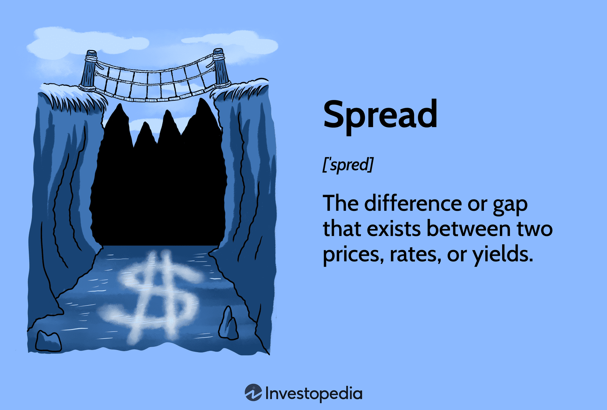

## Table of Contents

## What is a spread in financial trading?

In financial trading, a spread refers to the difference between the buying price (also known as the bid price) and the selling price (also known as the ask price) of a security, currency, or any other financial instrument. This difference is essentially the cost that traders pay to enter a trade, and it's how market makers, who facilitate trading, make their profit. For example, if the bid price for a stock is $10 and the ask price is $10.05, the spread is $0.05.

Spreads can vary widely depending on several factors, including the liquidity of the asset, market volatility, and the trading platform. Highly liquid assets, like major currency pairs in forex trading, typically have very tight spreads, sometimes as low as a few pips. On the other hand, less liquid assets, like certain stocks or exotic currency pairs, can have much wider spreads. Understanding and monitoring spreads is crucial for traders as it directly impacts the cost of trading and potential profitability.

## How does the spread affect trading costs?

The spread directly affects trading costs because it's the difference between the price you buy at and the price you sell at. When you buy a financial instrument, you pay the ask price, which is higher than the bid price. When you sell, you get the bid price, which is lower than the ask price. This difference, the spread, is a cost you have to cover before you can make any profit. For example, if you buy a stock at $10.05 and the bid price is $10, you need the stock price to go up by at least $0.05 just to break even.

Spreads can vary a lot depending on how easy it is to buy and sell the asset. If lots of people want to trade it, like with big currency pairs, the spread is usually small. But if fewer people are trading it, like with some stocks or less common currencies, the spread can be much bigger. A bigger spread means a higher cost to trade, which can eat into your profits. So, traders need to think about the spread when they decide what to trade and how often, because it can make a big difference to how much money they make or lose.

## What are the different types of spread variations?

Spreads can change because of how easy it is to buy and sell something. If lots of people want to trade something, like the big currency pairs in [forex](/wiki/forex-system), the spread will be small. This is because there are many buyers and sellers, so the price to buy and sell doesn't have to be very different. On the other hand, if fewer people want to trade something, like a small company's stock, the spread will be bigger. This is because it's harder to find someone to buy or sell it, so the price difference has to be larger to make it worth it for the market makers.

Spreads can also change because of how much the market is moving around. If the market is calm and prices aren't changing much, the spread will usually be smaller. But if the market is moving a lot, like during big news events, the spread can get bigger. This is because market makers need to protect themselves from quick price changes, so they make the spread wider. Traders need to watch these changes because a bigger spread means more cost to trade, which can affect how much money they make or lose.

## Can you explain fixed spreads versus variable spreads?

Fixed spreads stay the same no matter what's happening in the market. If you're trading with a fixed spread, you know exactly how much it will cost to buy or sell something. This can be good because it makes it easier to plan your trades. But, fixed spreads are usually a bit bigger than variable spreads because the people who set them need to make sure they can still make money even if the market gets crazy.

Variable spreads change depending on what's going on in the market. If lots of people are trading and the market is calm, the spread might be small. But if the market is moving a lot or fewer people are trading, the spread can get bigger. This means the cost to trade can go up or down, which can be good if the spread gets smaller but bad if it gets bigger. Traders need to keep an eye on variable spreads because they can affect how much money they make or lose.

## How do market conditions influence spread variations?

Market conditions can make the spread bigger or smaller. When lots of people are trading and the market is calm, the spread tends to be small. This is because there are many buyers and sellers, so the price to buy and sell doesn't have to be very different. But if fewer people are trading, like with a small company's stock, the spread gets bigger. This is because it's harder to find someone to buy or sell it, so the price difference has to be larger to make it worth it for the market makers.

Also, if the market is moving around a lot, like during big news events, the spread can get bigger. This is because market makers need to protect themselves from quick price changes, so they make the spread wider. Traders need to watch these changes because a bigger spread means more cost to trade, which can affect how much money they make or lose.

## What role do liquidity providers play in spread variations?

Liquidity providers are important because they help make the spread smaller or bigger. They are the ones who buy and sell things in the market, making it easier for everyone else to trade. When there are lots of liquidity providers, the spread is usually small. This is because there are many people ready to buy and sell, so the price difference doesn't have to be big. But if there are fewer liquidity providers, the spread gets bigger. This happens because it's harder to find someone to buy or sell from, so the price difference has to be larger to make it worth it for them.

Market conditions can also change how liquidity providers affect the spread. If the market is calm and lots of people are trading, liquidity providers can keep the spread small. But if the market is moving around a lot, like during big news events, liquidity providers might make the spread bigger. They do this to protect themselves from quick price changes. So, traders need to keep an eye on how liquidity providers are acting because it can change how much it costs to trade.

## How can traders use spread variations to their advantage?

Traders can use spread variations to their advantage by watching how the spread changes and using this information to decide when to trade. If the spread is small, it's cheaper to trade, so it might be a good time to buy or sell. Traders can look for times when the market is calm and lots of people are trading, because this usually means the spread will be small. By trading when the spread is small, traders can save money on trading costs and make more profit.

On the other hand, traders can also use big spreads to their advantage. If they see the spread getting bigger, it might mean the market is about to move a lot. Traders can use this information to get ready for big price changes. They might decide to wait until the spread gets smaller again before trading, or they might use the big spread as a sign to make a quick trade if they think the market will move in their favor. By understanding how spreads change, traders can make smarter decisions and improve their chances of making money.

## What are the impacts of economic news releases on spreads?

Economic news releases can make the spread bigger. When big news comes out, like about jobs or interest rates, the market can get really busy and prices can move a lot. This makes it harder for people who help with trading, called market makers, to keep the prices steady. So, they make the spread bigger to protect themselves from quick price changes. This means it costs more for traders to buy or sell during these times.

Traders need to be careful when economic news is coming out. If they know the spread might get bigger, they can plan their trades better. They might wait until after the news to trade when the spread gets smaller again, or they might use the big spread as a sign that the market will move a lot. By understanding how news affects the spread, traders can make smarter choices and maybe save money on trading costs.

## How do different trading platforms handle spread variations?

Different trading platforms handle spread variations in their own ways. Some platforms offer fixed spreads, which means the spread stays the same no matter what's happening in the market. This can be good for traders because they know exactly how much it will cost to trade. But, fixed spreads are usually a bit bigger than variable spreads because the platform needs to make sure they can still make money even if the market gets crazy. Other platforms use variable spreads, which change depending on what's going on in the market. If lots of people are trading and the market is calm, the spread might be small. But if the market is moving a lot or fewer people are trading, the spread can get bigger.

Some platforms also let traders see the spread in real-time, which can help them decide when to trade. By watching the spread, traders can see if it's getting smaller or bigger and use this information to make better trading decisions. For example, if a trader sees the spread getting smaller, they might decide it's a good time to buy or sell because it's cheaper. On the other hand, if the spread is getting bigger, they might wait until it gets smaller again or use it as a sign that the market might move a lot. Knowing how their trading platform handles spread variations can help traders save money on trading costs and make more profit.

## What strategies can be employed to minimize the impact of spread variations?

Traders can minimize the impact of spread variations by choosing the right times to trade. When the market is calm and lots of people are trading, the spread is usually small. This means it's cheaper to buy or sell. Traders can watch the market and wait for these times to make their trades. They can also use tools on their trading platforms that show the spread in real-time. By keeping an eye on the spread, traders can see when it's small and jump in to trade at a lower cost.

Another strategy is to be aware of economic news releases. Big news can make the spread bigger because the market gets busy and prices move a lot. Traders can plan around these times by waiting until after the news to trade when the spread might be smaller again. Or, they can use the big spread as a sign that the market might move a lot and make quick trades if they think the market will go their way. By understanding how news affects the spread, traders can make smarter choices and save money on trading costs.

## How do regulatory changes affect spread variations in financial markets?

Regulatory changes can make the spread bigger or smaller in financial markets. When governments or financial watchdogs make new rules, it can change how easy it is for people to buy and sell things. If the new rules make it harder for market makers to do their job, they might make the spread bigger to protect themselves. For example, if there are new rules about how much money market makers need to have, they might need a bigger spread to make sure they can still make money and follow the rules.

On the other hand, if the new rules make it easier for more people to trade, the spread might get smaller. More people trading means more buyers and sellers, which can make the spread smaller because it's easier to find someone to trade with. Traders need to keep an eye on these changes because they can affect how much it costs to trade. By understanding how new rules might change the spread, traders can plan their trades better and maybe save money on trading costs.

## Can you discuss advanced analytical techniques for predicting spread variations?

Advanced analytical techniques can help traders predict how the spread might change. One way is to use [machine learning](/wiki/machine-learning). This is where computers learn from past data to guess what will happen next. Traders can feed the computer lots of information about how the spread changed in the past, along with other things like how much people were trading and what was happening in the news. The computer can then look for patterns and use them to predict when the spread might get bigger or smaller. This can help traders decide the best times to buy or sell.

Another technique is called time series analysis. This is where traders look at how the spread has changed over time and use math to guess what might happen next. They can use special formulas to see if there are any patterns in how the spread moves. For example, they might see that the spread gets bigger every time there's a big news event. By understanding these patterns, traders can get ready for when the spread might change and plan their trades better. Both of these techniques can help traders save money on trading costs and make more profit by knowing when the spread might be small.

## What is Understanding Financial Spreads?

A 'spread' in finance typically refers to the difference between two financial measures, such as prices, rates, or yields. This concept is fundamental in various trading and investment activities, as it can significantly impact the execution and cost of transactions.

One of the most common types of spreads encountered in trading is the bid-ask spread. This spread represents the difference between the highest price that buyers are willing to pay for an asset (the bid) and the lowest price that sellers are willing to accept (the ask). Mathematically, the bid-ask spread can be expressed as:

$$
\text{Bid-Ask Spread} = \text{Ask Price} - \text{Bid Price}
$$

The bid-ask spread is a critical measure of market [liquidity](/wiki/liquidity-risk-premium), as narrower spreads often indicate a more liquid market with high trading activity, while wider spreads may suggest lower liquidity and potentially higher transaction costs.

Spreads also play a crucial role in the bond market, where yield spreads compare the yield differences between bonds with varying credit qualities or maturities. These yield spreads can provide insights into the perceived risk and relative value of different debt securities. For instance, a wider yield spread between corporate and government bonds may indicate higher perceived risk or economic uncertainty.

In lending, [interest rate](/wiki/interest-rate-trading-strategies) spreads are important for assessing the profitability and risk associated with different loan products. The interest rate spread is the difference between the interest rate charged on loans and the interest rate paid on deposits or other borrowed funds. This spread is vital for financial institutions as it affects their net interest margin and overall profitability.

Understanding these subtleties in spreads is crucial for traders and investors looking to optimize their strategies. By analyzing and leveraging various types of spreads, market participants can make more informed decisions, minimize transaction costs, and enhance their overall trading performance.

## References & Further Reading

[1]: Avellaneda, M., & Stoikov, S. (2008). ["High-frequency trading in a limit order book."](https://math.nyu.edu/~avellane/HighFrequencyTrading.pdf) Quantitative Finance.

[2]: Harris, L. (2003). ["Trading and Exchanges: Market Microstructure for Practitioners."](https://www.amazon.com/Trading-Exchanges-Market-Microstructure-Practitioners/dp/0195144708) Oxford University Press.

[3]: Lopez de Prado, M. (2018). ["Advances in Financial Machine Learning."](https://www.amazon.com/Advances-Financial-Machine-Learning-Marcos/dp/1119482089) Wiley.

[4]: Jarrow, R. A., & Turnbull, S. M. (1995). ["Pricing Derivatives on Financial Securities Subject to Credit Risk."](https://www.jstor.org/stable/2329239) Journal of Finance.

[5]: Chan, E. P. (2009). ["Quantitative Trading: How to Build Your Own Algorithmic Trading Business."](https://github.com/ftvision/quant_trading_echan_book) Wiley.

[6]: Jaitly, S. (2017). ["Machine Learning for Algorithmic Trading."](https://github.com/PacktPublishing/Machine-Learning-for-Algorithmic-Trading-Second-Edition) O'Reilly Media.

[7]: Ritchken, P. (1996). ["Derivatives: Principles and Practice."](https://archive.org/details/derivativemarket0000ritc) Dryden Press.