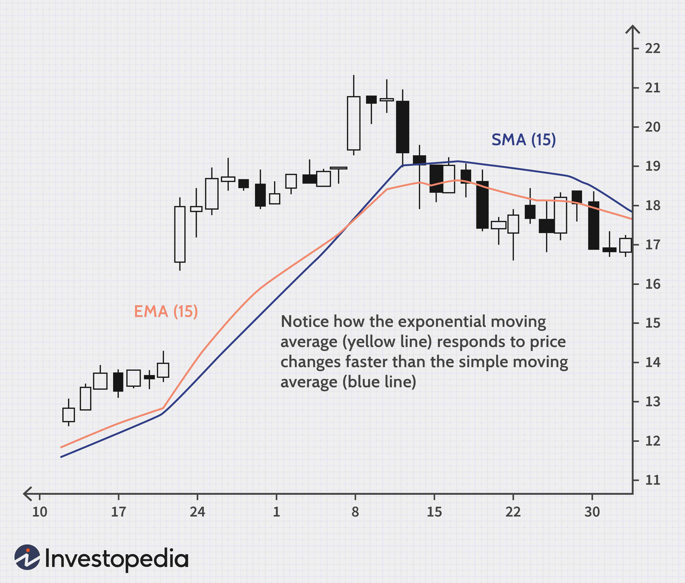

Financial trading is a fascinating and intricate domain, characterized by a myriad of opportunities and complexities. One of the pivotal elements in this world is the concept of spreads, which holds various interpretations within the finance sector. Essentially, a spread refers to the difference between two financial metrics, such as prices, rates, or yields. This concept is crucial in numerous financial contexts, including stock trading, bond markets, and foreign exchange, where it fundamentally influences trading decisions and market dynamics.

In trading, particularly, the bid-ask spread is a well-known instance, illustrating the difference between the prices buyers are willing to pay (bid) and the prices sellers are willing to accept (ask) for an asset. Comprehending these spreads not only aids in understanding market liquidity but also in optimizing transaction costs, thereby enhancing overall trading performance.



Moreover, spreads have a significant role in portraying market conditions and investor sentiment, offering traders opportunities to strategize effectively. The sophistication of spreads is further amplified in the context of algorithmic trading, where computerized systems leverage these differences to execute efficient and profitable trading strategies. Algorithmic trading has fundamentally transformed the trading landscape by enabling rapid, data-driven decision-making processes that capitalize on the nuances of financial spreads.

This article is set to explore these diverse interpretations of spreads within financial trading, examining their critical importance and utility. By examining their roles in various markets and the opportunities they provide, we aim to offer a comprehensive understanding of spreads. Additionally, the discussion will highlight the intersection of spreads with algorithmic trading, showcasing how this integration has revolutionized contemporary trading methodologies.

## Table of Contents

## Understanding Financial Spreads

A 'spread' in finance typically refers to the difference between two financial measures, such as prices, rates, or yields. This concept is fundamental in various trading and investment activities, as it can significantly impact the execution and cost of transactions.

One of the most common types of spreads encountered in trading is the bid-ask spread. This spread represents the difference between the highest price that buyers are willing to pay for an asset (the bid) and the lowest price that sellers are willing to accept (the ask). Mathematically, the bid-ask spread can be expressed as:

$$
\text{Bid-Ask Spread} = \text{Ask Price} - \text{Bid Price}
$$

The bid-ask spread is a critical measure of market [liquidity](/wiki/liquidity-risk-premium), as narrower spreads often indicate a more liquid market with high trading activity, while wider spreads may suggest lower liquidity and potentially higher transaction costs.

Spreads also play a crucial role in the bond market, where yield spreads compare the yield differences between bonds with varying credit qualities or maturities. These yield spreads can provide insights into the perceived risk and relative value of different debt securities. For instance, a wider yield spread between corporate and government bonds may indicate higher perceived risk or economic uncertainty.

In lending, [interest rate](/wiki/interest-rate-trading-strategies) spreads are important for assessing the profitability and risk associated with different loan products. The interest rate spread is the difference between the interest rate charged on loans and the interest rate paid on deposits or other borrowed funds. This spread is vital for financial institutions as it affects their net interest margin and overall profitability.

Understanding these subtleties in spreads is crucial for traders and investors looking to optimize their strategies. By analyzing and leveraging various types of spreads, market participants can make more informed decisions, minimize transaction costs, and enhance their overall trading performance.

## Types of Spreads in Financial Markets

### Types of Spreads in Financial Markets

1. **Stock Market Spreads**: Stock market spreads, primarily characterized by the bid-ask spread, critically influence liquidity and trading costs. The bid-ask spread is the difference between the highest price a buyer is willing to pay (bid) and the lowest price a seller is willing to accept (ask) for a stock. A narrow bid-ask spread typically indicates a liquid market with low transaction costs, while a wider spread can signify reduced liquidity and higher costs. This spread acts as a primary revenue stream for market makers, who provide liquidity by buying and selling securities.

2. **Bond Market Spreads**: In the bond market, spreads often refer to yield spreads, which are the differences in yields between bonds of varying credit qualities, maturities, or issuers. Yield spreads are crucial for assessing the risk-return profile of bonds. For instance, the yield spread between corporate bonds and government bonds, known as the credit spread, reflects the additional risk of corporate debt. Similarly, the term spread, which compares long-term and short-term bond yields, can offer insights into economic expectations and interest rate forecasts.

3. **Options Spreads**: Options spreads are strategic tools involving multiple options contracts to control risk and enhance returns. These spreads can be categorized into various strategies, such as bull spreads, bear spreads, and butterfly spreads, each designed to capitalize on specific market predictions. For example, a bull call spread involves buying and selling call options with different strike prices but the same expiration date, limiting potential losses while capping gains.

4. **Forex Spreads**: In foreign exchange markets, or forex, the spread is the difference between the buy (bid) and sell (ask) prices of currency pairs. Forex spreads impact traders' overall costs and are influenced by factors such as market liquidity, currency pair volatility, and economic news. For instance, major currency pairs, such as EUR/USD, generally exhibit narrower spreads due to higher liquidity compared to exotic pairs like USD/TRY.

Each type of spread provides traders and investors with unique insights into its respective market, offering opportunities for cost management, risk assessment, and strategic decision-making. By understanding the nuances of these spreads, participants can better navigate the complexities of financial markets.

## The Role of Spreads in Algo Trading

Algorithmic trading utilizes spreads to implement sophisticated strategies, enhancing trading accuracy and efficiency. By analyzing spreads, algorithms can gain insights into market conditions, enabling more informed decision-making. Spreads such as the bid-ask spread provide crucial information about liquidity and market depth, which algorithms can exploit to optimize trade execution.

For instance, statistical [arbitrage](/wiki/arbitrage) is a popular algorithmic strategy that capitalizes on price inefficiencies between related financial instruments. This strategy often involves executing trades based on observed spreads, predicting that these will revert to their historical average. By using statistical models and high-frequency data, traders can identify advantageous entry and [exit](/wiki/exit-strategy) points.

Moreover, understanding spread dynamics is vital in constructing models that can swiftly react to market changes. Algorithms can be programmed to detect and respond to widening or narrowing spreads, adjusting trading strategies accordingly. This adaptability is crucial in volatile markets where quick response times can significantly impact profitability.

In Python, traders often employ libraries such as NumPy and pandas to analyze spread data and backtest strategies. For example:

```python
import numpy as np
import pandas as pd

# Example: Simple moving average strategy based on bid-ask spread
def calculate_moving_average(spread_data, window=5):
    return spread_data.rolling(window=window).mean()

# Sample spread data (bid-ask prices)
data = {'bid': [100, 101, 102, 103, 104],
        'ask': [101, 102, 103, 104, 105]}
df = pd.DataFrame(data)
df['spread'] = df['ask'] - df['bid']

# Calculate moving average of spread
df['spread_ma'] = calculate_moving_average(df['spread'])

print(df)
```

This code demonstrates a basic approach to analyzing spread data through a moving average strategy. The adaptability of such strategies lies in the ability to adjust parameters based on contemporary market conditions and backtested results, key for maximizing efficiency and profitability in [algorithmic trading](/wiki/algorithmic-trading).

Ultimately, understanding and leveraging spreads is integral to developing algorithms that not only execute trades with precision but also react dynamically to ever-changing market environments. This ability to adapt ensures algorithmic trading remains at the forefront of financial innovation and profitability.

## Spread Trading Strategies

Spread trading strategies are designed to capitalize on the pricing inefficiencies and correlations between two related financial instruments or markets. By taking opposing positions in these instruments, traders can potentially benefit from the movement in the spread, regardless of the overall market direction. Here are some of the most common types of spread trading strategies:

1. **Calendar Spreads**: This strategy involves taking positions in two different contract months of the same underlying asset. For instance, a trader might buy a futures contract for crude oil expiring in one month while selling another contract for crude oil with a different expiration date. The goal is to profit from the changes in the price differences among these contract months, often influenced by seasonality or carry costs.

2. **Inter-Commodity Spreads**: These spreads involve trading between two related, but different, commodities. For example, a trader might take a long position in corn futures while shorting wheat futures. The relationship between these commodities, such as their use as feed in agriculture or their response to weather patterns, can create spread opportunities. These spreads rely on understanding correlations between different markets and predicting changes in their relative values.

3. **Volatility Spreads**: This strategy aims to profit from expected changes in the volatility of an asset rather than its price. By using options, traders can implement strategies such as straddles, strangles, or butterfly spreads. These involve buying and selling options at different strike prices and/or expiration dates to capitalize on anticipated fluctuations in the underlying asset’s volatility, rather than the direction of its price.

Spread trading strategies require a deep understanding of market conditions and predictions about price movements. Traders typically rely on statistical models or algorithms to identify inefficiencies and predict movements in the spreads. Python, renowned for its powerful data analysis libraries like Pandas and NumPy, is often used to model and backtest these strategies:

```python
import numpy as np
import pandas as pd

# Sample data for two related markets
data = {
    'Asset_A': [100, 102, 101, 105, 107],
    'Asset_B': [98, 99, 100, 102, 103]
}

df = pd.DataFrame(data)

# Calculate the spread
df['Spread'] = df['Asset_A'] - df['Asset_B']

# Strategy: If Spread > threshold, short Asset A, long Asset B; else, reverse
threshold = 3
df['Signal'] = np.where(df['Spread'] > threshold, 'Short A, Long B', 'Long A, Short B')

print(df)
```

By analyzing historical data, traders can identify the best parameters for their trading model, set thresholds, and generate trading signals based on spread dynamics. Effective spread trading strategies are rooted in accurate market predictions and disciplined risk management, allowing traders to potentially achieve consistent profits by focusing on the difference in price movements.

## Benefits and Risks of Spread Trading

Spread trading is a popular strategy among traders due to its potential to mitigate market risks and reduce [volatility](/wiki/volatility-trading-strategies) compared to taking outright positions. The fundamental advantage of spread trading lies in its ability to hedge against adverse market movements. By focusing on the price differential between two related financial instruments rather than their absolute prices, traders can often manage risk more effectively. This spread-based approach is less susceptible to market-wide volatility, providing a comparative layer of stability especially in turbulent market conditions.

However, spread trading is not without its risks. One of the primary challenges is the potential for market shifts that could widen spreads unexpectedly, leading to greater than anticipated losses. For instance, sudden changes in interest rates or geopolitical events can alter the price relationships between the instruments involved, potentially affecting the intended hedging benefits. This emphasizes the importance of maintaining a vigilant stance on market conditions and potential risk factors.

Effective risk management is crucial for navigating these challenges successfully. Traders can employ several strategies to mitigate risks, such as setting predefined stop-loss limits to cap potential losses and using historical data to forecast potential spread movements. Additionally, diversification across different spread trading strategies can help distribute risk and reduce the impact of adverse market events on a trader's portfolio.

Understanding the nuances of spread trading and incorporating robust risk management techniques are essential for maintaining a sustainable trading strategy. By balancing the potential benefits with the inherent risks, traders can enhance their ability to make informed decisions that capitalize on market opportunities while safeguarding against unfavorable outcomes.

## Conclusion

Financial spreads serve as a multifaceted instrument within trading, allowing traders to gain valuable insights into market dynamics and identify potential opportunities. These spreads, whether manifesting as bid-ask spreads, yield differences, or other forms, reveal critical information about market liquidity, pricing efficiency, and investor sentiment. For traders engaged in algorithmic strategies, mastering the intricacies of spreads can substantially enhance trading performance. By accurately analyzing and reacting to these spreads, algorithms can execute trades with improved precision, capturing fleeting market opportunities while minimizing transaction costs.

As financial markets continue to grow and adapt, spreads will persist as an essential element of trading strategies and financial analysis. Their ability to signal shifts in market conditions or inefficiencies ensures their continued relevance. By embracing the complexities inherent to spreads, traders can make more informed and strategic decisions. This comprehensive understanding enables market participants to tailor their strategies towards enhancing profitability and optimizing risk management.

In this context, it is crucial for traders to not only understand the explicit numerical differences that spreads represent but also the underlying economic forces at play. This dual comprehension of both quantitative metrics and qualitative insights underscores the significance and utility of financial spreads in modern trading. As such, a nuanced appreciation of spreads can lead to more effective trading decisions, transforming potential complexities into advantageous trading opportunities.

## References & Further Reading

[1]: Avellaneda, M., & Stoikov, S. (2008). ["High-frequency trading in a limit order book."](https://math.nyu.edu/~avellane/HighFrequencyTrading.pdf) Quantitative Finance.

[2]: Harris, L. (2003). ["Trading and Exchanges: Market Microstructure for Practitioners."](https://www.amazon.com/Trading-Exchanges-Market-Microstructure-Practitioners/dp/0195144708) Oxford University Press.

[3]: Lopez de Prado, M. (2018). ["Advances in Financial Machine Learning."](https://www.amazon.com/Advances-Financial-Machine-Learning-Marcos/dp/1119482089) Wiley.

[4]: Jarrow, R. A., & Turnbull, S. M. (1995). ["Pricing Derivatives on Financial Securities Subject to Credit Risk."](https://www.jstor.org/stable/2329239) Journal of Finance.

[5]: Chan, E. P. (2009). ["Quantitative Trading: How to Build Your Own Algorithmic Trading Business."](https://github.com/ftvision/quant_trading_echan_book) Wiley.

[6]: Jaitly, S. (2017). ["Machine Learning for Algorithmic Trading."](https://github.com/PacktPublishing/Machine-Learning-for-Algorithmic-Trading-Second-Edition) O'Reilly Media.

[7]: Ritchken, P. (1996). ["Derivatives: Principles and Practice."](https://archive.org/details/derivativemarket0000ritc) Dryden Press.