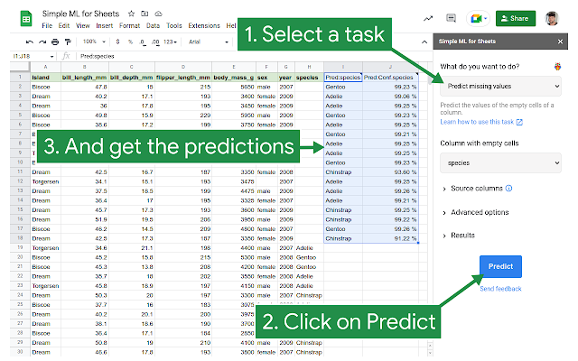

## Table of Contents

## What is a Spreadsheet Formula Prediction Model?

A Spreadsheet Formula Prediction Model is a type of artificial intelligence tool that helps predict what formulas users might want to use in a spreadsheet. Imagine you are working on a big table of numbers and data. Sometimes, you need to add up numbers, find averages, or do other calculations. This model looks at the data you have and the formulas you've already used, and then it suggests new formulas that could be helpful for your next step.

These models use machine learning, which means they learn from examples. They look at lots of spreadsheets that people have made before and see patterns in how formulas are used. For example, if people often use a formula to calculate the total sales after entering individual sales data, the model will learn this pattern. Then, when it sees similar data in a new spreadsheet, it can suggest the same formula. This makes working with spreadsheets faster and easier because you don't have to remember or search for the right formulas every time.

## How does machine learning apply to spreadsheet formula prediction?

Machine learning helps with spreadsheet formula prediction by learning from lots of spreadsheets that people have made before. It looks at the data and the formulas used in these spreadsheets and finds patterns. For example, if people often use a formula to add up numbers in a column, like $$ \text{SUM}(A1:A10) $$, the machine learning model will notice this. It then uses this knowledge to suggest similar formulas when it sees similar data in a new spreadsheet. This makes it easier for users because they don't have to remember or search for the right formulas every time.

The model gets better over time as it sees more spreadsheets. It keeps learning and updating its understanding of which formulas are used in different situations. This means that the more data the model is trained on, the better its predictions become. For instance, if it sees that people often calculate averages after summing numbers, it might suggest $$ \text{AVERAGE}(A1:A10) $$ when it sees someone summing up numbers in a new spreadsheet. This continuous learning helps users work more efficiently with their data.

## What are the basic components of a Spreadsheet Formula Prediction Model?

A Spreadsheet Formula Prediction Model has a few main parts that work together to make it useful. The first part is the data collection system, which gathers lots of spreadsheets to learn from. This data is important because it shows the model how people use formulas in real life. The second part is the [machine learning](/wiki/machine-learning) algorithm, which looks at all the collected spreadsheets and finds patterns in how formulas are used. For example, if people often use $$ \text{SUM}(A1:A10) $$ to add up numbers in a column, the model will notice this pattern.

The third part is the prediction engine, which uses the patterns found by the machine learning algorithm to suggest formulas when someone is working on a new spreadsheet. It looks at the data entered and the formulas already used, and then it guesses what formula might be helpful next. The last part is the user interface, which shows the suggested formulas to the user in an easy-to-understand way. Together, these parts make the model smart and helpful for people working with spreadsheets.

## Can you explain the difference between rule-based and machine learning-based formula prediction?

Rule-based formula prediction works by following a set of pre-defined rules. For example, if you have a column of numbers, a rule might say to use the formula $$ \text{SUM}(A1:A10) $$ to add them up. These rules are set by people who know a lot about spreadsheets. The good thing about rule-based systems is that they are easy to understand and control. But they can be limited because they only work well for situations that the rules cover. If you have a new type of data or a different way of using formulas, the rule-based system might not know what to do.

Machine learning-based formula prediction is different because it learns from examples. It looks at many spreadsheets and sees how people use formulas in different situations. For example, if it often sees people using $$ \text{AVERAGE}(A1:A10) $$ after summing numbers, it will learn this pattern. Over time, the machine learning model gets better at guessing which formulas to suggest. This makes it more flexible than rule-based systems because it can adapt to new types of data and new ways of using formulas. However, machine learning models can be harder to understand and might sometimes make mistakes if they see something very different from what they have learned before.

## What datasets are commonly used to train Spreadsheet Formula Prediction Models?

To train Spreadsheet Formula Prediction Models, datasets are often collected from a wide variety of spreadsheets that people use in their daily work. These can include spreadsheets from businesses, schools, and personal projects. For example, a dataset might contain sales reports, budget sheets, or student grade trackers. The more diverse the spreadsheets, the better the model can learn different ways people use formulas. A common dataset used is the Enron Spreadsheet Corpus, which includes thousands of spreadsheets from the Enron corporation, showing a variety of financial and operational data.

These datasets are important because they help the model learn patterns in how formulas like $$ \text{SUM}(A1:A10) $$ or $$ \text{AVERAGE}(B1:B10) $$ are used. The model looks at the data and the formulas people have entered, and over time, it gets better at predicting what formulas might be useful next. For example, if the model often sees $$ \text{SUM} $$ used after entering numbers in a column, it will learn to suggest this formula when it sees a similar situation in a new spreadsheet. This way, the model can help users work faster and more efficiently.

## How do you evaluate the performance of a Spreadsheet Formula Prediction Model?

To evaluate the performance of a Spreadsheet Formula Prediction Model, we look at how well it can guess the right formulas. One way to do this is by using a metric called accuracy. Accuracy tells us how often the model suggests the correct formula out of all the times it makes a suggestion. For example, if the model suggests $$ \text{SUM}(A1:A10) $$ when it should, and it gets this right 90% of the time, we say its accuracy is 90%. Another way to evaluate the model is by looking at the relevance of its suggestions. This means checking if the suggested formulas make sense for the data and the task at hand, even if they are not exactly what the user would have used.

Another important aspect is the model's ability to adapt to new situations. We can test this by using a dataset that the model hasn't seen before and seeing how well it performs. If the model can still suggest useful formulas even with new types of data, it shows that it has learned well from its training. Additionally, we can measure how much time users save when using the model's suggestions compared to finding and entering formulas themselves. If users find that the model helps them work faster and with less effort, it's a good sign that the model is performing well.

## What are some common challenges faced when developing these models?

One common challenge when developing Spreadsheet Formula Prediction Models is dealing with the variety of data and formulas people use. Spreadsheets can be used for many different things, like tracking sales, budgeting, or grading students. This means the model needs to learn from a wide range of examples to be useful. If the model only sees a few types of spreadsheets, it might not work well for other types. For example, if it often sees $$ \text{SUM}(A1:A10) $$ used for adding up numbers, but then it sees a new type of data where $$ \text{AVERAGE}(B1:B10) $$ is more common, it might still suggest the wrong formula.

Another challenge is making sure the model's suggestions are easy for users to understand and use. The model needs to show its suggestions in a clear way, so users can quickly see if the formula is what they need. If the suggestions are too complicated or not well-explained, users might not use them. Also, the model needs to keep learning and getting better over time. As people find new ways to use spreadsheets, the model has to adapt to these changes. This means the developers need to keep updating the model with new data and checking that it still works well.

## How can feature engineering improve the accuracy of Spreadsheet Formula Prediction Models?

Feature engineering can make Spreadsheet Formula Prediction Models more accurate by creating new ways to look at the data. For example, if the model sees a lot of numbers in a column, it might be helpful to create a feature that checks if those numbers are usually added up with a formula like $$ \text{SUM}(A1:A10) $$. By making these new features, the model can learn better patterns and guess which formulas people might use next.

Another way feature engineering helps is by making the data easier for the model to understand. Sometimes, the raw data in a spreadsheet can be messy or hard to read. By turning this data into simpler features, like counting how many times a certain formula is used or looking at the types of data in each cell, the model can work better. This makes the model's predictions more accurate because it can see the important parts of the data more clearly.

## What advanced algorithms are used in state-of-the-art Spreadsheet Formula Prediction Models?

State-of-the-art Spreadsheet Formula Prediction Models often use advanced algorithms like [deep learning](/wiki/deep-learning) and neural networks. These algorithms are good at finding complex patterns in data. For example, a [neural network](/wiki/neural-network) can learn how people use formulas like $$ \text{SUM}(A1:A10) $$ or $$ \text{AVERAGE}(B1:B10) $$ in different situations. By looking at many spreadsheets, the model can get better at guessing which formulas to suggest next. This makes the model more helpful for users because it can adapt to new types of data and new ways of using formulas.

Another advanced algorithm used is the attention mechanism, which helps the model focus on the most important parts of the data. For instance, if a user is working on a sales report, the model can pay more attention to the columns with numbers that are usually added up. This helps the model suggest the right formula, like $$ \text{SUM}(C1:C10) $$, more accurately. By using these advanced algorithms, Spreadsheet Formula Prediction Models can become smarter and more useful over time, making it easier for people to work with their spreadsheets.

## How do Spreadsheet Formula Prediction Models handle complex formulas and multiple sheets?

Spreadsheet Formula Prediction Models can handle complex formulas by learning from examples that include these formulas. For instance, if people often use a formula like $$ \text{IF}(A1>10, "High", "Low") $$ to categorize data, the model will recognize this pattern and suggest it when it sees similar data. The model uses advanced algorithms, like deep learning and neural networks, to understand these complex formulas and predict when they might be useful. This means the model can help users with more than just simple sums and averages, making it a powerful tool for working with spreadsheets.

When it comes to handling multiple sheets, Spreadsheet Formula Prediction Models look at the relationships between different sheets. For example, if one sheet has sales data and another sheet calculates totals from that data using a formula like $$ \text{SUM}(Sheet1!A1:A10) $$, the model can learn to suggest this type of formula when it sees similar setups. The model pays attention to how data flows between sheets and uses this information to make better predictions. This helps users manage their data across multiple sheets more efficiently, as the model can suggest formulas that work across different parts of their spreadsheet.

## What are the ethical considerations when deploying Spreadsheet Formula Prediction Models in real-world scenarios?

When deploying Spreadsheet Formula Prediction Models in real-world scenarios, it's important to think about privacy and data security. These models learn from lots of spreadsheets, which might have personal or sensitive information. It's crucial to make sure that this data is kept safe and used in a way that respects people's privacy. For example, if a model is trained on spreadsheets that include people's salaries or health data, it must be handled carefully to prevent any misuse or leaks.

Another ethical consideration is fairness and bias. The model might suggest formulas like $$ \text{SUM}(A1:A10) $$ or $$ \text{AVERAGE}(B1:B10) $$ based on the data it has seen. If the training data comes from a specific group of people or companies, the model might not work well for others. It's important to use a diverse set of spreadsheets to train the model so that it can help everyone fairly. Also, the model should be checked regularly to make sure it's not making biased suggestions that could affect people's decisions or outcomes unfairly.

## How can Spreadsheet Formula Prediction Models be integrated into existing spreadsheet software?

Spreadsheet Formula Prediction Models can be integrated into existing spreadsheet software by adding a feature that suggests formulas as users work. This can be done by including a small window or sidebar in the software that shows suggested formulas like $$ \text{SUM}(A1:A10) $$ or $$ \text{AVERAGE}(B1:B10) $$ based on the data the user is entering. The model runs in the background, analyzing the data and the user's actions to make these suggestions. This way, users can see and choose from the suggestions without having to search for the right formulas themselves, making their work faster and easier.

To make sure the integration works well, the software needs to be updated to communicate with the prediction model. This means adding code that sends the spreadsheet data to the model and receives the suggestions back. The model's suggestions should be shown in a way that is easy for users to understand and use. By doing this, the software can help users work more efficiently with their data, as the model learns and improves over time.

## References & Further Reading

[1]: Davis, J., & Jermain, C. (2019). ["Deep Learning for Excel Formula Suggestion."](https://www.researchgate.net/publication/332768872_Anthropocene_Capitalocene_Plantationocene_A_Manifesto_for_Ecological_Justice_in_an_Age_of_Global_Crises) arXiv preprint arXiv:1906.01738.

[2]: Gulwani, S., Harris, W. R., & Singh, R. (2012). ["Spreadsheet data manipulation using examples."](https://dl.acm.org/doi/10.1145/2240236.2240260) Communications of the ACM, 55(8), 97-105.

[3]: Zhelezniakov, M., Singh, R., & Klein, D. (2013). ["Adaptive feature selection for fast sequential prediction."](https://www.researchgate.net/profile/Dmytro-Zhelezniakov/publication/333626023_Acceleration_of_Online_Recognition_of_2D_Sequences_Using_Deep_Bidirectional_LSTM_and_Dynamic_Programming/links/603e747792851c077f128815/Acceleration-of-Online-Recognition-of-2D-Sequences-Using-Deep-Bidirectional-LSTM-and-Dynamic-Programming.pdf) arXiv preprint arXiv:1302.0287.

[4]: ["The Enron Spreadsheet Corpus"](https://github.com/SheetJS/enron_xls) - A publicly available dataset used in the development of machine learning models for spreadsheets, including formula prediction.

[5]: Thorne, C., & Hynes, N. (2019). ["Applications of machine learning in spreadsheet software."](https://onlinelibrary.wiley.com/doi/10.1111/nin.12282) arXiv preprint arXiv:1908.07545. 

[6]: Deodhar, A., & Gelbrich, C. (2020). ["Ethical considerations in machine learning-based decision support systems."](https://pmc.ncbi.nlm.nih.gov/articles/PMC8639945/) Information Systems Journal, 30(4), 826-850.