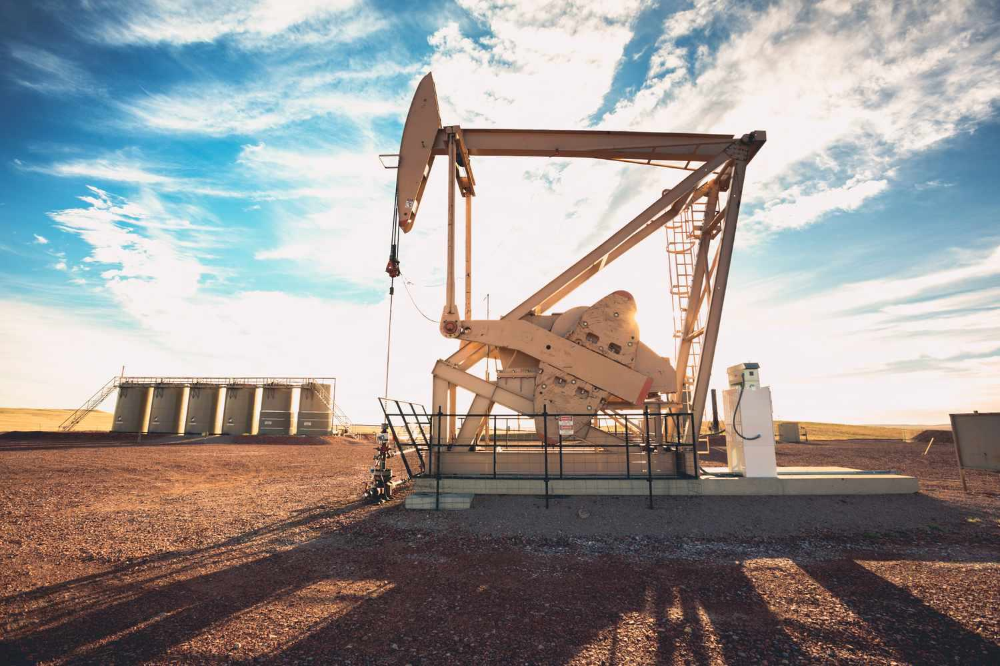

## Table of Contents

## What is spudding in the oil and gas industry?

Spudding is the very first step in drilling an oil or gas well. It happens when the drill bit starts to break the ground or the ocean floor to begin making a hole. This action is called "spudding in" and it marks the beginning of the drilling process. The term "spud" comes from the old days when they used a special tool that looked a bit like a potato, which is why it got that name.

Once the spudding is done, the drilling can continue deeper into the earth. The goal is to reach the oil or gas that is trapped underground. Spudding is important because it starts the whole drilling project. It's exciting for the people working on the project because it means they are finally moving forward after all the planning and preparation.

## Why is the term 'spudding' used in drilling operations?

The term 'spudding' comes from the early days of drilling when a special tool was used to start the hole. This tool looked a bit like a potato, which is why it got the name 'spud'. When the drill bit first touches the ground or the ocean floor and starts to make a hole, that's called spudding. It's the very first step in drilling for oil or gas.

Spudding is important because it marks the beginning of the whole drilling project. After a lot of planning and preparation, spudding is when the action finally starts. It's an exciting moment for everyone involved because it means they are moving forward with the project. Once the spudding is done, the drilling can continue deeper into the earth to reach the oil or gas that is trapped underground.

## What are the initial steps taken before spudding a well?

Before spudding a well, a lot of planning and preparation happens. First, they choose a good spot to drill. This is done by studying the land or ocean floor and looking at old data to see where the oil or gas might be. They also need to get permission from the government or landowners to drill there. Once the spot is picked, they bring in all the equipment and set it up. This includes the drilling rig, which is a big machine that will do the drilling, and other tools and supplies they will need.

After setting up the equipment, they do some more checks. They make sure everything is working right and that they have all the safety measures in place. This is important because drilling can be dangerous, so they want to make sure everyone stays safe. They also talk to the workers about the plan and what everyone needs to do. Once all these steps are done, they are ready to start drilling, and that's when they do the spudding.

## How does the spudding process work?

Spudding is the first step in drilling a well for oil or gas. It happens when the drill bit touches the ground or the ocean floor and starts to make a hole. The drill bit is attached to a big machine called a drilling rig. When the drill bit starts to turn and dig into the earth, that's called spudding. It's like the starting whistle for the whole drilling project.

Once the spudding is done, the drilling can continue deeper into the earth. The goal is to reach the oil or gas that is trapped underground. Spudding is important because it marks the beginning of the drilling process. It's an exciting moment for everyone involved because it means they are finally moving forward after all the planning and preparation.

## What equipment is typically used during the spudding of a well?

During the spudding of a well, the main piece of equipment used is the drilling rig. This is a big machine that holds the drill bit and makes it turn to start digging into the ground or the ocean floor. The drill bit is the part that actually touches the earth and starts making the hole. It's attached to a long drill string that can be lowered deeper into the ground as the drilling continues.

Other important equipment includes the derrick, which is a tall structure on the drilling rig that supports the drill string and helps lift and lower it. There are also pumps that send drilling mud down the drill string. This mud helps cool the drill bit and [carry](/wiki/carry-trading) away the pieces of rock that get dug up. All these pieces of equipment work together to make the spudding process happen smoothly and safely.

## What are the safety considerations during the spudding process?

Safety is very important during the spudding process. Before they start, the workers make sure everyone knows the safety rules and what to do if something goes wrong. They wear special gear like hard hats, safety glasses, and gloves to protect themselves. The area around the drilling rig is kept clear of anything that could be dangerous, and they have emergency plans ready just in case.

The equipment used during spudding is checked carefully to make sure it is working right. They look at the drilling rig, the drill bit, and all the other tools to make sure they are safe to use. They also make sure the drilling mud system is working properly because it helps keep the drilling safe by cooling the drill bit and carrying away the rock pieces. By taking these safety steps, they can help prevent accidents and keep everyone safe while they start drilling the well.

## How long does the spudding process usually take?

The spudding process usually doesn't take very long. It can take anywhere from a few hours to a full day, depending on the type of ground or ocean floor they are drilling into. If the ground is soft, it might go faster, but if it's hard, it might take a bit longer.

Once the drill bit starts turning and digging into the earth, the spudding is done. After that, the drilling can keep going deeper to reach the oil or gas. The exact time can change a bit because of different things like the weather or if something unexpected happens, but usually, it's pretty quick.

## What are the common challenges faced during spudding?

Spudding can be tricky because the ground or ocean floor might be hard to drill into. If the earth is really hard or rocky, it can take longer and wear out the drill bit faster. Sometimes, the drill bit can get stuck or break, which means they have to stop and fix it before they can keep going. Weather can also make things harder, like if it's stormy or windy, it can be tough to work safely and keep everything running smoothly.

Another challenge is making sure everything is set up right before they start. If the drilling rig or any other equipment isn't working properly, it can cause problems during spudding. They also have to be careful about safety, because accidents can happen if people aren't paying attention or if something goes wrong. Keeping everyone safe while they start drilling is a big part of making sure spudding goes well.

## How does spudding impact the overall drilling project timeline?

Spudding is the first step in drilling a well, so it's important for the whole project timeline. If spudding goes well and is quick, it can help keep the project on track. But if there are problems during spudding, like if the ground is really hard or the drill bit gets stuck, it can slow things down. This might mean the whole project takes longer than planned.

The time it takes to spud a well can change a lot. It might take just a few hours or up to a full day. If spudding takes longer than expected, it can push back other parts of the project. So, getting the spudding done right and quickly can help make sure the rest of the drilling goes smoothly and stays on schedule.

## What are the differences between spudding onshore versus offshore?

Spudding onshore and offshore are similar because they both start the drilling process, but they have some big differences. Onshore spudding happens on land, so the drilling rig is set up on solid ground. This makes it easier to move equipment around and set things up. The ground can be soft or hard, but it's usually easier to deal with than the ocean floor. Onshore, they also don't have to worry about the weather as much, like storms or big waves.

Offshore spudding happens in the ocean, so the drilling rig is on a platform that floats on the water. This makes everything more complicated because they have to deal with the movement of the water and the weather. The ocean floor can be really hard or have a lot of rocks, which can make spudding take longer. They also need special equipment to keep the platform steady and safe. So, offshore spudding can be trickier and take more time than onshore spudding.

## How have technological advancements affected the spudding process?

Technological advancements have made spudding a lot easier and faster. New kinds of drill bits are stronger and can cut through hard rock better. This means they don't break as often and can get the job done quicker. Also, better drilling rigs can control the drill bit more precisely, which helps start the hole in the right spot and at the right angle. These improvements help keep the spudding process on track and reduce the chances of problems happening.

Another big change is in the way they plan and prepare for spudding. Computers and special software help them study the ground or ocean floor before they start drilling. This lets them know what they might run into and plan the best way to do the spudding. Plus, safety has gotten better with new equipment and training that helps keep everyone safe during the process. All these changes have made spudding a more reliable and efficient part of drilling for oil and gas.

## What are the environmental considerations and regulations related to spudding?

When they start drilling a well by spudding, people have to think about how it might affect the environment. They need to be careful not to harm the land, water, or air. Governments have rules to make sure drilling is done safely. These rules say things like where you can drill, how you should handle the waste from drilling, and what to do if there's a spill. They also check to make sure the drilling doesn't hurt animals or plants in the area.

There are special rules for spudding on land and in the ocean. On land, they have to think about the soil and nearby water sources. They might need to put up barriers to keep drilling mud from spreading. In the ocean, they have to be careful not to harm sea life or the water. They use special equipment to keep the drilling mud from spilling into the ocean. Both on land and in the ocean, they have to follow these rules to keep the environment safe while they start drilling.

## References & Further Reading

[1]: ["Advances in Financial Machine Learning"](https://www.amazon.com/Advances-Financial-Machine-Learning-Marcos/dp/1119482089) by Marcos Lopez de Prado

[2]: ["Evidence-Based Technical Analysis: Applying the Scientific Method and Statistical Inference to Trading Signals"](https://www.amazon.com/Evidence-Based-Technical-Analysis-Scientific-Statistical/dp/0470008741) by David Aronson

[3]: ["Machine Learning for Algorithmic Trading"](https://github.com/stefan-jansen/machine-learning-for-trading) by Stefan Jansen

[4]: ["Quantitative Trading: How to Build Your Own Algorithmic Trading Business"](https://www.amazon.com/Quantitative-Trading-Build-Algorithmic-Business/dp/1119800064) by Ernest P. Chan

[5]: BP (2020). ["Statistical Review of World Energy"](https://www.bp.com/content/dam/bp/business-sites/en/global/corporate/pdfs/energy-economics/statistical-review/bp-stats-review-2020-full-report.pdf). BP Global. 

[6]: Hyne, Norman J. (2012). ["Nontechnical Guide to Petroleum Geology, Exploration, Drilling & Production"](https://www.amazon.com/Nontechnical-Petroleum-Exploration-Drilling-Production/dp/1593702698) 3rd Edition. PennWell Corporation.

[7]: Yergin, Daniel. (2011). ["The Quest: Energy, Security, and the Remaking of the Modern World"](https://en.wikipedia.org/wiki/The_Quest:_Energy,_Security,_and_the_Remaking_of_the_Modern_World). Penguin Books.