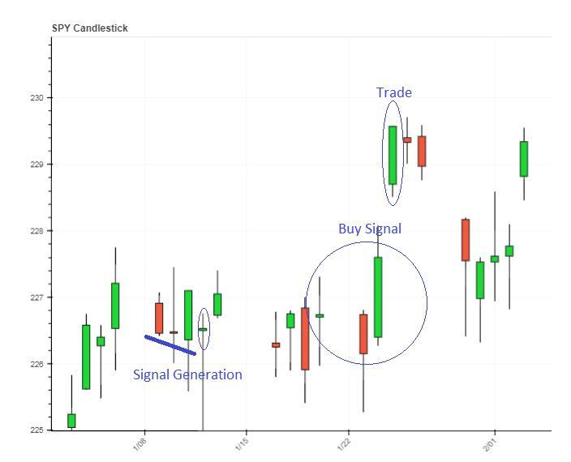

## Table of Contents

## What is the SPY ETF and why is it popular for day trading?

The SPY ETF, or SPDR S&P 500 ETF Trust, is an exchange-traded fund that tracks the S&P 500 index. This means it represents the performance of 500 large companies in the U.S. stock market. The SPY ETF is one of the most popular ETFs because it gives investors an easy way to invest in the overall market without having to buy each of the 500 stocks individually.

The SPY ETF is popular for day trading because it is very liquid. This means there are always a lot of people buying and selling it, so it's easy to get in and out of trades quickly. Day traders like this because they can make quick profits from small changes in the price. Also, since the SPY ETF represents the whole market, it can be a good way to bet on whether the market will go up or down in a single day.

## What are the basic principles of day trading with the SPY?

Day trading with the SPY means buying and selling the ETF within the same day to make a profit. The main idea is to take advantage of small price changes throughout the day. Traders look at charts and use tools to guess where the price might go next. They might buy the SPY if they think the price will go up and sell it when it does, or they might sell it first (this is called short selling) if they think the price will go down, and then buy it back cheaper later.

The key to successful [day trading](/wiki/day-trading-spy) with the SPY is understanding the market's movements and managing risk. Since the SPY is very liquid, it's easier to trade quickly, but it can still be risky. Traders often use stop-loss orders to limit how much they can lose on a trade. They also need to keep an eye on news and events that can affect the market, like economic reports or company announcements, because these can cause big price swings. Day trading requires a lot of focus and discipline, but with practice and the right strategies, it can be a way to make money from the stock market.

## How can beginners start day trading the SPY?

If you're new to day trading and want to start with the SPY, the first thing you need to do is open a brokerage account. This is where you'll buy and sell the SPY. Make sure to choose a broker that has low fees and good tools for trading. Once your account is set up, you can start practicing with a small amount of money. It's important to learn how to use the trading platform and understand how to place orders. You can also use a demo account if your broker offers one, to practice without risking real money.

Next, you need to learn about the basics of day trading. This means understanding how to read charts and use technical analysis to guess where the price of the SPY might go next. You can find lots of free resources online, like videos and articles, to help you learn. It's also a good idea to start with simple strategies, like buying when the price goes up and selling when it goes down. Remember, day trading can be risky, so always use stop-loss orders to limit how much you can lose on a trade. As you get more comfortable, you can try more advanced strategies and increase the amount of money you trade with.

## What are the key technical indicators used in SPY day trading?

When day trading the SPY, traders often use technical indicators to help them decide when to buy and sell. One common indicator is the moving average, which shows the average price of the SPY over a certain period of time. Traders might use a short-term moving average, like a 20-day moving average, and a long-term moving average, like a 50-day moving average. When the short-term average crosses above the long-term average, it's called a "golden cross" and can be a signal to buy. When the short-term average crosses below the long-term average, it's called a "death cross" and can be a signal to sell.

Another important indicator is the Relative Strength Index (RSI), which measures how fast the price of the SPY is going up or down. The RSI is shown on a scale from 0 to 100. If the RSI is above 70, it means the SPY might be overbought and could go down soon, so traders might sell. If the RSI is below 30, it means the SPY might be oversold and could go up soon, so traders might buy. The RSI helps traders see if the SPY is moving too fast in one direction and might be ready for a change.

Volume is also a key indicator for SPY day trading. Volume shows how many shares of the SPY are being bought and sold. If the [volume](/wiki/volume-trading-strategy) is high when the price is going up, it means a lot of people are buying, which can be a strong signal that the price will keep going up. If the volume is high when the price is going down, it means a lot of people are selling, which can be a strong signal that the price will keep going down. Watching the volume can help traders understand how strong a price move is and make better trading decisions.

## How does market volatility affect SPY day trading strategies?

Market [volatility](/wiki/volatility-trading-strategies) means how much the price of the SPY goes up and down in a day. When the market is very volatile, the price of the SPY can change a lot, which can be good and bad for day traders. On the good side, more volatility means more chances to make money. Traders can buy the SPY when the price goes down and sell it when it goes up, making a profit from the big swings. But on the bad side, more volatility also means more risk. The price can move against what the trader expects, and they can lose money quickly. So, traders need to be careful and use stop-loss orders to limit their losses when the market is very volatile.

In times of high volatility, day traders might change their strategies. They might use shorter time frames for their trades, like looking at 5-minute charts instead of 15-minute charts, to catch the quick price moves. They might also trade less often, waiting for the right moment to make a trade instead of trading all the time. Another thing traders do is to pay more attention to news and events that can cause big price swings, like economic reports or company announcements. By understanding what's causing the volatility, traders can make better decisions about when to buy and sell the SPY.

## What are common entry and exit strategies for SPY day trading?

When day trading the SPY, traders use different entry strategies to decide when to buy or sell. A common entry strategy is to use moving averages. Traders might buy the SPY when the short-term moving average, like the 20-day average, crosses above the long-term moving average, like the 50-day average. This is called a golden cross and can signal that the price might keep going up. Another entry strategy is to use the Relative Strength Index (RSI). If the RSI is below 30, it means the SPY might be oversold, and traders might see this as a good time to buy. If the RSI is above 70, it means the SPY might be overbought, and traders might see this as a good time to sell or short sell.

Exit strategies are just as important as entry strategies in SPY day trading. Traders often use stop-loss orders to limit their losses. For example, if a trader buys the SPY at $400, they might set a stop-loss order at $395. This means if the price drops to $395, the trade will close automatically, and the trader won't lose more than $5 per share. Another [exit](/wiki/exit-strategy) strategy is to use a take-profit order. If the same trader thinks the SPY will go up to $410, they might set a take-profit order at that price. When the SPY reaches $410, the trade will close, and the trader will make a profit of $10 per share. By using these entry and exit strategies, traders can manage their trades and aim to make money from the SPY's price movements.

## How can traders manage risk when day trading the SPY?

Managing risk is very important when day trading the SPY. One way to do this is by using stop-loss orders. A stop-loss order is like a safety net. It tells the broker to sell the SPY if the price drops to a certain level. This way, traders can limit how much money they lose on a trade. For example, if a trader buys the SPY at $400, they might set a stop-loss at $395. If the price goes down to $395, the trade will close automatically, and the trader won't lose more than $5 per share. This helps traders protect their money and stay in the game longer.

Another way to manage risk is by not putting all their money into one trade. Traders should only use a small part of their money for each trade. This is called position sizing. If a trader has $10,000, they might only use $1,000 for one trade. This way, if the trade goes wrong, they won't lose all their money. Traders also need to keep an eye on the market and be ready to change their plans if things don't go as expected. By using these strategies, traders can manage their risk and have a better chance of making money from day trading the SPY.

## What role does volume play in SPY day trading?

Volume is really important when day trading the SPY. It tells traders how many shares of the SPY are being bought and sold. When the volume is high, it means a lot of people are trading the SPY, and the price can move a lot. This can be good because it gives traders more chances to make money from the big price swings. But it can also be risky because the price can move against what the trader expects. So, traders need to watch the volume to understand if the price move is strong or if it might not last long.

Traders use volume to help them decide when to buy and sell the SPY. If the volume is high when the price is going up, it means a lot of people are buying, which can be a strong signal that the price will keep going up. On the other hand, if the volume is high when the price is going down, it means a lot of people are selling, which can be a strong signal that the price will keep going down. By looking at the volume, traders can get a better idea of how strong the price move is and make better decisions about their trades.

## How can advanced traders use options in conjunction with SPY day trading?

Advanced traders can use options to make their SPY day trading strategies better. Options give traders the right to buy or sell the SPY at a certain price before a certain time. Traders can use options to make money from small price changes in the SPY without having to buy the [ETF](/wiki/etf-trading-strategies) itself. For example, if a trader thinks the SPY will go up, they can buy a call option. This lets them make money if the SPY goes up, but they don't have to pay as much as they would if they bought the SPY directly. If they think the SPY will go down, they can buy a put option, which lets them make money if the SPY goes down.

Options can also help traders manage their risk. Traders can use options to protect their trades from big losses. For example, if a trader buys the SPY and wants to limit their risk, they can buy a put option at the same time. This put option acts like insurance. If the SPY goes down, the put option will make money, which can help cover the losses from the SPY trade. By using options in this way, traders can try to make more money from their SPY day trading while also keeping their risk under control.

## What are some advanced chart patterns to look for when trading SPY?

When trading the SPY, advanced traders often look for chart patterns like the head and shoulders. This pattern looks like a head with two shoulders and can tell traders that the price might start going down soon. The pattern has three peaks: the left shoulder, the head, and the right shoulder. The head is the highest peak, and the shoulders are lower. When the price breaks below the neckline, which is a line drawn at the bottom of the pattern, it's a signal to sell the SPY. This pattern can help traders make money by selling before the price drops a lot.

Another useful pattern is the cup and handle. This pattern looks like a cup with a small handle on the right side. It shows that the price of the SPY has been going up and down but is now ready to keep going up. The cup part of the pattern is a big U-shape, and the handle is a small dip on the right side. When the price breaks above the top of the handle, it's a signal to buy the SPY. This pattern can help traders make money by buying before the price goes up a lot. By looking for these patterns, traders can make better decisions about when to buy and sell the SPY.

## How do macroeconomic events influence SPY day trading?

Macroeconomic events, like news about the economy or decisions by the government, can have a big effect on SPY day trading. When there's important news, like a report on how many jobs were created or what the Federal Reserve is doing with interest rates, it can make the price of the SPY go up or down a lot. Traders need to keep an eye on these events because they can cause big price swings. For example, if the job report is better than expected, traders might think the economy is doing well and buy the SPY, making the price go up. But if the report is worse than expected, traders might think the economy is doing poorly and sell the SPY, making the price go down.

To handle these big price swings, traders can change their strategies. They might trade less often, waiting for the right moment to make a trade instead of trading all the time. They can also use stop-loss orders to limit their losses if the price moves against them. By understanding what's causing the price to move and being ready to change their plans, traders can make better decisions and have a better chance of making money from the SPY's price movements.

## What are the psychological aspects of day trading SPY and how can traders cope with them?

Day trading the SPY can be hard on a trader's mind. It can make them feel stressed and worried because the price can change a lot in a short time. Traders might feel scared to lose money or feel too excited when they make money. This can make them make bad choices, like trading too much or not following their plan. It's important for traders to stay calm and not let their feelings control their trades. They need to stick to their plan and not let the ups and downs of the market make them do things they might regret.

To cope with the stress of day trading the SPY, traders can use some simple tricks. One way is to take breaks and step away from the screen when things get too intense. This can help them clear their mind and come back with a fresh view. Another way is to set clear goals and rules for their trading and stick to them, no matter what the market does. Traders can also talk to other traders or join a trading group to share their feelings and get support. By doing these things, traders can keep their emotions in check and make better decisions when trading the SPY.

## References & Further Reading

[1]: Bergstra, J., Bardenet, R., Bengio, Y., & Kégl, B. (2011). ["Algorithms for Hyper-Parameter Optimization."](https://dl.acm.org/doi/10.5555/2986459.2986743) Advances in Neural Information Processing Systems 24.

[2]: ["Advances in Financial Machine Learning"](https://www.amazon.com/Advances-Financial-Machine-Learning-Marcos/dp/1119482089) by Marcos Lopez de Prado

[3]: ["Evidence-Based Technical Analysis: Applying the Scientific Method and Statistical Inference to Trading Signals"](https://www.amazon.com/Evidence-Based-Technical-Analysis-Scientific-Statistical/dp/0470008741) by David Aronson

[4]: ["Machine Learning for Algorithmic Trading"](https://github.com/stefan-jansen/machine-learning-for-trading) by Stefan Jansen

[5]: ["Quantitative Trading: How to Build Your Own Algorithmic Trading Business"](https://books.google.com/books/about/Quantitative_Trading.html?id=j70yEAAAQBAJ) by Ernest P. Chan