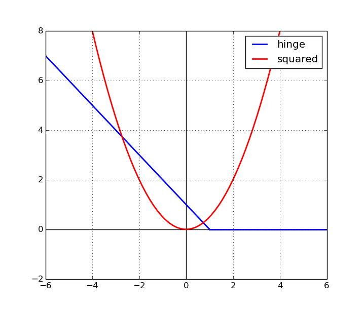

## Table of Contents

## What is Squared Hinge Loss in the context of machine learning?

Squared Hinge Loss is a type of loss function used in machine learning, particularly in classification problems. It is an extension of the Hinge Loss function, which is commonly used in Support Vector Machines (SVMs). The main difference is that Squared Hinge Loss squares the error term, which can lead to a smoother optimization landscape. This can be helpful during the training process, as it can make the model more sensitive to misclassifications and encourage it to correct them more aggressively.

The formula for Squared Hinge Loss can be written as $$ \text{loss} = \max(0, 1 - y \cdot f(x))^2 $$, where $y$ is the true label (either +1 or -1), $f(x)$ is the predicted value from the model, and $\max$ is a function that returns the larger of the two values inside the parentheses. If the product $y \cdot f(x)$ is greater than or equal to 1, the loss is zero, indicating a correct classification. If it's less than 1, the loss is non-zero, and the model needs to adjust its parameters to reduce this loss. Squared Hinge Loss can lead to better performance in some cases because it penalizes larger errors more heavily than smaller ones.

## How does Squared Hinge Loss differ from standard Hinge Loss?

Squared Hinge Loss and standard Hinge Loss are both used in machine learning to help train models, especially in classification tasks. The main difference between them is how they handle errors. Standard Hinge Loss uses a linear approach to penalize errors, meaning the loss increases at a steady rate as the error grows. On the other hand, Squared Hinge Loss squares the error term, making the loss grow faster as the error increases. This can make the model more sensitive to larger mistakes and push it harder to correct them.

The formula for standard Hinge Loss is $$ \text{loss} = \max(0, 1 - y \cdot f(x)) $$, where $y$ is the true label (either +1 or -1) and $f(x)$ is the model's prediction. If the product $y \cdot f(x)$ is at least 1, the loss is zero, meaning the classification is correct. For Squared Hinge Loss, the formula is $$ \text{loss} = \max(0, 1 - y \cdot f(x))^2 $$. The key difference is the squaring of the error term, which makes the loss increase more quickly for larger errors. This can lead to a smoother optimization process and potentially better performance in some scenarios.

## What are the advantages of using Squared Hinge Loss in classification problems?

Using Squared Hinge Loss in classification problems can make the training process smoother. This is because it squares the error term, which means the loss grows faster as the error gets bigger. This can help the model focus more on fixing bigger mistakes. For example, the formula for Squared Hinge Loss is $$ \text{loss} = \max(0, 1 - y \cdot f(x))^2 $$. Here, if the model's prediction $f(x)$ is far from the true label $y$, the loss will be much larger than with standard Hinge Loss. This can lead to a more stable and effective training process.

Another advantage is that Squared Hinge Loss can help the model perform better in some cases. By making the model more sensitive to larger errors, it encourages the model to correct these errors more aggressively. This can be especially useful in situations where it's important to minimize big mistakes. Overall, while both Squared Hinge Loss and standard Hinge Loss can be used effectively, the squared version can offer a smoother optimization landscape and potentially better performance in certain classification tasks.

## Can you explain the mathematical formula for Squared Hinge Loss?

The mathematical formula for Squared Hinge Loss is $$ \text{loss} = \max(0, 1 - y \cdot f(x))^2 $$. In this formula, $y$ is the true label, which can be either +1 or -1. The $f(x)$ part is the prediction the model makes. When you multiply $y$ and $f(x)$, you get a number that shows how close the prediction is to the true label. If this number is at least 1, the loss is zero because the prediction is correct. But if it's less than 1, the loss is not zero, and the model needs to adjust to make the prediction better.

The key part of the formula is the squaring of the error term, which is $1 - y \cdot f(x)$. This squaring makes the loss grow faster when the error gets bigger. For example, if the error is small, the loss will be small too. But if the error is big, the loss will be much bigger because of the squaring. This helps the model focus more on fixing bigger mistakes, which can make the training process smoother and help the model perform better in some cases.

## How is Squared Hinge Loss used in Support Vector Machines (SVMs)?

Squared Hinge Loss is used in Support Vector Machines (SVMs) as a way to measure how well the model is doing during training. In SVMs, the goal is to find the best line, or hyperplane, that separates different groups of data. Squared Hinge Loss helps the SVM figure out if the data points are on the right side of this line. If a point is on the wrong side or too close to the line, the loss will be high, and the SVM will try to move the line to fix this. The formula for Squared Hinge Loss is $$ \text{loss} = \max(0, 1 - y \cdot f(x))^2 $$. Here, $y$ is the true label, either +1 or -1, and $f(x)$ is the prediction the model makes. If $y \cdot f(x)$ is at least 1, the loss is zero, meaning the prediction is correct. If it's less than 1, the loss is not zero, and the model needs to adjust.

Using Squared Hinge Loss in SVMs can make the training process smoother. This is because it squares the error term, making the loss grow faster when the error gets bigger. This can help the SVM focus more on fixing bigger mistakes. For example, if a data point is far from where it should be, the loss will be much larger than with standard Hinge Loss. This encourages the SVM to correct these errors more aggressively. Overall, Squared Hinge Loss can lead to a more stable and effective training process for SVMs, potentially improving the model's performance in classifying data.

## What are the potential drawbacks or limitations of using Squared Hinge Loss?

One potential drawback of using Squared Hinge Loss is that it can be more sensitive to outliers in the data. Because the loss function squares the error term, large errors caused by outliers can have a much bigger impact on the overall loss. This can make the model focus too much on these outliers, potentially leading to overfitting where the model fits the noise in the data rather than the underlying pattern. For example, if a data point is far from where it should be, the loss will be much larger than with standard Hinge Loss, and the model might adjust too much to correct this one point.

Another limitation is that Squared Hinge Loss can sometimes make the optimization process more challenging. The squared term can create a more complex optimization landscape, which can slow down the training process or make it harder for the model to find the best solution. While this can sometimes lead to better performance by encouraging the model to correct larger errors more aggressively, it can also result in longer training times and potentially less stable convergence. Overall, while Squared Hinge Loss can be beneficial in certain scenarios, it's important to consider these potential drawbacks when choosing a loss function for a specific problem.

## How does the choice of Squared Hinge Loss affect the training process of a model?

Using Squared Hinge Loss in training a model can make the process smoother because it squares the error term. This means that if a model makes a big mistake, the loss will be much larger than if it made a small mistake. The formula for Squared Hinge Loss is $$ \text{loss} = \max(0, 1 - y \cdot f(x))^2 $$. Here, $y$ is the true label, either +1 or -1, and $f(x)$ is the model's prediction. If the model's prediction is far from the true label, the loss will be bigger, encouraging the model to fix these bigger mistakes more aggressively. This can help the model perform better in some cases by focusing on correcting larger errors.

However, there are also challenges with using Squared Hinge Loss. It can be more sensitive to outliers in the data. If there are data points that are far away from where they should be, these outliers can have a big impact on the loss because of the squaring. This might make the model focus too much on these outliers, leading to overfitting where the model fits the noise in the data instead of the pattern. Also, the squared term can make the optimization process more complex, which might slow down training or make it harder for the model to find the best solution. So, while Squared Hinge Loss can be helpful, it's important to think about these potential issues when choosing it for a specific problem.

## In what scenarios would Squared Hinge Loss be more suitable than other loss functions?

Squared Hinge Loss can be more suitable than other loss functions in scenarios where you want the model to focus more on fixing bigger mistakes. Because it squares the error term, the loss grows faster when the model makes larger errors. For example, the formula for Squared Hinge Loss is $$ \text{loss} = \max(0, 1 - y \cdot f(x))^2 $$. Here, if the model's prediction $f(x)$ is far from the true label $y$, the loss will be much bigger than with standard Hinge Loss. This can make the training process smoother and help the model perform better by encouraging it to correct larger errors more aggressively.

Another scenario where Squared Hinge Loss might be preferred is when the optimization landscape needs to be smoother. The squaring of the error term can lead to a more stable and effective training process. However, it's important to consider the potential drawbacks. Squared Hinge Loss can be more sensitive to outliers in the data, which might lead to overfitting. Also, the squared term can make the optimization process more complex, potentially slowing down training or making it harder for the model to find the best solution. So, while Squared Hinge Loss can be beneficial in certain situations, it's crucial to weigh these factors when choosing a loss function.

## How can the hyperparameters be tuned when using Squared Hinge Loss?

When using Squared Hinge Loss, tuning hyperparameters like the learning rate and regularization strength can make a big difference in how well the model performs. The learning rate controls how much the model changes with each step of training. If it's too high, the model might overshoot the best solution and not learn well. If it's too low, the training might take too long. You can try different learning rates to see which one works best. Regularization strength helps prevent overfitting by adding a penalty to the loss. If it's too high, the model might not fit the data well enough. If it's too low, the model might fit the noise in the data. You can adjust this to find the right balance.

Another important hyperparameter to tune is the margin parameter in the Squared Hinge Loss formula $$ \text{loss} = \max(0, 1 - y \cdot f(x))^2 $$. This margin parameter is the "1" in the formula. Changing it can affect how the model classifies the data. If you make it bigger, the model might need to be more confident in its predictions to have a low loss. If you make it smaller, the model might be less strict. You can experiment with different values to see what works best for your data. Tuning these hyperparameters carefully can help make your model work better when using Squared Hinge Loss.

## What impact does Squared Hinge Loss have on the margin of a classifier?

Squared Hinge Loss affects the margin of a classifier by making the model focus more on fixing bigger mistakes. The formula for Squared Hinge Loss is $$ \text{loss} = \max(0, 1 - y \cdot f(x))^2 $$. Here, the "1" is like a margin that the model tries to keep between different groups of data. If the model's prediction $f(x)$ times the true label $y$ is less than 1, the loss is not zero, and the model needs to adjust to make the prediction better. Because the loss is squared, big mistakes make the loss grow faster, pushing the model to correct these errors more aggressively. This can help the model create a wider margin between the groups, making the classification more clear and confident.

However, using Squared Hinge Loss can also make the model more sensitive to outliers. If there are data points that are far away from where they should be, these outliers can have a big impact on the loss because of the squaring. This might make the model focus too much on these outliers, leading to overfitting where the model fits the noise in the data instead of the pattern. So, while Squared Hinge Loss can help create a wider margin and improve classification, it's important to be careful about how it might affect the model's performance with unusual data points.

## Can Squared Hinge Loss be applied to multi-class classification problems? If so, how?

Squared Hinge Loss can be used for multi-class classification problems, but it needs to be adjusted a bit. In multi-class classification, you have more than two groups to sort data into. One way to use Squared Hinge Loss here is by using the "one-vs-all" approach. This means you train a separate classifier for each class, treating it as the positive class and all other classes as the negative class. For each classifier, you use the Squared Hinge Loss formula $$ \text{loss} = \max(0, 1 - y \cdot f(x))^2 $$, where $y$ is +1 if the data point belongs to the class you're focusing on and -1 otherwise. The model then tries to push the data points of the positive class away from the negative class, creating a clear separation.

Another way to apply Squared Hinge Loss to multi-class problems is by using the "one-vs-one" approach. Here, you train a classifier for every pair of classes, so if you have three classes, you'd train three classifiers. Each classifier uses Squared Hinge Loss to separate the two classes it's focused on. After training all these classifiers, you can use voting to decide which class a new data point belongs to. The class that wins the most votes from the classifiers is the final prediction. Both methods can work well, but they might need more time and computing power because you're training multiple classifiers.

## How does Squared Hinge Loss perform in comparison to other loss functions in terms of robustness to outliers?

Squared Hinge Loss can be less robust to outliers compared to other loss functions like the standard Hinge Loss. The formula for Squared Hinge Loss is $$ \text{loss} = \max(0, 1 - y \cdot f(x))^2 $$. Because it squares the error term, big mistakes make the loss grow much faster. This means if there's a data point that's far away from where it should be, it can have a big impact on the total loss. The model might then focus too much on fixing this one outlier, which can lead to overfitting. Overfitting happens when the model fits the noise in the data instead of the pattern, making it less good at predicting new data.

On the other hand, standard Hinge Loss, which is $$ \text{loss} = \max(0, 1 - y \cdot f(x)) $$, grows at a steady rate as the error gets bigger. This makes it less sensitive to outliers because the impact of a big mistake isn't as strong. Other loss functions like the Huber Loss or Mean Absolute Error (MAE) are also more robust to outliers. Huber Loss, for example, uses a different formula for small and large errors, which helps it balance between being sensitive to small errors and not being too affected by big ones. So, while Squared Hinge Loss can help the model fix bigger mistakes more aggressively, it might not be the best choice if your data has a lot of outliers.

## References & Further Reading

[1]: Rosasco, L., De Vito, E., Caponnetto, A., Piana, M., & Verri, A. (2004). ["Are loss functions all the same?"](https://web.mit.edu/lrosasco/www/publications/loss.pdf) Neural Computation, 16(5), 1063-1076.

[2]: ["Pattern Recognition and Machine Learning"](https://www.microsoft.com/en-us/research/publication/pattern-recognition-machine-learning/) by Christopher Bishop. Springer, 2006.

[3]: Bartlett, P. L., Jordan, M. I., & McAuliffe, J. D. (2006). ["Convexity, Classification, and Risk Bounds."](https://www.jstor.org/stable/30047445) Journal of the American Statistical Association, Vol 101, No 473.

[4]: Rifkin, R., & Klautau, A. (2004). ["In Defense of One-Vs-All Classification."](https://dl.acm.org/doi/10.5555/1005332.1005336) Journal of Machine Learning Research, 5, 101-141.

[5]: ["The Elements of Statistical Learning: Data Mining, Inference, and Prediction"](https://link.springer.com/book/10.1007/978-0-387-84858-7) by Trevor Hastie, Robert Tibshirani, and Jerome Friedman. Springer, 2009.