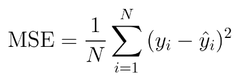

## Table of Contents

## What is Squared Loss in the context of machine learning?

Squared Loss, also known as Mean Squared Error (MSE), is a common way to measure how well a machine learning model is doing. It calculates the average of the squared differences between the predicted values and the actual values. The idea is to make the difference between what the model predicts and what is actually true as small as possible. If the model's predictions are far from the actual values, the squared loss will be high, showing that the model needs improvement.

The formula for Squared Loss is pretty straightforward. If you have a set of predictions and actual values, you can find the Squared Loss by taking the difference between each prediction and its corresponding actual value, squaring that difference, and then averaging all those squared differences. Mathematically, if $$ y_i $$ is the actual value and $$ \hat{y_i} $$ is the predicted value, the Squared Loss (L) can be expressed as $$ L = \frac{1}{n} \sum_{i=1}^{n} (y_i - \hat{y_i})^2 $$, where $$ n $$ is the number of observations. This method is widely used because it penalizes larger errors more heavily, encouraging the model to be as accurate as possible.

## How is Squared Loss calculated?

Squared Loss, or Mean Squared Error (MSE), is a way to see how well a machine learning model is doing. It looks at the difference between what the model predicts and what is actually true. To find the Squared Loss, you take each prediction, subtract the actual value, and then square that difference. After doing this for all predictions, you add up all the squared differences and then divide by the number of predictions you made.

The formula for Squared Loss is $$ L = \frac{1}{n} \sum_{i=1}^{n} (y_i - \hat{y_i})^2 $$. Here, $$ y_i $$ is the actual value, $$ \hat{y_i} $$ is the predicted value, and $$ n $$ is the number of observations. This formula helps to make sure that bigger mistakes are punished more, pushing the model to be more accurate. By using this method, we can see how far off the model's guesses are on average, and work to make them better.

## Why is Squared Loss commonly used in regression problems?

Squared Loss, or Mean Squared Error (MSE), is widely used in regression problems because it gives a clear and easy-to-understand way to measure how well a model is doing. It works by taking the difference between the model's predictions and the actual values, squaring those differences, and then finding the average. This method is popular because it penalizes bigger mistakes more heavily. If a model makes a large error, the squared loss will be much bigger than if it made a small error. This encourages the model to aim for accuracy across all predictions.

Another reason Squared Loss is commonly used is that it is mathematically convenient. The formula for Squared Loss, $$ L = \frac{1}{n} \sum_{i=1}^{n} (y_i - \hat{y_i})^2 $$, where $$ y_i $$ is the actual value, $$ \hat{y_i} $$ is the predicted value, and $$ n $$ is the number of observations, is simple to work with. This simplicity makes it easier to calculate and optimize. Many [machine learning](/wiki/machine-learning) algorithms, like linear regression, are designed to minimize this squared loss, making it a natural choice for regression tasks.

## What are the advantages of using Squared Loss?

Squared Loss, or Mean Squared Error (MSE), is popular in machine learning because it clearly shows how well a model is doing. It works by taking the difference between what the model predicts and what's actually true, squaring those differences, and then finding the average. This way, bigger mistakes are punished more than smaller ones. If a model makes a big error, the squared loss will be much higher than if it made a small error. This encourages the model to aim for accuracy across all its predictions, making it a great tool for improving models.

Another big advantage of using Squared Loss is that it's easy to work with. The formula for Squared Loss, $$ L = \frac{1}{n} \sum_{i=1}^{n} (y_i - \hat{y_i})^2 $$, is simple and straightforward. Here, $$ y_i $$ is the actual value, $$ \hat{y_i} $$ is the predicted value, and $$ n $$ is the number of observations. This simplicity makes it easy to calculate and use in many different kinds of machine learning algorithms. Many common methods, like linear regression, are designed to minimize this squared loss, making it a natural choice for many regression tasks.

## What are the disadvantages or limitations of Squared Loss?

One disadvantage of Squared Loss is that it can be overly sensitive to outliers. Since it squares the difference between the predicted and actual values, any large errors will have a much bigger impact on the overall loss. This means that if there are a few data points that are far from the rest, they can throw off the model's performance, making it less accurate for the majority of the data. In some cases, this can lead to a model that's not as good at predicting for most of the data because it's trying too hard to fit those unusual points.

Another limitation is that Squared Loss assumes that all errors are equally important, which might not always be true in real-world situations. For example, in some applications, underestimating a value might be more costly than overestimating it. Squared Loss treats both types of errors the same, which can be a problem if the cost of different kinds of errors is not the same. This can lead to models that are not as useful in practical settings where the impact of errors varies.

Lastly, the mathematical properties of Squared Loss can sometimes make optimization more challenging. While it's generally easy to work with, the squared term in $$ L = \frac{1}{n} \sum_{i=1}^{n} (y_i - \hat{y_i})^2 $$ can lead to non-linear optimization problems, which can be harder to solve than linear ones. This can slow down the training process and make it more difficult to find the best model, especially in complex scenarios with many variables.

## How does Squared Loss affect the training of a model?

Squared Loss, or Mean Squared Error (MSE), plays a big role in how a model is trained. It measures how far off the model's guesses are from the real values. The formula for Squared Loss is $$ L = \frac{1}{n} \sum_{i=1}^{n} (y_i - \hat{y_i})^2 $$, where $$ y_i $$ is the actual value, $$ \hat{y_i} $$ is the predicted value, and $$ n $$ is the number of observations. When training a model, the goal is to make this loss as small as possible. The model learns by adjusting its guesses to make them closer to the real values, and Squared Loss helps guide this process by showing how much the model needs to improve.

One thing to keep in mind is that Squared Loss can make the model pay more attention to big mistakes. This is because it squares the difference between the guesses and the real values, so big errors have a much bigger impact on the loss. While this can help the model become more accurate overall, it can also cause problems if there are a few unusual data points, called outliers. These outliers can pull the model's focus away from the rest of the data, making it less accurate for most cases. So, while Squared Loss is a useful tool for training, it's important to be aware of its effects on how the model learns.

## Can you explain the mathematical formula for Squared Loss?

The mathematical formula for Squared Loss, also known as Mean Squared Error (MSE), is pretty straightforward. It's used to see how well a model is doing by looking at the difference between what the model predicts and what is actually true. The formula is $$ L = \frac{1}{n} \sum_{i=1}^{n} (y_i - \hat{y_i})^2 $$. Here, $$ y_i $$ is the actual value, $$ \hat{y_i} $$ is the predicted value, and $$ n $$ is the total number of observations. What this formula does is take each prediction, subtract the actual value, square that difference, and then find the average of all those squared differences.

This formula is important because it helps guide the model to make better predictions. When you use Squared Loss, you want to make the value of $$ L $$ as small as possible. That means the model is getting closer to the actual values. The squaring part is key because it makes bigger mistakes have a much bigger impact on the loss. This encourages the model to aim for accuracy across all its predictions, not just the easy ones. But, it's also worth noting that this focus on big errors can sometimes cause problems if there are a few unusual data points, known as outliers, that pull the model's focus away from the rest of the data.

## How does Squared Loss compare to other loss functions like Absolute Loss or Huber Loss?

Squared Loss, or Mean Squared Error (MSE), is often compared to other loss functions like Absolute Loss and Huber Loss. MSE is calculated using the formula $$ L = \frac{1}{n} \sum_{i=1}^{n} (y_i - \hat{y_i})^2 $$, where $$ y_i $$ is the actual value, $$ \hat{y_i} $$ is the predicted value, and $$ n $$ is the number of observations. This loss function squares the difference between predictions and actual values, which makes it more sensitive to larger errors. This can be good for pushing a model to be more accurate overall, but it can also cause problems if there are a few unusual data points, called outliers, because these can have a big impact on the loss. On the other hand, Absolute Loss, or Mean Absolute Error (MAE), uses the formula $$ L = \frac{1}{n} \sum_{i=1}^{n} |y_i - \hat{y_i}| $$. It's less sensitive to outliers because it doesn't square the differences, making it a better choice when you want to treat all errors more equally.

Huber Loss tries to combine the best of both worlds. It's designed to be less sensitive to outliers than Squared Loss but more accurate for smaller errors than Absolute Loss. The Huber Loss function can be described like this: for small errors, it behaves like Squared Loss, but for larger errors, it switches to behaving more like Absolute Loss. The formula for Huber Loss is $$ L_{\delta}(y, \hat{y}) = \begin{cases} \frac{1}{2}(y - \hat{y})^2 & \text{if } |y - \hat{y}| \leq \delta \\ \delta(|y - \hat{y}| - \frac{1}{2}\delta) & \text{if } |y - \hat{y}| > \delta \end{cases} $$, where $$ \delta $$ is a parameter that determines the threshold between small and large errors. This makes Huber Loss a good choice when you want to balance the need for accuracy with the risk of being too influenced by outliers.

## In what scenarios might Squared Loss be less effective?

Squared Loss, or Mean Squared Error (MSE), might not be the best choice when you have data with a lot of outliers. Outliers are unusual data points that are far from the rest. Since Squared Loss uses the formula $$ L = \frac{1}{n} \sum_{i=1}^{n} (y_i - \hat{y_i})^2 $$, it squares the difference between the predicted values and the actual values. This means big errors have a much bigger impact on the loss. If there are a few outliers in the data, they can pull the model's focus away from the rest of the data, making the model less accurate for most cases.

Another scenario where Squared Loss might be less effective is when the cost of different kinds of errors is not the same. For example, in some situations, it might be worse to underestimate a value than to overestimate it. Squared Loss treats all errors the same, no matter if they are underestimates or overestimates. This can lead to a model that doesn't work well in real-world settings where the impact of different errors varies.

## How does the choice of Squared Loss impact the sensitivity to outliers?

Squared Loss, or Mean Squared Error (MSE), can be sensitive to outliers because it squares the difference between the predicted values and the actual values. The formula for Squared Loss is $$ L = \frac{1}{n} \sum_{i=1}^{n} (y_i - \hat{y_i})^2 $$. When there are outliers in the data, these unusual points can have a big impact on the loss. Since the differences are squared, any large errors from outliers will be magnified, making the overall loss much higher. This can cause the model to focus too much on fitting these outliers, which might make it less accurate for the rest of the data.

In situations where outliers are common, using Squared Loss might not be the best choice. The model might try too hard to predict these unusual points correctly, leading to worse predictions for the majority of the data. If you want a model that is less affected by outliers, you might consider using other loss functions like Absolute Loss or Huber Loss. These can help the model perform better overall by not letting a few unusual data points throw off the training process.

## What are some optimization techniques used specifically with Squared Loss?

When training models with Squared Loss, one common optimization technique is gradient descent. This method helps the model learn by adjusting its predictions to make the Squared Loss smaller. The formula for Squared Loss is $$ L = \frac{1}{n} \sum_{i=1}^{n} (y_i - \hat{y_i})^2 $$. In gradient descent, you calculate the gradient, or the slope, of the loss function and then take small steps in the opposite direction of the gradient to minimize the loss. This process is repeated until the loss is as small as possible, meaning the model's predictions are close to the actual values.

Another technique used with Squared Loss is the normal equation, which is especially useful for linear regression models. The normal equation directly solves for the parameters that minimize the Squared Loss without needing to take iterative steps like gradient descent. The formula for the normal equation is $$ \theta = (X^T X)^{-1} X^T y $$, where $$ \theta $$ are the model parameters, $$ X $$ is the input matrix, and $$ y $$ is the target vector. This method is quick and works well for small datasets but can be computationally expensive for large datasets.

Stochastic Gradient Descent (SGD) is a variation of gradient descent that can also be used with Squared Loss. Instead of using the entire dataset to calculate the gradient in each step, SGD uses a single random data point or a small batch of data points. This makes the optimization process faster and can help the model escape local minima, leading to better overall performance. The formula for updating parameters in SGD with Squared Loss is $$ \theta = \theta - \alpha \nabla_{\theta} \frac{1}{2}(y_i - \hat{y_i})^2 $$, where $$ \alpha $$ is the learning rate and $$ \nabla_{\theta} $$ is the gradient with respect to the model parameters.

## How can Squared Loss be implemented in a machine learning algorithm?

To implement Squared Loss in a machine learning algorithm, you need to calculate the average of the squared differences between the predicted values and the actual values. The formula for Squared Loss is $$ L = \frac{1}{n} \sum_{i=1}^{n} (y_i - \hat{y_i})^2 $$, where $$ y_i $$ is the actual value, $$ \hat{y_i} $$ is the predicted value, and $$ n $$ is the number of observations. In practice, this means you'll go through each data point, find the difference between the prediction and the actual value, square that difference, and then add up all these squared differences. Finally, you divide by the total number of data points to get the average, which is the Squared Loss.

Here's an example of how you might implement Squared Loss in Python using a simple function:

```python
def squared_loss(y_true, y_pred):
    n = len(y_true)
    loss = sum((y_true[i] - y_pred[i])**2 for i in range(n)) / n
    return loss
```

In this code, `y_true` is a list of actual values and `y_pred` is a list of predicted values. The function calculates the Squared Loss by summing the squared differences between `y_true` and `y_pred`, then dividing by the number of observations `n`. This function can be used within a machine learning algorithm to measure how well the model is doing and guide the training process to improve the model's predictions.

## References & Further Reading

[1]: Hastie, T., Tibshirani, R., & Friedman, J. (2009). ["The Elements of Statistical Learning: Data Mining, Inference, and Prediction"](https://link.springer.com/book/10.1007/978-0-387-84858-7) (2nd ed.). Springer. 

[2]: Bishop, C. M. (2006). ["Pattern Recognition and Machine Learning"](https://www.cs.uoi.gr/~arly/courses/ml/tmp/Bishop_book.pdf) (Information Science and Statistics). Springer.

[3]: Goodfellow, I., Bengio, Y., & Courville, A. (2016). ["Deep Learning"](https://www.deeplearningbook.org/). MIT Press.

[4]: Murphy, K. P. (2012). ["Machine Learning: A Probabilistic Perspective"](https://www.cs.ubc.ca/~murphyk/MLbook/pml-toc-1may12.pdf) (Adaptive Computation and Machine Learning series). The MIT Press.

[5]: Zhang, T. (2004). ["Solving Large Scale Linear Prediction Problems Using Stochastic Gradient Descent Algorithms."](https://dl.acm.org/doi/10.1145/1015330.1015332) In Proceedings of the Twenty-First International Conference on Machine Learning (ICML). 

[6]: ["A Gentle Introduction to Gradient Descent Algorithm and Its Variants"](https://www.geeksforgeeks.org/gradient-descent-algorithm-and-its-variants/). Machine Learning Mastery.